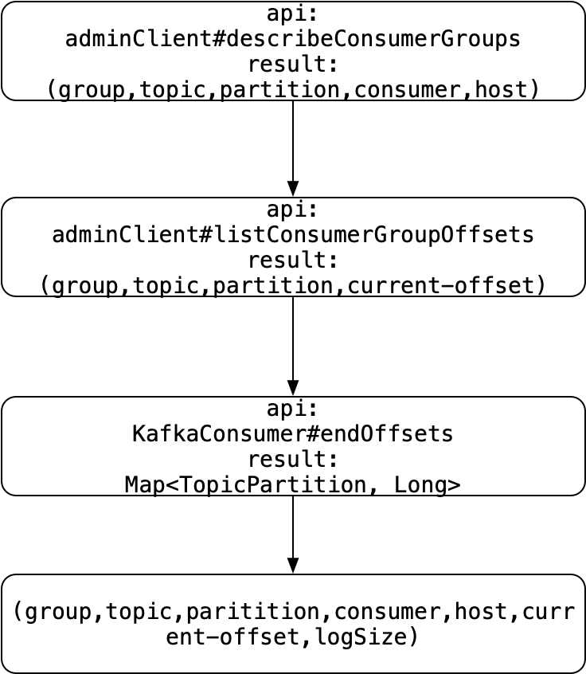

## Kafka监控：consumer消费进度查询方案的演变

[TOC]

### 1. 背景

大数据平台经常以Kafka作为消息中间件，且需要有完整的针对Kafka的管理和监控体系，例如实时查看：

**current-offset：**topic在不同消费者组中的消费进度

**log-end-offset：** topic中的可见消息总量

**Lag：**消费延迟，lag=logEndOffset - currentOffset

消费进度的保存机制在不同的Kafka版本中经历了以下几个阶段的变化：

**<=0.8：**保存在zookeeper中的/consumer路径下

**\>=0.9：**保存在内部主题__consumer_offsets中

因为zookeeper是一个分布式协调工具，不适合大量数据的读和写，因此将消费进度转而保存在内部主题__consumer_offsets中是一个合适的优化，我们只针对该种保存方式进行查询。


### 2. 方案一：__consumer_offsets

既然主题__consumer_offsets中保存了消费进度消息，我们的第一想法是通过查询\_\_consumer_offsets来获取消费进度。

#### 2.1 __consumer_offsets消息种类

要想正确地解析\_\_consumer_offsets并获取消费进度，我们首先要了解\_\_consumer_offsets中消息格式。

\_\_consumer_offsets 中保存的记录是普通的Kafka消息，但是消息的格式由Kafka来维护，用户不能干预。\_\_consumer_offsets中保存三类消息，分别是：

1. Consumer group组元数据消息

每个消费者组的元信息都保存在这个topic中，这些元数据包括：


需要强调的是，如果使用simple consumer（consumer.assign），因为不存在消费者组，则不会向该内部主题写入消息。

key：key是一个二元组，格式是【版本+groupId】，这里的版本表征这类消息的版本号，无实际用途；

value：图中的组元数据

写入时机：消费者组rebalance时写入的


2. Consumer group位移消息

\_\_consumer_offsets保存consumer提交到Kafka的位移数据，这是众所周知的。元数据如下：


其中，过期时间是用户指定的过期时间。如果consumer代码在提交位移时没有明确指定过期间隔，故broker端默认设置过期时间为提交时间+offsets.retention.minutes参数值，即提交1天之后自动过期。Kafka会定期扫描__consumer_offsets中的位移消息并删除掉那些过期的位移数据。

key：一个三元组，格式是【groupId + topic + 分区号】

value：图中的位移元数据

写入时机：消费者提交位移时写入

> 提交的时候，即使位移数据并没有更新，也会向_\_consumer_offsets写入一条新消息


3. Tombstone消息

第三类消息是tombstone消息或delete mark消息。这类消息只出现在源码中而不暴露给用户。

写入时机：在Kafka后台线程扫描并删除过期位移或者__consumer_offsets分区副本重分配时写入的

#### 2.2 代码

```java
    /**
     * GroupTopicPartition --> OffsetAndMetadata
     * 利用guava cache清除策略进行group的过期清除，利用监听器同时清除集合中的group
     */
    private final Cache<GroupTopicPartition, OffsetAndMetadata> groupTopicPartitionOffsetMap = CacheBuilder
                    .newBuilder()
                    .maximumSize(100000)
                    .expireAfterAccess(7,TimeUnit.DAYS)
                    .removalListener((t) ->  groupTopicPartitionOffsetSet.remove(t))
                    .build();

    /**
     * group topicPartition set ,element: group、topic、partition
     */
    private Set<GroupTopicPartition> groupTopicPartitionOffsetSet = Collections.newSetFromMap(new ConcurrentHashMap<>());

    private Map<String,Set<String>> consumerTopicSetMap = new HashMap<>(32);

    GroupMetadataManager groupMetaManager = new GroupMetadataManager();

    @Override
    public void run() {
        // 自定义一个消费者组名为“kafkaManager”的消费者，订阅内部topic获取offset信息
        Consumer<byte[],byte[]> consumer = createKafkaConsumer();
        consumer.subscribe(Collections.singleton("__consumer_offsets"));

        while (true){
           ConsumerRecords<byte[],byte[]> records = consumer.poll(duration);
           Iterator<ConsumerRecord<byte[],byte[]>> recordIter = records.iterator();
           while(recordIter.hasNext()){
               ConsumerRecord<byte[],byte[]> record  = recordIter.next();
               // 读取key的信息，确定消息是 consumer offset 还是group info
               BaseKey baseKey = groupMetaManager.readMessageKey(ByteBuffer.wrap(record.key()));
               if(baseKey instanceof OffsetKey){
                   // 读取消息的key
                   OffsetKey offsetKey = (OffsetKey) baseKey;
                   kafka.common.OffsetAndMetadata metadata =
                       groupMetaManager.readOffsetMessageValue(ByteBuffer.wrap(record.value()));
                   // 缓存起来,确定消费的offset信息
                   GroupTopicPartition groupTp = (GroupTopicPartition) offsetKey.key();
                   if(!groupTp.getGroup().startsWith("kafkaManager")){
                       groupTopicPartitionOffsetMap.put(groupTp,metadata);
                       groupTopicPartitionOffsetSet.add(groupTp);
                       // 确定consumer
                       if(!consumerTopicSetMap.containsKey(record.topic())){
                           consumerTopicSetMap.put(record.topic(),new LinkedHashSet<>());
                       }
                       consumerTopicSetMap.get(record.topic()).add(groupTp.getGroup());
                   }
               }
           }
        }
    }
```

该方法中的缺点：

- 后台线程无限轮询，占用CPU

- 自定义消费者组kafkaManager中的消费者，无限消费\__consumer_offsets，造成\_\_consumer_offsets中关于消费者组kafkaManager的位移信息一直在提交，加大了\_\_consumer_offsets的磁盘占用量

  

### 3. 方案二：AdminClient

早在Kafka0.11.0.0版本之前，消费者管理和集群管理等相关操作都由kafka-core包下的AdminClient和AdminUtils来实现，虽然AdminClient类提供了诸如`describeConsumerGroup`，`listGroupOffsets`之类的api来获取消费进度，但是kafka-core包下的代码都是scala编写，有些开发者会觉得java中调用很多scala的代码风格，显得不是那么纯粹。

幸运的是，Kafka 2.0开始将将AdminClient类迁移到了kafka-client-admin包下，且代码由java编写。

#### 3.1 流程



#### 3.2 代码

```java
adminClient = AdminClient.create(properties);

// 自建consumer获取log-end-offset
public Map<TopicPartition,Long> loadPartitionOffsets(String topic){
    try(KafkaConsumer<byte[],byte[]> consumer = new KafkaConsumer<>(createConsumerProperties())){
       List<TopicPartition> topicPartitions =  consumer.partitionsFor(topic)
                .stream()
                .map(t-> new TopicPartition(t.topic(),t.partition()))
                .collect(Collectors.toList());
      return consumer.endOffsets(topicPartitions);
    }
}

public List<ConsumerDetail> getConsumersByAdminClient(String topic){
  			// 通过zookeeper进行判断
        if (!existTopic(topic)) {
            LOG.info("the specified topic-{} does not exist", topic);
            return Collections.emptyList();
        }
        List<String> groupIdsOfTopic = new ArrayList<>(8);
        List<ConsumerDetail> details = new ArrayList<>(8);
        try{
        ListConsumerGroupsResult groupResult = adminClient.listConsumerGroups(new ListConsumerGroupsOptions());
        Collection<ConsumerGroupListing> list = groupResult.valid().get();
        List<String> groupIds = list.stream().map(ConsumerGroupListing::groupId).collect(Collectors.toList());
        DescribeConsumerGroupsResult consumerGroupsResult = adminClient.describeConsumerGroups(groupIds);
        Map<String, ConsumerGroupDescription> consumerGroupDescriptionMap = consumerGroupsResult.all().get();

        // describeConsumerGroups，get all fields of consumerDetail except consumerOffset, lag and logSize
        for (Map.Entry<String, ConsumerGroupDescription> entry : consumerGroupDescriptionMap.entrySet()) {
            ConsumerGroupDescription consumerGroupDescription = entry.getValue();
            String groupId = consumerGroupDescription.groupId();
            for (MemberDescription memberDescription : consumerGroupDescription.members()) {
                String consumerId = memberDescription.consumerId();
                String host = memberDescription.host();
                for (TopicPartition topicPartition : memberDescription.assignment().topicPartitions()) {
                    String unitTopic = topicPartition.topic();
                    Integer unitPartition = topicPartition.partition();
                    if (!unitTopic.equals(topic))
                        continue;
                    groupIdsOfTopic.add(groupId);
                    ConsumerDetail detail = new ConsumerDetail();
                    detail.setGroupId(groupId);
                    detail.setConsumerId(consumerId);
                    detail.setHost(host);
                    detail.setTopic(unitTopic);
                    detail.setPartitionId(unitPartition);
                    details.add(detail);
                }
            }
        }

        // listConsumerGroupOffsets, get consumerOffset, lag and logSize
        Map<ConsumerDetail, Long> currentOffsetMap = new HashMap<>(8);
        for (String groupId : groupIdsOfTopic) {
            ListConsumerGroupOffsetsResult consumerGroupOffsetsResult = adminClient.listConsumerGroupOffsets(groupId);
            Map<TopicPartition, org.apache.kafka.clients.consumer.OffsetAndMetadata> consumerGroupOffsetsMap = consumerGroupOffsetsResult.partitionsToOffsetAndMetadata().get();
            for (Map.Entry<TopicPartition, org.apache.kafka.clients.consumer.OffsetAndMetadata> entry : consumerGroupOffsetsMap.entrySet()) {
                Long offset = entry.getValue().offset();
                String unitTopic = entry.getKey().topic();
                Integer unitPartition = entry.getKey().partition();
                if (!unitTopic.equals(topic))
                    continue;
                ConsumerDetail consumerDetail = new ConsumerDetail();
                consumerDetail.setPartitionId(unitPartition);
                consumerDetail.setTopic(topic);
                consumerDetail.setGroupId(groupId);
                currentOffsetMap.put(consumerDetail, offset);
            }
        }

        // loadPartitionOffsets, get log end offset
        Map<TopicPartition, Long> leoMap = loadPartitionOffsets(topic);

        // add consumerOffset, lag and logSize to ConsumerDetail list
        for (ConsumerDetail detail : details) {
            Long currentOffset = currentOffsetMap.get(detail);
            detail.setConsumerOffset(currentOffset);

            TopicPartition topicPartition = new TopicPartition(topic, detail.getPartitionId());
            Long logEndOffset = leoMap.get(topicPartition);
            detail.setLogSize(logEndOffset);
        }
        }catch (Exception e){
            throw new KafkaAdminException("failed to get consumers of topic:" + topic, e);
        }
        return details;
    }
```

AdminClient类中的方法，有统一的入参格式和返回格式，如

```java
DescribeConsumerGroupsResult describeConsumerGroups(final Collection<String> groupIds,
final DescribeConsumerGroupsOptions options)
```

```java
ListConsumerGroupOffsetsResult listConsumerGroupOffsets(final String groupId, final ListConsumerGroupOffsetsOptions options)
```

入参：XXXOptions，返回：XXXResult，这些api本质上都是通过AdminClientRunnable线程将请求放入队列，并由线程依次与broker进行通信并返回结果，AdminClientRunnable使用Kafka自定义的一套二进制协议来与broker通信。


