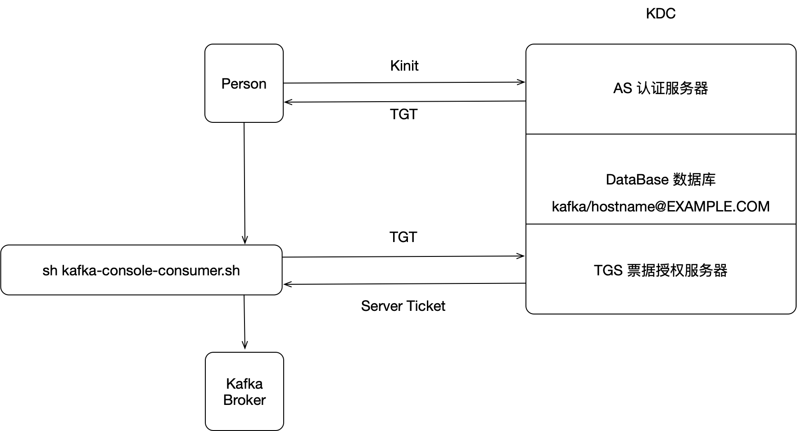

### 1.kerberos概念介绍

principal：认证的主体，如`kafka/stream.dtwave.local@EXAMPLE.COM`，其中`kafka`是主体的用户名，`stream.dtwave.local`表示一个组，`EXAMPLE.COM`表示一个命名空间；

realm： realm有点像编程语言中的namespace。在编程语言中，变量名只有在某个"namespace"里才有意义。同样的，一个principal只有在某个realm下才有意义；kafka配置kerberos（SASL）认证时，realm必须为当前kafka broker所在机器的hostname，如`kafka/stream.dtwave.local@EXAMPLE.COM` ；在kerberos, 大家都约定成俗用大写来命名realm, 比如"EXAMPLE.COM"；

password：某个用户的密码，即kerberos中的master_key。password可以存在一个keytab文件中。所以kerberos中需要使用密码的场景都可以用一个keytab作为输入；


### 2. kerberos认证过程



step1：用户通过`kinit`命令登录KDC（key distribution center），其中的AS认证服务器到本地数据库中查询用户发送过来的principle是否存在，如果存在，则返回TGT给用户

Step2：kafka客户端无法直接连通开启kerberos认证的kafka broker，需要将缓存在用户端的TGT发送给KDC，其中的TGS票据授权服务器会验证TGT是否对应数据库中某个principle，如果验证通过，则返回server ticket给kafka客户端，然后便可以访问kafka broker

术语解释：

KDC：Key Distribution Center，密钥分发中心

TGT：Ticket-Granting-Ticket，Ticket for getting tickets 

AS：Authentication Service，认证服务器

TGS：Ticket Granting Service，票据授权服务器


### 3. kerberos安装

1. 安装kerberos

   ```shell
   # The krb5-server package contains the programs that must be installed on a Kerberos 5 key distribution center (KDC). If you are installing a Kerberos 5 KDC, you need to install this package (in other words, most people should NOT install this package).
   
   # krb5-workstation package contains the basic Kerberos programs (kinit, klist, kdestroy, kpasswd). If your network uses Kerberos, this package should be installed on every workstation.
   
   # The krb5-libs package contains the shared libraries needed by Kerberos 5. If you are using Kerberos, you need to install this package.
   
   yum install -y krb5-libs krb5-server krb5-workstation
   ```

2. 修改配置文件

/var/kerberos/krb5kdc/kdc.conf，kdc配置

```properties
[kdcdefaults]
 kdc_ports = 88
 kdc_tcp_ports = 88

[realms]
 EXAMPLE.COM = {
  #master_key_type = aes256-cts
  acl_file = /var/kerberos/krb5kdc/kadm5.acl
  dict_file = /usr/share/dict/words
  admin_keytab = /var/kerberos/krb5kdc/kadm5.keytab
  max_life = 1d
  max_renewable_life = 7d
  supported_enctypes = aes256-cts:normal aes128-cts:normal des3-hmac-sha1:normal arcfour-hmac:normal camellia256-cts:normal camellia128-cts:normal des-hmac-sha1:normal des-cbc-md5:normal des-cbc-crc:normal
 }
```

/etc/krb5.conf，kdc和客户端配置

```properties
[logging]
 default = FILE:/var/log/krb5libs.log
 kdc = FILE:/var/log/krb5kdc.log
 admin_server = FILE:/var/log/kadmind.log

[libdefaults]
 dns_lookup_kdc = false
 dns_lookup_realm = false
 ticket_lifetime = 24h
 renew_lifetime = 7d
 forwardable = true
 rdns = false
 default_realm = EXAMPLE.COM
 udp_preference_limit=1
# default_ccache_name = KEYRING:persistent:%{uid}

[realms]
 EXAMPLE.COM = {
  kdc = stream.dtwave.local
  admin_server = stream.dtwave.local
 }
# admin_server 数据库连接服务

[domain_realm]
# .example.com = EXAMPLE.COM
# example.com = EXAMPLE.COM
```


### 4. 创建 KDC 数据库

```shell
$ kdb5_util create -s -r EXAMPLE.COM
```


### 5. 编辑 `kadm5.acl`

```shell
$ vim /var/kerberos/krb5kdc/kadm5.acl
*/admin@EXAMPLE.COM    *
```


### 6. 启动kdc和admin

```shell
$ systemctl start krb5kdc
$ systemctl start kadmin
# kadmin即admin_server，是数据库连接服务，当使用kadmin.local命令时，就要用到该服务
# 设置开机自启
$ systemctl enable krb5kdc
$ systemctl enable kadmin
```


### 7. 添加principal

```shell
$ kadmin.local
$ kadmin.local:  addprinc kafka/stream.dtwave.local
$ kadmin.local:  listprincs
```


### 8. 使用keytab登陆

使用`kinit`进行登陆共有两种登录方式，第一种是通过密码登陆，第二种是通过keytab文件，其中keytab文件是通过加密算法将密码进行加密并存入文件中。此处演示通过keytab进行登陆

```shell
$ kadmin.local
# 生成keytab文件
$ kadmin.local:  xst -k /opt/third/kafka/kerberos/kafka_server.keytab kafka/stream.dtwave.local@EXAMPLE.COM
# 查看keytab文件支持的加密算法，验证其是否与kdc.conf配置的加密算法一致
$ klist -t -e -k /opt/third/kafka/kerberos/kafka_server.keytab 
# 利用keytab进行登陆
$ kinit -kt /opt/third/kafka/kerberos/kafka_server.keytab kafka/stream.dtwave.local
# 查看是否登陆成功
$ klist
```

> 参考：
>
> https://www.jianshu.com/p/fc2d2dbd510b
>
> https://rpmfind.net/linux/rpm2html/search.php?query=krb5-libs&submit=Search+...&system=&arch=
>
> https://simple.wikipedia.org/wiki/Kerberos_(protocol)