本文主要围绕 Flink 源码中 `flink-streaming-java` 模块。介绍如何使用 DataStream API 进行 Flink 流任务开发，`flink-streaming-java` 模块中的一些重要类，贯穿着介绍下从 DataStream 
API 到 StreamGraph 的构建过程。


## DataStream API使用一览

使用 DataStream API 通常有以下步骤：

1. 如何创建 Environment(Local、Remote) 并设置属性

- setParallelism(int)：StreamExecutionEnvironment
- setMaxParallelism(int)：StreamExecutionEnvironment
- setBufferTimeout(long)：StreamExecutionEnvironment
- enableCheckpointing(long,CheckpointingMode)：StreamExecutionEnvironment
- setStateBackend(StateBackend)：StreamExecutionEnvironment
- setStreamTimeCharacteristic(TimeCharacteristic)：void

2. 如何读取数据？添加 Source 数据源获得 DataStream
- fromElements(OUT …): DataStreamSource<OUT>   …
- readTextFile(String): DataStreamSource<String>  …
- readFile(FileInputFormat<OUT>,String): DataStreamSource<OUT> …
- socketTextStream(String ,int ,String ,long): DataStreamSource<String>  …
- createInput(InputFormat<OUT,?>,TypeInformation<OUT>): DataStreamSource<OUT> …
- addSource(SourceFunction<OUT>,TypeInformation<OUT>): DataStreamSource<OUT> …

3. 如何操作转换数据？

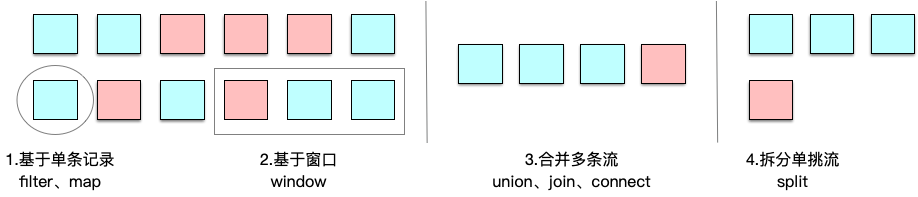

- Basic Transformations
  map、filter、flatMap
- KeyedStream Transformations
  keyBy、aggregations、reduce
- MultiStream Transformations
  union、connect、coMap、coFlatMap、split、select

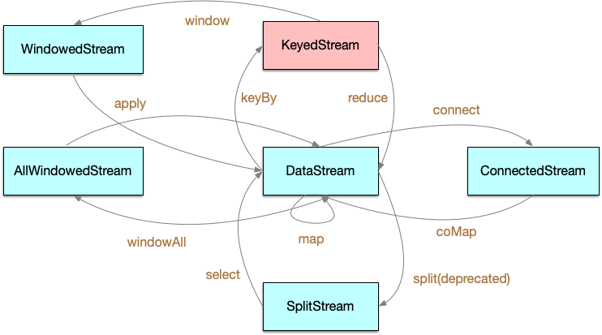

- Distribution Transformations
物理分组：

| 关系                    |   表示               |  图示   |  
| ----------------------- | ------------------- | ------- | 
| global                  |   全部发往第1个task                     |  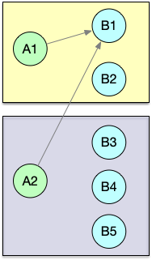   | 
| broadcast               |   广播，复制上游的数据发送到所有下游节点    |  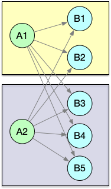   | 
| forward                 |   上下游并发度一样时一对一发送            |  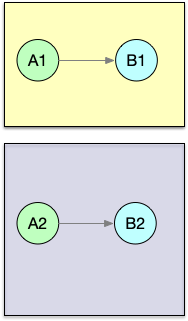   | 
| shuffle                 |   随机均匀分配                          |     | 
| reblance                |   Round-Robin（轮流分配）               |     | 
| rescale                 |   Local Round-Robin (本地轮流分配)，</br>只会看到本机的实例  |  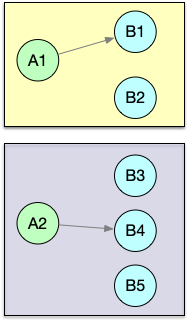  | 
| partitionCustom         |   自定义单播                |    | 


4. 如何输出数据？添加 Sink

- writeAsText(String path): DataStreamSink<T> ...
- writeAsCsv(String path): DataStreamSink<T> ...
- addSink(SinkFunction<T> sinkFunction): DataStreamSink<T>

5. 如何提交执行？ 
DataStream 通过不同的算子不停地在 DataStream 上实现转换过滤等逻辑，最终将结果输出到 DataSink 中。
在 StreamExecutionEnvironment 内部使用一个 `List<StreamTransformation<?>> transformations` 来保留生成 DataStream 的所有转换。
- execute()：JobExecutionResult


我们看下基于 Flink DataStream API 的自带 WordCount 示例：实时统计单词数量，每来一个计算一次并输出一次。

```java
public class WordCount {

	// *************************************************************************
	// PROGRAM
	// *************************************************************************

	public static void main(String[] args) throws Exception {

		final ParameterTool params = ParameterTool.fromArgs(args);
		// 1. 设置运行环境
		final StreamExecutionEnvironment env = StreamExecutionEnvironment.getExecutionEnvironment();
		env.getConfig().setGlobalJobParameters(params);

		// 2. 配置数据源读取数据
		DataStream<String> text;
		if (params.has("input")) {
			// read the text file from given input path
			text = env.readTextFile(params.get("input"));
		} else {
			// get default test text data
			text = env.fromElements(new String[] {
				"miao,She is a programmer",
				"wu,He is a programmer",
				"zhao,She is a programmer"
			});
		}

        // 3. 进行一系列转换
		DataStream<Tuple2<String, Integer>> counts =
			// split up the lines in pairs (2-tuples) containing: (word,1)
			text.flatMap(new Tokenizer())
			// group by the tuple field "0" and sum up tuple field "1"
			.keyBy(0).sum(1);

		// 4. 配置数据汇写出数据
		if (params.has("output")) {
			counts.writeAsText(params.get("output"));
		} else {
			System.out.println("Printing result to stdout. Use --output to specify output path.");
			counts.print();
		}

		// 5. 提交执行
		env.execute("Streaming WordCount");
	}

	// *************************************************************************
	// USER FUNCTIONS
	// *************************************************************************
	public static final class Tokenizer implements FlatMapFunction<String, Tuple2<String, Integer>> {

		@Override
		public void flatMap(String value, Collector<Tuple2<String, Integer>> out) {
			// normalize and split the line
			String[] tokens = value.toLowerCase().split("\\W+");

			// emit the pairs
			for (String token : tokens) {
				if (token.length() > 0) {
					out.collect(new Tuple2<>(token, 1));
				}
			}
		}
	}
}
```

## 源码剖析

### StreamExecutionEnvironment

StreamExecutionEnvironment 是 Flink 流处理任务执行的上下文，是我们编写 Flink 程序的入口。根据执行环境的不同，选择不同的 StreamExecutionEnvironment 类，
有 LocalStreamEnvironment、RemoteStreamEnvironment 等。如下图：
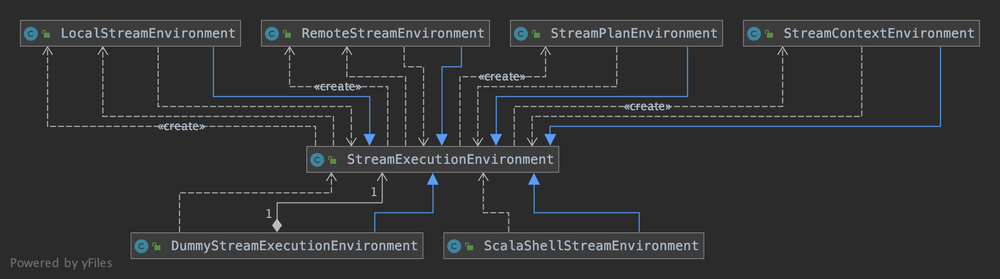

StreamExecutionEnvironment 依赖 ExecutionConfig 类来设置并行度等，依赖 CheckpointConfig 设置 Checkpointing 等相关属性。
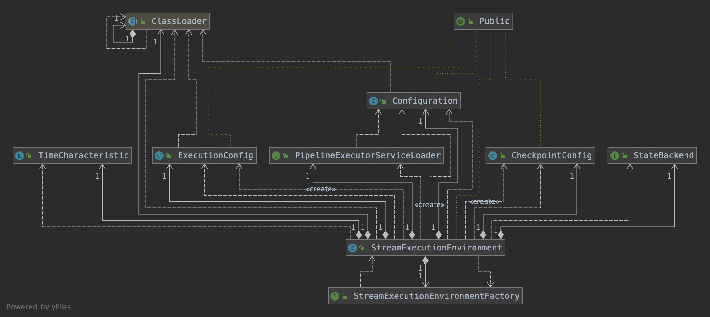


这里再补充说明下 StreamExecutionEnvironment类中的重要属性和方法：
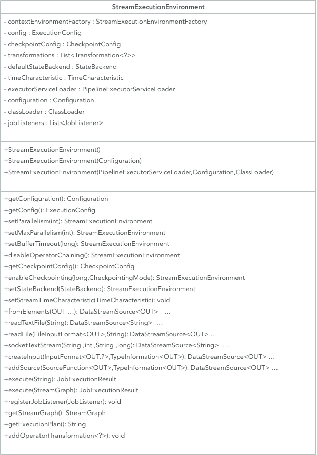


### Transformation


Transformation 代表了从一个或多个 DataStream 生成新 DataStream 的操作。在 DataStream 上通过 map 等算子不断进行转换，就得到了由 Transformation
构成的图。当需要执行的时候，底层的这个图就会被转换成 StreamGraph 。

Transformation 有很多子类，如 SourceTransformation、OneInputTransformation、TwoInputTransformation、SideOutputTransformation 等，分别对应了 DataStream 上的不同转换操作。

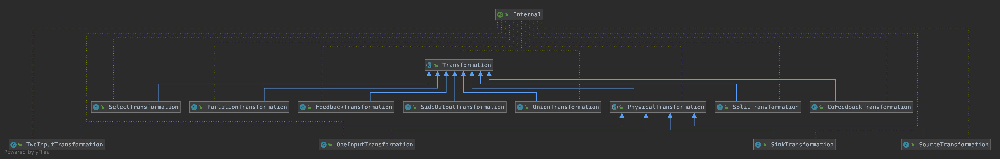

每一个 Transformation 都有一个关联 id，这个 id 是全局递增的，还有 uid、slotSharingGroup、parallelism 等信息。

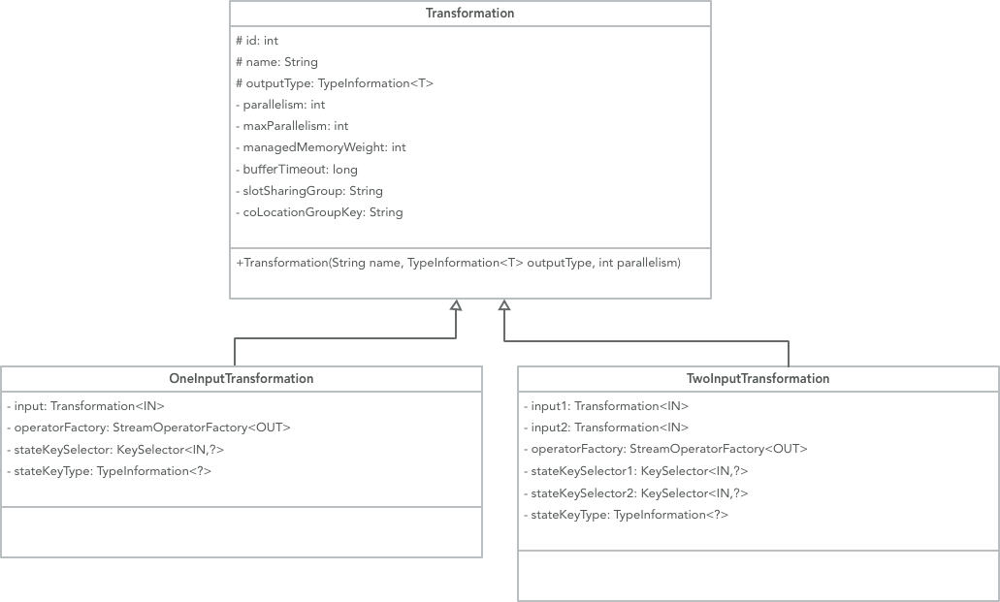

查看 Transformation 的其中两个子类 OneInputTransformation、TwoInputTransformation 的实现，都对应有输入 Transformation，也正是基于此才能还原出 DAG 的拓扑结构。

Transformation 在运行时并不对应着一个物理转换操作，有一些操作只是逻辑层面上的，比如 split/select/partitioning 等。
Transformations 组成的 graph ，也就是我们写代码时的图结构如下：
```txt
    Source              Source
       +                   +
       |                   |
       v                   v
   Rebalance          HashPartition
       +                   +
       |                   |
       |                   |
       +------>Union<------+
                 +
                 |
                 v
               Split
                 +
                 |
                 v
               Select
                 +
                 v
                Map
                 +
                 |
                 v
               Sink
```

但是，在运行时将生成如下操作图，split/select/partitioning 等转换操作会被编码到边中，这个边连接 sources 和 map 操作：
```txt
  Source              Source
     +                   +
     |                   |
     |                   |
     +------->Map<-------+
               +
               |
               v
              Sink
```

### DataStream

一个 DataStream 就代表了同一种类型元素构成的数据流。通过对 DataStream 应用 map/filter 等操作，就可以将一个 DataStream 转换成另一个 DataStream 。
这个转换的过程就是根据不同的操作生成不同的 Transformation ，并将其加入到 StreamExecutionEnvironment 的 transformations 列表中。

DataStream 的子类包括 DataStreamSource、KeyedStream、IterativeStream、SingleOutputStreamOperator。

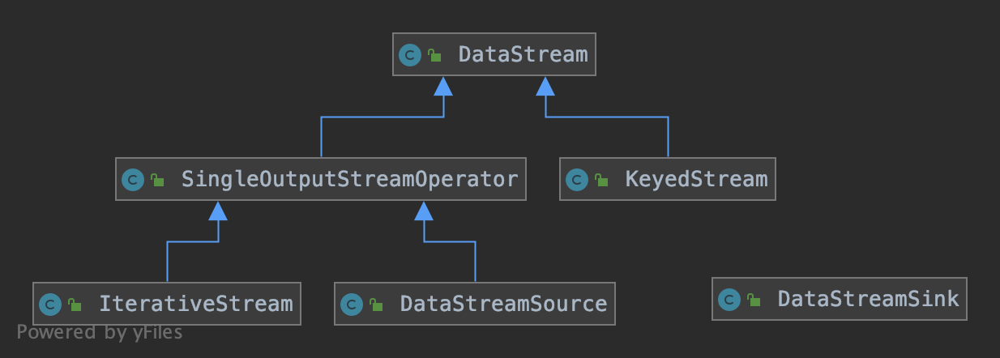

除了 DataStream 及其子类以外，其它的表征数据流的类还有 ConnectedStreams、WindowedStream、AllWindowedStream，这些会在后续的文章中陆续介绍。

DataStream 类中的重要属性和方法：

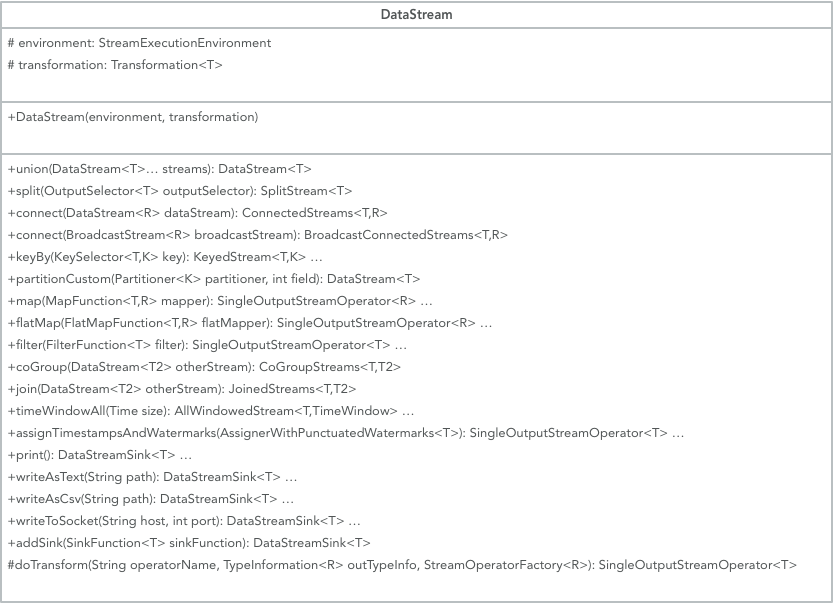


下面我们看下 map 操作是如何被添加进来的：
```java
public <R> SingleOutputStreamOperator<R> map(MapFunction<T, R> mapper, TypeInformation<R> outputType) {
	// 将 MapFunction 封装成 StreamMap 这个 StreamOperator
	return transform("Map", outputType, new StreamMap<>(clean(mapper)));
}
```

```java
@PublicEvolving
public <R> SingleOutputStreamOperator<R> transform(
	String operatorName,
	TypeInformation<R> outTypeInfo,
	OneInputStreamOperator<T, R> operator) {

	return doTransform(operatorName, outTypeInfo, SimpleOperatorFactory.of(operator));
}
```

接着我们看下其中一个比较重要的方法 doTransform ：
```java
protected <R> SingleOutputStreamOperator<R> doTransform(
		String operatorName,
		TypeInformation<R> outTypeInfo,
		StreamOperatorFactory<R> operatorFactory) {

	// read the output type of the input Transform to coax out errors about MissingTypeInfo
	transformation.getOutputType();

	// 构造 Transformation
	OneInputTransformation<T, R> resultTransform = new OneInputTransformation<>(
			this.transformation,
			operatorName,
			operatorFactory,
			outTypeInfo,
			environment.getParallelism());

	// 将 Transformation 封装进 SingleOutputStreamOperator 返回
	@SuppressWarnings({"unchecked", "rawtypes"})
	SingleOutputStreamOperator<R> returnStream = new SingleOutputStreamOperator(environment, resultTransform);

	// 添加到 StreamExecutionEnvironment 的 transformations 列表中
	getExecutionEnvironment().addOperator(resultTransform);

	return returnStream;
}
```

### StreamOperator

在操作 DataStream 的时候，比如 `DataStream.map(MapFunction<T, R> mapper)` 时，都会传入一个自定义的 Function 。那么这些信息是如何保存在 Transformation 中的呢？
这里就引入了一个新的接口 StreamOpertor ，DataStream 上的每一个 Transformation 都对应了一个 StreamOperator，StreamOperator 是运行时的具体实现，会决定 UDF 的调用方式。

StreamOperator 的类继承关系如下：

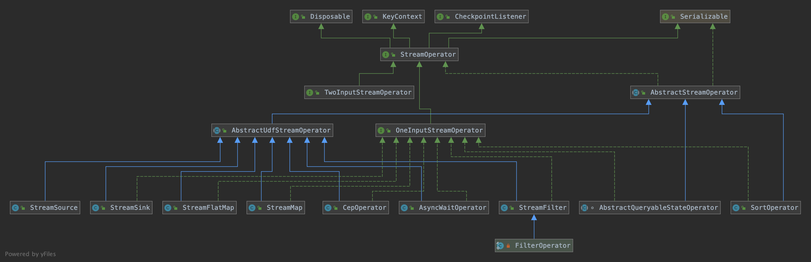

接口 StreamOpertor 定义了对一个具体的算子的生命周期的管理。StreamOperator 的两个子接口 OneInputStreamOperator 和 TwoInputStreamOperator 提供了数据流中具体元素的操作方法，而 AbstractUdfStreamOperator 抽象子类则提供了自定义处理函数对应的算子的基本实现：

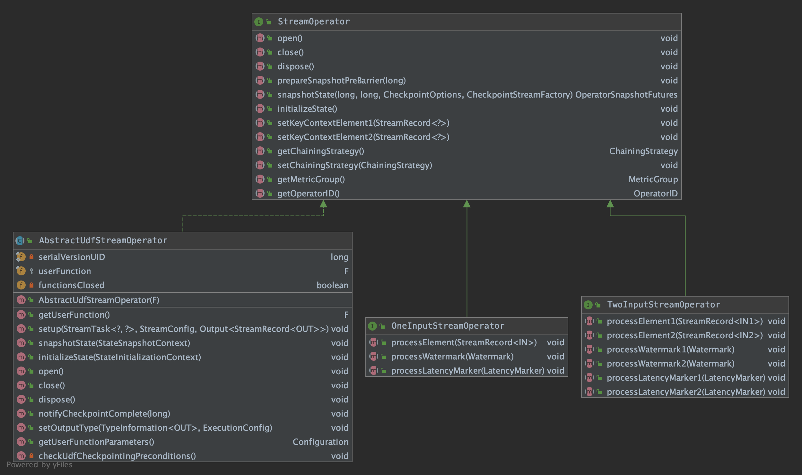

下面我们还是拿 map 举例，map 操作对应的 StreamOperator 为 StreamMap ，继承了 AbstractUdfStreamOperator 类，实现了 OneInputStreamOperator 接口：
```java
@Internal
public class StreamMap<IN, OUT>
		extends AbstractUdfStreamOperator<OUT, MapFunction<IN, OUT>>
		implements OneInputStreamOperator<IN, OUT> {

	private static final long serialVersionUID = 1L;

	public StreamMap(MapFunction<IN, OUT> mapper) {
		super(mapper);
		chainingStrategy = ChainingStrategy.ALWAYS;
	}

	@Override
	public void processElement(StreamRecord<IN> element) throws Exception {
		output.collect(element.replace(userFunction.map(element.getValue())));
	}
}
```

以上，我们可以知道通过 DataStream -> Function -> StreamOperator -> StreamTransformation 这种依赖关系，就可以完成 DataStream 的转换，并且可以保存数据流和应用在流上
的算子之间的关系。


### Function

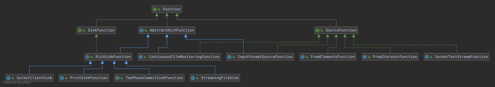


### StreamGraph

StreamGraph 是在 Client 端构造的。
了解 StreamGraph 之前我们首先要知道 StreamGraphGenerator 这个类，它会基于 StreamExecutionEnvironment 的 transformations 列表来生成 StreamGraph。

首先看下 StreamGraphGenerator 的 generate() 方法，这个方法会由触发程序执行的方法 StreamExecutionEnvironment.execute() 调用到：
```java
public StreamGraph generate() {
	streamGraph = new StreamGraph(executionConfig, checkpointConfig, savepointRestoreSettings);
	streamGraph.setStateBackend(stateBackend);
	streamGraph.setChaining(chaining);
	streamGraph.setScheduleMode(scheduleMode);
	streamGraph.setUserArtifacts(userArtifacts);
	streamGraph.setTimeCharacteristic(timeCharacteristic);
	streamGraph.setJobName(jobName);
	streamGraph.setBlockingConnectionsBetweenChains(blockingConnectionsBetweenChains);

	alreadyTransformed = new HashMap<>();

	/**
	 * 遍历 transformations 列表，递归调用 transform 方法。
	 * 对于每一个 Transformation ，确保当前上游已经完成转换，转换成 StreamGraph 中的 StreamNode，并为上下游节点添加 StreamEdge
	 */
	for (Transformation<?> transformation: transformations) {
		transform(transformation);
	}

	final StreamGraph builtStreamGraph = streamGraph;

	alreadyTransformed.clear();
	alreadyTransformed = null;
	streamGraph = null;

	return builtStreamGraph;
}
```

在遍历 List<Transformation> 生成 StreamGraph 时，会递归调用其 transform 方法。对于每一个 Transformation ，确保当前其上游已经完成转换。最终，部分 Transformation 节点被
转换为 StreamGraph 中的 StreamNode 节点，并会为上下游节点添加边 StreamEdge。下面看下 transform() 方法：
```java
private Collection<Integer> transform(Transformation<?> transform) {

	if (alreadyTransformed.containsKey(transform)) {
		return alreadyTransformed.get(transform);
	}

	// 对于不同类型的 Transformation，分别调用对应的转换方法
	// 只有 OneInputTransformation、TwoInputTransformation、SourceTransformation、SinkTransformation 会生成 StreamNode，
	// 会生成 StreamNode.
	// 像 Partitioning, split/select, union 这些是不包含物理转换操作的，会生成一个带有特定属性的虚拟节点，
	// 当添加一条有虚拟节点指向下游节点的边时，会找到虚拟节点上游的物理节点，在两个物理节点之间添加边，并把虚拟转换操作的属性附着上去。
	Collection<Integer> transformedIds;
	if (transform instanceof OneInputTransformation<?, ?>) {
		transformedIds = transformOneInputTransform((OneInputTransformation<?, ?>) transform);
	} else if (transform instanceof TwoInputTransformation<?, ?, ?>) {
		transformedIds = transformTwoInputTransform((TwoInputTransformation<?, ?, ?>) transform);
	} else if (transform instanceof SourceTransformation<?>) {
		transformedIds = transformSource((SourceTransformation<?>) transform);
	} else if (transform instanceof SinkTransformation<?>) {
		transformedIds = transformSink((SinkTransformation<?>) transform);
	} else if (transform instanceof UnionTransformation<?>) {
		transformedIds = transformUnion((UnionTransformation<?>) transform);
	} else if (transform instanceof SplitTransformation<?>) {
		transformedIds = transformSplit((SplitTransformation<?>) transform);
	} else if (transform instanceof SelectTransformation<?>) {
		transformedIds = transformSelect((SelectTransformation<?>) transform);
	} else if (transform instanceof FeedbackTransformation<?>) {
		transformedIds = transformFeedback((FeedbackTransformation<?>) transform);
	} else if (transform instanceof CoFeedbackTransformation<?>) {
		transformedIds = transformCoFeedback((CoFeedbackTransformation<?>) transform);
	} else if (transform instanceof PartitionTransformation<?>) {
		transformedIds = transformPartition((PartitionTransformation<?>) transform);
	} else if (transform instanceof SideOutputTransformation<?>) {
		transformedIds = transformSideOutput((SideOutputTransformation<?>) transform);
	} else {
		throw new IllegalStateException("Unknown transformation: " + transform);
	}

	return transformedIds;
}
```

对于另外一部分 Transformation ，如 partitioning, split/select, union，并不包含真正的物理转换操作，是不会生成 StreamNode 的，而是生成一个带有特定属性的虚拟节点。
当添加一条有虚拟节点指向下游节点的边时，会找到虚拟节点上游的物理节点，在两个物理节点之间添加边，并把虚拟转换操作的属性附着上去。下面我们首先看下 transformOneInputTransform() 方法：
```java
private <IN, OUT> Collection<Integer> transformOneInputTransform(OneInputTransformation<IN, OUT> transform) {

	// 首先确保上游节点完成转换
	Collection<Integer> inputIds = transform(transform.getInput());

	// the recursive call might have already transformed this
	// 由于是递归调用的，可能已经完成了转换
	if (alreadyTransformed.containsKey(transform)) {
		return alreadyTransformed.get(transform);
	}

	// 确定共享资源组，如果用户没有指定，默认是 default
	String slotSharingGroup = determineSlotSharingGroup(transform.getSlotSharingGroup(), inputIds);

	// 向 StreamGraph 中添加 Operator，这一步会生成对应的 StreamNode
	streamGraph.addOperator(transform.getId(),
			slotSharingGroup,
			transform.getCoLocationGroupKey(),
			transform.getOperatorFactory(),
			transform.getInputType(),
			transform.getOutputType(),
			transform.getName());

	// 设置 stateKey
	if (transform.getStateKeySelector() != null) {
		TypeSerializer<?> keySerializer = transform.getStateKeyType().createSerializer(executionConfig);
		streamGraph.setOneInputStateKey(transform.getId(), transform.getStateKeySelector(), keySerializer);
	}

	// 设置 parallelism
	int parallelism = transform.getParallelism() != ExecutionConfig.PARALLELISM_DEFAULT ?
		transform.getParallelism() : executionConfig.getParallelism();
	streamGraph.setParallelism(transform.getId(), parallelism);
	streamGraph.setMaxParallelism(transform.getId(), transform.getMaxParallelism());

	// 在每一个物理节点的转换上
	// 依次连接到上游 input 节点，创建 StreamEdge，在输入节点和当前节点之间建立边的连接
	for (Integer inputId: inputIds) {
		streamGraph.addEdge(inputId, transform.getId(), 0);
	}

	return Collections.singleton(transform.getId());
}
```

接着看下 StreamGraph 中对应的添加节点的方法：
```java
public <IN, OUT> void addOperator(
		Integer vertexID,
		@Nullable String slotSharingGroup,
		@Nullable String coLocationGroup,
		StreamOperatorFactory<OUT> operatorFactory,
		TypeInformation<IN> inTypeInfo,
		TypeInformation<OUT> outTypeInfo,
		String operatorName) {

		if (operatorFactory.isStreamSource()) {
			// 从传入的 StreamOperatorFactory 得知当前 operator 代表的是 source 流。SourceStreamTask
			addNode(vertexID, slotSharingGroup, coLocationGroup, SourceStreamTask.class, operatorFactory, operatorName);
		} else {
			// 上游节点输入流，OneInputStreamTask
			addNode(vertexID, slotSharingGroup, coLocationGroup, OneInputStreamTask.class, operatorFactory, operatorName);
		}
}

protected StreamNode addNode(Integer vertexID,
							@Nullable String slotSharingGroup,
						    @Nullable String coLocationGroup,
							// 表示该节点在 TM 中运行时的实际任务类型
							Class<? extends AbstractInvokable> vertexClass,
							StreamOperatorFactory<?> operatorFactory,
							String operatorName) {

	if (streamNodes.containsKey(vertexID)) {
		throw new RuntimeException("Duplicate vertexID " + vertexID);
	}

	// 构造 StreamNode
	StreamNode vertex = new StreamNode(
		vertexID,
		slotSharingGroup,
		coLocationGroup,
		operatorFactory,
		operatorName,
		new ArrayList<OutputSelector<?>>(),
		vertexClass);

	// 保存在 streamNodes 这个 map 中
	streamNodes.put(vertexID, vertex);

	return vertex;
}
```

下面我们再看下 transformPartition() 非物理节点的转换方法：
```java
private <T> Collection<Integer> transformPartition(PartitionTransformation<T> partition) {
	Transformation<T> input = partition.getInput();
	List<Integer> resultIds = new ArrayList<>();

	// 递归遍历转换上游节点
	Collection<Integer> transformedIds = transform(input);
	for (Integer transformedId: transformedIds) {
		int virtualId = Transformation.getNewNodeId();
		// 添加虚拟的 Partition 节点
		streamGraph.addVirtualPartitionNode(
				transformedId, virtualId, partition.getPartitioner(), partition.getShuffleMode());
		resultIds.add(virtualId);
	}

	return resultIds;
}

public void addVirtualPartitionNode(
	Integer originalId,
	Integer virtualId,
	StreamPartitioner<?> partitioner,
	ShuffleMode shuffleMode) {

	if (virtualPartitionNodes.containsKey(virtualId)) {
		throw new IllegalStateException("Already has virtual partition node with id " + virtualId);
	}

	// 添加一个虚拟节点到 virtualPartitionNodes 中，后续添加边的时候会连接到实际的物理节点
	virtualPartitionNodes.put(virtualId, new Tuple3<>(originalId, partitioner, shuffleMode));
}	
```

在实际的物理节点执行添加边的操作时，会判断上游是不是虚拟节点，如果是则会一直递归调用，将虚拟节点的信息添加到边中，直到连接到一个物理转换节点为止：
```java
private void addEdgeInternal(Integer upStreamVertexID,
							 Integer downStreamVertexID,
							 int typeNumber,
							 StreamPartitioner<?> partitioner,
							 List<String> outputNames,
							 OutputTag outputTag,
							 ShuffleMode shuffleMode) {

	// 先判断是不是虚拟节点上的边，如果是，则找到虚拟节点上游对应的物理节点
	// 在两个物理节点之间添加边，并把对应的 outputTag 或 StreamPartitioner 添加到 StreamEdge 中
	if (virtualSideOutputNodes.containsKey(upStreamVertexID)) {
			
	} else if (virtualSelectNodes.containsKey(upStreamVertexID)) {
			
	} else if (virtualPartitionNodes.containsKey(upStreamVertexID)) {
		int virtualId = upStreamVertexID;
		upStreamVertexID = virtualPartitionNodes.get(virtualId).f0;
		if (partitioner == null) {
			partitioner = virtualPartitionNodes.get(virtualId).f1;
		}
		shuffleMode = virtualPartitionNodes.get(virtualId).f2;
		addEdgeInternal(upStreamVertexID, downStreamVertexID, typeNumber, partitioner, outputNames, outputTag, shuffleMode);
	} else {

		// 两个物理节点
		StreamNode upstreamNode = getStreamNode(upStreamVertexID);
		StreamNode downstreamNode = getStreamNode(downStreamVertexID);

		// If no partitioner was specified and the parallelism of upstream and downstream
		// operator matches use forward partitioning, use rebalance otherwise.
		if (partitioner == null && upstreamNode.getParallelism() == downstreamNode.getParallelism()) {
			partitioner = new ForwardPartitioner<Object>();
		} else if (partitioner == null) {
			partitioner = new RebalancePartitioner<Object>();
		}

		if (partitioner instanceof ForwardPartitioner) {
			if (upstreamNode.getParallelism() != downstreamNode.getParallelism()) {
				throw new UnsupportedOperationException("Forward partitioning does not allow " +
					"change of parallelism. Upstream operation: " + upstreamNode + " parallelism: " + upstreamNode.getParallelism() +
					", downstream operation: " + downstreamNode + " parallelism: " + downstreamNode.getParallelism() +
					" You must use another partitioning strategy, such as broadcast, rebalance, shuffle or global.");
			}
		}

		if (shuffleMode == null) {
			shuffleMode = ShuffleMode.UNDEFINED;
		}

		// 创建 StreamEdge，带着 outputTag 、StreamPartitioner 等属性
		StreamEdge edge = new StreamEdge(upstreamNode, downstreamNode, typeNumber, outputNames, partitioner, outputTag, shuffleMode);

		// 分别将 StreamEdge 添加到上游节点和下游节点
		// 获取上游节点，添加 OutEdge
		getStreamNode(edge.getSourceId()).addOutEdge(edge);
		// 获取下游节点，添加 InEdge
		getStreamNode(edge.getTargetId()).addInEdge(edge);
	}
}
```

StreamGraph 是 Flink 任务最接近用户逻辑的 DAG 表示，后面到具体执行时还会进行一系列转换。


### 类之间的层级关系

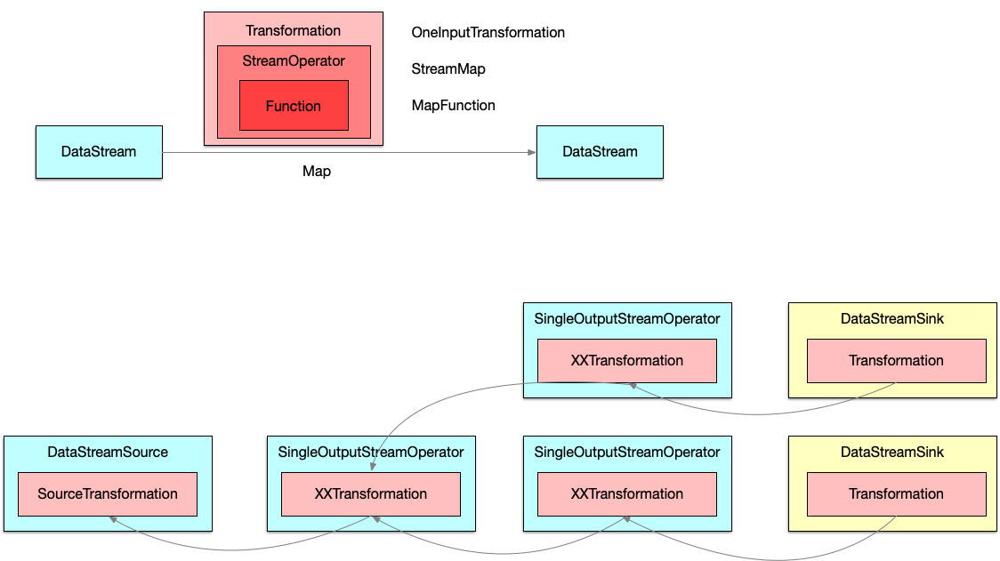

map 转换将用户自定义函数 MapFunction 包装到 StreamMap 这个 StreamOperator 中，再将 StreamMap 包装到 OneInputTransformation，最后该 transformation 会存到 
StreamExecutionEnvironment 中。当调用 env.execute() 时，会遍历其中的 transformations 集合构造出 StreamGraph 。


