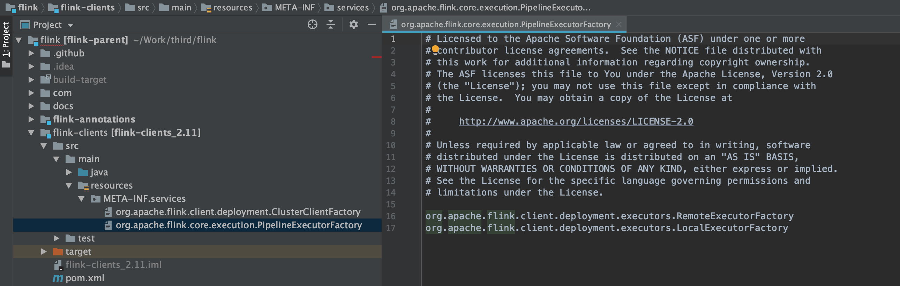
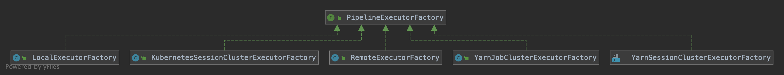
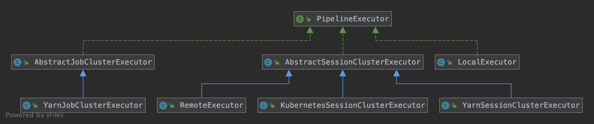

本文主要围绕 Flink 源码中 `flink-streaming-java` 模块。介绍下 StreamGraph 转成 JobGraph 的过程等。

<!-- more -->

StreamGraph 和 JobGraph 都是在 Client 端生成的，也就是说我们可以在 IDE 中通过断点调试观察 StreamGraph 和 JobGraph 的生成过程。
StreamGraph 实际上只对应 Flink 作业在逻辑上的执行计划图，Flink 会进一步对 StreamGraph 进行转换，得到另一个执行计划图，即 JobGraph。

## 调用链路

1. 使用 DataStream API 编写好程序之后，就会调用到 StreamExecutionEnvironment.execute() 方法了。
   下面我们从 StreamExecutionEnvironment 中的 execute() 方法一直往下跟：
```java
@Public
public class StreamExecutionEnvironment {
/**
 * Streaming 程序的提交入口
 */
public JobExecutionResult execute() throws Exception {
	return execute(DEFAULT_JOB_NAME);
}

/**
 * 生成 StreamGraph
 */
public JobExecutionResult execute(String jobName) throws Exception {
	Preconditions.checkNotNull(jobName, "Streaming Job name should not be null.");

	return execute(getStreamGraph(jobName));
}

/**
 * 生成 JobGraph ，提交任务，并响应 JobListeners
 */
@Internal
public JobExecutionResult execute(StreamGraph streamGraph) throws Exception {
	// 异步执行
	final JobClient jobClient = executeAsync(streamGraph);

	try {
		final JobExecutionResult jobExecutionResult;

		if (configuration.getBoolean(DeploymentOptions.ATTACHED)) {
			jobExecutionResult = jobClient.getJobExecutionResult(userClassloader).get();
		} else {
			jobExecutionResult = new DetachedJobExecutionResult(jobClient.getJobID());
		}

		jobListeners.forEach(jobListener -> jobListener.onJobExecuted(jobExecutionResult, null));

		return jobExecutionResult;
	} catch (Throwable t) {
		jobListeners.forEach(jobListener -> {
			jobListener.onJobExecuted(null, ExceptionUtils.stripExecutionException(t));
		});
		ExceptionUtils.rethrowException(t);

		// never reached, only make javac happy
		return null;
	}
}
}
```

2. 下面我们详细看看 StreamExecutionEnvironment 中的 executeAsync 方法：
```java
@Public
public class StreamExecutionEnvironment {
/**
 * 根据 execution.target 配置反射得到 PipelineExecutorFactory，拿出工厂类对应的 PipelineExecutor，执行其 execute 方法
 * execute的主要工作是将 StreamGraph 转成了 JobGraph，并创建相应的 ClusterClient 完成提交任务的操作。
 */
@Internal
public JobClient executeAsync(StreamGraph streamGraph) throws Exception {
	checkNotNull(streamGraph, "StreamGraph cannot be null.");
	checkNotNull(configuration.get(DeploymentOptions.TARGET), "No execution.target specified in your configuration file.");

	// SPI机制
	// 根据flink Configuration中的"execution.target"加载 PipelineExecutorFactory
	// PipelineExecutorFactory 的实现类在flink-clients包或者flink-yarn包里，因此需要在pom.xml中添加此依赖
	final PipelineExecutorFactory executorFactory =
		executorServiceLoader.getExecutorFactory(configuration);

    // 反射出的 PipelineExecutorFactory 类不能为空
	checkNotNull(
		executorFactory,
		"Cannot find compatible factory for specified execution.target (=%s)",
		configuration.get(DeploymentOptions.TARGET));

	// 根据加载到的 PipelineExecutorFactory 工厂类，获取其对应的 PipelineExecutor，
	// 并执行 PipelineExecutor 的 execute() 方法，将 StreamGraph 转成 JobGraph
	CompletableFuture<JobClient> jobClientFuture = executorFactory
		.getExecutor(configuration)
		.execute(streamGraph, configuration);

	// 异步调用的返回结果
	try {
		JobClient jobClient = jobClientFuture.get();
		jobListeners.forEach(jobListener -> jobListener.onJobSubmitted(jobClient, null));
		return jobClient;
	} catch (Throwable t) {
		jobListeners.forEach(jobListener -> jobListener.onJobSubmitted(null, t));
		ExceptionUtils.rethrow(t);

		// make javac happy, this code path will not be reached
		return null;
	}
}
}
```

executeAsync 方法中有涉及到 PipelineExecutorFactory 和 PipelineExecutor 。 
PipelineExecutorFactory 是通过 SPI ServiceLoader 加载的，我们看下 `flink-clients` 模块的 `META-INF.services` 文件：


PipelineExecutorFactory 的实现子类，分别对应着 Flink 的不同部署模式，local、standalone、yarn、kubernets 等：


这里我们只看下 LocalExecutorFactory 的实现：
```java
@Internal
public class LocalExecutorFactory implements PipelineExecutorFactory {

	/**
	 * execution.target 配置项对应的值为 "local"
	 */
	@Override
	public boolean isCompatibleWith(final Configuration configuration) {
		return LocalExecutor.NAME.equalsIgnoreCase(configuration.get(DeploymentOptions.TARGET));
	}

	/**
	 * 直接 new 一个 LocalExecutor 返回
	 */
	@Override
	public PipelineExecutor getExecutor(final Configuration configuration) {
		return new LocalExecutor();
	}
}
```

PipelineExecutor 的实现子类与 PipelineExecutorFactory 与工厂类一一对应，负责将 StreamGraph 转成 JobGraph，并生成 ClusterClient 执行任务的提交：


3. LocalExecutorFactory 对应的 LocalExecutor 实现如下：
```java
@Internal
public class LocalExecutor implements PipelineExecutor {

	public static final String NAME = "local";

	@Override
	public CompletableFuture<JobClient> execute(Pipeline pipeline, Configuration configuration) throws Exception {
		checkNotNull(pipeline);
		checkNotNull(configuration);

		// we only support attached execution with the local executor.
		checkState(configuration.getBoolean(DeploymentOptions.ATTACHED));

		// StreamGraph 转成 JobGraph
		final JobGraph jobGraph = getJobGraph(pipeline, configuration);

		// local 模式，本地启动一个 Mini Cluster
		final MiniCluster miniCluster = startMiniCluster(jobGraph, configuration);
		// 创建 MiniClusterClient ，准备提交任务
		final MiniClusterClient clusterClient = new MiniClusterClient(configuration, miniCluster);
        // 提交任务
		CompletableFuture<JobID> jobIdFuture = clusterClient.submitJob(jobGraph);

		jobIdFuture
				.thenCompose(clusterClient::requestJobResult)
				.thenAccept((jobResult) -> clusterClient.shutDownCluster());

		return jobIdFuture.thenApply(jobID ->
				new ClusterClientJobClientAdapter<>(() -> clusterClient, jobID));
	}

	private JobGraph getJobGraph(Pipeline pipeline, Configuration configuration) {
		...

		// 这里调用 FlinkPipelineTranslationUtil 的 getJobGraph() 方法
		return FlinkPipelineTranslationUtil.getJobGraph(pipeline, configuration, 1);
	}
}
```


4. 回归主题，我们看下 FlinkPipelineTranslationUtil 的 getJobGraph() 方法：
   通过反射得到一个 FlinkPipelineTranslator 。
```java
public class FlinkPipelineTranslationUtil{
    public static JobGraph getJobGraph(
		Pipeline pipeline,
		Configuration optimizerConfiguration,
		int defaultParallelism) {

	    // 通过反射得到 FlinkPipelineTranslator 
	    FlinkPipelineTranslator pipelineTranslator = getPipelineTranslator(pipeline);

	    return pipelineTranslator.translateToJobGraph(pipeline,
			optimizerConfiguration,
			defaultParallelism);
    }

    private static FlinkPipelineTranslator getPipelineTranslator(Pipeline pipeline) {
	    PlanTranslator planToJobGraphTransmogrifier = new PlanTranslator();

	    if (planToJobGraphTransmogrifier.canTranslate(pipeline)) {
		    return planToJobGraphTransmogrifier;
	    }

	    FlinkPipelineTranslator streamGraphTranslator = reflectStreamGraphTranslator();

	    // 其实就是判断当前的 Pipeline 实例是不是 StreamGraph
	    if (!streamGraphTranslator.canTranslate(pipeline)) {
		    throw new RuntimeException("Translator " + streamGraphTranslator + " cannot translate "
				+ "the given pipeline " + pipeline + ".");
	    }
	    return streamGraphTranslator;
    }

    private static FlinkPipelineTranslator reflectStreamGraphTranslator() {
		
	    Class<?> streamGraphTranslatorClass;
	    try {
		    streamGraphTranslatorClass = Class.forName(
				// 因为这个类在 flink-streaming-java 模块中，FlinkPipelineTranslationUtil 在 flink-clients 模块中，
			    // flink-clients 模块没有引入 flink-streaming-java 模块，所以只能通过反射拿到
				"org.apache.flink.streaming.api.graph.StreamGraphTranslator",
				true,
				FlinkPipelineTranslationUtil.class.getClassLoader());
	    } catch (ClassNotFoundException e) {
		    throw new RuntimeException("Could not load StreamGraphTranslator.", e);
	    }

	    FlinkPipelineTranslator streamGraphTranslator;
	    try {
		    streamGraphTranslator =
				(FlinkPipelineTranslator) streamGraphTranslatorClass.newInstance();
	    } catch (InstantiationException | IllegalAccessException e) {
		    throw new RuntimeException("Could not instantiate StreamGraphTranslator.", e);
	    }
	    return streamGraphTranslator;
    }
}
```

接着走到 StreamGraphTranslator 的 translateToJobGraph 方法：
就是调用 StreamGraph 类自己的 getJobGraph 方法了。
```java
public class StreamGraphTranslator implements FlinkPipelineTranslator {

	/**
	 * 其实就是调用 StreamGraph 自己的 getJobGraph 方法生成 JobGraph
	 */
	@Override
	public JobGraph translateToJobGraph(
			Pipeline pipeline,
			Configuration optimizerConfiguration,
			int defaultParallelism) {
		checkArgument(pipeline instanceof StreamGraph,
				"Given pipeline is not a DataStream StreamGraph.");

		StreamGraph streamGraph = (StreamGraph) pipeline;
		return streamGraph.getJobGraph(null);
	}

	@Override
	public String translateToJSONExecutionPlan(Pipeline pipeline) {
		checkArgument(pipeline instanceof StreamGraph,
				"Given pipeline is not a DataStream StreamGraph.");

		StreamGraph streamGraph = (StreamGraph) pipeline;

		return streamGraph.getStreamingPlanAsJSON();
	}

	@Override
	public boolean canTranslate(Pipeline pipeline) {
		return pipeline instanceof StreamGraph;
	}
}
```

在看 StreamGraph 的 getJobGraph 这个核心方法之前，我们先来看下 JobGraph 涉及到的几个类：

## JobVertex

在 StreamGraph 中，每一个算子（Operator）对应了图中的一个节点（StreamNode）。StreamGraph 会被进一步优化，将多个符合条件的节点 Chain 在一起形成一个节点，从而减少数据在不同节点之间流动产生的序列化、反序列化、网络传输的开销。多个算子被 chain 在一起的形成的节点在 JobGraph 中对应的就是 JobVertex。
每个 JobVertex 中包含一个或多个 Operators。
```java
public class JobVertex {
	/**
	 * The ID of the vertex.
	 * 顶点的id
	 */
	private final JobVertexID id;

	/**
	 * The alternative IDs of the vertex.
	 * 顶点的可选id
	 */
	private final ArrayList<JobVertexID> idAlternatives = new ArrayList<>();

	/**
	 * The IDs of all operators contained in this vertex.
	 * 此顶点中包含的所有运算符的ID
	 */
	private final ArrayList<OperatorID> operatorIDs = new ArrayList<>();

	/**
	 * The alternative IDs of all operators contained in this vertex.
	 * 此顶点中包含的所有运算符的可选ID
	 */
	private final ArrayList<OperatorID> operatorIdsAlternatives = new ArrayList<>();

	/**
	 * List of produced data sets, one per writer.
	 * 生成的数据集列表，每个 writer 一个
	 */
	private final ArrayList<IntermediateDataSet> results = new ArrayList<>();

	/**
	 * List of edges with incoming data. One per Reader.
	 * 包含传入数据的边的列表，每个 reader 一个
	 */
	private final ArrayList<JobEdge> inputs = new ArrayList<>();

	/**
	 * Number of subtasks to split this task into at runtime.
	 * 运行时要将此任务拆分为的子任务数
	 */
	private int parallelism = ExecutionConfig.PARALLELISM_DEFAULT;
}
```


## JobEdge
在 StreamGraph 中，StreamNode 之间是通过 StreamEdge 建立连接的。在 JobGraph 中对应的是 JobEdge 。
和 StreamEdge 中同时保留了源节点和目标节点(sourceId 和 targetId) 不同，在 JobEdge 中只有源节点的信息，JobEdge 是和节点的输出结果相关联的。
```java
public class JobEdge {
/**
	 * The vertex connected to this edge.
	 * 连接到该边的顶点
	 */
	private final JobVertex target;

	/**
	 * The distribution pattern that should be used for this job edge.
	 * 应用于此作业边的分发模式
	 */
	private final DistributionPattern distributionPattern;
	
	/**
	 * The data set at the source of the edge, may be null if the edge is not yet connected
	 * 如果边尚未连接，则边的 source 源处的数据集可能为空
	 */
	private IntermediateDataSet source;
	
	/**
	 * The id of the source intermediate data set
	 * 源中间数据集的id
	 */
	private IntermediateDataSetID sourceId;
	
	/** Optional name for the data shipping strategy (forward, partition hash, rebalance, ...),
	 * to be displayed in the JSON plan
	 * JSON计划中显示的数据传送策略（转发、分区哈希、重新平衡…）的可选名称
	 */
	private String shipStrategyName;

	/** Optional name for the pre-processing operation (sort, combining sort, ...),
	 * to be displayed in the JSON plan
	 * JSON计划中显示的预处理操作的可选名称（排序、组合排序...）的可选名称
	 */
	private String preProcessingOperationName;

	/**
	 * Optional description of the caching inside an operator, to be displayed in the JSON plan
	 * JSON计划中显示的操作内部缓存的可选描述
	 */
	private String operatorLevelCachingDescription;
}
```


## IntermediateDataSet
JobVertex 产生的数据被抽象为 IntermediateDataSet ，字面意思为中间数据集。
JobVertex 是 IntermediateDataSet 的生产者，JobEdge 是 IntermediateDataSet 的消费者。
```java
public class IntermediateDataSet {
	/**
	 * the identifier
	 * IntermediateDataSet ID
	 */
	private final IntermediateDataSetID id;

	/**
	 * the operation that produced this data set
	 * JobVertex 是 IntermediateDataSet 的生产者
	 */
	private final JobVertex producer;

	/**
	 * JobEdge 是和节点的输出结果相关联的，其实就是指可以把 JobEdge 看作是 IntermediateDataSet 的消费者
	 */
	private final List<JobEdge> consumers = new ArrayList<JobEdge>();

	/**
	 * The type of partition to use at runtime
	 * 运行时要使用的分区类型，表示中间结果类型
 	 */
	private final ResultPartitionType resultType;
}
```

ResultPartitionType 表示中间结果枚举类型，有以下几个属性：
要结合 Flink 任务运行时的内存管理机制来看，后续再作分析。
```java
public enum ResultPartitionType {
	BLOCKING(false, false, false, false),
	BLOCKING_PERSISTENT(false, false, false, true),
	PIPELINED(true, true, false, false),
	/**
	 * 在 Stream 模式下使用的类型
	 */
	PIPELINED_BOUNDED(true, true, true, false);
	/**
	 * Can the partition be consumed while being produced?
	 * 分区正在生产时是否能被消费？
	 */
	private final boolean isPipelined;

	/**
	 * Does the partition produce back pressure when not consumed?
	 * 当分区不消费时是否产生背压？
	 */
	private final boolean hasBackPressure;

	/**
	 * Does this partition use a limited number of (network) buffers?
	 * 分区是否使用有限制的网络 buffer 数？
	 */
	private final boolean isBounded;

	/**
	 * This partition will not be released after consuming if 'isPersistent' is true.
	 * 如果 isPersistent 为 true，则在使用后不会释放此分区
	 */
	private final boolean isPersistent;
}
```

## StreamConfig
对于每一个 StreamOperator ，也就是 StreamGraph 中的每一个 StreamNode ，在生成 JobGraph 的过程中 StreamingJobGraphGenerator 都会创建一个对应的 StreamConfig 。 StreamConfig 中保存了这个算子 (operator) 在运行时需要的所有配置信息，这些信息都是 k/v 存储在 Configuration 中的。
```java
public class StreamConfig {
	/**
	 * 保存 StreamOperator 信息
	 */
	@VisibleForTesting
	public void setStreamOperator(StreamOperator<?> operator) {
		setStreamOperatorFactory(SimpleOperatorFactory.of(operator));
	}

	/**
	 * 设置数据集的消费出边集合
	 */
	public void setChainedOutputs(List<StreamEdge> chainedOutputs) {
		try {
			InstantiationUtil.writeObjectToConfig(chainedOutputs, this.config, CHAINED_OUTPUTS);
		} catch (IOException e) {
			throw new StreamTaskException("Cannot serialize chained outputs.", e);
		}
	}

	...
}
```

## StreamGraph 到 JobGraph 的核心转换

1. 下面我们就来看看 StreamGraph 中的 getJobGraph() 这个核心方法：
```java
public class StreamGraph {
    public JobGraph getJobGraph(@Nullable JobID jobID) {
	    return StreamingJobGraphGenerator.createJobGraph(this, jobID);
    }
}
```

2. 接着走到 StreamingJobGraphGenerator 的 createJobGraph() 方法：

```java
public class StreamingJobGraphGenerator {

	/**
 	 * 传入 StreamGraph，生成 JobGraph
 	 */
	public static JobGraph createJobGraph(StreamGraph streamGraph) {
		return createJobGraph(streamGraph, null);
	}

	public static JobGraph createJobGraph(StreamGraph streamGraph, @Nullable JobID jobID) {
		return new StreamingJobGraphGenerator(streamGraph, jobID).createJobGraph();
	}

	private final StreamGraph streamGraph;

	/**
	 * id -> JobVertex 的对应关系
	 */
	private final Map<Integer, JobVertex> jobVertices;
	private final JobGraph jobGraph;
	/**
	 * 已经构建的JobVertex的id集合
	 */
	private final Collection<Integer> builtVertices;
	/**
	 * 物理边集合（排除了chain内部的边）, 按创建顺序排序
	 */
	private final List<StreamEdge> physicalEdgesInOrder;
	/**
	 * 保存chain信息，部署时用来构建 OperatorChain，startNodeId -> (currentNodeId -> StreamConfig)
	 */
	private final Map<Integer, Map<Integer, StreamConfig>> chainedConfigs;
	/**
	 * 所有节点的配置信息，id -> StreamConfig
	 */
	private final Map<Integer, StreamConfig> vertexConfigs;
	/**
	 * 保存每个节点的名字，id -> chainedName
	 */
	private final Map<Integer, String> chainedNames;

	private final Map<Integer, ResourceSpec> chainedMinResources;
	private final Map<Integer, ResourceSpec> chainedPreferredResources;

	private final Map<Integer, InputOutputFormatContainer> chainedInputOutputFormats;

	/**
	 * 用于计算 hash 值的算法
	 */
	private final StreamGraphHasher defaultStreamGraphHasher;
	private final List<StreamGraphHasher> legacyStreamGraphHashers;

	/**
	 * 核心方法
 	 * StreamGraph 转 JobGraph 的整体流程
 	 */
	private JobGraph createJobGraph() {
		preValidate();

		// make sure that all vertices start immediately
		// 设置调度模式，streaming 模式下，默认是 ScheduleMode.EAGER ，调度模式是所有节点一起启动
		jobGraph.setScheduleMode(streamGraph.getScheduleMode());

		// 1. 广度优先遍历 StreamGraph 并且为每个 SteamNode 生成一个唯一确定的 hash id
		// Generate deterministic hashes for the nodes in order to identify them across
		// submission iff they didn't change.
		// 保证如果提交的拓扑没有改变，则每次生成的 hash id 都是一样的，这里只要保证 source 的顺序是确定的，就可以保证最后生产的 hash id 不变
		// 它是利用 input 节点的 hash 值及该节点在 map 中位置（实际上是 map.size 算的）来计算确定的
		Map<Integer, byte[]> hashes = defaultStreamGraphHasher.traverseStreamGraphAndGenerateHashes(streamGraph);

		// Generate legacy version hashes for backwards compatibility
		// 这个设置主要是为了防止 hash 机制变化时出现不兼容的情况
		List<Map<Integer, byte[]>> legacyHashes = new ArrayList<>(legacyStreamGraphHashers.size());
		for (StreamGraphHasher hasher : legacyStreamGraphHashers) {
			legacyHashes.add(hasher.traverseStreamGraphAndGenerateHashes(streamGraph));
		}

		Map<Integer, List<Tuple2<byte[], byte[]>>> chainedOperatorHashes = new HashMap<>();

		// 2. 最重要的函数，生成 JobVertex/JobEdge/IntermediateDataSet 等，并尽可能地将多个 StreamNode 节点 chain 在一起
		setChaining(hashes, legacyHashes, chainedOperatorHashes);

		// 3. 将每个 JobVertex 的入边集合也序列化到该 JobVertex 的 StreamConfig 中 (出边集合已经在 setChaining 的时候写入了)
		setPhysicalEdges();

		// 4. 根据 group name，为每个 JobVertex 指定所属的 SlotSharingGroup 以及设置 CoLocationGroup
		setSlotSharingAndCoLocation();

		// 5. 其他设置
		// 设置 ManagedMemory 因子
		setManagedMemoryFraction(
			Collections.unmodifiableMap(jobVertices),
			Collections.unmodifiableMap(vertexConfigs),
			Collections.unmodifiableMap(chainedConfigs),
			id -> streamGraph.getStreamNode(id).getMinResources(),
			id -> streamGraph.getStreamNode(id).getManagedMemoryWeight());

		// checkpoint相关的配置
		configureCheckpointing();

		// savepoint相关的配置
		jobGraph.setSavepointRestoreSettings(streamGraph.getSavepointRestoreSettings());

		// 用户的第三方依赖包就是在这里（cacheFile）传给 JobGraph
		JobGraphGenerator.addUserArtifactEntries(streamGraph.getUserArtifacts(), jobGraph);

		// set the ExecutionConfig last when it has been finalized
		try {
			// 将 StreamGraph 的 ExecutionConfig 序列化到 JobGraph 的配置中
			jobGraph.setExecutionConfig(streamGraph.getExecutionConfig());
		}
		catch (IOException e) {
			throw new IllegalConfigurationException("Could not serialize the ExecutionConfig." +
					"This indicates that non-serializable types (like custom serializers) were registered");
		}

		return jobGraph;
	}
}
```
这个方法首先为所有节点生成一个唯一的 hash id，如果节点在多次提交中没有改变（包括并发度、上下游等），那么这个 id 就不会改变，这主要用于故障恢复。这里之所以不能用 StreamNode.id 代替，是因为 StreamNode.id 是一个从 1 开始的静态计数变量，同样的 job 在不同的提交中会得到不同的 id 。


接着，就是最关键的 chaining 处理。


之后就是写入各种配置相关的信息。


