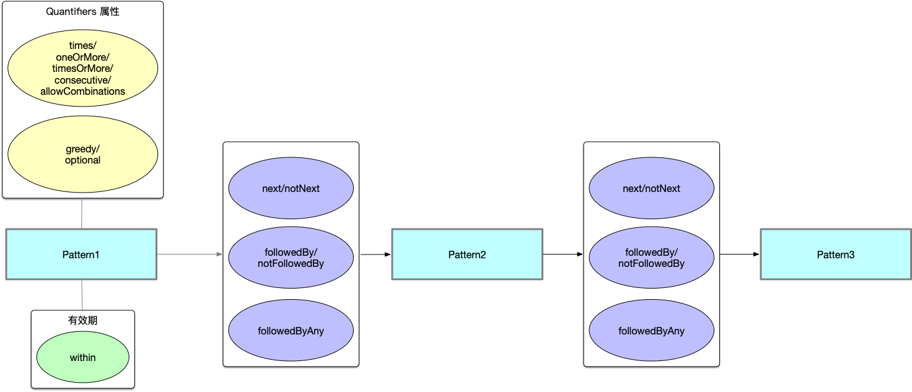

## 1. 什么是 CEP

复杂事件处理，即 Complex Event Processing，用来检测无界数据集中的复杂模式，如受一系列事件驱动的异常检测。
模式的检测过程被称为模式匹配（Pattern Matching）。

平时我们 app 点外卖，如果商家超时未接单，C 端用户如果无法实时感知到，无法实时接收到退款的话，体验感会很差，会疑惑我已支付的钱怎么办？
所以平台要实时监控商家超时未接单这一事件，及时的告知 C 端用户并执行相应的退款操作。


## 2. Flink CEP 的使用场景

- 风控检测

  对用户异常行为模式、数据异常流向实时检测。

- 策略营销

  向特定行为的用户进行实时的精准营销。

- 运维监控

  监控设备运行参数，灵活配置多指标的发生规则。

## 3. 原理

### 3.1 NFA-非确定有限自动机

由点和边组成的状态图。
- 点
  + 始态
  + 中间状态
  + 终态
- 边
  + take：以一种条件作为判断，当过来的一条事件满足 take 边的条件时，就把相应的事件放入结果集，并且转移到下一个状态
  + ignore：当事件到来时，忽略此事件，保持当前状态，是一个自己到自己的状态
  + proceed：状态的空转移，当前的状态不依赖于任何事件而转移到下一个状态，类似透传
  
  
## 4. 如何使用 Flink CEP

### 4.1 Pattern API 

官网上的入门示例：
```java
// 事件流
DataStream<Event> input = ...

// 定义事件模式
Pattern<Event, ?> pattern = Pattern.<Event>begin("start").where(
        new SimpleCondition<Event>() {
            @Override
            public boolean filter(Event event) {
                return event.getId() == 42;
            }
        }
    ).next("middle").subtype(SubEvent.class).where(
        new SimpleCondition<SubEvent>() {
            @Override
            public boolean filter(SubEvent subEvent) {
                return subEvent.getVolume() >= 10.0;
            }
        }
    ).followedBy("end").where(
         new SimpleCondition<Event>() {
            @Override
            public boolean filter(Event event) {
                return event.getName().equals("end");
            }
         }
    );

// 事件模式作用到输入流上
PatternStream<Event> patternStream = CEP.pattern(input, pattern);

// 匹配数据结果集
DataStream<Alert> result = patternStream.process(
    new PatternProcessFunction<Event, Alert>() {
        @Override
        public void processMatch(
                // <pattern 节点名称（start,middle,end），pattern 节点匹配到的事件集合>
                Map<String, List<Event>> pattern,
                Context ctx,
                Collector<Alert> out) throws Exception {
            out.collect(createAlertFrom(pattern));
        }
    });
`````




#### 4.1.1 模式的属性

Quantifiers，对应正则表达式去理解：

| Pattern 操作 | 描述 | 
|--|--|
|  start.times(4);      |  |
|  start.times(4).optional();      |  |
|  start.times(2, 4);      |  |
|  start.times(2, 4).greedy();      |  |
|  start.times(2, 4).optional();      |  |
|  start.times(2, 4).optional().greedy();     |  |
|  start.oneOrMore();      |  |
|  start.oneOrMore().greedy();      |  |
|  start.oneOrMore().optional();      |  |
|  start.oneOrMore().optional().greedy();      |  |
|  start.timesOrMore(2);      |  |
|  start.timesOrMore(2).greedy();     |  |
|  start.timesOrMore(2).optional().greedy();      |  |

#### 4.1.2 条件

| Pattern 操作 | 描述 | 
|--|--|
|  where(condition)      | 简单条件 |
|  subtype(subClass) | 指定当前 Pattern 要过滤的事件类型为初始事件的子类型 |
|  or(condition)       | 联合条件 |
|  until(condition)       | 终止条件 |


#### 4.1.3 有效期


#### 4.1.4 模式间的联系

Pattern(a b)
Streaming("a","c","b1","b2")

- next/notNext：严格连续性，两个 match 的事件必须连续发生
{}

- followedBy/notFollowedBy：宽松连续性，两个 match 的事件之间允许忽略不 match 的事件
{a,b1}

- followedByAny：非确定宽松连续性，两个 match 的事件之间允许忽略不 match 的事件和 match 的事件
{a,b1} {a,b2}


| Pattern 操作 | 描述 | 
|--|--|
|  next/notNext     |严格连续性，两个 match 的事件必须连续发生 |
|  followedBy/notFollowedBy | 宽松连续性，两个 match 的事件之间允许忽略不 match 的事件 |
|  followedByAny       | 非确定宽松连续性，两个 match 的事件之间允许忽略不 match 的事件和 match 的事件 |
|  consecutive()	    |  |
|  allowCombinations()	|  |


#### 4.1.5 Groups of patterns


| Pattern 操作 | 描述 | 
|--|--|
|  begin(pattern_s)     | |
|  next("middle")       |  |
|  followedBy("middle")       |  |

|  consecutive()	    |  |
|  allowCombinations()	|  |


#### 4.1.6 匹配之后的 SKIP 策略


#### 4.1.6 输出模式匹配的结果

| 输出方式 |  描述 |
|--|--|
| PatternSelectFunction  |  |  |  | 
| PatternFlatSelectFunction  |  |  |  | 
| PatternTimeoutFunction  |  |  |  | 
| PatternFlatTimeoutFunction  |  |  |  | 
| PatternProcessFunction  |  |  |  | 


#### 4.1.6 输出过期的 Pattern 数据


#### 4.1.7 EventTime 中处理迟到数据


### 4.2 CEP SQL


## 5. 实现


> 参考：
> https://ci.apache.org/projects/flink/flink-docs-release-1.10/dev/libs/cep.html
> 
> 
> https://files.alicdn.com/tpsservice/94d409d9679d1b46034f7d00161d99a7.pdf
> https://ci.apache.org/projects/flink/flink-docs-stable/dev/table/streaming/match_recognize.html
> https://help.aliyun.com/document_detail/73845.html?spm=a2c4g.11186623.6.657.65074146ntMAgq
