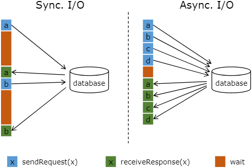
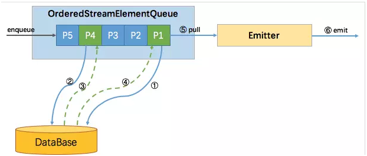
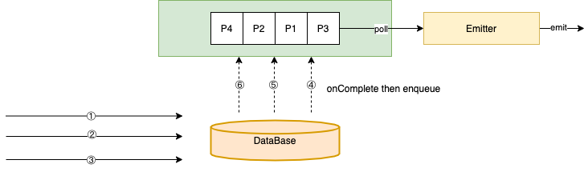
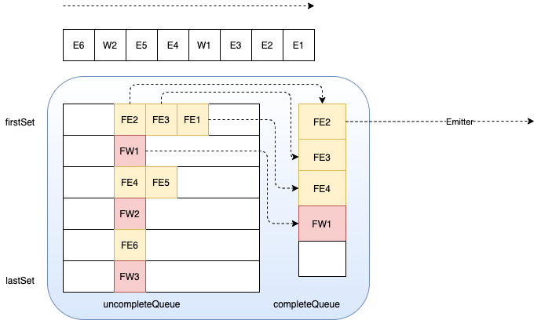

[TOC]

### 1. 维表join

流计算系统中经常需要与外部系统进行交互，比如需要查询外部数据库以关联上用户的额外信息。通常，我们的实现方式是向数据库发送用户`a`的查询请求，然后等待结果返回，在这之前，我们无法发送用户`b`的查询请求。这是一种同步访问的模式，如下图左边所示。



图中棕色的长条表示等待时间，可以发现网络等待时间极大地阻碍了吞吐和延迟。为了解决同步访问的问题，异步模式可以并发地处理多个请求和回复。也就是说，你可以连续地向数据库发送用户`a`、`b`、`c`等的请求，与此同时，哪个请求先返回了就处理哪个请求，从而连续的请求之间不需要阻塞等待，如上图右边所示。这也正是 Async I/O 的实现原理。

###2. richmapfunction

利用richmapfunction进行维表关联，就是典型的sync I/O的关联方式。两次请求之间阻塞进行。不适合并发量高的情形。

#### 2.1 示例

```java
  public static final class MapWithSiteInfoFunc
    extends RichMapFunction<String, String> {
    private static final Logger LOGGER = LoggerFactory.getLogger(MapWithSiteInfoFunc.class);
    private static final long serialVersionUID = 1L;
    private transient ScheduledExecutorService dbScheduler;
    // 引入缓存，减小请求次数
    private Map<Integer, SiteAndCityInfo> siteInfoCache;

    @Override
    public void open(Configuration parameters) throws Exception {
      super.open(parameters);
      siteInfoCache = new HashMap<>(1024);
			// 利用定时线程，实现维度数据的周期性更新
      dbScheduler = new ScheduledThreadPoolExecutor(1, r -> {
        Thread thread = new Thread(r, "site-info-update-thread");
        thread.setUncaughtExceptionHandler((t, e) -> {
          LOGGER.error("Thread " + t + " got uncaught exception: " + e);
        });
        return thread;
      });

      dbScheduler.scheduleWithFixedDelay(() -> {
        try {
          QueryRunner queryRunner = new QueryRunner(JdbcUtil.getDataSource());
          List<Map<String, Object>> info = queryRunner.query(SITE_INFO_QUERY_SQL, new MapListHandler());

          for (Map<String, Object> item : info) {
            siteInfoCache.put((int) item.get("site_id"), new SiteAndCityInfo(
              (int) item.get("site_id"),
              (String) item.getOrDefault("site_name", ""),
              (long) item.get("city_id"),
              (String) item.getOrDefault("city_name", "")
            ));
          }

          LOGGER.info("Fetched {} site info records, {} records in cache", info.size(), siteInfoCache.size());
        } catch (Exception e) {
          LOGGER.error("Exception occurred when querying: " + e);
        }
      }, 0, 10 * 60, TimeUnit.SECONDS);
    }

    @Override
    public String map(String value) throws Exception {
      JSONObject json = JSON.parseObject(value);
      int siteId = json.getInteger("site_id");
     
      String siteName = "", cityName = "";
      SiteAndCityInfo info = siteInfoCache.getOrDefault(siteId, null);
      if (info != null) {
        siteName = info.getSiteName();
        cityName = info.getCityName();
      }

      json.put("site_name", siteName);
      json.put("city_name", cityName);
      return json.toJSONString();
    }

    @Override
    public void close() throws Exception {
      // 清空缓存，关闭连接
      siteInfoCache.clear();
      ExecutorUtils.gracefulShutdown(10, TimeUnit.SECONDS, dbScheduler);
      JdbcUtil.close();

      super.close();
    }

    private static final String SITE_INFO_QUERY_SQL = "...";
  }
```

​	

### 3. asyncio

Flink 1.2中引入了Async IO(异步IO)来加快flink与外部系统的交互性能，提升吞吐量。其设计的核心是对原有的每条处理后的消息发送至下游operator的执行流程进行改进。其核心实现包括生产和消费两部分，生产端引入了一个AsyncWaitOperator,在其processElement/processWatermark方法中完成对消息的维表关联，随即将未处理完的Futrue对象存入队列中；消费端引入一个Emitter线程，不断从队列中消费数据并发往下游算子。

#### 3.1 示例

简单的来说，使用 Async I/O 对应到 Flink 的 API 就是 RichAsyncFunction 这个抽象类，继承这个抽象类实现里面的open（初始化），asyncInvoke（数据异步调用），close（停止的一些操作）方法，最主要的是实现asyncInvoke 里面的方法。有如下示例，Kafka作为流表，存储用户浏览记录，Elasticsearch作为维表，存储用户年龄信息，利用async I/O对浏览记录进行加宽。

流表: 用户行为日志。某个用户在某个时刻点击或浏览了某个商品。自己造的测试数据，数据样例如下:

```json
{"userID": "user_1", "eventTime": "2016-06-06 07:03:42", "eventType": "browse", "productID": 2}
```

维表: 用户基础信息。自己造的测试数据，数据存储在ES上，数据样例如下:

```json
GET dim_user/dim_user/user

{
  "_index": "dim_user",
  "_type": "dim_user",
  "_id": "user_1",
  "_version": 1,
  "found": true,
  "_source": {
    "age": 22
  }
}
```

实现逻辑：

```java
public class FlinkAsyncIO {
    public static void main(String[] args) throws Exception{

        String kafkaBootstrapServers = "localhost:9092";
        String kafkaGroupID = "async-test";
        String kafkaAutoOffsetReset= "latest";
        String kafkaTopic = "asyncio";
        int kafkaParallelism =2;

        String esHost= "localhost";
        Integer esPort= 9200;
        String esUser = "";
        String esPassword = "";
        String esIndex = "dim_user";
        String esType = "dim_user";

        /**Flink DataStream 运行环境*/
        Configuration config = new Configuration();
        config.setInteger(RestOptions.PORT,8081);
        config.setBoolean(ConfigConstants.LOCAL_START_WEBSERVER, true);
        StreamExecutionEnvironment env = StreamExecutionEnvironment.createLocalEnvironmentWithWebUI(config);

        /**添加数据源*/
        Properties kafkaProperties = new Properties();
        kafkaProperties.put("bootstrap.servers",kafkaBootstrapServers);
        kafkaProperties.put("group.id",kafkaGroupID);
        kafkaProperties.put("auto.offset.reset",kafkaAutoOffsetReset);
        FlinkKafkaConsumer010<String> kafkaConsumer = new FlinkKafkaConsumer010<>(kafkaTopic, new SimpleStringSchema(), kafkaProperties);
        kafkaConsumer.setCommitOffsetsOnCheckpoints(true);
        SingleOutputStreamOperator<String> source = env.addSource(kafkaConsumer).name("KafkaSource").setParallelism(kafkaParallelism);

        //数据转换
        SingleOutputStreamOperator<Tuple4<String, String, String, Integer>> sourceMap = source.map((MapFunction<String, Tuple4<String, String, String, Integer>>) value -> {
            Tuple4<String, String, String, Integer> output = new Tuple4<>();
            try {
                JSONObject obj = JSON.parseObject(value);
                output.f0 = obj.getString("userID");
                output.f1 = obj.getString("eventTime");
                output.f2 = obj.getString("eventType");
                output.f3 = obj.getInteger("productID");
            } catch (Exception e) {
                e.printStackTrace();
            }
            return output;
        }).returns(new TypeHint<Tuple4<String, String, String, Integer>>(){}).name("Map: ExtractTransform");

        //过滤掉异常数据
        SingleOutputStreamOperator<Tuple4<String, String, String, Integer>> sourceFilter = sourceMap.filter((FilterFunction<Tuple4<String, String, String, Integer>>) value -> value.f3 != null).name("Filter: FilterExceptionData");

        //Timeout: 超时时间 默认异步I/O请求超时时，会引发异常并重启或停止作业。 如果要处理超时，可以重写AsyncFunction#timeout方法。
        //Capacity: 并发请求数量
        /**Async IO实现流表与维表Join*/
        SingleOutputStreamOperator<Tuple5<String, String, String, Integer, Integer>> result = AsyncDataStream.unorderedWait(sourceFilter, new ElasticsearchAsyncFunction(esHost,esPort,esUser,esPassword,esIndex,esType), 500, TimeUnit.MILLISECONDS, 10).name("Join: JoinWithDim");

        /**结果输出*/
        result.print().name("PrintToConsole");
        env.execute();
    }
}
```

ElasticsearchAsyncFunction：

```java
public class ElasticsearchAsyncFunction extends RichAsyncFunction<Tuple4<String, String, String, Integer>, Tuple5<String, String, String, Integer, Integer>> {
    private String host;
    private Integer port;
    private String user;
    private String password;
    private String index;
    private String type;

    public ElasticsearchAsyncFunction(String host, Integer port, String user, String password, String index, String type) {
        this.host = host;
        this.port = port;
        this.user = user;
        this.password = password;
        this.index = index;
        this.type = type;
    }

    private RestHighLevelClient restHighLevelClient;
    private Cache<String, Integer> cache;
    /**
     * 和ES建立连接
     *
     * @param parameters
     */
    @Override
    public void open(Configuration parameters) {

        //ES Client
        CredentialsProvider credentialsProvider = new BasicCredentialsProvider();
        credentialsProvider.setCredentials(AuthScope.ANY, new UsernamePasswordCredentials(user, password));
        restHighLevelClient = new RestHighLevelClient(
                RestClient
                        .builder(new HttpHost(host, port))
                        .setHttpClientConfigCallback(httpAsyncClientBuilder -> HttpAsyncClientBuilder.create()));

        //初始化缓存
        cache = CacheBuilder.newBuilder().maximumSize(2).expireAfterAccess(5, TimeUnit.MINUTES).build();
    }

    /**
     * 关闭连接
     *
     * @throws Exception
     */
    @Override
    public void close() throws Exception {
        restHighLevelClient.close();
    }
    /**
     * 异步调用
     *
     * @param input
     * @param resultFuture
     */
    @Override
    public void asyncInvoke(Tuple4<String, String, String, Integer> input, ResultFuture<Tuple5<String, String, String, Integer, Integer>> resultFuture) {

        // 1、先从缓存中取
        Integer cachedValue = cache.getIfPresent(input.f0);
        if (cachedValue != null) {
            System.out.println("从缓存中获取到维度数据: key=" + input.f0 + ",value=" + cachedValue);
            resultFuture.complete(Collections.singleton(new Tuple5<>(input.f0, input.f1, input.f2, input.f3, cachedValue)));

            // 2、缓存中没有,则从外部存储获取
        } else {
            searchFromES(input, resultFuture);
        }
    }
    /**
     * 当缓存中没有数据时，从外部存储ES中获取
     *
     * @param input
     * @param resultFuture
     */
    private void searchFromES(Tuple4<String, String, String, Integer> input, ResultFuture<Tuple5<String, String, String, Integer, Integer>> resultFuture) {

        // 1、构造输出对象
        Tuple5<String, String, String, Integer, Integer> output = new Tuple5<>();
        output.f0 = input.f0;
        output.f1 = input.f1;
        output.f2 = input.f2;
        output.f3 = input.f3;

        // 2、待查询的Key
        String dimKey = input.f0;

        // 3、构造Ids Query
        SearchRequest searchRequest = new SearchRequest();
        searchRequest.indices(index);
        searchRequest.types(type);
        searchRequest.source(SearchSourceBuilder.searchSource().query(QueryBuilders.idsQuery().addIds(dimKey)));

        RequestOptions requestOptions = RequestOptions.DEFAULT;
        // 4、用异步客户端查询数据
        restHighLevelClient.searchAsync(searchRequest, RequestOptions.DEFAULT, new ActionListener<SearchResponse>() {

            //成功响应时处理
            @Override
            public void onResponse(SearchResponse searchResponse) {
                SearchHit[] searchHits = searchResponse.getHits().getHits();
                if (searchHits.length > 0) {
                    JSONObject obj = JSON.parseObject(searchHits[0].getSourceAsString());
                    Integer dimValue = obj.getInteger("age");
                    output.f4 = dimValue;
                    cache.put(dimKey, dimValue);
                    System.out.println("将维度数据放入缓存: key=" + dimKey + ",value=" + dimValue);
                }
                resultFuture.complete(Collections.singleton(output));
            }

            //响应失败时处理
            @Override
            public void onFailure(Exception e) {
                output.f4 = null;
                resultFuture.complete(Collections.singleton(output));
            }
        });

    }

    //超时时处理
    @Override
    public void timeout(Tuple4<String, String, String, Integer> input, ResultFuture<Tuple5<String, String, String, Integer, Integer>> resultFuture) {
        searchFromES(input, resultFuture);
    }
}
```


#### 3.2 Ordered模式

Flink Async I/O又可以细分为三种，一种是有序的Ordered模式，一种是ProcessingTime 无序模式，一种是EventTime 无序。

主要区别是往下游output的顺序，有序模式会按接收的顺序继续往下游output发送，无序模式就是谁先处理完谁就先往下游发送。下图是ordered模式的原理图。

无论有序无需，都采用了Futrue/Promise设计模式，大体都遵循以下设计逻辑：

1. 生产端：将每条消息封装成一个`StreamRecordQueueEntry`(内部维护一个Future对象)，放入`StreamElementQueue`中

2. 生产端：消息与外部系统交互的逻辑放入AsynInvoke方法中，将交互执行结果放入`StreamRecordQueueEntry`中
3. 消费端：启动一个emitter线程，从`StreamElementQueue`中读取已经完成的`StreamRecordQueueEntry`，将其结果发送至下游operator算子





下面我们分别就生产端和消费端对ordered模式进行源码分析

##### 3.2.1 生产

AsyncWaitOperator

```java
@Internal
public class AsyncWaitOperator<IN, OUT>
		extends AbstractUdfStreamOperator<OUT, AsyncFunction<IN, OUT>>
		implements OneInputStreamOperator<IN, OUT>, OperatorActions, BoundedOneInput {

	@Override
	public void setup(StreamTask<?, ?> containingTask, StreamConfig config, Output<StreamRecord<OUT>> output) {
		super.setup(containingTask, config, output);

		this.checkpointingLock = getContainingTask().getCheckpointLock();

		this.inStreamElementSerializer = new StreamElementSerializer<>(
			getOperatorConfig().<IN>getTypeSerializerIn1(getUserCodeClassloader()));

		// create the operators executor for the complete operations of the queue entries
		this.executor = Executors.newSingleThreadExecutor();
		// 根据项目中使用AsyncDataStream.unorderedWait还是AsyncDataStream.orderedWait方法，进行有序和无需两种模式的区分，初始化不同的队列
		switch (outputMode) {
			case ORDERED:
				queue = new OrderedStreamElementQueue(
					capacity,
					executor,
					this);
				break;
			case UNORDERED:
				queue = new UnorderedStreamElementQueue(
					capacity,
					executor,
					this);
				break;
			default:
				throw new IllegalStateException("Unknown async mode: " + outputMode + '.');
		}
	}

	@Override
	public void open() throws Exception {
		super.open();

		// 启动emitter线程
		this.emitter = new Emitter<>(checkpointingLock, output, queue, this);
		this.emitterThread = new Thread(emitter, "AsyncIO-Emitter-Thread (" + getOperatorName() + ')');
		emitterThread.setDaemon(true);
		emitterThread.start();

		// process stream elements from state, since the Emit thread will start as soon as all
		// elements from previous state are in the StreamElementQueue, we have to make sure that the
		// order to open all operators in the operator chain proceeds from the tail operator to the
		// head operator.
		if (recoveredStreamElements != null) {
			for (StreamElement element : recoveredStreamElements.get()) {
				if (element.isRecord()) {
					processElement(element.<IN>asRecord());
				}
				else if (element.isWatermark()) {
					processWatermark(element.asWatermark());
				}
				else if (element.isLatencyMarker()) {
					processLatencyMarker(element.asLatencyMarker());
				}
				else {
					throw new IllegalStateException("Unknown record type " + element.getClass() +
						" encountered while opening the operator.");
				}
			}
			recoveredStreamElements = null;
		}

	}

  // 算子中的processElement方法，都会逐个处理每一条到来的数据
	@Override
	public void processElement(StreamRecord<IN> element) throws Exception {
    // 将数据包装成StreamRecordBufferEntry对象
		final StreamRecordQueueEntry<OUT> streamRecordBufferEntry = new StreamRecordQueueEntry<>(element);

		addAsyncBufferEntry(streamRecordBufferEntry);
		// 调用AsyncFunction接口的用户自定义实现类ElasticsearchAsyncFunction中的asyncInvoke方法，该用户实现方法中，将返回结果通过异步回调的方式，返回给StreamRecordBufferEntry对象中的Future对象
		userFunction.asyncInvoke(element.getValue(), streamRecordBufferEntry);
	}

	private <T> void addAsyncBufferEntry(StreamElementQueueEntry<T> streamElementQueueEntry) throws InterruptedException {
		assert(Thread.holdsLock(checkpointingLock));

		pendingStreamElementQueueEntry = streamElementQueueEntry;
		// 尝试将StreamRecordQueueEntry对象加入到队列
		while (!queue.tryPut(streamElementQueueEntry)) {
			// we wait for the emitter to notify us if the queue has space left again
			checkpointingLock.wait();
		}
		pendingStreamElementQueueEntry = null;
	}
}

```


OrderedStreamElementQueue

```java
@Internal
public class OrderedStreamElementQueue implements StreamElementQueue {
  // 往OrderedStreamElementQueue队列中插入StreamRecordBufferEntry对象
	@Override
	public <T> boolean tryPut(StreamElementQueueEntry<T> streamElementQueueEntry) throws InterruptedException {
		lock.lockInterruptibly();

		try {
      // capacity用于控制并发请求数量，即OrderedStreamElementQueue队列中的StreamRecordBufferEntry对象的个数
			if (queue.size() < capacity) {
				addEntry(streamElementQueueEntry);

				LOG.debug("Put element into ordered stream element queue. New filling degree " +
					"({}/{}).", queue.size(), capacity);

				return true;
			} else {
        // 如果一直插入失败，则AsyncWaitOperator#addAsyncBufferEntry方法会无限尝试插入，极致情况下，会触发Flink自身的反压机制，用户不用做任何特殊处理
				LOG.debug("Failed to put element into ordered stream element queue because it " +
					"was full ({}/{}).", queue.size(), capacity);

				return false;
			}
		} finally {
			lock.unlock();
		}
	}
  
  	private <T> void addEntry(StreamElementQueueEntry<T> streamElementQueueEntry) {
		assert(lock.isHeldByCurrentThread());
		// 将StreamRecordBufferEntry对象插入队尾
		queue.addLast(streamElementQueueEntry);

    // StreamRecordBufferEntry对象中的Futrue对象一旦返回结果，则进行以下调用
		streamElementQueueEntry.onComplete(
			(StreamElementQueueEntry<T> value) -> {
				try {
					onCompleteHandler(value);
				} catch (InterruptedException e) {
					// we got interrupted. This indicates a shutdown of the executor
					LOG.debug("AsyncBufferEntry could not be properly completed because the " +
						"executor thread has been interrupted.", e);
				} catch (Throwable t) {
					operatorActions.failOperator(new Exception("Could not complete the " +
						"stream element queue entry: " + value + '.', t));
				}
			},
			executor);
	}
  
  	private void onCompleteHandler(StreamElementQueueEntry<?> streamElementQueueEntry) throws InterruptedException {
		lock.lockInterruptibly();

		try {
      // 队列不为空，且队首StreamRecordBufferEntry对象中的Future对象已收到返回值，则通过Condition对象唤醒emmiter线程，使其能够取出队首元素
			if (!queue.isEmpty() && queue.peek().isDone()) {
				LOG.debug("Signal ordered stream element queue has completed head element.");
				headIsCompleted.signalAll();
			}
		} finally {
			lock.unlock();
		}
	}
  
  	@Override
	public AsyncResult peekBlockingly() throws InterruptedException {
		lock.lockInterruptibly();

		try {
			// emmiter线程在从队列中取StreamRecordBufferEntry对象时，如果队列为空 or 队首future未完成，则emmiter线程会一直阻塞
			while (queue.isEmpty() || !queue.peek().isDone()) {
        // Condition阻塞
				headIsCompleted.await();
			}

			LOG.debug("Peeked head element from ordered stream element queue with filling degree " +
				"({}/{}).", queue.size(), capacity);

			return queue.peek();
		} finally {
			lock.unlock();
		}
	}
}
```

##### 3.2.2 消费

Emmiter

```java
@Internal
public class Emitter<OUT> implements Runnable {
  @Override
	public void run() {
		try {
      // 不断尝试读取队首元素，在OrderedStreamElementQueue#peekBlockingly中可以看到，如果队首元素中的Future对象还没有返回数据，Emitter线程会一直阻塞
			while (running) {
				LOG.debug("Wait for next completed async stream element result.");
				AsyncResult streamElementEntry = streamElementQueue.peekBlockingly();
				// 将数据发往下游算子
				output(streamElementEntry);
			}
		} catch (InterruptedException e) {
			if (running) {
				operatorActions.failOperator(e);
			} else {
				// Thread got interrupted which means that it should shut down
				LOG.debug("Emitter thread got interrupted, shutting down.");
			}
		} catch (Throwable t) {
			operatorActions.failOperator(new Exception("AsyncWaitOperator's emitter caught an " +
				"unexpected throwable.", t));
		}
	}
  
  	private void output(AsyncResult asyncResult) throws InterruptedException {
		if (asyncResult.isWatermark()) {
			synchronized (checkpointLock) {
				AsyncWatermarkResult asyncWatermarkResult = asyncResult.asWatermark();

				LOG.debug("Output async watermark.");
				// 如果是watermark，直接发往下游算子
				output.emitWatermark(asyncWatermarkResult.getWatermark());

				// 移除队首StreamRecordBufferEntry对象，注意peek和poll的区别
				streamElementQueue.poll();

				// notify the main thread that there is again space left in the async collector
				// buffer
				checkpointLock.notifyAll();
			}
		} else {
			AsyncCollectionResult<OUT> streamRecordResult = asyncResult.asResultCollection();

			if (streamRecordResult.hasTimestamp()) {
				timestampedCollector.setAbsoluteTimestamp(streamRecordResult.getTimestamp());
			} else {
				timestampedCollector.eraseTimestamp();
			}

			synchronized (checkpointLock) {
				LOG.debug("Output async stream element collection result.");

				try {
					// 取出StreamRecordBufferEntry对象中的Future对象中的join后的数据
					Collection<OUT> resultCollection = streamRecordResult.get();

					// 将数据发往下游算子
					if (resultCollection != null) {
						for (OUT result : resultCollection) {
							timestampedCollector.collect(result);
						}
					}
				} catch (Exception e) {
					operatorActions.failOperator(
						new Exception("An async function call terminated with an exception. " +
							"Failing the AsyncWaitOperator.", e));
				}

				// 移除队首StreamRecordBufferEntry对象，注意peek和poll的区别
				streamElementQueue.poll();

				// notify the main thread that there is again space left in the async collector
				// buffer
				checkpointLock.notifyAll();
			}
		}
	}
}
```


#### 3.3 基于processtime的unordered模式

区别于ordered模式，无序模式下的StreamRecordBufferEntry对象外层又被封装了一层Set层，主要是为了应对watermark的存在，详情见下节。基于processtime的unordered模式下，虽然没有watermark，但是也跟基于eventTime的unordered模式共用了同一套逻辑，因此也多了一层Set层。

该模式下，不存在watermark类型的消息，因此所有消息的StreamRecordBufferEntry对象都是放入lastSet（此模式下，lastSet和firstSet引用相同的对象）,在消息的onCompleteHandler方法中，直接将该消息的StreamRecordBufferEntry对象从lastSet中取出再放入completeQueue中，通过emitter线程发送至下游operator，因此该场景下实现的是完全无序的处理模式。


云邪在其博客

[Flink 原理与实现：Aysnc I/O]: http://wuchong.me/blog/2017/05/17/flink-internals-async-io/

中提到的基于processtime的unordered模式的架构图，是针对Flink 1.3进行分析的，已经不再适用于Flink1.9，Flink1.9中该模式已经不需要用到uncompletedQueue，架构图如下：



##### 3.3.1 生产

UnorderedStreamElementQueue

```java
@Internal
public class UnorderedStreamElementQueue implements StreamElementQueue {
  	private <T> void addEntry(StreamElementQueueEntry<T> streamElementQueueEntry) {
		assert(lock.isHeldByCurrentThread());

		if (streamElementQueueEntry.isWatermark()) {
			lastSet = new HashSet<>(capacity);
			
			if (firstSet.isEmpty()) {
				firstSet.add(streamElementQueueEntry);
			} else {
				Set<StreamElementQueueEntry<?>> watermarkSet = new HashSet<>(1);
				watermarkSet.add(streamElementQueueEntry);
				uncompletedQueue.offer(watermarkSet);
			}
			uncompletedQueue.offer(lastSet);
		} else {
      // 基于processtime的unordered模式只会走这里，且lastSet和firstSet引用同一个对象
			lastSet.add(streamElementQueueEntry);
		}

		streamElementQueueEntry.onComplete(
			(StreamElementQueueEntry<T> value) -> {
				try {
					onCompleteHandler(value);
				} catch (InterruptedException e) {
					// The accept executor thread got interrupted. This is probably cause by
					// the shutdown of the executor.
					LOG.debug("AsyncBufferEntry could not be properly completed because the " +
						"executor thread has been interrupted.", e);
				} catch (Throwable t) {
					operatorActions.failOperator(new Exception("Could not complete the " +
						"stream element queue entry: " + value + '.', t));
				}
			},
			executor);

		numberEntries++;
	}
  
   // StreamRecordBufferEntry对象中的Future对象返回结果时进行回调
  	public void onCompleteHandler(StreamElementQueueEntry<?> streamElementQueueEntry) throws InterruptedException {
		lock.lockInterruptibly();
      
		try {
      // 将StreamRecordBufferEntry对象插入completedQueue队列
      // 此处将StreamRecordBufferEntry对象插入lastSet（等同于firstSet），又从其中取出，确实是比较多余的。这样做只是因为跟”基于eventTime的unordered模式”共用了一套代码
			if (firstSet.remove(streamElementQueueEntry)) {
        // 将StreamRecordBufferEntry对象加入completedQueue
				completedQueue.offer(streamElementQueueEntry);
				// 该模式下不会走下面的代码
				while (firstSet.isEmpty() && firstSet != lastSet) {
					firstSet = uncompletedQueue.poll();

					Iterator<StreamElementQueueEntry<?>> it = firstSet.iterator();

					while (it.hasNext()) {
						StreamElementQueueEntry<?> bufferEntry = it.next();

						if (bufferEntry.isDone()) {
							completedQueue.offer(bufferEntry);
							it.remove();
						}
					}
				}

				LOG.debug("Signal unordered stream element queue has completed entries.");
				hasCompletedEntries.signalAll();
			}
		} finally {
			lock.unlock();
		}
	}
  
  	@Override
	public AsyncResult peekBlockingly() throws InterruptedException {
		lock.lockInterruptibly();

		try {
      // emitter线程从completedQueue取出StreamRecordBufferEntry对象，相比ordered模式，这里不需要判断队首StreamRecordBufferEntry对象中的Future对象是否已经返回，因为只有Futrue已返回的StreamRecordBufferEntry对象才能被插入到completedQueue队列
			while (completedQueue.isEmpty()) {
				hasCompletedEntries.await();
			}

			LOG.debug("Peeked head element from unordered stream element queue with filling degree " +
				"({}/{}).", numberEntries, capacity);

			return completedQueue.peek();
		} finally {
			lock.unlock();
		}
	}
  
}
```


##### 3.3.2 消费

Emitter线程消费逻辑同ordered模式


#### 3.4 基于eventTime的unordered模式

该模式下虽然一段时间内的消息之间是无序的，但是由于引入了watermark，watermark1和watermark2之间的数据必须还是原来那批数据，虽然数据之间是可以是乱序的。即Set集合内部的数据，发往下游时可以乱序，但是watermark1—set—watermark2这个顺序不可以被打破。

如果watermark和数据集set直接的顺序被打乱，那么当watermark2触发窗口计算时，窗口里面的数据可能会变多或变少，影响计算的正确性。





##### 3.4.1 生产

AsyncWaitOperator

```java
@Internal
public class AsyncWaitOperator<IN, OUT>
		extends AbstractUdfStreamOperator<OUT, AsyncFunction<IN, OUT>>
		implements OneInputStreamOperator<IN, OUT>, OperatorActions, BoundedOneInput {
  	@Override
	public void processWatermark(Watermark mark) throws Exception {
		WatermarkQueueEntry watermarkBufferEntry = new WatermarkQueueEntry(mark);
    // 处理watermark
		addAsyncBufferEntry(watermarkBufferEntry);
	}
  
  	@Override
	public void processElement(StreamRecord<IN> element) throws Exception {
		final StreamRecordQueueEntry<OUT> streamRecordBufferEntry = new StreamRecordQueueEntry<>(element);
    // 处理StreamRecordBufferEntry对象
		addAsyncBufferEntry(streamRecordBufferEntry);
		userFunction.asyncInvoke(element.getValue(), streamRecordBufferEntry);
	}
  
  	private <T> void addAsyncBufferEntry(StreamElementQueueEntry<T> streamElementQueueEntry) throws InterruptedException {
		assert(Thread.holdsLock(checkpointingLock));

		pendingStreamElementQueueEntry = streamElementQueueEntry;
		// 尝试将StreamRecordBufferEntry对象 or watermarkBufferEntry对象插入队列
		while (!queue.tryPut(streamElementQueueEntry)) {
			// we wait for the emitter to notify us if the queue has space left again
			checkpointingLock.wait();
		}
		pendingStreamElementQueueEntry = null;
	}
}
```


UnorderedStreamElementQueue

```java
@Internal
public class UnorderedStreamElementQueue implements StreamElementQueue {
	@Override
	public <T> boolean tryPut(StreamElementQueueEntry<T> streamElementQueueEntry) throws InterruptedException {
		lock.lockInterruptibly();
		try {
			if (numberEntries < capacity) {
				addEntry(streamElementQueueEntry);

				LOG.debug("Put element into unordered stream element queue. New filling degree " +
					"({}/{}).", numberEntries, capacity);

				return true;
			} else {
				LOG.debug("Failed to put element into unordered stream element queue because it " +
					"was full ({}/{}).", numberEntries, capacity);

				return false;
			}
		} finally {
			lock.unlock();
		}
	}

	private <T> void addEntry(StreamElementQueueEntry<T> streamElementQueueEntry) {
		assert(lock.isHeldByCurrentThread());

		if (streamElementQueueEntry.isWatermark()) {
      // 遇到watermark，将lastSet置空，方便塞入下一批StreamRecordBufferEntry对象
      // 注：firstSet可以存watermarkBufferEntry对象，也可以存StreamRecordBufferEntry对象；但是
      // lastSet只会存StreamRecordBufferEntry对象
			lastSet = new HashSet<>(capacity); 

			if (firstSet.isEmpty()) {
				firstSet.add(streamElementQueueEntry);
			} else {
				Set<StreamElementQueueEntry<?>> watermarkSet = new HashSet<>(1);
				watermarkSet.add(streamElementQueueEntry);
				uncompletedQueue.offer(watermarkSet);
			}
			uncompletedQueue.offer(lastSet);
		} else {
      //在没有遇到watermark之前，一直往lastSet中塞入StreamRecordBufferEntry对象
			lastSet.add(streamElementQueueEntry);
		}

		streamElementQueueEntry.onComplete(
			(StreamElementQueueEntry<T> value) -> {
				try {
					onCompleteHandler(value);
				} catch (InterruptedException e) {
					// The accept executor thread got interrupted. This is probably cause by
					// the shutdown of the executor.
					LOG.debug("AsyncBufferEntry could not be properly completed because the " +
						"executor thread has been interrupted.", e);
				} catch (Throwable t) {
					operatorActions.failOperator(new Exception("Could not complete the " +
						"stream element queue entry: " + value + '.', t));
				}
			},
			executor);

		numberEntries++;
	}
		// watermarkBufferEntry对象 or StreamRecordBufferEntry对象中的Futrue对象返回后的回调逻辑
  	public void onCompleteHandler(StreamElementQueueEntry<?> streamElementQueueEntry) throws InterruptedException {
		lock.lockInterruptibly();

		try {
      // 从firstSet中取出StreamRecordBufferEntry对象
			if (firstSet.remove(streamElementQueueEntry)) {
        // 将取出的StreamRecordBufferEntry对象加入completedQueue
				completedQueue.offer(streamElementQueueEntry);

				while (firstSet.isEmpty() && firstSet != lastSet) {
          // firstSet指针下移
					firstSet = uncompletedQueue.poll();

					Iterator<StreamElementQueueEntry<?>> it = firstSet.iterator();
					// 遍历firstSet中的StreamRecordBufferEntry对象，如果完成，加入completedQueue队列，且移出firstSet
					while (it.hasNext()) {
						StreamElementQueueEntry<?> bufferEntry = it.next();
						if (bufferEntry.isDone()) {
							completedQueue.offer(bufferEntry);
							it.remove();
						}
					}
				}

				LOG.debug("Signal unordered stream element queue has completed entries.");
				hasCompletedEntries.signalAll();
			}
		} finally {
			lock.unlock();
		}
	}

```


##### 3.4.2 消费

Emitter线程消费逻辑同ordered模式

> 参考：
>
> http://wuchong.me/blog/2017/05/17/flink-internals-async-io/
>
> https://www.cnblogs.com/ljygz/p/11864176.html
>
> https://www.jianshu.com/p/f9bde854627b
>
> https://blog.csdn.net/weixin_44904816/article/details/104305824?utm_medium=distribute.pc_relevant_right.none-task-blog-BlogCommendFromMachineLearnPai2-5.nonecase&depth_1-utm_source=distribute.pc_relevant_right.none-task-blog-BlogCommendFromMachineLearnPai2-5.nonecase