### 背景

我们知道，流处理从事件产生，到流经source，再到operator，中间是有一个过程和时间的。虽然大部分情况下，流到operator的数据都是按照事件产生的时间顺序来的，但是也不排除由于网络延迟等原因，导致乱序的产生，特别是使用kafka的话，多个分区的数据无法保证有序。那么此时出现一个问题，一旦出现乱序，如果只根据 eventTime 决定 window 的运行，我们不能明确数据是否全部到位，又不能无限期的等下去，必须要有个机制来保证一个特定的时间后，必须触发window去进行计算了。这个特别的机制，就是watermark


如图中的 record 3 和 record 5 为乱序数据，record 4 为迟到数据，下文会介绍 Flink 是如何处理迟到数据的。

### 定义

watermark是一种特殊的时间戳，也是一种被插入到数据流的特殊的数据结构，用于表示eventTime小于watermark的事件已经全部落入到相应的窗口中，此时可进行窗口操作。

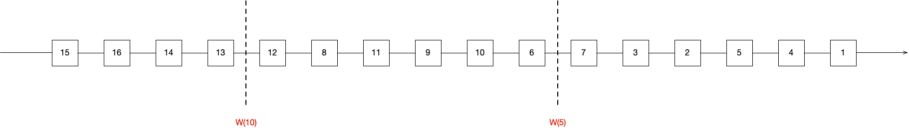

数据流入图

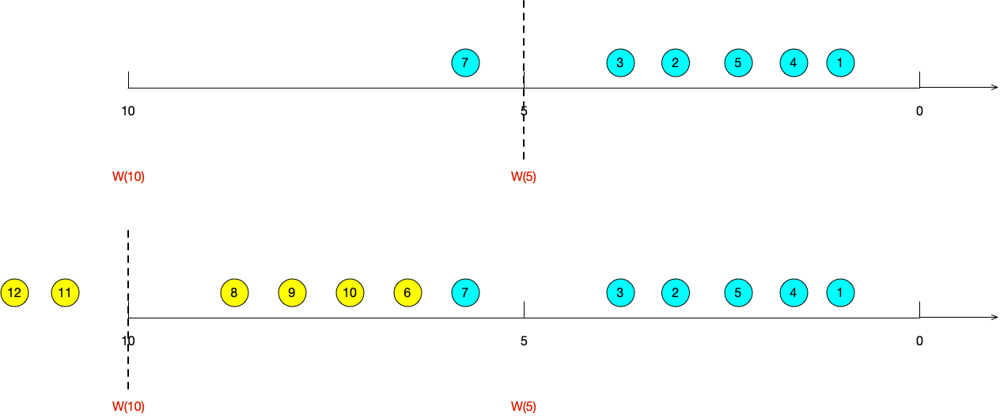


数据落位图

如图是一个乱序流，窗口大小为5，w(5)表示eventTime < 5的所有数据均已落入相应窗口，window_end_time < =5的所有窗口都将进行计算；w(10)表示表示eventTime < 10的所有数据均已落入相应窗口，5 < window_end_time < =10的所有窗口都将进行计算。

### 生成

#### 1. 生成时机

通常，在接收到source的数据后，应该立刻生成watermark；但是，也可以在source后应用简单的map或者filter操作，再生成watermark。

#### 2. 生成方式

1. With Periodic Watermarks（常用）

周期性的生成watermark，周期默认是200ms，可通过`env.getConfig().setAutoWatermarkInterval()`进行修改。实现`AssignerWithPeriodicWatermarks`接口，使用方式如下：

```java
        DataStream<Tuple2<String, Long>> waterMarkStream = inputMap.assignTimestampsAndWatermarks(new AssignerWithPeriodicWatermarks<Tuple2<String, Long>>() {

            Long currentMaxTimestamp = 0L;
            final Long maxOutOfOrderness = 10000L;// 最大允许的延迟时间是10s

            SimpleDateFormat sdf = new SimpleDateFormat("yyyy-MM-dd HH:mm:ss.SSS");
            /**
             * 定义生成watermark的逻辑
             * 默认200ms被调用一次
             */
            @Nullable
            @Override
            public Watermark getCurrentWatermark() {
                return new Watermark(currentMaxTimestamp - maxOutOfOrderness);
            }

            //定义如何提取timestamp
            @Override
            public long extractTimestamp(Tuple2<String, Long> element, long previousElementTimestamp) {
                long timestamp = element.f1;
                currentMaxTimestamp = Math.max(timestamp, currentMaxTimestamp);
                return timestamp;
            }
        });
```


2. With Punctuated Watermarks（不常用）

在满足自定义条件时生成watermark，每一个元素都有机会判断是否生成一个watermark。 如果得到的watermark 不为null并且比之前的大就注入流中。实现`AssignerWithPunctuatedWatermarks`接口，使用方式如下：

```java
				DataStream<Tuple2<String, Long>> waterMarkStream = inputMap.assignTimestampsAndWatermarks(new AssignerWithPunctuatedWatermarks<Tuple2<String, Long>>(){

            @Override
            public long extractTimestamp(Tuple2<String, Long> element, long previousElementTimestamp) {
                return element.f1;
            }

            @Nullable
            @Override
            public Watermark checkAndGetNextWatermark(Tuple2<String, Long> lastElement, long extractedTimestamp) {
                // 当时间戳为偶数则生成，为奇数不不生成
                return lastElement.f1 % 2 == 0 ? new Watermark(extractedTimestamp) : null;
            }
        });
```

### 更新规则

#### 1. 单并行度

watermark单调递增，一直覆盖较小的watermark

#### 2. 多并行度

每个分区都会维护和更新自己的watermark。某一时刻的watermark取所有分区中最小的那一个，详情见watermark的传播


### 传播

Tasks 内部有一个 time services，维护 timers ，当接收到 watermark 时触发。例如，一个窗口 operator 为每一个活跃窗口在 time servive 注册一个 timer，当event time大于窗口结束时间时，清除窗口状态。

当 task 接收到 watermark 后，会执行以下操作：

1. task 根据 watermark 的时间戳，更新内部的 event_time clock。
2. time service 区分出所有时间戳小于更新之后的 event_time 的 timers，对超时的 timer，task 执行回调函数触发计算并发射数据。
3. task 发射 watermark，时间戳为更新之后的 event_time。

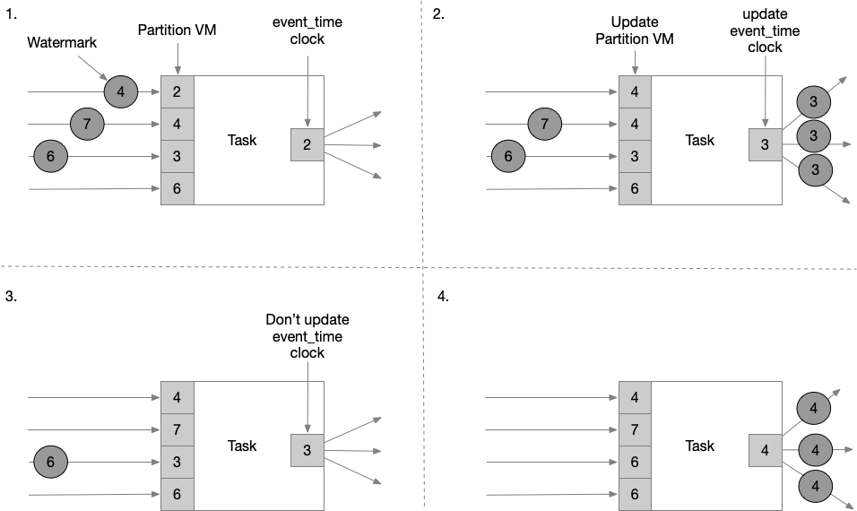


### 窗口触发时机分析

下面以一些小实验对窗口的触发时机进行分析：

#### 1. 示例一

```java
public class BoundedOutOfOrdernessGenerator implements AssignerWithPeriodicWatermarks<MyEvent> {

    private final long maxOutOfOrderness = 3000; // 3.0 seconds

    private long currentMaxTimestamp;

    @Override
    public long extractTimestamp(MyEvent element, long previousElementTimestamp) {
        long timestamp = element.getCreationTime();
        currentMaxTimestamp = Math.max(timestamp, currentMaxTimestamp);
        return timestamp;
    }

    @Override
    public Watermark getCurrentWatermark() {
        // return the watermark as current highest timestamp minus the out-of-orderness bound
        // 以迄今为止收到的最大时间戳来生成 watermark
        return new Watermark(currentMaxTimestamp - maxOutOfOrderness);
    }
}
```

效果解析：

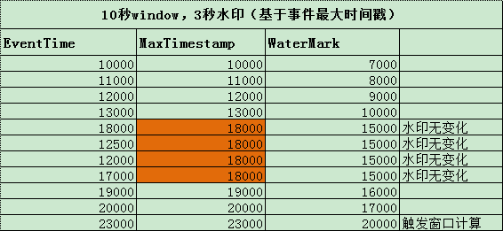

图中是一个10s大小的窗口，10000～20000为一个窗口。当 eventTime 为 23000 的数据到来，生成的 watermark 的时间戳为20000，>= 窗口的结束时间，会触发窗口计算。

#### 2. 示例二

示例二相较于示例一，更换了watermark的计算方式

```java
public class TimeLagWatermarkGenerator implements AssignerWithPeriodicWatermarks<MyEvent> {

    private final long maxTimeLag = 3000; // 3 seconds

    @Override
    public long extractTimestamp(MyEvent element, long previousElementTimestamp) {
        return element.getCreationTime();
    }

    @Override
    public Watermark getCurrentWatermark() {
        // return the watermark as current time minus the maximum time lag
        return new Watermark(System.currentTimeMillis() - maxTimeLag);
    }
}
```

效果解析：

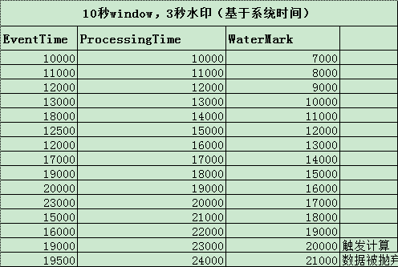

只是简单的用当前系统时间减去最大延迟时间生成 Watermark ，当 Watermark 为 20000时，>= 窗口的结束时间，会触发10000～20000窗口计算。再当 eventTime 为 19500 的数据到来，它本应该是属于窗口 10000～20000窗口的，但这个窗口已经触发计算了，所以此数据会被丢弃。

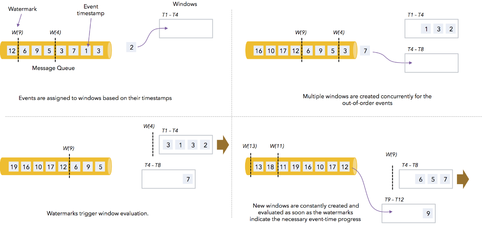

#### 3. 示例三

```java
public class TumblingEventWindowExample {

    public static void main(String[] args) throws Exception {
        StreamExecutionEnvironment env = StreamExecutionEnvironment.getExecutionEnvironment();
        env.setStreamTimeCharacteristic(TimeCharacteristic.EventTime);

        DataStream<String> socketStream = env.socketTextStream("localhost", 9999);
        DataStream<Tuple2<String, Long>> resultStream = socketStream
            // Time.seconds(3)有序的情况修改为0
            .assignTimestampsAndWatermarks(new BoundedOutOfOrdernessTimestampExtractor<String>(Time.seconds(3)) {
                @Override
                public long extractTimestamp(String element) {
                    long eventTime = Long.parseLong(element.split(" ")[0]);
                    System.out.println(eventTime);
                    return eventTime;
                }
            })
            .map(new MapFunction<String, Tuple2<String, Long>>() {
                @Override
                public Tuple2<String, Long> map(String value) throws Exception {
                    return Tuple2.of(value.split(" ")[1], 1L);
                }
            })
            .keyBy(0)
            .window(TumblingEventTimeWindows.of(Time.seconds(10)))
            .reduce(new ReduceFunction<Tuple2<String, Long>>() {
                @Override
                public Tuple2<String, Long> reduce(Tuple2<String, Long> value1, Tuple2<String, Long> value2) throws Exception {
                    return new Tuple2<>(value1.f0, value1.f1 + value2.f1);
                }
            });
        resultStream.print();
        env.execute();
    }
}
```

运行程序之前，在本地启动命令行监听:

```shell
nc -l 9999
```

有序的情况下，watermark延迟时间为0

```shell
miaowenting@miaowentingdeMacBook-Pro flink$ nc -l 9999
10000 a
11000 a
12000 b
13000 b
14000 a
19888 a
13000 a
20000 a  时间戳20000触发第一个窗口计算，实际上19999也会触发，因为左闭右开的原则，20000这个时间戳并不会在第一个窗口计算，第一个窗口是[10000-20000)，第二个窗口是[20000-30000)，以此类推
11000 a
12000 b
21000 b
22000 a
29999 a  第一个窗口触发计算后，后续来的11000，12000这两条数据被抛弃，29999直接触发窗口计算，并且本身也属于第二个窗口，所以也参与计算了。
```

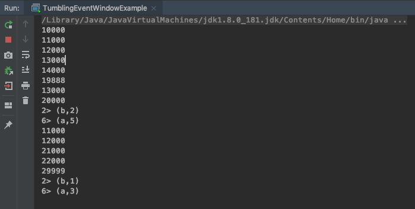

无序的情况下，watermark延迟时间为3

```shell
miaowenting@miaowentingdeMacBook-Pro flink$ nc -l 9999
10000 a
11000 a
12000 b
20000 a  从数据中可以验证，第一个窗口在20000的时候没有触发计算
21000 a
22000 b
23000 a  在23000的时候触发计算，计算内容是第一个窗口[10000-20000)，所以20000，21000，22000，23000属于第二个窗口，没有参与计算。
24000 a
29000 b
30000 a
22000 a
23000 a
33000 a  第二个窗口[20000-30000)，它是在33000触发计算，并且，迟到的数据22000，23000也被计算在内（如果这个数据在水印33000后到达，则会被抛弃），30000和33000是第三个窗口的数据，没有计算
```

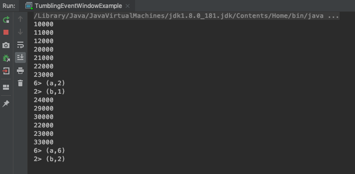


由数据落位图可以看出，窗口是前开后闭的，20000和30000这两个数据分别会落到[20000, 30000)和[30000, 40000)这两个窗口；已经触发过的窗口不会被再次触发，即w(30000)不会再次触发窗口[20000, 30000)

### 如何设置最大乱序时间

我们已知的`BoundedOutOfOrdernessTimestampExtractor`中 watermark的计算公式为`currentMaxTimestamp - maxOutOfOrderness`，`maxOutOfOrderness`通过构造函数传入。如何设置`maxOutOfOrderness`才会比较合理呢？

如果`maxOutOfOrderness`设置的太小，而自身数据发送时由于网络等原因导致乱序或者late太多，那么最终的结果就是会有很多单条的数据在window中被触发，数据的正确性太差，容错性太低。对于严重乱序的数据，需要严格统计数据最大延迟时间，才能保证计算的数据准确。

如果`maxOutOfOrderness`延时设置太大，则当大部分时间都已落入所属窗口时，flink迟迟不会进行窗口计算，影响数据的实时性；且由于在最大时间与watermark之间维护了很多未被触发的窗口，会加重Flink作业的负担。

总结：这个要结合自己的业务以及数据情况去设置。不是对eventTime要求特别严格的数据，尽量不要采用eventTime方式来处理，会有丢数据的风险。

### 延迟数据处理

#### 1. 定义

所谓延迟数据，即窗口已经因为watermark进行了触发，则在此之后如果还有数据进入窗口，则默认情况下不会对窗口进行再次触发和聚合计算。要想在数据进入已经被触发过的窗口后，还能继续触发窗口计算，则可以使用延迟数据处理机制。

#### 2. 触发条件

第二次(或多次)触发的条件是 watermark < window_end_time + allowedLateness 时间内， 这个窗口有 late 数据到达时。

#### 3. 示例

我们对“窗口触发时机分析”这一章节中的示例三进行修改

```java
public class TumblingEventWindowExample {

    public static void main(String[] args) throws Exception {
        StreamExecutionEnvironment env = StreamExecutionEnvironment.getExecutionEnvironment();
        env.setStreamTimeCharacteristic(TimeCharacteristic.EventTime);
        env.setParallelism(1);
//        env.getConfig().setAutoWatermarkInterval(100);
        DataStream<String> socketStream = env.socketTextStream("localhost", 9999);
        DataStream<Tuple2<String, Long>> resultStream = socketStream
                .assignTimestampsAndWatermarks(new BoundedOutOfOrdernessTimestampExtractor<String>(Time.seconds(3)) {
                    @Override
                    public long extractTimestamp(String element) {
                        long eventTime = Long.parseLong(element.split(" ")[0]);
                        System.out.println(eventTime);
                        return eventTime;
                    }
                })
                .map(new MapFunction<String, Tuple2<String, Long>>() {
                    @Override
                    public Tuple2<String, Long> map(String value) throws Exception {
                        return Tuple2.of(value.split(" ")[1], 1L);
                    }
                })
                .keyBy(0)
                .window(TumblingEventTimeWindows.of(Time.seconds(10)))
                .allowedLateness(Time.seconds(2)) // 允许延迟处理2秒
                .reduce(new ReduceFunction<Tuple2<String, Long>>() {
                    @Override
                    public Tuple2<String, Long> reduce(Tuple2<String, Long> value1, Tuple2<String, Long> value2) throws Exception {
                        return new Tuple2<>(value1.f0, value1.f1 + value2.f1);
                    }
                });
        resultStream.print();
        env.execute();
    }
}
```

```shell
djg@djgdeMacBook-Pro bin % nc -l 9999
10000 a
24000 a
11000 a
12000 a
25000 a
11000 a
```

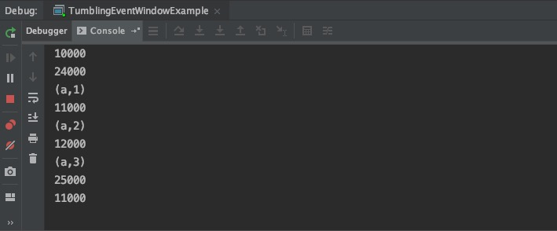

当watermark为21000时，触发了[10000, 20000)窗口计算，由于设置了`allowedLateness(Time.seconds(2))`即允许两秒延迟处理，`watermark < window_end_time + lateTime`公式得到满足，因此随后10000和12000进入窗口时，依然能触发窗口计算；

随后watermark增加到22000，`watermark < window_end_time + lateTime`不再满足，因此11000再次进入窗口时，窗口不再进行计算

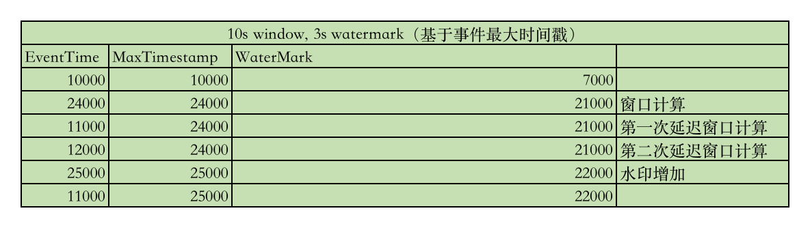

### 延迟数据重定向

流的返回值必须是`SingleOutputStreamOperator`，其是`DataStream`的子类。通过`getSideOutput`方法获取延迟数据。可以将延迟数据重定向到其他流或者进行输出。

```java
public class TumblingEventWindowExample {

    public static void main(String[] args) throws Exception {
        StreamExecutionEnvironment env = StreamExecutionEnvironment.getExecutionEnvironment();
        env.setStreamTimeCharacteristic(TimeCharacteristic.EventTime);
        env.setParallelism(1);
        DataStream<String> socketStream = env.socketTextStream("localhost", 9999);
        //保存被丢弃的数据
        OutputTag<Tuple2<String, Long>> outputTag = new OutputTag<Tuple2<String, Long>>("late-data"){};
        //注意，由于getSideOutput方法是SingleOutputStreamOperator子类中的特有方法，所以这里的类型，不能使用它的父类dataStream。
        SingleOutputStreamOperator<Tuple2<String, Long>> resultStream = socketStream
                // Time.seconds(3)有序的情况修改为0
                .assignTimestampsAndWatermarks(new BoundedOutOfOrdernessTimestampExtractor<String>(Time.seconds(3)) {
                    @Override
                    public long extractTimestamp(String element) {
                        long eventTime = Long.parseLong(element.split(" ")[0]);
                        System.out.println(eventTime);
                        return eventTime;
                    }
                })
                .map(new MapFunction<String, Tuple2<String, Long>>() {
                    @Override
                    public Tuple2<String, Long> map(String value) throws Exception {
                        return Tuple2.of(value.split(" ")[1], 1L);
                    }
                })
                .keyBy(0)
                .window(TumblingEventTimeWindows.of(Time.seconds(10)))
                .sideOutputLateData(outputTag) // 收集延迟大于2s的数据
                .allowedLateness(Time.seconds(2)) //允许2s延迟
                .reduce(new ReduceFunction<Tuple2<String, Long>>() {
                    @Override
                    public Tuple2<String, Long> reduce(Tuple2<String, Long> value1, Tuple2<String, Long> value2) throws Exception {
                        return new Tuple2<>(value1.f0, value1.f1 + value2.f1);
                    }
                });
        resultStream.print();
        //把迟到的数据暂时打印到控制台，实际中可以保存到其他存储介质中
        DataStream<Tuple2<String, Long>> sideOutput = resultStream.getSideOutput(outputTag);
        sideOutput.print();
        env.execute();
    }
}
```

```shell
djg@djgdeMacBook-Pro bin % nc -l 9999
10000 a
25000 a
11000 a
```

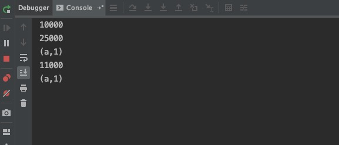

当25000进入window时，watermark被更新到22000，触发[10000, 20000)窗口进行计算；当延迟数据11000到达窗口时，由于不满足`watermark < window_end_time + lateTime`，窗口无法被再次计算。但是11000会被收集，重定向到`sideOutput`流中，最终可以进行打印或输出到其他介质

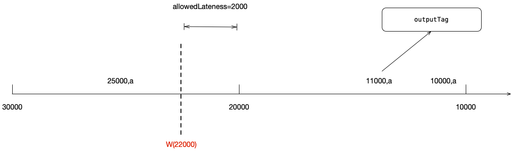

数据落位图

> 参考
>
> https://blog.csdn.net/sghuu/article/details/103704415
>
> https://miaowenting.site/2019/10/19/Apache-Flink/