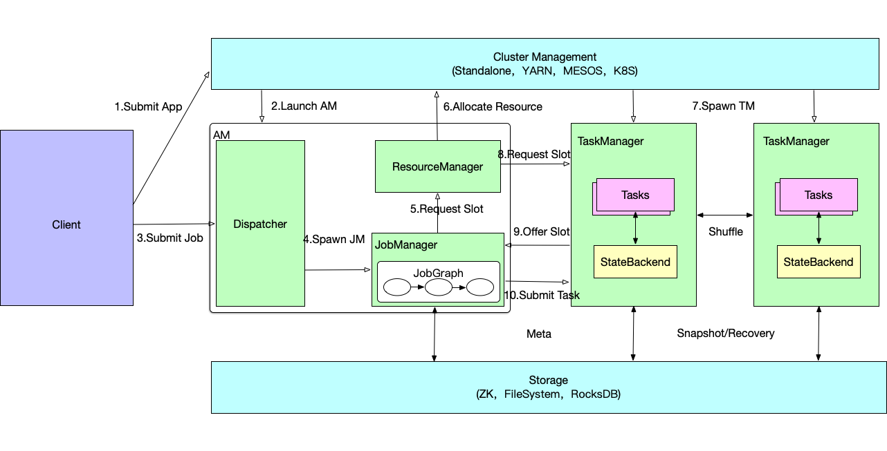
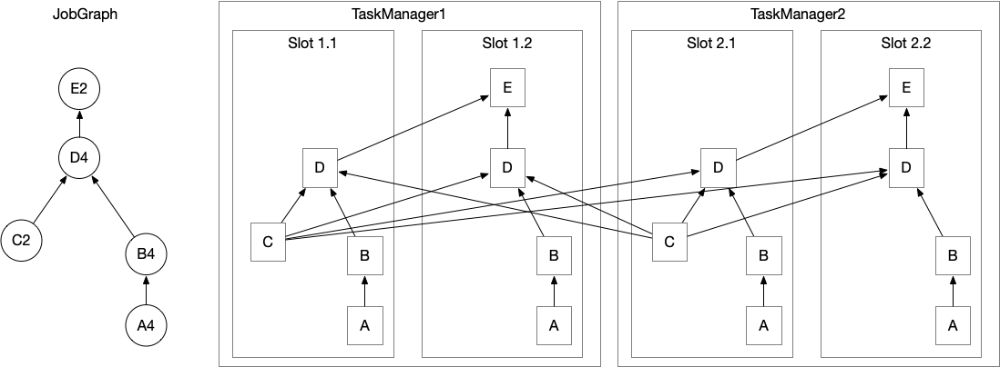
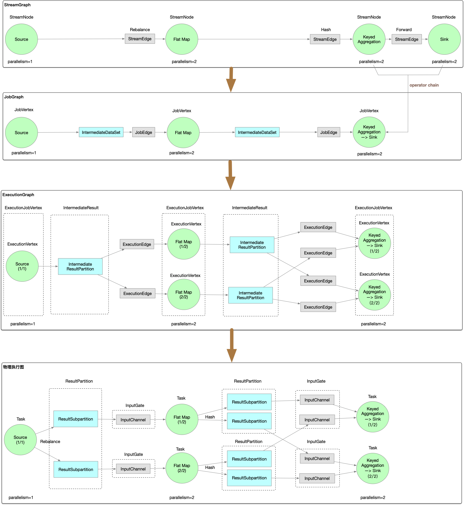

## 1.系统架构

### 1.1 Layered APIs

### 1.2 Components

#### 1.2.1 JobManager

一个 application 对应一个 JobManager，JobManager 接收待执行的 application。application 包含一个 JobGraph 和 JAR （包含所有需要的classes,libraries 和其他资源）。
JobManager 将 JobGraph 转成 ExecutionGraph，ExecutionGraph中包含可以并发执行的 tasks。
JobManager 向 ResourceManager 申请需要的资源（TaskManager slots），一旦分配到足够的slots，则分发 tasks 到 TaskManager 执行。
执行期间，JobManager 负责中央协调，如协调checkpoint等

#### 1.2.2 ResourceManager

负责管理 TaskManager slots，当 JobManager 申请 slots 时，ResourceManager 会通知拥有闲置 slots 的 TaskManager 提供 slots 给 JobManager 。

#### 1.2.3 TaskManager

TaskManager 是 Flink 的工作进程，每个 TaskManager 提供一定数量的 slots ，slots的数量限制了 TaskManager 可以执行的 task 数。
启动之后，TaskManager 向 ResourceManager 注册 slots 数，当接收到 ResourceManager 的分配通知后，会向 JobManager 提供一个或多个slots，
紧接着 JobManager 将 tasks 分配到 slots 执行。执行期间，不同的 TaskManager 之间会进行数据交换。

#### 1.2.4 Dispatcher

提供 REST 接口供提交任务，一旦 application 被提交执行，就会启动一个 JobManager 。还运行 Web Dashboard。

#### 1.2.5 Client

### 1.3 Task Execution

图左边是JobGraph，包含5个operators，A和C代表source，E代表sink。因为最大并行度为4，所以此 application 至少需要4个 slots。A、B、D的并行度为4，会被分配到每一个slot，C被分配到了Slot1.1和Slot2.1，E被分配到了Slot1.2和Slot2.2。 

TaskManager在同一个JVM进程中多线程执行tasks。

#### 1.3.1 Operators

#### 1.3.2 Tasks

##### 1.3.2.1 Parallelism

##### 1.3.2.2 Tasks Failure Recovery

#### 1.3.3 Slots and Resources

### 1.4 高可用

实时应用程序通常设计成`7*24`的运行模式，因此应该保证 application 不停机。当进程出现故障时，第一步要重启失败的进程，第二步是重启 application 并恢复其状态。

#### 1.4.1 TaskManager failures
   
假设一个Flink集群有4个 TaskManagers ，每个 TaskManager 提供2个 slots，所以一个 application 的最大并发为8。当其中一个 TaskManager 故障，可用的 slots 数就降为了6。
此时，JobManager 会向 ResourceManager 申请新的 slots。在standalone模式下，将永远申请不到新的 slots，JobManager 也就不能重启 application，直到获得足够的 slots。
重启策略决定 JobManager 重启 application 的次数以及重启的间隔。

#### 1.4.2 JobManager failures

比起 TaskManager 故障，JobManager 故障是更具有挑战性的问题。JobManager 控制 application 的执行，保存执行相关的元数据，如指向完整 checkpoints 的指针等。
如果 JobManager 进程消失，application 将不能再继续执行，因此必须解决 JobManager 的单点故障问题。Flink提供了高可用模式，在当前 JobManager 进程消失时，
将 JobManager 负责的功能和元数据传递给另一个 JobManager，依赖于 zookeeper。高可用模式下，JobManager 会将 JobGraph 和其所需的元数据，如 application 的jar包文件，
持久化到远程公共存储上，并将存储路径写到 zookeeper 上。
执行期间，JobManager会收到各个task checkpoints 的状态处理，当一次 checkpoint 完成，即所有task都将状态持久化到远程存储上了，JobManager 将状态处理持久化到远程存储，
并将存储路径写到 zookeeper 上。因此，当 JobManager 故障时，需要结合 zookeeper及远程存储来恢复 application。

当JobManager故障，其所属 application 的所有 tasks 都会自动取消，新的 JobManager 将会接管：

1. 从 Zookeeper 获取远程存储路径，取得 JobGraph 、jar包文件、上一次 checkpoint 的状态处理
2. 从 ResourceManager 申请 slots ，继续执行 application
3. 重启 application , 并根据上一次完整的 checkpoint 重置所有 tasks 的状态

yarn模式下，Flink 尚存的进程会触发故障 JobManager 和 TaskManager 的重启。
standalone模式下，Flink 不提供重启失败进程的方法，因此需要运行备用的 JobManager 和 TaskManager 。

## 2. Graph

Flink 中的执行图可以分成 4 层，StreamGraph -> JobGraph -> ExecutionGraph -> 物理执行图。

- StreamGraph：用户根据 DataStream API 编写的代码生成的最初的图，用来表示程序的拓扑结构。
 + StreamNode：用来代表 operator 的类，并具有所有相关的属性，如并发度、入边和出边等。
 + StreamEdge：连接两个 StreamNode 的边。
 
- JobGraph：StreamGraph 经过 chain 后生成 JobGraph，提交给 JobManager 的数据结构，将多个符合条件的 StreamNode chain 在一起作为一个 JobVertex，
可以减少数据在节点之间传输所需要的序列化/反序列化/传输等消耗。
 + JobVertex：经过优化后符合条件的多个 StreamNode 可能会 chain 在一起生成一个 JobVertex ，即一个 JobVertex 包含一个或多个 operator，
 JobVertex 的输入是 JobEdge ，输出是 IntermediateDataSet。
 + IntermediateDataSet：表示 JobVertex 的输出，即经过 operator 处理产生的数据集，producer 是 JobVertex，consumer 是 JobEdge。
 + JobEdge：代表 JobGraph 中的一条数据传输通道，source 是 IntermediateDataSet ，target 是 JobVertex，即数据通过 JobEdge 由 IntermediateDataSet
 传递给目标 JobVertex。
 
- ExecutionGraph：JobManager 根据 JobGraph 生成 ExecutionGraph ，ExecutionGraph 是 JobGraph 的并行化版本，是调度层最核心的数据结构。
 + ExecutionJobVertex：和JobGraph中的JobVertex一一对应。每一个ExecutionJobVertex都有和并发度一样多的 ExecutionVertex。
 + ExecutionVertex：表示ExecutionJobVertex的其中一个并发子任务，输入是ExecutionEdge，输出是IntermediateResultPartition。
 + IntermediateResult：和JobGraph中的IntermediateDataSet一一对应。一个IntermediateResult包含多个IntermediateResultPartition
，其个数等于该operator的并发度。
 + IntermediateResultPartition：表示ExecutionVertex的一个输出分区，producer是ExecutionVertex，consumer是若干个ExecutionEdge。
 + ExecutionEdge：表示ExecutionVertex的输入，source是IntermediateResultPartition，target是ExecutionVertex。source和target都只能是一个。
 + Execution：是执行一个 ExecutionVertex 的一次尝试。当发生故障或者数据需要重算的情况下 ExecutionVertex 可能会有多个 ExecutionAttemptID。一个 Execution 通过 
ExecutionAttemptID 来唯一标识。JM和TM之间关于 task 的部署和 task status 的更新都是通过 ExecutionAttemptID 来确定消息接受者。

- 物理执行图：JobManager 根据 ExecutionGraph 对 Job 进行调度后，在各个 TaskManager 上部署 Task 后形成的图，不是一个具体的数据结构了。
 + Task：Execution被调度后在分配的 TaskManager 中启动对应的 Task。Task 包裹了具有用户执行逻辑的 operator。
 + ResultPartition：代表由一个Task的生成的数据，和ExecutionGraph中的IntermediateResultPartition一一对应。
 + ResultSubpartition：是ResultPartition的一个子分区。每个ResultPartition包含多个ResultSubpartition，其数目要由下游消费 Task 数和 DistributionPattern 来决定。
 + InputGate：代表Task的输入封装，和JobGraph中JobEdge一一对应。每个InputGate消费了一个或多个的ResultPartition。
 + InputChannel：每个InputGate会包含一个以上的InputChannel，和ExecutionGraph中的ExecutionEdge一一对应，也和ResultSubpartition一对一地相连，即一个InputChannel接收一个ResultSubpartition的输出。
