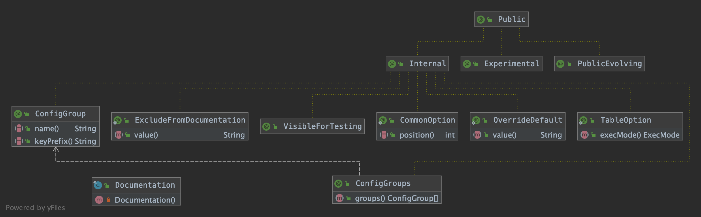

@[toc]


本文将详细介绍下flink中的自定义注解模块，了解flink注解的作用与使用，使得后面阅读源码时看到这几个注解不至于很陌生。
主要围绕flink源码中的`flink-annotations`模块展开。与docs 相关的注解有@ConfigGroup、@ConfigGroups , 通常作用于配置类上，
@Documentation.OverrideDefault、@Documentation.CommonOption、@Documentation.TableOption、@Documentation.ExcludeFromDocumentation, 作用于配置类的 ConfigOption 字段上，对配置项做一些修改。
另外，还有其他5种标记注解，@Experimental、@Internal、@Public、@PublicEvolving、@VisibleForTesting。


<center>图1: flink中的自定义注解</center>

## 1. docs相关注解

### 1.1 @ConfigGroup

指定一组配置选项，组的名称将用作生成 HTML 文件名，keyPrefix 用于匹配配置项名称前缀。
如 @ConfigGroup(name = "firstGroup", keyPrefix = "first")，生成的 HTML 文件名为 firstGroup ，其中的配置项名称都是以 first 开头的。
```java
@Target({})
@Internal
public @interface ConfigGroup {
	String name();
	String keyPrefix();
}
```

### 1.2 @ConfigGroups

允许一个配置类中的配置项可以按照配置项名称前缀分成不同的组，生成多个 HTML 文件。
如：
@ConfigGroups(groups = {
		@ConfigGroup(name = "firstGroup", keyPrefix = "first"),
		@ConfigGroup(name = "secondGroup", keyPrefix = "second")})
可以从配置类生成 3 个 HTML 文件，分别为 firstGroup、secondGroup、default，具体可以接着往下看，下面会有示例说明。
```java
@Target(ElementType.TYPE)
@Retention(RetentionPolicy.RUNTIME)
@Internal
public @interface ConfigGroups {
	ConfigGroup[] groups() default {};
}
```

下面通过一个示例来说明这两个注解的用途。
查看测试类 ConfigOptionsDocGeneratorTest 中应用到 @ConfigGroups 和 @ConfigGroup 的单测 `testCreatingMultipleGroups`：
```java
@Test
public void testCreatingMultipleGroups() {
	final List<Tuple2<ConfigGroup, String>> tables = ConfigOptionsDocGenerator.generateTablesForClass(
		TestConfigMultipleSubGroup.class);

	assertEquals(tables.size(), 3);
	final HashMap<String, String> tablesConverted = new HashMap<>();
	for (Tuple2<ConfigGroup, String> table : tables) {
		tablesConverted.put(table.f0 != null ? table.f0.name() : "default", table.f1);
	}
}
```

`TestConfigMultipleSubGroup` 类 mock 了一个配置项类：
@ConfigGroup(name = "firstGroup", keyPrefix = "first") 将 key 以 first 开头的 ConfigOption 归为 firstGroup，
@ConfigGroup(name = "secondGroup", keyPrefix = "second") 将 key 以 second 开头的 ConfigOption 归为 secondGroup。
```java
@ConfigGroups(groups = {
		@ConfigGroup(name = "firstGroup", keyPrefix = "first"),
		@ConfigGroup(name = "secondGroup", keyPrefix = "second")})
static class TestConfigMultipleSubGroup {
	public static ConfigOption<Integer> firstOption = ConfigOptions
		.key("first.option.a")
		.defaultValue(2)
		.withDescription("This is example description for the first option.");

	public static ConfigOption<String> secondOption = ConfigOptions
		.key("second.option.a")
		.noDefaultValue()
		.withDescription("This is long example description for the second option.");

	public static ConfigOption<Integer> thirdOption = ConfigOptions
		.key("third.option.a")
		.defaultValue(2)
		.withDescription("This is example description for the third option.");

	public static ConfigOption<String> fourthOption = ConfigOptions
		.key("fourth.option.a")
		.noDefaultValue()
		.withDescription("This is long example description for the fourth option.");
}
```

我们再看下 `ConfigOptionsDocGenerator.generateTablesForClass(Class<?> optionsClass)`
```java
@VisibleForTesting
static List<Tuple2<ConfigGroup, String>> generateTablesForClass(Class<?> optionsClass) {
	// 获取 optionsClass 类上定义的 @ConfigGroups
	ConfigGroups configGroups = optionsClass.getAnnotation(ConfigGroups.class);
	// 抽取 optionsClass 中的所有 ConfigOption 配置项
	List<OptionWithMetaInfo> allOptions = extractConfigOptions(optionsClass);

	// 遍历 @ConfigGroups 注解中的 ConfigGroup[] groups()
	List<Tuple2<ConfigGroup, String>> tables;
	if (configGroups != null) {
		// 解析 optionsClass 上的 ConfigGroup 注解，即是有分组的。另外一个是默认的 ConfigGroup
		tables = new ArrayList<>(configGroups.groups().length + 1);
		Tree tree = new Tree(configGroups.groups(), allOptions);

		for (ConfigGroup group : configGroups.groups()) {
			List<OptionWithMetaInfo> configOptions = tree.findConfigOptions(group);
			// 按照 ConfigOption 的 key 进行排序
 			sortOptions(configOptions);
			tables.add(Tuple2.of(group, toHtmlTable(configOptions)));
		}

		// 所有 @ConfigGroup 前缀都匹配不上的其他 ConfigOption 归为 default 组
		List<OptionWithMetaInfo> configOptions = tree.getDefaultOptions();
		sortOptions(configOptions);
		tables.add(Tuple2.of(null, toHtmlTable(configOptions)));
	} else {
		sortOptions(allOptions);
		tables = Collections.singletonList(Tuple2.of(null, toHtmlTable(allOptions)));
	}
	return tables;
}
```

运行单测 `testCreatingMultipleGroups` 的输出结果如下：
firstGroup 配置项组里的配置项名称都是以 first 为前缀的。
```html
<table class="table table-bordered">
    <thead>
        <tr>
            <th class="text-left" style="width: 20%">Key</th>
            <th class="text-left" style="width: 15%">Default</th>
            <th class="text-left" style="width: 10%">Type</th>
            <th class="text-left" style="width: 55%">Description</th>
        </tr>
    </thead>
    <tbody>
        <tr>
            <td><h5>first.option.a</h5></td>
            <td style="word-wrap: break-word;">2</td>
            <td>Integer</td>
            <td>This is example description for the first option.</td>
        </tr>
    </tbody>
</table>
```

secondGroup 配置项组里的配置项名称都是以 second 为前缀的。
```html
<table class="table table-bordered">
    <thead>
        <tr>
            <th class="text-left" style="width: 20%">Key</th>
            <th class="text-left" style="width: 15%">Default</th>
            <th class="text-left" style="width: 10%">Type</th>
            <th class="text-left" style="width: 55%">Description</th>
        </tr>
    </thead>
    <tbody>
        <tr>
            <td><h5>second.option.a</h5></td>
            <td style="word-wrap: break-word;">(none)</td>
            <td>String</td>
            <td>This is long example description for the second option.</td>
        </tr>
    </tbody>
</table>
```

TestConfigMultipleSubGroup 中的其他配置项都是没有分组的，默认都放到 default 组中。
```html
<table class="table table-bordered">
    <thead>
        <tr>
            <th class="text-left" style="width: 20%">Key</th>
            <th class="text-left" style="width: 15%">Default</th>
            <th class="text-left" style="width: 10%">Type</th>
            <th class="text-left" style="width: 55%">Description</th>
        </tr>
    </thead>
    <tbody>
        <tr>
            <td><h5>fourth.option.a</h5></td>
            <td style="word-wrap: break-word;">(none)</td>
            <td>String</td>
            <td>This is long example description for the fourth option.</td>
        </tr>
        <tr>
            <td><h5>third.option.a</h5></td>
            <td style="word-wrap: break-word;">2</td>
            <td>Integer</td>
            <td>This is example description for the third option.</td>
        </tr>
    </tbody>
</table>
```


Documentation 类中定义了修改文档生成器行为的注解结合，包括 @OverrideDefault、@CommonOption、@TableOption、@ExcludeFromDocumentation。下面依次介绍。

### 1.3 @Documentation.OverrideDefault

作用在 ConfigOption 上的注解，覆盖其默认值。
```java
@Target(ElementType.FIELD)
@Retention(RetentionPolicy.RUNTIME)
@Internal
public @interface OverrideDefault {
	String value();
}
```

下面通过一个示例来说明这个注解的用途。
查看测试类 ConfigOptionsDocGeneratorTest 中应用到 @Documentation.OverrideDefault 的单测 `testOverrideDefault`：
```java
@Test
public void testOverrideDefault() {
	String htmlTable = ConfigOptionsDocGenerator.generateTablesForClass(TestConfigGroupWithOverriddenDefault.class).get(0).f1;
}
```

`TestConfigGroupWithOverriddenDefault` 类 mock 了一个配置项类，每个配置项都使用了 @Documentation.OverrideDefault 注解覆盖配置项的默认值。
```java
static class TestConfigGroupWithOverriddenDefault {
	@Documentation.OverrideDefault("default_1")
	public static ConfigOption<Integer> firstOption = ConfigOptions
		.key("first.option.a")
		.defaultValue(2)
		.withDescription("This is example description for the first option.");

	@Documentation.OverrideDefault("default_2")
	public static ConfigOption<String> secondOption = ConfigOptions
		.key("second.option.a")
		.noDefaultValue()
		.withDescription("This is long example description for the second option.");
}
```

运行单测 `testOverrideDefault` 的输出结果如下：
将 firstOption 的默认值覆盖成了 default_1，secondOption 原先没有默认值，被设置成了 default_2。
```html
<table class="table table-bordered">
    <thead>
        <tr>
            <th class="text-left" style="width: 20%">Key</th>
            <th class="text-left" style="width: 15%">Default</th>
            <th class="text-left" style="width: 10%">Type</th>
            <th class="text-left" style="width: 55%">Description</th>
        </tr>
    </thead>
    <tbody>
        <tr>
            <td><h5>first.option.a</h5></td>
            <td style="word-wrap: break-word;">default_1</td>
            <td>Integer</td>
            <td>This is example description for the first option.</td>
        </tr>
        <tr>
            <td><h5>second.option.a</h5></td>
            <td style="word-wrap: break-word;">default_2</td>
            <td>String</td>
            <td>This is long example description for the second option.</td>
        </tr>
    </tbody>
</table>
```

### 1.4 @Documentation.CommonOption

作用在 ConfigOption 上的注解，使其包含在 "Common Options" 片段中，
按 position 值排序，position 值小的配置项排在前面。
```java
@Target(ElementType.FIELD)
@Retention(RetentionPolicy.RUNTIME)
@Internal
public @interface CommonOption {
	int POSITION_MEMORY = 10;
	int POSITION_PARALLELISM_SLOTS = 20;
	int POSITION_FAULT_TOLERANCE = 30;
	int POSITION_HIGH_AVAILABILITY = 40;
	int POSITION_SECURITY = 50;

	int position() default Integer.MAX_VALUE;
}
```

下面通过一个示例来说明这个注解的用途。
查看测试类 ConfigOptionsDocGeneratorTest 中应用到 @Documentation.CommonOption 的单测 `testCommonOptions`：
```java
@Test
public void testCommonOptions() throws IOException, ClassNotFoundException {
	final String projectRootDir = System.getProperty("rootDir");
	final String outputDirectory = TMP.newFolder().getAbsolutePath();

	final OptionsClassLocation[] locations = new OptionsClassLocation[] {
		new OptionsClassLocation("flink-docs", TestCommonOptions.class.getPackage().getName())
	};

	ConfigOptionsDocGenerator.generateCommonSection(projectRootDir, outputDirectory, locations, "src/test/java");
	Formatter formatter = new HtmlFormatter();
	String output = FileUtils.readFile(Paths.get(outputDirectory, ConfigOptionsDocGenerator.COMMON_SECTION_FILE_NAME).toFile(), StandardCharsets.UTF_8.name());

}
```

`TestCommonOptions` 类 mock 了一个配置项类：
COMMON_OPTION 使用了 @Documentation.CommonOption 注解，position 使用默认值为 Integer.MAX_VALUE，
COMMON_POSITIONED_OPTION 也是用了 @Documentation.CommonOption 注解，position 值指定为2，这个配置项肯定排在 COMMON_OPTION 前面。
```java
public class TestCommonOptions {

	@Documentation.CommonOption
	public static final ConfigOption<Integer> COMMON_OPTION = ConfigOptions
		.key("first.option.a")
		.defaultValue(2)
		.withDescription("This is the description for the common option.");

	public static final ConfigOption<String> GENERIC_OPTION = ConfigOptions
		.key("second.option.a")
		.noDefaultValue()
		.withDescription("This is the description for the generic option.");

	@Documentation.CommonOption(position = 2)
	public static final ConfigOption<Integer> COMMON_POSITIONED_OPTION = ConfigOptions
		.key("third.option.a")
		.defaultValue(3)
		.withDescription("This is the description for the positioned common option.");
}
```

运行单测 `testCommonOptions` 的输出结果如下：
```html
<table class="table table-bordered">
    <thead>
        <tr>
            <th class="text-left" style="width: 20%">Key</th>
            <th class="text-left" style="width: 15%">Default</th>
            <th class="text-left" style="width: 10%">Type</th>
            <th class="text-left" style="width: 55%">Description</th>
        </tr>
    </thead>
    <tbody>
        <tr>
            <td><h5>third.option.a</h5></td>
            <td style="word-wrap: break-word;">3</td>
            <td>Integer</td>
            <td>This is the description for the positioned common option.</td>
        </tr>
        <tr>
            <td><h5>first.option.a</h5></td>
            <td style="word-wrap: break-word;">2</td>
            <td>Integer</td>
            <td>This is the description for the common option.</td>
        </tr>
    </tbody>
</table>

```

### 1.5 @Documentation.TableOption

作用于 table 配置项上，用于添加元数据标签，配置执行模式（批处理、流式处理、两者兼有）。
```java
@Target(ElementType.FIELD)
@Retention(RetentionPolicy.RUNTIME)
@Internal
public @interface TableOption {
	ExecMode execMode();
}
```

我们看下 `ConfigOptionsDocGenerator` 类中的 toHtmlString 方法：
```java
private static String toHtmlString(final OptionWithMetaInfo optionWithMetaInfo) {
	ConfigOption<?> option = optionWithMetaInfo.option;
	String defaultValue = stringifyDefault(optionWithMetaInfo);
	String type = typeToHtml(optionWithMetaInfo);
	Documentation.TableOption tableOption = optionWithMetaInfo.field.getAnnotation(Documentation.TableOption.class);
	StringBuilder execModeStringBuilder = new StringBuilder();
	if (tableOption != null) {
		// 如果 ConfigOption 上有 @Documentation.TableOption 注解，则读取它的 execMode 字段，拼接到 html 内容中。
		Documentation.ExecMode execMode = tableOption.execMode();
		if (Documentation.ExecMode.BATCH_STREAMING.equals(execMode)) {
			execModeStringBuilder.append("<br> <span class=\"label label-primary\">")
					.append(Documentation.ExecMode.BATCH.toString())
					.append("</span> <span class=\"label label-primary\">")
					.append(Documentation.ExecMode.STREAMING.toString())
					.append("</span>");
		} else {
			execModeStringBuilder.append("<br> <span class=\"label label-primary\">")
					.append(execMode.toString())
					.append("</span>");
		}
	}

	return "" +
		"        <tr>\n" +
		"            <td><h5>" + escapeCharacters(option.key()) + "</h5>" + execModeStringBuilder.toString() + "</td>\n" +
		"            <td style=\"word-wrap: break-word;\">" + escapeCharacters(addWordBreakOpportunities(defaultValue)) + "</td>\n" +
		"            <td>" + type + "</td>\n" +
		"            <td>" + formatter.format(option.description()) + "</td>\n" +
		"        </tr>\n";
}
```

### 1.6 @Documentation.ExcludeFromDocumentation

作用于 ConfigOption 配置项，用于从最终生成的 HTML 文档中移除配置项。
```java
@Target(ElementType.FIELD)
@Retention(RetentionPolicy.RUNTIME)
@Internal
public @interface ExcludeFromDocumentation {
	/**
	 * The optional reason why the config option is excluded from documentation.
	 * 解释下从文档中移除配置项的原因
	 */
	String value() default "";
}
```

下面通过一个示例来说明这个注解的用途。
查看测试类 ConfigOptionsDocGeneratorTest 中应用到 @Documentation.ExcludeFromDocumentation 的单测 `testConfigOptionExclusion`：
```java
@Test
public void testConfigOptionExclusion() {
	final String htmlTable = ConfigOptionsDocGenerator.generateTablesForClass(TestConfigGroupWithExclusion.class).get(0).f1;
}
```

`TestConfigGroupWithExclusion` 类 mock 了一个配置项类：
excludedOption 使用了 @Documentation.ExcludeFromDocumentation 注解，在生成的 HTML 文档中它将被移除。
```java
static class TestConfigGroupWithExclusion {
	public static ConfigOption<Integer> firstOption = ConfigOptions
		.key("first.option.a")
		.defaultValue(2)
		.withDescription("This is example description for the first option.");

	@Documentation.ExcludeFromDocumentation
	public static ConfigOption<String> excludedOption = ConfigOptions
		.key("excluded.option.a")
		.noDefaultValue()
		.withDescription("This should not be documented.");
}
```

运行单测 `testConfigOptionExclusion` 的输出结果如下：
```html
<table class="table table-bordered">
    <thead>
        <tr>
            <th class="text-left" style="width: 20%">Key</th>
            <th class="text-left" style="width: 15%">Default</th>
            <th class="text-left" style="width: 10%">Type</th>
            <th class="text-left" style="width: 55%">Description</th>
        </tr>
    </thead>
    <tbody>
        <tr>
            <td><h5>first.option.a</h5></td>
            <td style="word-wrap: break-word;">2</td>
            <td>Integer</td>
            <td>This is example description for the first option.</td>
        </tr>
    </tbody>
</table>
```

## 2. 其他标记注解

关于这几种标记注解，源码中暂时还没有找到相关测试用例，后续补充。

### 2.1 @Experimental

表示标记对象是试验使用的注解，带有此注解的类是没有经过严格测试和不稳定的，可能在以后的版本中被修改或移除。
```java
@Documented
@Target({ElementType.TYPE, ElementType.METHOD, ElementType.FIELD, ElementType.CONSTRUCTOR })
@Public
public @interface Experimental {
}
```

### 2.2 @Internal

将稳定的公共的api注解为内部开发者api，内部开发者api是稳定的，面向Flink内部，可能随着版本变化。
```java
@Documented
@Target({ ElementType.TYPE, ElementType.METHOD, ElementType.CONSTRUCTOR })
@Public
public @interface Internal {
}
```

### 2.3 @Public

标注类为开放的，稳定的。
类、方法、属性被这个这个注解修饰时，表示在小版本迭代(1.0,1.1,1.2)中，都维持稳定，应用程序将根据同一大版本进行编译。
```java
@Documented
@Target(ElementType.TYPE)
@Public
public @interface Public {}
```

### 2.4 @PublicEvolving

带有此注解的类和方法用于公共使用，并且具有稳定的行为。但是，它们的接口和签名不被认为是稳定的，并且当跨版本时可能会变化。
```java
@Documented
@Target({ ElementType.TYPE, ElementType.METHOD, ElementType.FIELD, ElementType.CONSTRUCTOR })
@Public
public @interface PublicEvolving {
}
```

### 2.5 @VisibleForTesting

标注有些方法、属性、构造函数、类等在 test 阶段可见，用于测试。
例如，当方法是 private 的，不打算在外部去调用的，但是有些内部测试需要访问它，所以加上 VisibleForTesting 注解进行内部测试。
```java
@Documented
@Target({ ElementType.TYPE, ElementType.METHOD, ElementType.FIELD, ElementType.CONSTRUCTOR })
@Internal
public @interface VisibleForTesting {}
```