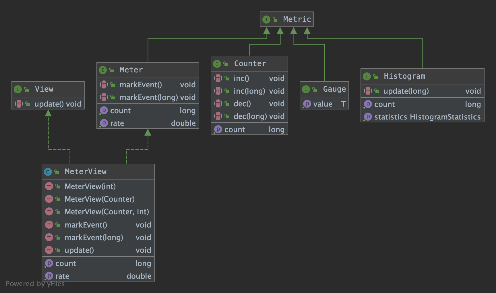
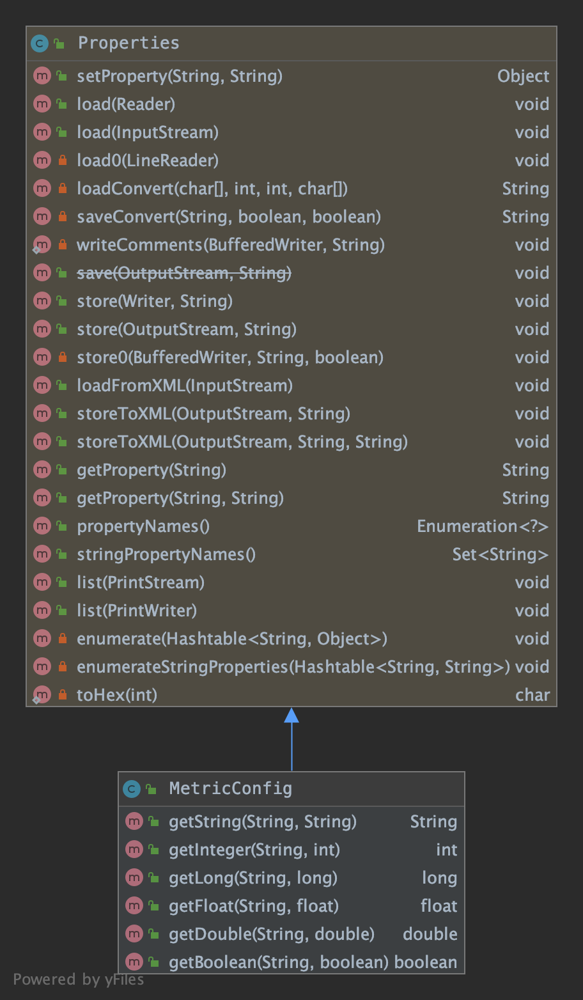
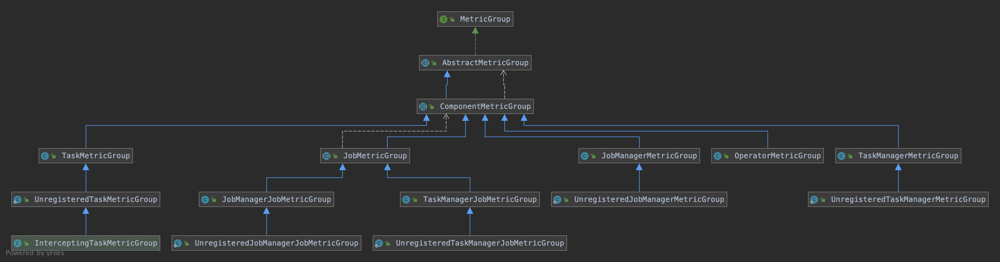
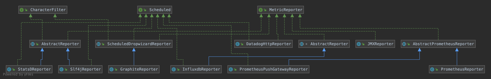
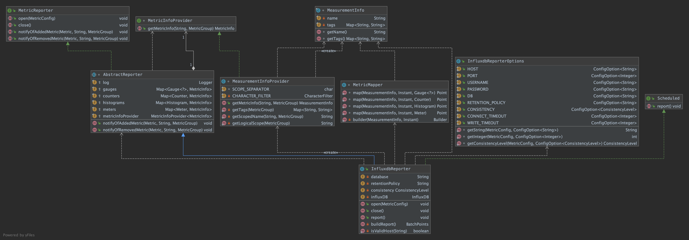
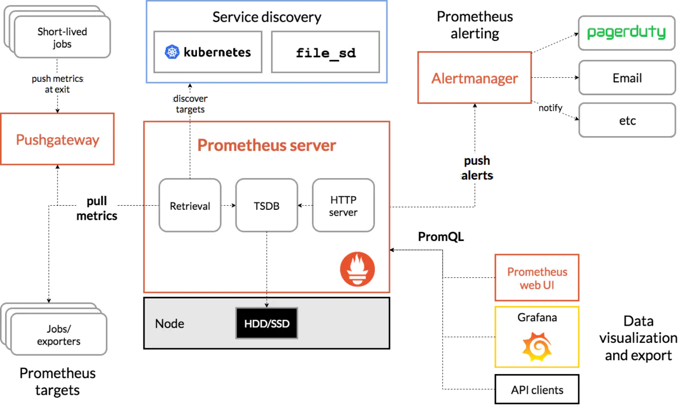
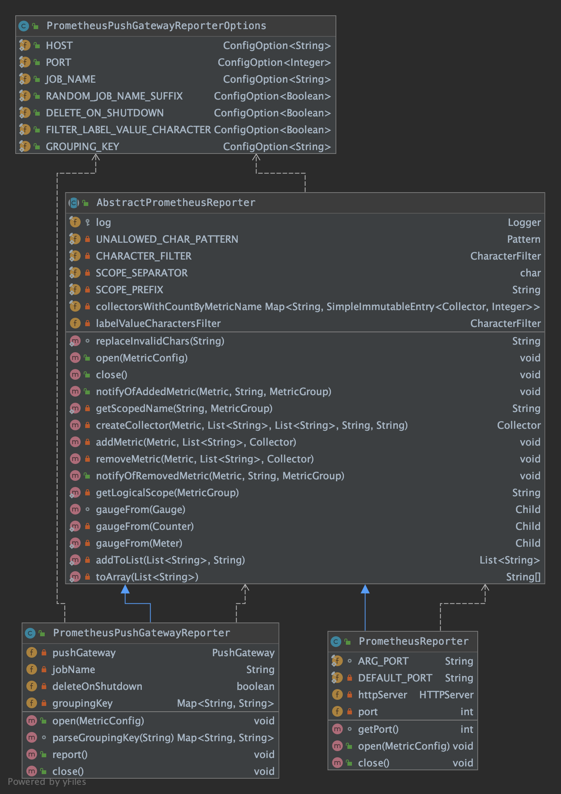
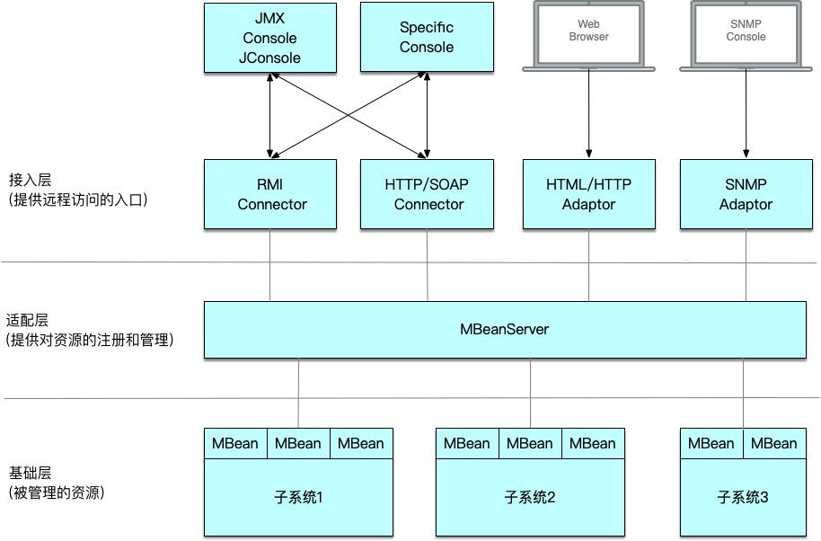
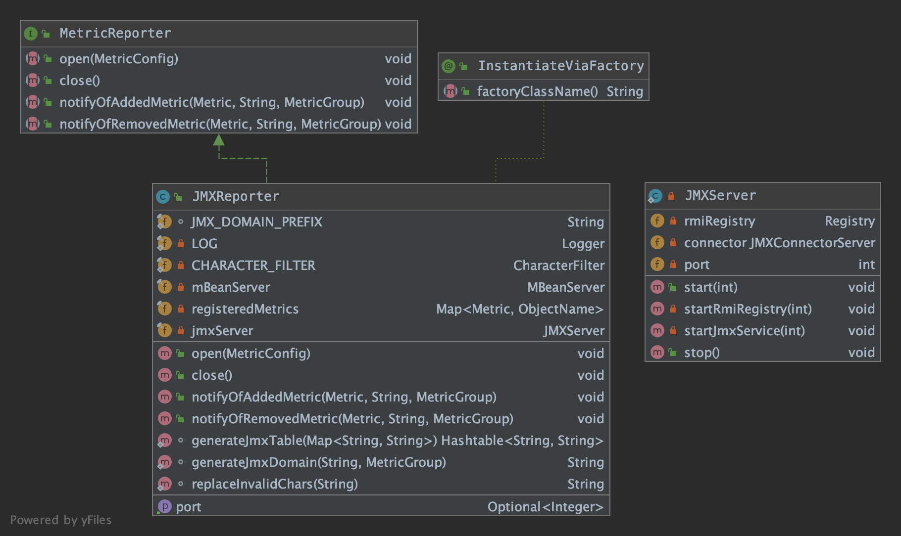
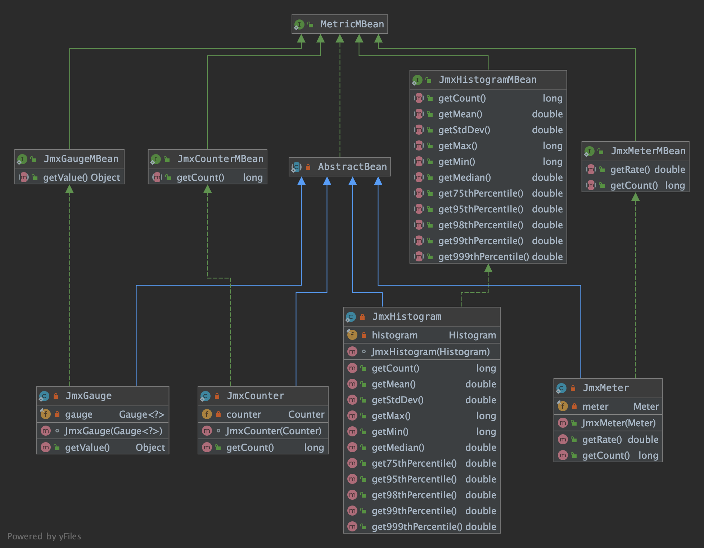

本文将详细介绍下Flink中的指标实现，包括自带的指标名和如何自定义指标。还会介绍下现在已经支持的reporter，如jmx、slf4j、influxdb、graphite、prometheus、pushgateway等。
最后介绍下flink指标平台化实践。

<!-- more -->


## flink-metrics-core

1. Metric
常见的指标类型有Gauge、Count、Meter、Histogram，flink 自定义了 Metric 类。


2. MetricConfig
存取flink指标相关配置的工具类，继承Properties，添加了直接读取string、int、long、float、double、boolean配置值的方法。


3. MetricGroup
Metric 在 flink 内部以 Group 的方式组织，有多层结构，Metric Group + Metric Name 是 Metric 的唯一标识。

```
TaskManagerMetricGroup
    •TaskManagerJobMetricGroup
        •TaskMetricGroup
            •TaskIOMetricGroup
            •OperatorMetricGroup
                •${User-defined Group} / ${User-defined Metrics}
                •OperatorIOMetricGroup
•JobManagerMetricGroup
    •JobManagerJobMetricGroup
```

   可以根据需要埋点自定义指标：
* 添加一个统计脏数据的指标，指标名为flink_taskmanager_job_task_operator_dtDirtyData ：
```java
// 从 RichFunction 中 getRuntimeContext() 
dirtyDataCounter = runtimeContext.getMetricGroup().counter(MetricConstant.DT_DIRTY_DATA_COUNTER);
```

* 添加一个消费延迟指标，自定了两层Group，分别是topic、partition，指标名为flink_taskmanager_job_task_operator_topic_partition_dtTopicPartitionLag ：
```java
for(TopicPartition topicPartition : assignedPartitions){
    MetricGroup metricGroup = getRuntimeContext().getMetricGroup().addGroup(DT_TOPIC_GROUP, topicPartition.topic())
                    .addGroup(DT_PARTITION_GROUP, String.valueOf(topicPartition.partition()));
    metricGroup.gauge(DT_TOPIC_PARTITION_LAG_GAUGE, new KafkaTopicPartitionLagMetric(subscriptionState, topicPartition));
}
```

MetricGroup通过继承实现多层结构：



4. MetricReporter
flink 内置了多种指标 reporter ，如jmx、slf4j、graphite、prometheus、influxdb、statsd、datadog等。



## 指标 Reporters

### flink-metrics-dropwizard

只是将flink内部定义的指标`org.apache.flink.metrics.Metric`和dropwizard中定义的指标`com.codahale.metrics.Metric`接口和子类互相包装转换。
并且实现了 ScheduledDropwizardReporter ：
```java
public static final String ARG_HOST = "host";
public static final String ARG_PORT = "port";
public static final String ARG_PREFIX = "prefix";
public static final String ARG_CONVERSION_RATE = "rateConversion";
public static final String ARG_CONVERSION_DURATION = "durationConversion";

// ------------------------------------------------------------------------
/**
 * dropwizard 包中的 MetricRegistry
 */
protected final MetricRegistry registry;
/**
 * dropwizard 包中的 ScheduledReporter
 */
protected ScheduledReporter reporter;

private final Map<Gauge<?>, String> gauges = new HashMap<>();
private final Map<Counter, String> counters = new HashMap<>();
private final Map<Histogram, String> histograms = new HashMap<>();
private final Map<Meter, String> meters = new HashMap<>();

/**
 * 添加指标，需要将flink内部的Metric转换成dropwizard中的Metric，
 * 再注册到 dropwizard 的 MetricRegistry 中
 */
@Override
public void notifyOfAddedMetric(Metric metric, String metricName, MetricGroup group) {
	final String fullName = group.getMetricIdentifier(metricName, this);

	synchronized (this) {
		if (metric instanceof Counter) {
			counters.put((Counter) metric, fullName);
			registry.register(fullName, new FlinkCounterWrapper((Counter) metric));
		}
		else if (metric instanceof Gauge) {
			gauges.put((Gauge<?>) metric, fullName);
			registry.register(fullName, FlinkGaugeWrapper.fromGauge((Gauge<?>) metric));
		} else if (metric instanceof Histogram) {
			Histogram histogram = (Histogram) metric;
			histograms.put(histogram, fullName);

			if (histogram instanceof DropwizardHistogramWrapper) {
				registry.register(fullName, ((DropwizardHistogramWrapper) histogram).getDropwizardHistogram());
			} else {
				registry.register(fullName, new FlinkHistogramWrapper(histogram));
			}
		} else if (metric instanceof Meter) {
			Meter meter = (Meter) metric;
			meters.put(meter, fullName);

			if (meter instanceof DropwizardMeterWrapper) {
				registry.register(fullName, ((DropwizardMeterWrapper) meter).getDropwizardMeter());
			} else {
				registry.register(fullName, new FlinkMeterWrapper(meter));
			}
		} else {
			log.warn("Cannot add metric of type {}. This indicates that the reporter " +
				"does not support this metric type.", metric.getClass().getName());
		}
	}
}

/**
 * report 时直接从 dropwizard 内部的 MetricRegistry 中捞取所有指标，执行 ScheduledReporter 的 report 方法
 */
@Override
public void report() {
	// we do not need to lock here, because the dropwizard registry is
	// internally a concurrent map
	@SuppressWarnings("rawtypes")
	final SortedMap<String, com.codahale.metrics.Gauge> gauges = registry.getGauges();
	final SortedMap<String, com.codahale.metrics.Counter> counters = registry.getCounters();
	final SortedMap<String, com.codahale.metrics.Histogram> histograms = registry.getHistograms();
	final SortedMap<String, com.codahale.metrics.Meter> meters = registry.getMeters();
	final SortedMap<String, com.codahale.metrics.Timer> timers = registry.getTimers();

	this.reporter.report(gauges, counters, histograms, meters, timers);
}

public abstract ScheduledReporter getReporter(MetricConfig config);

```
只有`flink-metrics-graphite`模块会引用这个模块，直接复用 dropwizard 包提供的 GraphiteReporter 功能。

### flink-metrics-graphite

GraphiteReporter 继承了 flink-metrics-dropwizard 模块中的 ScheduledDropwizardReporter。
只需要实现其中的 getReporter() 抽象方法：

```java
@Override
public ScheduledReporter getReporter(MetricConfig config) {
	String host = config.getString(ARG_HOST, null);
	int port = config.getInteger(ARG_PORT, -1);

	if (host == null || host.length() == 0 || port < 1) {
		throw new IllegalArgumentException("Invalid host/port configuration. Host: " + host + " Port: " + port);
	}

	String prefix = config.getString(ARG_PREFIX, null);
	String conversionRate = config.getString(ARG_CONVERSION_RATE, null);
	String conversionDuration = config.getString(ARG_CONVERSION_DURATION, null);
	String protocol = config.getString(ARG_PROTOCOL, "TCP");

	// 复用 dropwizard 包提供的 GraphiteReporter
	com.codahale.metrics.graphite.GraphiteReporter.Builder builder =
		com.codahale.metrics.graphite.GraphiteReporter.forRegistry(registry);

	if (prefix != null) {
		builder.prefixedWith(prefix);
	}

	if (conversionRate != null) {
		builder.convertRatesTo(TimeUnit.valueOf(conversionRate));
	}

	if (conversionDuration != null) {
		builder.convertDurationsTo(TimeUnit.valueOf(conversionDuration));
	}

	Protocol prot;
	try {
		prot = Protocol.valueOf(protocol);
	} catch (IllegalArgumentException iae) {
		log.warn("Invalid protocol configuration: " + protocol + " Expected: TCP or UDP, defaulting to TCP.");
		prot = Protocol.TCP;
	}

	log.info("Configured GraphiteReporter with {host:{}, port:{}, protocol:{}}", host, port, prot);
	switch(prot) {
		case UDP:
			return builder.build(new GraphiteUDP(host, port));
		case TCP:
		default:
			return builder.build(new Graphite(host, port));
	}
}
```

#### 配置

- 复制 flink-metrics-graphite-xxx.jar 到 $FLINK_HOME/lib 下
- 在 flink-conf.yml 增加如下配置：
```yaml
metrics.reporter.grph.class: org.apache.flink.metrics.graphite.GraphiteReporter
metrics.reporter.grph.host: localhost  # Graphite server host
metrics.reporter.grph.port: 2003       # Graphite server port
metrics.reporter.grph.protocol: TCP    # protocol to use (TCP/UDP)
```


### flink-metrics-influxdb

#### influxdb基本概念

使用方法参考：[时序数据库 Influxdb 使用详解](https://www.jianshu.com/p/a1344ca86e9b)
为了方便理解 InfluxdbReporter 的实现，这里简单说下 Influxdb 中的几个概念：

```
name: census
-————————————
time                     butterflies     honeybees     location   scientist
2015-08-18T00:00:00Z      12                23           1         langstroth
2015-08-18T00:00:00Z      1                 30           1         perpetua
2015-08-18T00:06:00Z      11                28           1         langstroth
2015-08-18T00:06:00Z      3                 28           1         perpetua
2015-08-18T05:54:00Z      2                 11           2         langstroth
2015-08-18T06:00:00Z      1                 10           2         langstroth
2015-08-18T06:06:00Z      8                 23           2         perpetua
2015-08-18T06:12:00Z      7                 22           2         perpetua
```
- timestamp
既然是时间序列数据库，influxdb 的数据都有一列名为 time 的列。

- field key,field value,field set
bufferflies 和 honeybees 为 field key，它们为String类型，用于存储元数据。
数据 12-7 为 bufferflies 的field value，数据 23-22 为 honeybees 的field value。field value可以为String,float,integer或boolean类型。
field key 和 field value 对组成的集合称之为 field set，如下：
```
butterflies = 12 honeybees = 23
butterflies = 1 honeybees = 30
butterflies = 11 honeybees = 28
butterflies = 3 honeybees = 28
butterflies = 2 honeybees = 11
butterflies = 1 honeybees = 10
butterflies = 8 honeybees = 23
butterflies = 7 honeybees = 22
```
在 influxdb 中，field 是必须的，但是字段是没有索引的，如果字段作为查询条件，会扫描所有符合查询条件的所有字段值。相当于SQL的没有索引的列。	

- tag key,tag value,tag set
location 和 scientist 是两个tag，location 有两个 tag value：1和2，scientist 有两个 tag value：langstroth 和 perpetua。
tag key 和 tag value 对组成的集合称之为 tag set，如下：
```
location = 1, scientist = langstroth
location = 2, scientist = langstroth
location = 1, scientist = perpetua
location = 2, scientist = perpetua
```
在 influxdb 中，tag 是可选的，但 tag 相当于SQL中有索引的列，因此强烈建议使用。

- measurement
指标项，是 fields，tags 以及 time 列的容器。

- retention policy
数据保留策略，默认是 autogen，表示数据一直保留永不过期，副本数量为1。

- series
指共享同一个 retention policy，measurement 以及 tag set 的数据集合，如下：

```
｜ Arbitrary series number ｜ Retention policy ｜ Measurement ｜ Tag set ｜
｜ ----------------------- ｜ ---------------- ｜ ----------- ｜ ------------------------------- ｜
｜        series 1         ｜       autogen    ｜     census  ｜ location=1,scientist=langstroth ｜
｜        series 2         ｜       autogen    ｜     census  ｜ location=2,scientist=perpetua   ｜
｜        series 3         ｜       autogen    ｜     census  ｜ location=1,scientist=langstroth ｜
｜        series 4         ｜       autogen    ｜     census  ｜ location=2,scientist=perpetua   ｜
```

- point
指的是同一个series中具有相同时间的 field set，points 相当于SQL中的数据行。如下：

```
name: census
-----------------
time                  butterflies    honeybees   location    scientist
2015-08-18T00:00:00Z       1            30           1        perpetua
```

- database

一个数据库可以有多个 measurement,retention policy,continuous queries以及user。提供InfluxQL语言查询和修改数据。

#### Reporter实现

InfluxdbReporter的详细类图如下，包括继承以及依赖关系：


- MeasurementInfo
```java
/**
 * 指标项名称
 */
private final String name;
/**
 * tag key 和 tag value对集合
 */
private final Map<String, String> tags;
```

- MeasurementInfoProvider
```java
/**
 * 根据 metricName 和 MetricGroup，将该指标项封装成 MeasurementInfo 返回
 */
@Override
public MeasurementInfo getMetricInfo(String metricName, MetricGroup group) {
	return new MeasurementInfo(getScopedName(metricName, group), getTags(group));
}
```

- InfluxdbReporterOptions
连接 influxdb 写指标的配置项，类似正常写RDBMS需要的配置

- MetricMapper
将 MeasurementInfo 转成 influxdb 中的 Point

- InfluxdbReporter extends AbstractReporter

构造函数中设置 MeasurementInfoProvider：
```java
public InfluxdbReporter() {
	// 设置 MeasurementInfoProvider
	super(new MeasurementInfoProvider());
}
```
open() 方法中要根据指标配置文件初始化 InfluxDB 操作类：
```java
/**
 * 根据配置项初始化得到 InfluxDB 操作类
 */
@Override
public void open(MetricConfig config) {
	String host = getString(config, HOST);
	int port = getInteger(config, PORT);
	if (!isValidHost(host) || !NetUtils.isValidClientPort(port)) {
		throw new IllegalArgumentException("Invalid host/port configuration. Host: " + host + " Port: " + port);
	}
	String database = getString(config, DB);
	if (database == null) {
		throw new IllegalArgumentException("'" + DB.key() + "' configuration option is not set");
	}
	String url = String.format("http://%s:%d", host, port);
	String username = getString(config, USERNAME);
	String password = getString(config, PASSWORD);

	this.database = database;
	this.retentionPolicy = getString(config, RETENTION_POLICY);
	this.consistency = getConsistencyLevel(config, CONSISTENCY);

	int connectTimeout = getInteger(config, CONNECT_TIMEOUT);
	int writeTimeout = getInteger(config, WRITE_TIMEOUT);
	// 使用 okhttp 包中提供的 HttpClient
	OkHttpClient.Builder client = new OkHttpClient.Builder()
		.connectTimeout(connectTimeout, TimeUnit.MILLISECONDS)
		.writeTimeout(writeTimeout, TimeUnit.MILLISECONDS);

	if (username != null && password != null) {
		influxDB = InfluxDBFactory.connect(url, username, password, client);
	} else {
		influxDB = InfluxDBFactory.connect(url, client);
	}

	log.info("Configured InfluxDBReporter with {host:{}, port:{}, db:{}, retentionPolicy:{} and consistency:{}}",
			host, port, database, retentionPolicy, consistency.name());
}
```

AbstractReporter 中的 notifyOfAddedMetric() 方法中添加指标时将 flink 内部定义的 Metric 转成 MeasurementInfo：
```java
@Override
public void notifyOfAddedMetric(Metric metric, String metricName, MetricGroup group) {
	final MetricInfo metricInfo = metricInfoProvider.getMetricInfo(metricName, group);
	synchronized (this) {
		if (metric instanceof Counter) {
			counters.put((Counter) metric, metricInfo);
		} else if (metric instanceof Gauge) {
			gauges.put((Gauge<?>) metric, metricInfo);
		} else if (metric instanceof Histogram) {
			histograms.put((Histogram) metric, metricInfo);
		} else if (metric instanceof Meter) {
			meters.put((Meter) metric, metricInfo);
		} else {
			log.warn("Cannot add unknown metric type {}. This indicates that the reporter " +
				"does not support this metric type.", metric.getClass().getName());
		}
	}
}
```

report()方法要将 MeasurementInfo 转成 influxdb 中的 Point 对象：
```java
@Override
public void report() {
	BatchPoints report = buildReport();
	if (report != null) {
		influxDB.write(report);
	}
}

/**
* 将指标信息封装成 influxdb 中的 BatchPoints
* @return BatchPoints
*/
@Nullable
private BatchPoints buildReport() {
	// 取当前时间点
	Instant timestamp = Instant.now();
	BatchPoints.Builder report = BatchPoints.database(database);
	// 设置保留策略
	report.retentionPolicy(retentionPolicy);
	report.consistency(consistency);
	try {
		for (Map.Entry<Gauge<?>, MeasurementInfo> entry : gauges.entrySet()) {
			// MeasurementInfo -> Point
			report.point(MetricMapper.map(entry.getValue(), timestamp, entry.getKey()));
		}

		for (Map.Entry<Counter, MeasurementInfo> entry : counters.entrySet()) {
			report.point(MetricMapper.map(entry.getValue(), timestamp, entry.getKey()));
		}

		for (Map.Entry<Histogram, MeasurementInfo> entry : histograms.entrySet()) {
			report.point(MetricMapper.map(entry.getValue(), timestamp, entry.getKey()));
		}

		for (Map.Entry<Meter, MeasurementInfo> entry : meters.entrySet()) {
			report.point(MetricMapper.map(entry.getValue(), timestamp, entry.getKey()));
		}
	}
	catch (ConcurrentModificationException | NoSuchElementException e) {
		// ignore - may happen when metrics are concurrently added or removed
		// report next time
		return null;
	}
	return report.build();
}
```

#### 配置

- 复制 flink-metrics-influxdb-xxx.jar 到 $FLINK_HOME/lib 下
- 在 flink-conf.yml 增加如下配置：

```yaml
metrics.reporter.influxdb.class: org.apache.flink.metrics.influxdb.InfluxdbReporter
metrics.reporter.influxdb.host: localhost           # the InfluxDB server host
metrics.reporter.influxdb.port: 8086                # (optional) the InfluxDB server port, defaults to 8086
metrics.reporter.influxdb.db: flink                 # the InfluxDB database to store metrics
metrics.reporter.influxdb.username: flink-metrics   # (optional) InfluxDB username
metrics.reporter.influxdb.password: qwerty          # (optional) InfluxDB username’s password
metrics.reporter.influxdb.retentionPolicy: one_hour # (optional) InfluxDB retention policy
```

### flink-metrics-prometheus

#### prometheus基本概念

这里先附上Prometheus官网架构图：


- Prometheus server 
负责数据的采集和存储，定期从配置好的 jobs/exporters 中拉取 metrics，或者从 Pushgateway 中拉取，或者从其他的 Prometheus server 中拉取。
Prometheus 是一个时序数据库，将采集到的监控数据按照时间序列的方式存储到本地磁盘。

-Pushgateway
支持临时性job主动推送指标的中间网关。

- PromQL
[PromQL使用方法](https://yunlzheng.gitbook.io/prometheus-book/parti-prometheus-ji-chu/promql/prometheus-query-language)

- PromDash
如Grafana，用于可视化指标数据。

- WebUI
9090提供图形化界面功能。


#### Reporter实现

Prometheus Reporter的详细类图如下，包括继承以及依赖关系：


- AbstractPrometheusReporter
```java
@Override
public void notifyOfAddedMetric(final Metric metric, final String metricName, final MetricGroup group) {

	// 维度key集合
	List<String> dimensionKeys = new LinkedList<>();
	// 维度value集合
	List<String> dimensionValues = new LinkedList<>();
	for (final Map.Entry<String, String> dimension : group.getAllVariables().entrySet()) {
		final String key = dimension.getKey();
		dimensionKeys.add(CHARACTER_FILTER.filterCharacters(key.substring(1, key.length() - 1)));
		dimensionValues.add(labelValueCharactersFilter.filterCharacters(dimension.getValue()));
	}

	final String scopedMetricName = getScopedName(metricName, group);
	final String helpString = metricName + " (scope: " + getLogicalScope(group) + ")";

	final Collector collector;
	Integer count = 0;

	synchronized (this) {
		if (collectorsWithCountByMetricName.containsKey(scopedMetricName)) {
			final AbstractMap.SimpleImmutableEntry<Collector, Integer> collectorWithCount = collectorsWithCountByMetricName.get(scopedMetricName);
			collector = collectorWithCount.getKey();
			count = collectorWithCount.getValue();
		} else {
			collector = createCollector(metric, dimensionKeys, dimensionValues, scopedMetricName, helpString);
			try {
				// 注册当前的 collector 到 CollectorRegistry.defaultRegistry 中
				collector.register();
			} catch (Exception e) {
				log.warn("There was a problem registering metric {}.", metricName, e);
			}
		}
		// 
		addMetric(metric, dimensionValues, collector);
		collectorsWithCountByMetricName.put(scopedMetricName, new AbstractMap.SimpleImmutableEntry<>(collector, count + 1));
	}
}

/**
* 将 Metric 转成 prometheus 的 Collector
*/
private Collector createCollector(Metric metric, List<String> dimensionKeys, List<String> dimensionValues, String scopedMetricName, String helpString) {
	Collector collector;
	if (metric instanceof Gauge || metric instanceof Counter || metric instanceof Meter) {
		collector = io.prometheus.client.Gauge
			.build()
			.name(scopedMetricName)
			.help(helpString)
			.labelNames(toArray(dimensionKeys))
			.create();
	} else if (metric instanceof Histogram) {
		collector = new HistogramSummaryProxy((Histogram) metric, scopedMetricName, helpString, dimensionKeys, dimensionValues);
	} else {
		log.warn("Cannot create collector for unknown metric type: {}. This indicates that the metric type is not supported by this reporter.",
			metric.getClass().getName());
		collector = null;
	}
	return collector;
}

/**
* 取出 Metric 中的值，为 Collector 设置 label values
*/
private void addMetric(Metric metric, List<String> dimensionValues, Collector collector) {
	if (metric instanceof Gauge) {
		((io.prometheus.client.Gauge) collector).setChild(gaugeFrom((Gauge) metric), toArray(dimensionValues));
	} else if (metric instanceof Counter) {
		((io.prometheus.client.Gauge) collector).setChild(gaugeFrom((Counter) metric), toArray(dimensionValues));
	} else if (metric instanceof Meter) {
		((io.prometheus.client.Gauge) collector).setChild(gaugeFrom((Meter) metric), toArray(dimensionValues));
	} else if (metric instanceof Histogram) {
		((HistogramSummaryProxy) collector).addChild((Histogram) metric, dimensionValues);
	} else {
		log.warn("Cannot add unknown metric type: {}. This indicates that the metric type is not supported by this reporter.",
			metric.getClass().getName());
	}
}
```

注意：从Gauge中取值时不支持返回值为String：
```java
@VisibleForTesting
io.prometheus.client.Gauge.Child gaugeFrom(Gauge gauge) {
	return new io.prometheus.client.Gauge.Child() {
		@Override
		public double get() {
			final Object value = gauge.getValue();
			// 注意：这里只支持 Gauge 的返回值为 Double、Number、Boolean 的，暂时不支持String
			if (value == null) {
				log.debug("Gauge {} is null-valued, defaulting to 0.", gauge);
				return 0;
			}
			if (value instanceof Double) {
				return (double) value;
			}
			if (value instanceof Number) {
				return ((Number) value).doubleValue();
			}
			if (value instanceof Boolean) {
				return ((Boolean) value) ? 1 : 0;
			}
			log.debug("Invalid type for Gauge {}: {}, only number types and booleans are supported by this reporter.",
				gauge, value.getClass().getName());
			return 0;
		}
	};
}
```

如 LatestCompletedCheckpointExternalPathGauge 这个指标，用来记录上次完成的 checkpoint 路径，它的返回值是 String 类型，在向 PrometheusPushgateway 推送的时候会报错。
```java
private class LatestCompletedCheckpointExternalPathGauge implements Gauge<String> {
	@Override
	public String getValue() {
		CompletedCheckpointStats completed = latestCompletedCheckpoint;
		if (completed != null && completed.getExternalPath() != null) {
			return completed.getExternalPath();
		} else {
			return "n/a";
		}
	}
}
```

报错如下：
```
20:06:36.782 [Flink-MetricRegistry-thread-1] DEBUG org.apache.flink.metrics.prometheus.PrometheusPushGatewayReporter - Invalid type for Gauge org.apache.flink.runtime.checkpoint.CheckpointStatsTracker$LatestCompletedCheckpointExternalPathGauge@78b86b65: java.lang.String, only number types and booleans are supported by this reporter.
20:06:36.810 [Flink-MetricRegistry-thread-1] WARN org.apache.flink.metrics.prometheus.PrometheusPushGatewayReporter - Failed to push metrics to PushGateway with jobName flinkSql_KUDUside_KUDUsink_20200324110200_69196657381606602020032420061183311.
java.io.IOException: Response code from http://xx.xx.xx.xx:8891/metrics/job/flinkSql_KUDUside_KUDUsink_20200324110200_69196657381606602020032420061183311 was 200
	at org.apache.flink.shaded.io.prometheus.client.exporter.PushGateway.doRequest(PushGateway.java:297)
	at org.apache.flink.shaded.io.prometheus.client.exporter.PushGateway.push(PushGateway.java:105)
	at org.apache.flink.metrics.prometheus.PrometheusPushGatewayReporter.report(PrometheusPushGatewayReporter.java:76)
	at org.apache.flink.runtime.metrics.MetricRegistryImpl$ReporterTask.run(MetricRegistryImpl.java:436)
	at java.util.concurrent.Executors$RunnableAdapter.call(Executors.java:511)
	at java.util.concurrent.FutureTask.runAndReset(FutureTask.java:308)
	at java.util.concurrent.ScheduledThreadPoolExecutor$ScheduledFutureTask.access$301(ScheduledThreadPoolExecutor.java:180)
	at java.util.concurrent.ScheduledThreadPoolExecutor$ScheduledFutureTask.run(ScheduledThreadPoolExecutor.java:294)
	at java.util.concurrent.ThreadPoolExecutor.runWorker(ThreadPoolExecutor.java:1149)
	at java.util.concurrent.ThreadPoolExecutor$Worker.run(ThreadPoolExecutor.java:624)
	at java.lang.Thread.run(Thread.java:748)
```

- PrometheusPushGatewayReporterOptions
连接 PrometheusPushGateway 写指标的配置项

- PrometheusPushGatewayReporter

open() 方法中要根据指标配置文件初始化 PushGateway 操作类：
```java
/**
 * 根据配置项初始化得到 PushGateway 操作类
 */
@Override
public void open(MetricConfig config) {
	super.open(config);

	String host = config.getString(HOST.key(), HOST.defaultValue());
	int port = config.getInteger(PORT.key(), PORT.defaultValue());
	String configuredJobName = config.getString(JOB_NAME.key(), JOB_NAME.defaultValue());
	boolean randomSuffix = config.getBoolean(RANDOM_JOB_NAME_SUFFIX.key(), RANDOM_JOB_NAME_SUFFIX.defaultValue());
	deleteOnShutdown = config.getBoolean(DELETE_ON_SHUTDOWN.key(), DELETE_ON_SHUTDOWN.defaultValue());
	groupingKey = parseGroupingKey(config.getString(GROUPING_KEY.key(), GROUPING_KEY.defaultValue()));

	if (host == null || host.isEmpty() || port < 1) {
		throw new IllegalArgumentException("Invalid host/port configuration. Host: " + host + " Port: " + port);
	}

	if (randomSuffix) {
		this.jobName = configuredJobName + new AbstractID();
	} else {
		this.jobName = configuredJobName;
	}

	pushGateway = new PushGateway(host + ':' + port);
	log.info("Configured PrometheusPushGatewayReporter with {host:{}, port:{}, jobName:{}, randomJobNameSuffix:{}, deleteOnShutdown:{}, groupingKey:{}}",
		host, port, jobName, randomSuffix, deleteOnShutdown, groupingKey);
}
```

report() 方法中调用 pushgateway 的 push() 方法，直接走HTTP将指标推送出去了：
```java
@Override
public void report() {
	try {
		// 使用 PushGateway 的 push 方法，走 HTTP 协议，将指标推送到 PushGateway
		pushGateway.push(CollectorRegistry.defaultRegistry, jobName, groupingKey);
	} catch (Exception e) {
		log.warn("Failed to push metrics to PushGateway with jobName {}, groupingKey {}.", jobName, groupingKey, e);
	}
}
```

- PrometheusReporter

open() 方法中要根据指标配置文件初始化一个HttpServer，让 Prometheus 来拉取：
注意：PrometheusReporter 类没有实现 Scheduled 接口，没有 report() 方法，因为它的指标是拉的，不是主动推的。
```java
/**
 * 根据配置项初始化一个 HttpServer，让 Prometheus 来拉取指标
 */
@Override
public void open(MetricConfig config) {
	super.open(config);

	String portsConfig = config.getString(ARG_PORT, DEFAULT_PORT);
	Iterator<Integer> ports = NetUtils.getPortRangeFromString(portsConfig);

	while (ports.hasNext()) {
		int port = ports.next();
		try {
			// internally accesses CollectorRegistry.defaultRegistry
			httpServer = new HTTPServer(port);
			this.port = port;
			log.info("Started PrometheusReporter HTTP server on port {}.", port);
			break;
		} catch (IOException ioe) { //assume port conflict
			log.debug("Could not start PrometheusReporter HTTP server on port {}.", port, ioe);
		}
	}
	if (httpServer == null) {
		throw new RuntimeException("Could not start PrometheusReporter HTTP server on any configured port. Ports: " + portsConfig);
	}
}
```

#### 配置

- 复制 flink-metrics-prometheus-xxx.jar 到 $FLINK_HOME/lib 下

- 如果使用 PrometheusReporter ，则在 flink-conf.yml 增加如下配置：
```yaml
metrics.reporter.prom.class: org.apache.flink.metrics.prometheus.PrometheusReporter
metrics.reporter.prom.port: 9249
```

- 如果使用 PrometheusPushGatewayReporter ，则在 flink-conf.yml 增加如下配置：
```yaml
metrics.reporter.promgateway.class: org.apache.flink.metrics.prometheus.PrometheusPushGatewayReporter
metrics.reporter.promgateway.host: localhost
metrics.reporter.promgateway.port: 9091
metrics.reporter.promgateway.jobName: myJob
metrics.reporter.promgateway.randomJobNameSuffix: true
metrics.reporter.promgateway.deleteOnShutdown: false
```

### flink-metrics-jmx

#### jmx基本概念

JMX（Java Management Extensions）是一个应用程序植入管理功能的框架。JMX 是一套标准的代理和服务，实际上，用户可以在任何Java应用程序中使用这些代理和服务实现管理。

JMX 架构图如下：


#### Reporter实现

- JMXReporter：


首先通过 `ManagementFactory.getPlatformMBeanServer()` 获取JVM中全局唯一的 MBeanServer 单例。

```java
JMXReporter(@Nullable final String portsConfig) {
	// 获取 MBeanServer 单例
	this.mBeanServer = ManagementFactory.getPlatformMBeanServer();
	// 存放注册指标的Map
	this.registeredMetrics = new HashMap<>();

	if (portsConfig != null) {
		Iterator<Integer> ports = NetUtils.getPortRangeFromString(portsConfig);

		JMXServer successfullyStartedServer = null;
		while (ports.hasNext() && successfullyStartedServer == null) {
			JMXServer server = new JMXServer();
			int port = ports.next();
			try {
				// 创建并启动 Registry 和 JMXConnectorServer
				server.start(port);
				LOG.info("Started JMX server on port " + port + ".");
				successfullyStartedServer = server;
			} catch (IOException ioe) { //assume port conflict
				LOG.debug("Could not start JMX server on port " + port + ".", ioe);
				try {
					server.stop();
				} catch (Exception e) {
					LOG.debug("Could not stop JMX server.", e);
				}
			}
		}
		if (successfullyStartedServer == null) {
			throw new RuntimeException("Could not start JMX server on any configured port. Ports: " + portsConfig);
		}
		this.jmxServer = successfullyStartedServer;
	} else {
		this.jmxServer = null;
	}
	LOG.info("Configured JMXReporter with {port:{}}", portsConfig);
}
```

- JMXRreporter中的MetricMBean：


添加指标项时，需要将 flink 中的 Metric 对象转换成 MetricBean ，再注册到 MBeanServer 中：
```java
@Override
public void notifyOfAddedMetric(Metric metric, String metricName, MetricGroup group) {
	final String domain = generateJmxDomain(metricName, group);
	final Hashtable<String, String> table = generateJmxTable(group.getAllVariables());

	AbstractBean jmxMetric;
	ObjectName jmxName;
	try {
		jmxName = new ObjectName(domain, table);
	} catch (MalformedObjectNameException e) {
		/**
		 * There is an implementation error on our side if this occurs. Either the domain was modified and no longer
		 * conforms to the JMX domain rules or the table wasn't properly generated.
		 */
		LOG.debug("Implementation error. The domain or table does not conform to JMX rules." , e);
		return;
	}

	// 将 flink 中的 Metric 转成 MBean
	if (metric instanceof Gauge) {
		jmxMetric = new JmxGauge((Gauge<?>) metric);
	} else if (metric instanceof Counter) {
		jmxMetric = new JmxCounter((Counter) metric);
	} else if (metric instanceof Histogram) {
		jmxMetric = new JmxHistogram((Histogram) metric);
	} else if (metric instanceof Meter) {
		jmxMetric = new JmxMeter((Meter) metric);
	} else {
		LOG.error("Cannot add unknown metric type: {}. This indicates that the metric type " +
			"is not supported by this reporter.", metric.getClass().getName());
		return;
	}

	try {
		synchronized (this) {
			// 注册到 MetricBean 到 MBeanServer 中
			mBeanServer.registerMBean(jmxMetric, jmxName);
			registeredMetrics.put(metric, jmxName);
		}
	} catch (NotCompliantMBeanException e) {
		// implementation error on our side
		LOG.debug("Metric did not comply with JMX MBean rules.", e);
	} catch (InstanceAlreadyExistsException e) {
		LOG.warn("A metric with the name " + jmxName + " was already registered.", e);
	} catch (Throwable t) {
		LOG.warn("Failed to register metric", t);
	}
}
```

#### 配置

- 在 flink-conf.yml 增加如下配置：
```yaml
metrics.reporter.jmx.factory.class: org.apache.flink.metrics.jmx.JMXReporterFactory
metrics.reporter.jmx.port: 8789  # 如果有多个 TM 在同一台机器，端口可以设置成范围 9250-9260
```


### flink-metrics-slf4j

Slf4jReporter 继承了 flink-metrics-core 模块中的 AbstractReporter，复用其添加移除指标的方法。
report() 方法的逻辑其实就是遍历所有的指标项，拼接成字符串，打印到日志文件中：
```java
private void tryReport() {
	// initialize with previous size to avoid repeated resizing of backing array
	// pad the size to allow deviations in the final string, for example due to different double value representations
	StringBuilder builder = new StringBuilder((int) (previousSize * 1.1));

	builder
		.append(lineSeparator)
		.append("=========================== Starting metrics report ===========================")
		.append(lineSeparator);

	builder
		.append(lineSeparator)
		.append("-- Counters -------------------------------------------------------------------")
		.append(lineSeparator);
	for (Map.Entry<Counter, String> metric : counters.entrySet()) {
		builder
			.append(metric.getValue()).append(": ").append(metric.getKey().getCount())
			.append(lineSeparator);
	}

	builder
		.append(lineSeparator)
		.append("-- Gauges ---------------------------------------------------------------------")
		.append(lineSeparator);
	for (Map.Entry<Gauge<?>, String> metric : gauges.entrySet()) {
		builder
			.append(metric.getValue()).append(": ").append(metric.getKey().getValue())
			.append(lineSeparator);
	}

	builder
		.append(lineSeparator)
		.append("-- Meters ---------------------------------------------------------------------")
		.append(lineSeparator);
	for (Map.Entry<Meter, String> metric : meters.entrySet()) {
		builder
			.append(metric.getValue()).append(": ").append(metric.getKey().getRate())
			.append(lineSeparator);
	}

	builder
		.append(lineSeparator)
		.append("-- Histograms -----------------------------------------------------------------")
		.append(lineSeparator);
	for (Map.Entry<Histogram, String> metric : histograms.entrySet()) {
		HistogramStatistics stats = metric.getKey().getStatistics();
		builder
			.append(metric.getValue()).append(": count=").append(stats.size())
			.append(", min=").append(stats.getMin())
			.append(", max=").append(stats.getMax())
			.append(", mean=").append(stats.getMean())
			.append(", stddev=").append(stats.getStdDev())
			.append(", p50=").append(stats.getQuantile(0.50))
			.append(", p75=").append(stats.getQuantile(0.75))
			.append(", p95=").append(stats.getQuantile(0.95))
			.append(", p98=").append(stats.getQuantile(0.98))
			.append(", p99=").append(stats.getQuantile(0.99))
			.append(", p999=").append(stats.getQuantile(0.999))
			.append(lineSeparator);
	}

	builder
		.append(lineSeparator)
		.append("=========================== Finished metrics report ===========================")
		.append(lineSeparator);
	LOG.info(builder.toString());

	previousSize = builder.length();
}
```

#### 配置

- 复制 flink-metrics-slf4j-xxx.jar 到 $FLINK_HOME/lib 下
- 在 flink-conf.yml 增加如下配置：
```yaml
metrics.reporter.slf4j.class: org.apache.flink.metrics.slf4j.Slf4jReporter
metrics.reporter.slf4j.interval: 60 SECONDS
```


### flink-metrics-statsd

#### statsd基本概念

statsd 从狭义上讲，其实就是一个监听 UDP（Default）/TCP的守护程序。
statsd 系统包括三部分：客户端（client）、服务器（server）和后端（backend）
StatsDReporter 相当于 statsd 系统的客户端，将 metrics 上报给 statsd server，statsd server 聚合这些 metrics 之后，定时发送给 backend，
backend 则负责存储这些时间序列数据，并通过适当的图表工具展示。

statsd 经常与 graphite 一起使用，statsd 负责收集并聚合测量值，之后将数据传给 graphite ，graphite 以时间序列为依据存储数据，并绘制图表。

#### Reporter实现

这里我们只关注下发送 UDP 数据包的方法：
```java
private void send(final String name, final String value) {
	try {
		// statsd 的协议其实非常简单，每一行就是一条数据，g 表示 Gauge
		// 如 "system.load.1min:0.5|g"，表示某一时刻系统1分钟的负载为0.5
		String formatted = String.format("%s:%s|g", name, value);
		byte[] data = formatted.getBytes(StandardCharsets.UTF_8);
		// 默认通过 socket 发送 UDP 数据包到 StatsD
		// 因为 UDP 比 TCP 更快，不想为了追踪应用的表现而减慢其速度
		socket.send(new DatagramPacket(data, data.length, this.address));
	}
	catch (IOException e) {
		LOG.error("unable to send packet to statsd at '{}:{}'", address.getHostName(), address.getPort());
	}
}
```

#### 配置

- 复制 flink-metrics-statsd-xxx.jar 到 $FLINK_HOME/lib 下
- 在 flink-conf.yml 增加如下配置：
```yaml
metrics.reporter.stsd.class: org.apache.flink.metrics.statsd.StatsDReporter
metrics.reporter.stsd.host: localhost    # the StatsD server host
metrics.reporter.stsd.port: 8125         # the StatsD server port
```

### flink-metrics-datadog

datadog这里就不详细说了，其实就是添加指标时将 flink 中的 Metric 转成 DMetric
汇报时将 DMetric 指标封装成 DatadogHttpRequest，使用 HttpClient 发送出去
```java
@Override
public void report() {
	DatadogHttpRequest request = new DatadogHttpRequest();

	List<Gauge> gaugesToRemove = new ArrayList<>();
	for (Map.Entry<Gauge, DGauge> entry : gauges.entrySet()) {
		DGauge g = entry.getValue();
		try {
			// Will throw exception if the Gauge is not of Number type
			// Flink uses Gauge to store many types other than Number
			g.getMetricValue();
			request.addGauge(g);
		} catch (ClassCastException e) {
			LOGGER.info("The metric {} will not be reported because only number types are supported by this reporter.", g.getMetric());
			gaugesToRemove.add(entry.getKey());
		} catch (Exception e) {
			if (LOGGER.isDebugEnabled()) {
				LOGGER.debug("The metric {} will not be reported because it threw an exception.", g.getMetric(), e);
			} else {
				LOGGER.info("The metric {} will not be reported because it threw an exception.", g.getMetric());
			}
			gaugesToRemove.add(entry.getKey());
		}
	}
	gaugesToRemove.forEach(gauges::remove);

	for (DCounter c : counters.values()) {
		request.addCounter(c);
	}

	for (DMeter m : meters.values()) {
		request.addMeter(m);
	}

	try {
		client.send(request);
		LOGGER.debug("Reported series with size {}.", request.getSeries().getSeries().size());
	} catch (SocketTimeoutException e) {
		LOGGER.warn("Failed reporting metrics to Datadog because of socket timeout: {}.", e.getMessage());
	} catch (Exception e) {
		LOGGER.warn("Failed reporting metrics to Datadog.", e);
	}
}
```

#### 配置

- 复制 flink-metrics-datadog-xxx.jar 到 $FLINK_HOME/lib 下
- 在 flink-conf.yml 增加如下配置：
```yaml
metrics.reporter.dghttp.class: org.apache.flink.metrics.datadog.DatadogHttpReporter
metrics.reporter.dghttp.apikey: xxx                   # the Datadog API key
#(optional) the global tags that will be applied to metrics when sending to Datadog. Tags should be separated by comma only
metrics.reporter.dghttp.tags: myflinkapp,prod 
metrics.reporter.dghttp.proxyHost: my.web.proxy.com   #(optional) The proxy host to use when sending to Datadog
metrics.reporter.dghttp.proxyPort: 8080               #(optional) The proxy port to use when sending to Datadog, defaults to 8080
```

## flink中的指标项

flink 指标项时，可以大致分Overview、Checkpoint、Watermark、BackPressure、Kafka Connector、JVM等几块，集成到产品中可以是一页指标大盘。

### Overview

其中，dt开头的是自定义指标。

| 指标名                                                                       |
| :------------------------------------------------------------------------- |
|  flink_taskmanager_job_task_operator_dtNumBytesIn                           |
|  flink_taskmanager_job_task_operator_dtNumBytesInRate                       |
|  flink_taskmanager_job_task_operator_dtNumRecordsIn                         |
|  flink_taskmanager_job_task_operator_dtNumRecordsInRate                     |
|  flink_taskmanager_job_task_operator_dtNumRecordsInResolve                  |
|  flink_taskmanager_job_task_operator_dtNumRecordsInResolveRate              |
|  flink_taskmanager_job_task_operator_dtNumRecordsOut                        |
|  flink_taskmanager_job_task_operator_dtNumRecordsOutRate                    |
|  flink_taskmanager_job_task_operator_dtDirtyData                            |
|  flink_taskmanager_job_task_operator_topic_partition_dtTopicPartitionLag    |
|  flink_taskmanager_job_task_operator_dtEventDelay                           |


### Checkpoint 

| 指标名                                                |
| :-------------------------------------------------- |
|  flink_jobmanager_job_lastCheckpointDuration         |
|  flink_jobmanager_job_lastCheckpointSize             |
|  flink_jobmanager_job_numberOfFailedCheckpoints      |

### Watermark

| 指标名                                                       |
| --------------------------------------------------------- |
|  flink_taskmanager_job_task_operator_currentInputWatermark  |
|  flink_taskmanager_job_task_operator_currentOutputWatermark |
|  flink_taskmanager_job_task_operator_numLateRecordsDropped  |


### BackPressure

| 指标名                                                                       |
| ------------------------------------------------------------------------- |
|  flink_taskmanager_job_task_buffers_inPoolUsage                             |
|  flink_taskmanager_job_task_buffers_outPoolUsage                            |
|  flink_taskmanager_job_task_buffers_inputQueueLength                        |
|  flink_taskmanager_job_task_buffers_outputQueueLength                       |


### Kafka Connector

| 指标名                                                                             |
| ------------------------------------------------------------------------------- |
|  flink_taskmanager_job_task_operator_commitsFailed                                |
|  flink_taskmanager_job_task_operator_KafkaConsumer_topic_partition_currentOffsets |
|  flink_taskmanager_job_task_operator_KafkaConsumer_records_lag_max                |


### JVM

| 指标名                                                                             |
| ------------------------------------------------------------------------------- |
|  flink_jobmanager_Status_JVM_CPU_Load                                             |
|  flink_jobmanager_Status_JVM_CPU_Time                                             |
|  flink_jobmanager_Status_JVM_GarbageCollector_PS_MarkSweep_Count                  |
|  flink_jobmanager_Status_JVM_GarbageCollector_PS_MarkSweep_Time                   |
|  flink_jobmanager_Status_JVM_GarbageCollector_PS_Scavenge_Count                   |
|  flink_jobmanager_Status_JVM_GarbageCollector_PS_Scavenge_Time                    |
|  flink_jobmanager_Status_JVM_Memory_Heap_Max                                      |
|  flink_jobmanager_Status_JVM_Memory_Heap_Used                                     |
|  flink_jobmanager_Status_JVM_Memory_NonHeap_Max                                   |
|  flink_jobmanager_Status_JVM_Memory_NonHeap_Used                                  |
|  flink_jobmanager_Status_JVM_Threads_Count                                        |
|  flink_taskmanager_Status_JVM_CPU_Load                                            |
|  flink_taskmanager_Status_JVM_CPU_Time                                            |
|  flink_taskmanager_Status_JVM_GarbageCollector_G1_Old_Generation_Count            |
|  flink_taskmanager_Status_JVM_GarbageCollector_G1_Old_Generation_Time             |
|  flink_taskmanager_Status_JVM_GarbageCollector_G1_Young_Generation_Count          |
|  flink_taskmanager_Status_JVM_GarbageCollector_G1_Young_Generation_Time           |
|  flink_taskmanager_Status_JVM_Memory_Heap_Max                                     |
|  flink_taskmanager_Status_JVM_Memory_Heap_Used                                    |
|  flink_taskmanager_Status_JVM_Memory_NonHeap_Max                                  |
|  flink_taskmanager_Status_JVM_Memory_NonHeap_Used                                 |
|  flink_taskmanager_Status_JVM_Threads_Count                                       |


## 指标平台化实践

首先，参考：[Monitor with Prometheus And Grafana](https://miaowenting.gitee.io/miaowenting.gitee.io/2020/02/04/Monitor-with-Prometheus-And-Grafana/)，
安装 Prometheus、pushgateway、Grafana 服务，以及学习如何在Grafana中添加指标项图标。
