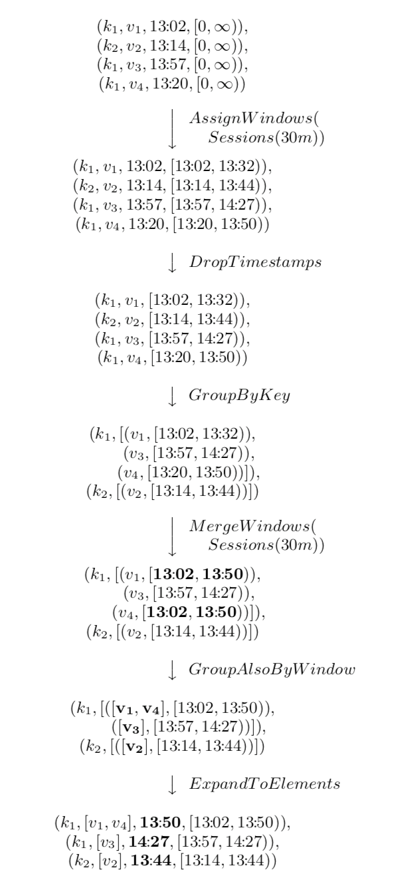

本文主要分析下 Flink 源码中 `flink-examples-streaming` 模块，可以更直观的了解 DataStream API，并了解 flink streaming 能解决的问题。
为了方便分析，对源码中的示例会有些许改动，并把代码粘贴在了文中。


## wordcount

实时统计单词数量，每来一个计算一次并输出一次。
```java
public class WordCount {

	// *************************************************************************
	// PROGRAM
	// *************************************************************************

	public static void main(String[] args) throws Exception {

		final ParameterTool params = ParameterTool.fromArgs(args);
		final StreamExecutionEnvironment env = StreamExecutionEnvironment.getExecutionEnvironment();
		env.getConfig().setGlobalJobParameters(params);
		DataStream<String> text;
		if (params.has("input")) {
			// read the text file from given input path
			text = env.readTextFile(params.get("input"));
		} else {
			// get default test text data
			text = env.fromElements(new String[] {
				"miao,She is a programmer",
				"wu,He is a programmer",
				"zhao,She is a programmer"
			});
		}

		DataStream<Tuple2<String, Integer>> counts =
			// split up the lines in pairs (2-tuples) containing: (word,1)
			text.flatMap(new Tokenizer())
			// group by the tuple field "0" and sum up tuple field "1"
			.keyBy(0).sum(1);

		// emit result
		if (params.has("output")) {
			counts.writeAsText(params.get("output"));
		} else {
			System.out.println("Printing result to stdout. Use --output to specify output path.");
			counts.print();
		}

		// execute program
		env.execute("Streaming WordCount");
	}

	// *************************************************************************
	// USER FUNCTIONS
	// *************************************************************************
	public static final class Tokenizer implements FlatMapFunction<String, Tuple2<String, Integer>> {

		@Override
		public void flatMap(String value, Collector<Tuple2<String, Integer>> out) {
			// normalize and split the line
			String[] tokens = value.toLowerCase().split("\\W+");

			// emit the pairs
			for (String token : tokens) {
				if (token.length() > 0) {
					out.collect(new Tuple2<>(token, 1));
				}
			}
		}
	}
}
```

输出结果：
```txt
8> (wu,1)
6> (a,1)
8> (is,1)
4> (programmer,1)
2> (he,1)
5> (miao,1)
4> (programmer,2)
6> (a,2)
3> (she,1)
8> (is,2)
3> (she,2)
8> (is,3)
6> (zhao,1)
4> (programmer,3)
6> (a,3)
```

## socket

监听socket端口输入的单词，进行单词统计。
```java
public class SocketWindowWordCount {

	public static void main(String[] args) throws Exception {

		// the host and the port to connect to
		final String hostname;
		final int port;
		try {
			final ParameterTool params = ParameterTool.fromArgs(args);
			hostname = params.has("hostname") ? params.get("hostname") : "localhost";
			port = 9999;
		} catch (Exception e) {
			return;
		}

		final StreamExecutionEnvironment env = StreamExecutionEnvironment.getExecutionEnvironment();

		// get input data by connecting to the socket
		// 数据来源是从socket读取，元素可以用分隔符切分
		DataStream<String> text = env.socketTextStream(hostname, port, "\n");

		// parse the data, group it, window it, and aggregate the counts
		DataStream<WordWithCount> windowCounts = text

			.flatMap(new FlatMapFunction<String, WordWithCount>() {
				@Override
				public void flatMap(String value, Collector<WordWithCount> out) {
					for (String word : value.split("\\s")) {
						out.collect(new WordWithCount(word, 1L));
					}
				}
			})

			.keyBy("word")
			.timeWindow(Time.seconds(10))

			.reduce(new ReduceFunction<WordWithCount>() {
				// 统计单词个数
				// reduce返回单个的结果值，并且reduce每处理一个元素总是创建一个新值。常用的average,sum,min,max,count,使用reduce方法都可以实现
				@Override
				public WordWithCount reduce(WordWithCount a, WordWithCount b) {
					return new WordWithCount(a.word, a.count + b.count);
				}
			});

		// print the results with a single thread, rather than in parallel
		windowCounts.print().setParallelism(1);

		env.execute("Socket Window WordCount");
	}

	// ------------------------------------------------------------------------

	/**
	 * Data type for words with count.
	 */
	public static class WordWithCount {

		public String word;
		public long count;

		public WordWithCount() {
		}

		public WordWithCount(String word, long count) {
			this.word = word;
			this.count = count;
		}

		@Override
		public String toString() {
			return word + " : " + count;
		}
	}
}
```

本机启用监听端口：
```jshelllanguage
nc -l 9999
```

socket监听端口输入以下内容：
```txt
miao she is a programmer
wu he is a programmer
zhao she is a programmer
```

输出的结果：
```txt
she : 2
programmer : 3
he : 1
a : 3
zhao : 1
miao : 1
wu : 1
is : 3
```


## async

主要通过以下示例了解下 AsyncFunction 作用到 DataStream 上的使用方法。没有用测试数据去跑。

```java
public class AsyncIOExample {

	private static final Logger LOG = LoggerFactory.getLogger(AsyncIOExample.class);

	private static final String EXACTLY_ONCE_MODE = "exactly_once";
	private static final String EVENT_TIME = "EventTime";
	private static final String INGESTION_TIME = "IngestionTime";
	private static final String ORDERED = "ordered";

	public static void main(String[] args) throws Exception {

		// obtain execution environment
		StreamExecutionEnvironment env = StreamExecutionEnvironment.getExecutionEnvironment();

		// parse parameters
		final ParameterTool params = ParameterTool.fromArgs(args);

		// 状态存放路径
		final String statePath;
		// checkpoint模式
		final String cpMode;
		// source生成的最大值
		final int maxCount;
		// RichAsyncFunction 中 线程休眠的因子
		final long sleepFactor;
		// 模拟RichAsyncFunction出错的概率因子
		final float failRatio;
		// 标志RichAsyncFunction 中的消息是有序还是无序的
		final String mode;
		// 设置任务的并行度
		final int taskNum;
		// 使用的Flink时间类型
		final String timeType;
		// 优雅停止RichAsyncFunction中线程池的等待毫秒数
		final long shutdownWaitTS;
		// RichAsyncFunction中执行异步操作的超时时间
		final long timeout;

		try {
			// check the configuration for the job
			statePath = params.get("fsStatePath", null);
			cpMode = params.get("checkpointMode", "exactly_once");
			maxCount = params.getInt("maxCount", 100000);
			sleepFactor = params.getLong("sleepFactor", 100);
			failRatio = params.getFloat("failRatio", 0.001f);
//			failRatio = params.getFloat("failRatio", 0.5f);
			mode = params.get("waitMode", "ordered");
			taskNum = params.getInt("waitOperatorParallelism", 1);
			timeType = params.get("eventType", "EventTime");
			shutdownWaitTS = params.getLong("shutdownWaitTS", 20000);
			timeout = params.getLong("timeout", 10000L);
		} catch (Exception e) {
			printUsage();

			throw e;
		}

		StringBuilder configStringBuilder = new StringBuilder();

		final String lineSeparator = System.getProperty("line.separator");

		configStringBuilder
			.append("Job configuration").append(lineSeparator)
			.append("FS state path=").append(statePath).append(lineSeparator)
			.append("Checkpoint mode=").append(cpMode).append(lineSeparator)
			.append("Max count of input from source=").append(maxCount).append(lineSeparator)
			.append("Sleep factor=").append(sleepFactor).append(lineSeparator)
			.append("Fail ratio=").append(failRatio).append(lineSeparator)
			.append("Waiting mode=").append(mode).append(lineSeparator)
			.append("Parallelism for async wait operator=").append(taskNum).append(lineSeparator)
			.append("Event type=").append(timeType).append(lineSeparator)
			.append("Shutdown wait timestamp=").append(shutdownWaitTS);

		LOG.info(configStringBuilder.toString());

		if (statePath != null) {
			// setup state and checkpoint mode
			env.setStateBackend(new FsStateBackend(statePath));
		}

		if (EXACTLY_ONCE_MODE.equals(cpMode)) {
			// 生成checkpoint的默认间隔是1s
			env.enableCheckpointing(1000L, CheckpointingMode.EXACTLY_ONCE);
		} else {
			env.enableCheckpointing(1000L, CheckpointingMode.AT_LEAST_ONCE);
		}

		// enable watermark or not
		if (EVENT_TIME.equals(timeType)) {
			env.setStreamTimeCharacteristic(TimeCharacteristic.EventTime);
		} else if (INGESTION_TIME.equals(timeType)) {
			env.setStreamTimeCharacteristic(TimeCharacteristic.IngestionTime);
		}

		// 创建一个数据源
		// create input stream of an single integer
		DataStream<Integer> inputStream = env.addSource(new SimpleSource(maxCount));

		// 创建async函数，通过等待来模拟异步i/o的过程
		// create async function, which will *wait* for a while to simulate the process of async i/o
		AsyncFunction<Integer, String> function =
			new SampleAsyncFunction(sleepFactor, failRatio, shutdownWaitTS);

		// add async operator to streaming job
		DataStream<String> result;
		if (ORDERED.equals(mode)) {
			result = AsyncDataStream.orderedWait(
				inputStream,
				function,
				timeout,
				TimeUnit.MILLISECONDS,
				20).setParallelism(taskNum);
		} else {
			result = AsyncDataStream.unorderedWait(
				inputStream,
				function,
				timeout,
				TimeUnit.MILLISECONDS,
				20).setParallelism(taskNum);
		}

		// add a reduce to get the sum of each keys.
		// 统计 key-> 源头数据除以10的余数，分别对应的个数
		result.flatMap(new FlatMapFunction<String, Tuple2<String, Integer>>() {
			private static final long serialVersionUID = -938116068682344455L;

			@Override
			public void flatMap(String value, Collector<Tuple2<String, Integer>> out) throws Exception {
				out.collect(new Tuple2<>(value, 1));
			}
		}).keyBy(0).sum(1).print();

		// execute the program
		env.execute("Async IO Example");
	}

	/**
	 * A checkpointed source.
	 * 具体功能：一个数据流 -> 不断发送一个从0递增的整数
	 */
	private static class SimpleSource implements SourceFunction<Integer>, ListCheckpointed<Integer> {
		private static final long serialVersionUID = 1L;

		private volatile boolean isRunning = true;
		/**
		 * 计数器
		 */
		private int counter = 0;
		/**
		 * 起始值
		 */
		private int start = 0;

		/**
		 * 储存快照状态：每次作业执行成功之后，会保存成功的上一条数据的状态，也就是start的值
		 */
		@Override
		public List<Integer> snapshotState(long checkpointId, long timestamp) throws Exception {
			return Collections.singletonList(start);
		}

		/**
		 * 当执行到某个作业流发生异常时，Flink会调用次方法，将状态还原到上一次的成功checkpoint的那个状态点
		 */
		@Override
		public void restoreState(List<Integer> state) throws Exception {
			// 找到最新的一次checkpoint成功时start的值
			for (Integer i : state) {
				this.start = i;
			}
		}

		public SimpleSource(int maxNum) {
			this.counter = maxNum;
		}

		@Override
		public void run(SourceContext<Integer> ctx) throws Exception {
			while ((start < counter || counter == -1) && isRunning) {
				synchronized (ctx.getCheckpointLock()) {
					ctx.collect(start);
					++start;

					// loop back to 0
					if (start == Integer.MAX_VALUE) {
						start = 0;
					}
				}
				Thread.sleep(10L);
			}
		}

		@Override
		public void cancel() {
			isRunning = false;
		}
	}


	/**
	 * 一个异步函数示例：用线程池模拟多个异步操作
	 * 具体功能：处理流任务的异步函数
	 */
	private static class SampleAsyncFunction extends RichAsyncFunction<Integer, String> {
		private static final long serialVersionUID = 2098635244857937717L;

		private transient ExecutorService executorService;

		/**
		 * The result of multiplying sleepFactor with a random float is used to pause
		 * the working thread in the thread pool, simulating a time consuming async operation.
		 * 模拟耗时的异步操作用的：就是假装这个异步操作很耗时，耗时时长为sleepFactor
		 */
		private final long sleepFactor;

		/**
		 * The ratio to generate an exception to simulate an async error. For example, the error
		 * may be a TimeoutException while visiting HBase.
		 * 模拟异步操作出现了异常：就是假装我的流任务的异步操作出现异常啦~ 会报错：Exception : wahahaha...
		 */
		private final float failRatio;

		private final long shutdownWaitTS;

		SampleAsyncFunction(long sleepFactor, float failRatio, long shutdownWaitTS) {
			this.sleepFactor = sleepFactor;
			this.failRatio = failRatio;
			this.shutdownWaitTS = shutdownWaitTS;
		}

		@Override
		public void open(Configuration parameters) throws Exception {
			super.open(parameters);

			executorService = Executors.newFixedThreadPool(30);
		}

		@Override
		public void close() throws Exception {
			super.close();
			ExecutorUtils.gracefulShutdown(shutdownWaitTS, TimeUnit.MILLISECONDS, executorService);
		}

		/**
		 * 真正执行异步IO的方法
		 * 这里用线程池模拟 source支持异步发送数据流
		 */
		@Override
		public void asyncInvoke(final Integer input, final ResultFuture<String> resultFuture) {
			executorService.submit(() -> {
				// wait for while to simulate async operation here
				// 模拟元素的操作时长：就是这个元素与外部系统交互的时长，然后sleep这么长的时间
				long sleep = (long) (ThreadLocalRandom.current().nextFloat() * sleepFactor);
				try {
					Thread.sleep(sleep);

					if (ThreadLocalRandom.current().nextFloat() < failRatio) {
						// 模拟触发异常：就是与外部系统交互时，假装出错发出了一个异常，此处可以查看日志，观察flink如何checkpoint恢复
						// restart-strategy.fixed-delay.attempts 默认为3，重启3次
						resultFuture.completeExceptionally(new Exception("wahahahaha..."));
					} else {
						// 根据输入的input/10的余数生成key
						resultFuture.complete(
							Collections.singletonList("key-" + (input % 10)));
					}
				} catch (InterruptedException e) {
					resultFuture.complete(new ArrayList<>(0));
				}
			});
		}
	}
}
```


## iteration

本示例为输入int值键值对，迭代计算斐波那契数列值大于100时需要计算的步长。

斐波那契数列：
F(n) = F(n-1) + F(n-2)

假设初始键值对为(34,11)，则产生的斐波那契数列为：34,11,45,56,101
经过本代码运行的结果应该是((34,11),3)，需要经历3步长，即累加3次才能使得数列值101 > 100，才能打到output流中。

```java
public class IterateExample {

	private static final int BOUND = 100;

	// *************************************************************************
	// PROGRAM
	// *************************************************************************

	public static void main(String[] args) throws Exception {

		final ParameterTool params = ParameterTool.fromArgs(args);
		// obtain execution environment and set setBufferTimeout to 1 to enable
		// continuous flushing of the output buffers (lowest latency)
		StreamExecutionEnvironment env = StreamExecutionEnvironment.getExecutionEnvironment()
			.setBufferTimeout(1);

		// make parameters available in the web interface
		env.getConfig().setGlobalJobParameters(params);

		// create input stream of integer pairs
		DataStream<Tuple2<Integer, Integer>> inputStream;
		if (params.has("input")) {
			inputStream = env.readTextFile(params.get("input")).map(new FibonacciInputMap());
		} else {
			inputStream = env.addSource(new RandomFibonacciSource());
		}

		// create an iterative data stream from the input with 5 second timeout
		// 经过InputMap() 将Tuple2 转成 Tuple5
		// 指定等待反馈输入的最大时间间隔，如果超过该时间间隔没有反馈元素到来，那么该迭代将会终止
		IterativeStream<Tuple5<Integer, Integer, Integer, Integer, Integer>> it = inputStream.map(new InputMap())
			.iterate(5000);

		// apply the step function to get the next Fibonacci number
		// increment the counter and split the output with the output selector
		// 再经过Step()步函数 获取下一个斐波那契数
		// 并进行分流
		SplitStream<Tuple5<Integer, Integer, Integer, Integer, Integer>> step = it.map(new Step())
			.split(new MySelector());

		// close the iteration by selecting the tuples that were directed to the
		// 'iterate' channel in the output selector
		it.closeWith(step.select("iterate"));

		// to produce the final output select the tuples directed to the
		// 'output' channel then get the input pairs that have the greatest iteration counter
		// on a 1 second sliding window
		DataStream<Tuple2<Tuple2<Integer, Integer>, Integer>> numbers = step.select("output")
			.map(new OutputMap());

		// emit results
		if (params.has("output")) {
			numbers.writeAsText(params.get("output"));
		} else {
			System.out.println("Printing result to stdout. Use --output to specify output path.");
			numbers.print();
		}

		long startTime = System.currentTimeMillis();
		System.out.println("Start time: " + startTime);
		// execute the program
		env.execute("Streaming Iteration Example");
		System.out.println("Spent time: " + (System.currentTimeMillis() - startTime));

	}

	// *************************************************************************
	// USER FUNCTIONS
	// *************************************************************************

	/**
	 * Generate BOUND number of random integer pairs from the range from 1 to BOUND/2.
	 * 随机生成Integer键值对的source
	 */
	private static class RandomFibonacciSource implements SourceFunction<Tuple2<Integer, Integer>> {
		private static final long serialVersionUID = 1L;

		private Random rnd = new Random();

		private volatile boolean isRunning = true;
		private int counter = 0;

		@Override
		public void run(SourceContext<Tuple2<Integer, Integer>> ctx) throws Exception {

			while (isRunning && counter < BOUND) {
				int first = rnd.nextInt(BOUND / 2 - 1) + 1;
				int second = rnd.nextInt(BOUND / 2 - 1) + 1;

				ctx.collect(new Tuple2<>(first, second));
				counter++;
				Thread.sleep(50L);
			}
		}

		@Override
		public void cancel() {
			isRunning = false;
		}
	}

	/**
	 * Generate random integer pairs from the range from 0 to BOUND/2.
	 */
	private static class FibonacciInputMap implements MapFunction<String, Tuple2<Integer, Integer>> {
		private static final long serialVersionUID = 1L;

		@Override
		public Tuple2<Integer, Integer> map(String value) throws Exception {
			String record = value.substring(1, value.length() - 1);
			String[] splitted = record.split(",");
			return new Tuple2<>(Integer.parseInt(splitted[0]), Integer.parseInt(splitted[1]));
		}
	}

	/**
	 * Map the inputs so that the next Fibonacci numbers can be calculated while preserving the original input tuple.
	 * A counter is attached to the tuple and incremented in every iteration step.
	 */
	public static class InputMap implements MapFunction<Tuple2<Integer, Integer>, Tuple5<Integer, Integer, Integer,
		Integer, Integer>> {
		private static final long serialVersionUID = 1L;

		@Override
		public Tuple5<Integer, Integer, Integer, Integer, Integer> map(Tuple2<Integer, Integer> value) throws
			Exception {
			// 结果map转换将Tuple2转成Tuple5
			return new Tuple5<>(value.f0, value.f1, value.f0, value.f1, 0);
		}
	}

	/**
	 * Iteration step function that calculates the next Fibonacci number.
	 */
	public static class Step implements
		MapFunction<Tuple5<Integer, Integer, Integer, Integer, Integer>, Tuple5<Integer, Integer, Integer,
			Integer, Integer>> {
		private static final long serialVersionUID = 1L;

		@Override
		public Tuple5<Integer, Integer, Integer, Integer, Integer> map(Tuple5<Integer, Integer, Integer, Integer,
			Integer> value) throws Exception {
			return new Tuple5<>(value.f0, value.f1, value.f3, value.f2 + value.f3, ++value.f4);
		}
	}

	/**
	 * OutputSelector testing which tuple needs to be iterated again.
	 */
	public static class MySelector implements OutputSelector<Tuple5<Integer, Integer, Integer, Integer, Integer>> {
		private static final long serialVersionUID = 1L;

		@Override
		public Iterable<String> select(Tuple5<Integer, Integer, Integer, Integer, Integer> value) {
			List<String> output = new ArrayList<>();
			if (value.f2 < BOUND && value.f3 < BOUND) {
				// 指定流的一部分用于反馈给迭代头
				// 反馈流反馈给迭代头就意味着一个迭代的完整逻辑的完成
				output.add("iterate");
			} else {
				// 指定流的另一部分发给下游
				output.add("output");
			}
			return output;
		}
	}

	/**
	 * Giving back the input pair and the counter.
	 */
	public static class OutputMap implements MapFunction<Tuple5<Integer, Integer, Integer, Integer, Integer>,
		Tuple2<Tuple2<Integer, Integer>, Integer>> {
		private static final long serialVersionUID = 1L;

		@Override
		public Tuple2<Tuple2<Integer, Integer>, Integer> map(Tuple5<Integer, Integer, Integer, Integer, Integer>
																 value) throws
			Exception {
			return new Tuple2<>(new Tuple2<>(value.f0, value.f1), value.f4);
		}
	}
}
```

输出的部分结果：
```txt
6> ((43,24),3)
7> ((23,25),3)
8> ((4,46),3)
1> ((42,49),2)
2> ((29,22),3)
3> ((36,3),4)
4> ((30,36),2)
5> ((18,24),3)
6> ((38,9),3)
7> ((19,44),2)
8> ((42,40),2)
1> ((16,9),5)
2> ((2,7),6)
```

## join

本示例演示了如何使用DataStream API进行双流join。

```java
public class WindowJoin {

	// *************************************************************************
	// PROGRAM
	// *************************************************************************

	public static void main(String[] args) throws Exception {
		// parse the parameters
		final ParameterTool params = ParameterTool.fromArgs(args);
		final long windowSize = params.getLong("windowSize", 2000);
		final long rate = params.getLong("rate", 3L);

		System.out.println("Using windowSize=" + windowSize + ", data rate=" + rate);
		System.out.println("To customize example, use: WindowJoin [--windowSize <window-size-in-millis>] [--rate <elements-per-second>]");

		// obtain execution environment, run this example in "ingestion time"
		StreamExecutionEnvironment env = StreamExecutionEnvironment.getExecutionEnvironment();
		env.setStreamTimeCharacteristic(TimeCharacteristic.IngestionTime);

		// make parameters available in the web interface
		env.getConfig().setGlobalJobParameters(params);

		// create the data sources for both grades and salaries
		// john,4
		DataStream<Tuple2<String, Integer>> grades = GradeSource.getSource(env, rate);
		// john,18000
		DataStream<Tuple2<String, Integer>> salaries = SalarySource.getSource(env, rate);

		// run the actual window join program
		// for testability, this functionality is in a separate method.
		DataStream<Tuple3<String, Integer, Integer>> joinedStream = runWindowJoin(grades, salaries, windowSize);

		// print the results with a single thread, rather than in parallel
		// 输出 john,4,18000
		joinedStream.print().setParallelism(1);

		// execute program
		env.execute("Windowed Join Example");
	}

	public static DataStream<Tuple3<String, Integer, Integer>> runWindowJoin(
			DataStream<Tuple2<String, Integer>> grades,
			DataStream<Tuple2<String, Integer>> salaries,
			long windowSize) {

		return grades.join(salaries)
				.where(new NameKeySelector())
				.equalTo(new NameKeySelector())

				.window(TumblingEventTimeWindows.of(Time.milliseconds(windowSize)))

				.apply(new JoinFunction<Tuple2<String, Integer>, Tuple2<String, Integer>, Tuple3<String, Integer, Integer>>() {

					@Override
					public Tuple3<String, Integer, Integer> join(
									Tuple2<String, Integer> first,
									Tuple2<String, Integer> second) {
						return new Tuple3<String, Integer, Integer>(first.f0, first.f1, second.f1);
					}
				});
	}

	private static class NameKeySelector implements KeySelector<Tuple2<String, Integer>, String> {
		@Override
		public String getKey(Tuple2<String, Integer> value) {
			return value.f0;
		}
	}
}
```

## sideoutput

当想要拆分数据流时，通常需要复制流，使用旁路输出可以直接过滤出不要的数据。示例中过滤出了长度 > 5的单词。

```java
public class SideOutputExample {

	/**
	 * OutputTag用来标识一个旁路输出流
	 */
	private static final OutputTag<String> rejectedWordsTag = new OutputTag<String>("rejected") {};

	public static void main(String[] args) throws Exception {

		final ParameterTool params = ParameterTool.fromArgs(args);
		final StreamExecutionEnvironment env = StreamExecutionEnvironment.getExecutionEnvironment();
		env.setStreamTimeCharacteristic(TimeCharacteristic.IngestionTime);

		// make parameters available in the web interface
		env.getConfig().setGlobalJobParameters(params);

		// get input data
		DataStream<String> text;
		if (params.has("input")) {
			// read the text file from given input path
			text = env.readTextFile(params.get("input"));
		} else {
			// get default test text data
			text = env.fromElements(WordCountData.WORDS);
		}

		SingleOutputStreamOperator<Tuple2<String, Integer>> tokenized = text
				.keyBy(new KeySelector<String, Integer>() {
					private static final long serialVersionUID = 1L;

					@Override
					public Integer getKey(String value) throws Exception {
						return 0;
					}
				})
				.process(new Tokenizer());

		// 旁路输出流
		DataStream<String> rejectedWords = tokenized
			    // 通过OutputTag从源source中获取旁路输出
				.getSideOutput(rejectedWordsTag)
				.map(new MapFunction<String, String>() {
					private static final long serialVersionUID = 1L;

					@Override
					public String map(String value) throws Exception {
						return "rejected: " + value;
					}
				});

		// 正常输出流，对正常数据做5s翻滚窗口的单词统计
		DataStream<Tuple2<String, Integer>> counts = tokenized
				.keyBy(0)
				.window(TumblingEventTimeWindows.of(Time.seconds(5)))
				// group by the tuple field "0" and sum up tuple field "1"
				.sum(1);

		// emit result
		if (params.has("output")) {
			counts.writeAsText(params.get("output"));
			rejectedWords.writeAsText(params.get("rejected-words-output"));
		} else {
			System.out.println("Printing result to stdout. Use --output to specify output path.");
			counts.print();
			rejectedWords.print();
		}

		// execute program
		env.execute("Streaming WordCount SideOutput");
	}

	// *************************************************************************
	// USER FUNCTIONS
	// *************************************************************************
	public static final class Tokenizer extends ProcessFunction<String, Tuple2<String, Integer>> {
		private static final long serialVersionUID = 1L;

		@Override
		public void processElement(
				String value,
				Context ctx,
				Collector<Tuple2<String, Integer>> out) throws Exception {
			// normalize and split the line
			String[] tokens = value.toLowerCase().split("\\W+");

			// emit the pairs
			for (String token : tokens) {
				if (token.length() > 5) {
					// 长度大于5的单词会作为旁路输出，ctx.output是将数据发送到旁路输出中
					ctx.output(rejectedWordsTag, token);
				} else if (token.length() > 0) {
					// 将数据发送到常规输出中
					out.collect(new Tuple2<>(token, 1));
				}
			}

		}
	}
}
```

输出的结果：
```txt
6> rejected: question
6> rejected: whether
6> rejected: nobler
6> rejected: suffer
......
1> (them,1)
4> (not,2)
2> (would,2)
1> (weary,1)
......
```


## windowing

### session window

示例演示了基于 EventTime 的会话窗口，分析了 watermark 生成以及触发窗口计算的时机。对于将被窗口丢弃的数据，如("a",1L,2)，可以 sideoutput。
```java
public class SessionWindowing {

	@SuppressWarnings("serial")
	public static void main(String[] args) throws Exception {

		final ParameterTool params = ParameterTool.fromArgs(args);
		final StreamExecutionEnvironment env = StreamExecutionEnvironment.getExecutionEnvironment();

		env.getConfig().setGlobalJobParameters(params);
		env.setStreamTimeCharacteristic(TimeCharacteristic.EventTime);
		env.setParallelism(1);

		final boolean fileOutput = params.has("output");

		final List<Tuple3<String, Long, Integer>> input = new ArrayList<>();

		// key、event time时间戳、key出现的次数
		input.add(new Tuple3<>("a", 1L, 1));

		input.add(new Tuple3<>("b", 1L, 1));
		input.add(new Tuple3<>("b", 3L, 1));
		input.add(new Tuple3<>("b", 5L, 1));

		input.add(new Tuple3<>("c", 6L, 1));

		// 即将被窗口丢弃的数据
		input.add(new Tuple3<>("a", 1L, 2));
		// We expect to detect the session "a" earlier than this point (the old
		// functionality can only detect here when the next starts)
		input.add(new Tuple3<>("a", 10L, 1));
		// We expect to detect session "b" and "c" at this point as well
		input.add(new Tuple3<>("c", 11L, 1));

		DataStream<Tuple3<String, Long, Integer>> source = env
				.addSource(new SourceFunction<Tuple3<String, Long, Integer>>() {
					private static final long serialVersionUID = 1L;

					@Override
					public void run(SourceContext<Tuple3<String, Long, Integer>> ctx) throws Exception {
						for (Tuple3<String, Long, Integer> value : input) {
							ctx.collectWithTimestamp(value, value.f1);
							// 发射watermark
							ctx.emitWatermark(new Watermark(value.f1 - 1));
						}
						// input输入流中的数据读取完毕之后，发射一个大的watermark，确保触发最后的窗口计算
						// 无限流，表示终止的watermark，需要一个超过window的end time的watermark来触发window计算
						ctx.emitWatermark(new Watermark(Long.MAX_VALUE));
					}

					@Override
					public void cancel() {
					}
				});

		// We create sessions for each id with max timeout of 3 time units
		DataStream<Tuple3<String, Long, Integer>> aggregated = source
				.keyBy(0)
				.window(EventTimeSessionWindows.withGap(Time.milliseconds(3L)))
				.sum(2);

		if (fileOutput) {
			aggregated.writeAsText(params.get("output"));
		} else {
			System.out.println("Printing result to stdout. Use --output to specify output path.");
			aggregated.print();
		}

		env.execute();
	}
}
```

输出的结果：
```txt
(a,1,1)

(b,1,3)
(c,6,1)

(a,10,1)
(c,11,1)
```

在类 InternalTimeServiceImpl 的 advanceWatermark() 中添加打印增量 Watermark 和 Timer 信息：
```java
public class InternalTimerServiceImpl {
	public void advanceWatermark(long time) throws Exception {
		// 打印增量watermark
		System.out.println(String.format("Advanced watermark %s", time));
		currentWatermark = time;

		InternalTimer<K, N> timer;

		while ((timer = eventTimeTimersQueue.peek()) != null && timer.getTimestamp() <= time) {
			// 打印触发时的timer
			System.out.println(timer);
			eventTimeTimersQueue.poll();
			keyContext.setCurrentKey(timer.getKey());
			triggerTarget.onEventTime(timer);
		}
	}
}
```

watermark生成与触发计算详情分析如下：
```txt
Advanced watermark 0
Advanced watermark 2
Advanced watermark 4
# watermark 4 = a 窗口的结束时间4，所以触发a计算输出
Timer{timestamp=3, key=(a), namespace=TimeWindow{start=1, end=4}}
(a,1,1)
Advanced watermark 5
Advanced watermark 9
# (b,1,1)、(b,3,1)、(b,5,1)，因为 3-1=2<Gap3，5-3=2<Gap3
# 这3条数据会进行窗口合并，所以这里的结束时间是8
# watermark 9 > b 窗口的结束时间8，所以触发b计算输出
Timer{timestamp=7, key=(b), namespace=TimeWindow{start=1, end=8}}
(b,1,3)
# watermark 9 = c 窗口的结束时间9，所以触发c计算输出
Timer{timestamp=8, key=(c), namespace=TimeWindow{start=6, end=9}}
(c,6,1)
Advanced watermark 10
Advanced watermark 9223372036854775807
# watermark 9223372036854775807 > a 窗口的结束时间13，所以触发a计算输出
Timer{timestamp=12, key=(a), namespace=TimeWindow{start=10, end=13}}
(a,10,1)
# watermark 9223372036854775807 > c 窗口的结束时间14，所以触发c计算输出
Timer{timestamp=13, key=(c), namespace=TimeWindow{start=11, end=14}}
(c,11,1)
```

由此也可以看出 Flink 何时触发window ？
```txt
1. watermark > window_end_time (对于out-of-order以及正常的数据而言)
2. 在[window_start_time,window_end_time)区间有数据存在
```  

窗口合并过程示例：



1. AssignWindows 给每一条到来的元素根据事件时间分配 session 窗口：k1,v1,13:02,[13:02,13:32];k1,v4,13:20,[13:20,13:50]    
2. DropTimestamps 丢弃数据事件时间戳：k1,v1,[13:02,13:32];k1,v4,[13:20,13:50]
3. GroupByKey 根据 key 进行聚合，根据不同的 key 进行窗口合并
4. MergeWindows 窗口合并，k1,v1对应的会话窗口[13:02,13:32]，k1,v4对应的会话窗口[13:20,13:50]，13:20 - 13:02 = 18min < Gap30min，
                所以这两个窗口会进行合并，合并的结果为 k1,v1,[13:02,13:50];k1,v4,[13:02,13:50]
5. GroupAlsoByWindow k1,(v1,v4),[13:02,13:50]
6. ExpandToElements  将新的 session 窗口结束时间作为元素的事件时间： k1,(v1,v4),13:50,[13:02,13:50]    


### count window

以下这两个示例是笔者自己写的，分别演示 滑动 count 窗口和 翻滚 count 窗口。

#### slide count window

```java
public class SlideCountWindowExample {

	public static void main(String[] args) throws Exception {
		final ParameterTool params = ParameterTool.fromArgs(args);
		final StreamExecutionEnvironment env = StreamExecutionEnvironment.getExecutionEnvironment();
		env.getConfig().setGlobalJobParameters(params);
		env.setParallelism(1);
		final int windowSize = params.getInt("window", 3);
		final int slideSize = params.getInt("slide", 2);

		Tuple2[] elements = new Tuple2[]{
			Tuple2.of("a", "1"),
			Tuple2.of("a", "2"),
			Tuple2.of("a", "3"),
			Tuple2.of("a", "4"),
			Tuple2.of("a", "5"),
			Tuple2.of("a", "6"),
			Tuple2.of("b", "7"),
			Tuple2.of("b", "8"),
			Tuple2.of("b", "9"),
			Tuple2.of("b", "0")
		};

		// read source data
		DataStreamSource<Tuple2<String, String>> inStream = env.fromElements(elements);

		// calculate
		DataStream<Tuple2<String, String>> outStream = inStream
			.keyBy(0)
			// sliding count window of 3 elements size and 2 elements trigger interval
			.countWindow(windowSize, slideSize)
			.reduce(
				new ReduceFunction<Tuple2<String, String>>() {
					@Override
					public Tuple2<String, String> reduce(Tuple2<String, String> value1, Tuple2<String, String> value2) throws Exception {
						return Tuple2.of(value1.f0, value1.f1 + "" + value2.f1);
					}
				}
			);
		outStream.print();
		env.execute("WindowWordCount");
	}
}
``` 

输出的结果：
```txt
(a,12)
(a,234)
(a,456)
(b,78)
(b,890)
```

countWindow(3,2)，3为窗口大小，2为滑动步长。每进来2个元素，就对最近的3个元素计算一遍并输出。

查看内部源码：

```java
public class KeyedStream<T, KEY> extends DataStream<T> {

    public WindowedStream<T, KEY, GlobalWindow> countWindow(long size, long slide) {
		return window(GlobalWindows.create())
			    // 在触发计算之前之后的剔除操作
				.evictor(CountEvictor.of(size))
			    // 触发条件是slide步长的个数
				.trigger(CountTrigger.of(slide));
    }
}
```

#### tumble count window

```java
public class TumbleCountWindowExample {

	public static void main(String[] args) throws Exception {
		final ParameterTool params = ParameterTool.fromArgs(args);
		final StreamExecutionEnvironment env = StreamExecutionEnvironment.getExecutionEnvironment();
		env.getConfig().setGlobalJobParameters(params);
		env.setParallelism(1);
		final int windowSize = params.getInt("window", 3);

		Tuple2[] elements = new Tuple2[]{
			Tuple2.of("a", "1"),
			Tuple2.of("a", "2"),
			Tuple2.of("a", "3"),
			Tuple2.of("a", "4"),
			Tuple2.of("a", "5"),
			Tuple2.of("a", "6"),
			Tuple2.of("b", "7"),
			Tuple2.of("b", "8"),
			Tuple2.of("b", "9"),
			Tuple2.of("b", "0")
		};

		// read source data
		DataStreamSource<Tuple2<String, String>> inStream = env.fromElements(elements);

		// calculate
		DataStream<Tuple2<String, String>> outStream = inStream
			.keyBy(0)
			// tumbling count window of 3 elements size
			.countWindow(windowSize)
			.reduce(
				new ReduceFunction<Tuple2<String, String>>() {
					@Override
					public Tuple2<String, String> reduce(Tuple2<String, String> value1, Tuple2<String, String> value2) throws Exception {
						return Tuple2.of(value1.f0, value1.f1 + "" + value2.f1);
					}
				}
			);
		outStream.print();
		env.execute("WindowWordCount");
	}
}
```

输出的结果：
```txt
(a,123)
(a,456)
(b,789)
```

最后一条 Tuple2.of(“b”, “0”) 被丢弃，因为最后一条数据已经无法触发计算了。


