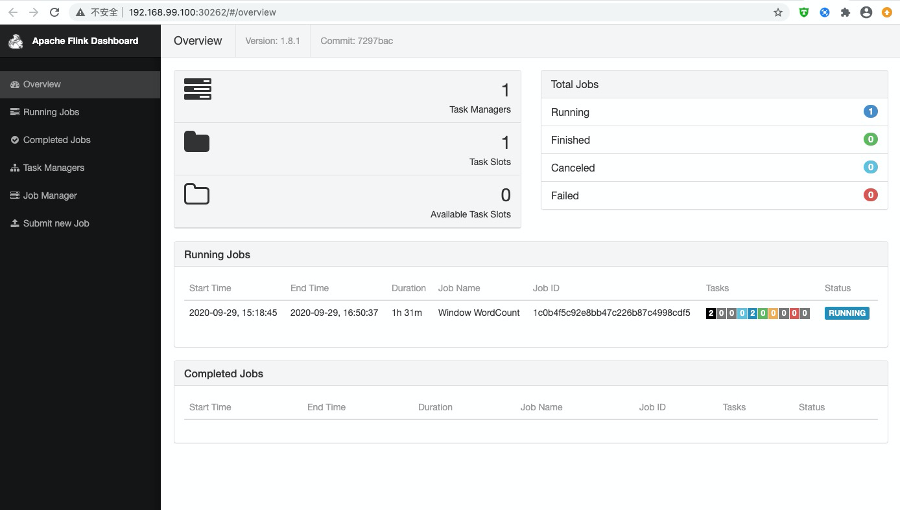
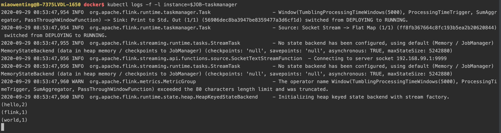

kubernetes 是目前非常流行的容器编排系统，在其之上可以运行 web 服务、大数据处理等各类应用。这些应用被打包在非常轻量的容器中，我们通过声明的方式来告知 kubernetes 要如何部署和扩容这些程序，并对外提供服务。flink on kubernetes 可以得到一个健壮和高可扩的数据处理应用，并且能够更安全的和其他服务共享一个 kubernetes 集群。

本文将记录使用 kubernetes 部署 flink 应用的步骤。

<!-- more -->

## Mac 安装 Docker

Docker Desktop 下载地址：[Docker 官网](https://www.docker.com/get-started)
注册 DockerID 并登录。

安装 docker 命令行：
```shell
$ brew install docker
```


## Minikube 搭建 Kubernetes 实验环境

可以参考：[Kubernetes 官网](https://kubernetes.io/docs/setup/learning-environment/minikube/#quickstart)

### 安装 Minikube

1. 校验 MacOS 是否支持虚拟化，运行如下命令出现 'VMX'：
```shell
$ sysctl -a | grep -E --color 'machdep.cpu.features|VMX'
```

2. 安装 kubectl 命令
```shell
$ curl -LO "https://storage.googleapis.com/kubernetes-release/release/$(curl -s https://storage.googleapis.com/kubernetes-release/release/stable.txt)/bin/darwin/amd64/kubectl"
$ chmod +x ./kubectl
$ sudo mv ./kubectl /usr/local/bin/kubectl
```
	或者直接使用 Homebrew 安装：
```shell
$ brew install kubectl 
$ brew install kubernetes-cli
```

	查看是否安装成功：
```shell
$ kubectl version --client
Client Version: version.Info{Major:"1", Minor:"19", GitVersion:"v1.19.2", GitCommit:"f5743093fd1c663cb0cbc89748f730662345d44d", GitTreeState:"clean", BuildDate:"2020-09-16T13:41:02Z", GoVersion:"go1.15", Compiler:"gc", Platform:"darwin/amd64"}
```


3. 安装 VirtualBox
VirtualBox 下载地址：[VirtualBox 官网](https://www.virtualbox.org/wiki/Downloads)


4. 安装 minikube
```shell
$ curl -Lo minikube https://storage.googleapis.com/minikube/releases/latest/minikube-darwin-amd64 && chmod +x minikube
$ sudo mv minikube /usr/local/bin
```
	或者直接使用 Homebrew 安装：
```shell
$ brew install minikube
```

5. 执行 minikube start
该命令会下载 kubelet 和 kubeadm 程序，并构建一个完整的 k8s 集群。
```shell
$ minikube start
```

6. 查看 k8s pods
Minikube 已经将命令 kubectl 指向虚拟机中的 k8s 集群了。
```shell
$ kubectl get pods -A
kube-system   coredns-f9fd979d6-xjht6                           1/1     Running   0          5h14m
kube-system   etcd-minikube                                     1/1     Running   0          5h14m
kube-system   kube-apiserver-minikube                           1/1     Running   0          5h14m
kube-system   kube-controller-manager-minikube                  1/1     Running   0          5h14m
kube-system   kube-proxy-ff8m8                                  1/1     Running   0          5h14m
kube-system   kube-scheduler-minikube                           1/1     Running   0          5h14m
kube-system   storage-provisioner                               1/1     Running   0          5h14m
```


## Flink 实时处理 demo

我们可以编写一个简单的实时处理脚本，该脚本会从某个端口中读取文本，分割为单词，并且每 5 秒钟打印一次每个单词出现的次数。

```java
DataStream<Tuple2<String, Integer>> dataStream = env
    .socketTextStream("192.168.99.1", 9999)
    .flatMap(new Splitter())
    .keyBy(0)
    .timeWindow(Time.seconds(5))
    .sum(1);

dataStream.print();

env.execute("Window WordCount");
```
K8s 容器中的程序可以通过 IP 192.168.99.1 来访问 Minikube 宿主机上的服务。


demo 下载：[flink-on-kubernetes-0.0.1-SNAPSHOT-jar-with-dependencies.jar](flink-on-kubernetes-0.0.1-SNAPSHOT-jar-with-dependencies.jar)


## 构建 Docker 容器镜像

flink 提供了一个官方的容器镜像，可以从 [DockerHub](https://hub.docker.com/_/flink?tab=tags&page=1&name=1.8.1-scala_2.12) 上下载镜像。
官方镜像的 [Dockerfile](https://github.com/docker-flink/docker-flink/blob/master/1.8/scala_2.12-debian/Dockerfile)，以 `1.8.1-scala_2.12` 为例，大致内容如下：
```txt
FROM openjdk:8-jre
ENV FLINK_HOME=/opt/flink
ENV PATH=$FLINK_HOME/bin:$PATH
RUN groupadd --system --gid=9999 flink && \
    useradd --system --home-dir $FLINK_HOME --uid=9999 --gid=flink flink
WORKDIR $FLINK_HOME

RUN useradd flink && \
  wget -O flink.tgz "$FLINK_TGZ_URL" && \
  tar -xf flink.tgz
ENTRYPOINT ["/docker-entrypoint.sh"]
```
主要做了以下几件事情：
- 将 OpenJDK 1.8 作为基础镜像
- 下载并安装 flink 至 /opt/flink 目录中
- 添加 flink 用户和组等

下面我们以 flink:1.8.1-scala_2.12 作为基础镜像，编写新的 Dockerfile，将打包好的任务 jar 包放置进去。此外，新版 flink 已将 hadoop 依赖从官方发行版本中剥离，因此在打包镜像的时候也要包含进去。
Hadoop jar 下载：[flink-shaded-hadoop-2-uber-2.8.3-7.0.jar](flink-shaded-hadoop-2-uber-2.8.3-7.0.jar)

```txt
FROM flink:1.8.1-scala_2.12

ARG hadoop_jar
ARG job_jar

ENV FLINK_CONF=$FLINK_HOME/conf/flink-conf.yaml

RUN set -x && \
  sed -i -e "s/jobmanager\.heap\.size:.*/jobmanager.heap.size: 128m/g" $FLINK_CONF && \
  sed -i -e "s/taskmanager\.heap\.size:.*/taskmanager.heap.size: 256m/g" $FLINK_CONF

COPY --chown=flink:flink $hadoop_jar $job_jar $FLINK_HOME/lib/

USER flink
```

将 docker 命令行指向 Minikube 中的 Docker 服务，这样打印出来的镜像才能被 k8s 使用：
```shell 
$ eval $(minikube docker-env)
```

移动到 Dockerfile 所在目录，开始构建镜像：
```shell
$ docker build \
  --build-arg hadoop_jar=flink-shaded-hadoop-2-uber-2.8.3-7.0.jar \
  --build-arg job_jar=flink-on-kubernetes-0.0.1-SNAPSHOT-jar-with-dependencies.jar \
  --tag flink-on-kubernetes:0.0.1 .
```

镜像打包完毕，可用于部署：
```shell
$ docker image ls
REPOSITORY                           TAG                                              IMAGE ID            CREATED             SIZE
flink-on-kubernetes                  0.0.1                                            ed4dfaf07cfe        5 hours ago         618MB
```


## 部署 JobManager
`jobmanager.yml` ：
```yml
apiVersion: batch/v1
kind: Job
metadata:
  name: ${JOB}-jobmanager
spec:
  template:
    metadata:
      labels:
        app: flink
        instance: ${JOB}-jobmanager
    spec:
      restartPolicy: OnFailure
      containers:
      - name: jobmanager
        image: flink-on-kubernetes:0.0.1
        command: ["/opt/flink/bin/standalone-job.sh"]
        args: ["start-foreground",
               "-Djobmanager.rpc.address=${JOB}-jobmanager",
               "-Dparallelism.default=1",
               "-Dblob.server.port=6124",
               "-Dqueryable-state.server.ports=6125",
               "-Dstate.savepoints.dir=hdfs://192.168.99.1:9000/flink/savepoints/",
               ]
        ports:
        - containerPort: 6123
          name: rpc
        - containerPort: 6124
          name: blob
        - containerPort: 6125
          name: query
        - containerPort: 8081
          name: ui

```

- ${JOB} 变量可以使用 `envsubst` 命令来替换
- 容器的入口修改为 `standalone-job.sh`
- JobManager 的 rpc 地址修改为了 k8s Service 的名称，集群中的其他组件将通过这个名称来访问 JobManager。
- 为 Flink Blob Server & Queryable State Server 指定默认端口号

使用 `kubectl` 命令创建 JobManager pod，并查看状态：
```shell
$ export JOB=flink-on-kubernetes
$ envsubst <jobmanager.yml | kubectl create -f -
$ kubectl get pod
NAME                                              READY   STATUS    RESTARTS   AGE
flink-on-kubernetes-jobmanager-dzhcs              1/1     Running   0          77m
```

创建一个 k8s Service 把 JobManager 的端口开放出来，以便 TaskManager 前来注册。
`service.yml`：
```yml
apiVersion: v1
kind: Service
metadata:
  name: ${JOB}-jobmanager
spec:
  selector:
    app: flink
    instance: ${JOB}-jobmanager
  type: NodePort
  ports:
  - name: rpc
    port: 6123
  - name: blob
    port: 6124
  - name: query
    port: 6125
  - name: ui
    port: 8081
```
使用 `kubectl` 命令创建 JobManager service，并查看状态：

```shell
$ envsubst <service.yml | kubectl create -f -
$  kubectl get service
NAME                             TYPE        CLUSTER-IP      EXTERNAL-IP   PORT(S)                                                       AGE
flink-on-kubernetes-jobmanager   NodePort    10.104.157.70   <none>        6123:30261/TCP,6124:31158/TCP,6125:30509/TCP,8081:30262/TCP   89m

$ minikube service $JOB-jobmanager --url
http://192.168.99.100:30261
http://192.168.99.100:31158
http://192.168.99.100:30509
http://192.168.99.100:30262
```



## 部署 TaskManager
`taskmanager.yml` ：
```yml
apiVersion: apps/v1
kind: Deployment
metadata:
  name: ${JOB}-taskmanager
spec:
  selector:
    matchLabels:
      app: flink
      instance: ${JOB}-taskmanager
  replicas: 1
  template:
    metadata:
      labels:
        app: flink
        instance: ${JOB}-taskmanager
    spec:
      containers:
      - name: taskmanager
        image: flink-on-kubernetes:0.0.1
        command: ["/opt/flink/bin/taskmanager.sh"]
        args: ["start-foreground", "-Djobmanager.rpc.address=${JOB}-jobmanager"]

```

使用 `kubectl` 命令创建 TaskManager pod，并查看状态：
```shell
$ kubectl get pod
NAME                                              READY   STATUS    RESTARTS   AGE
flink-on-kubernetes-jobmanager-dzhcs              1/1     Running   0          77m
flink-on-kubernetes-taskmanager-64b7cc4bf-9t6cr   1/1     Running   2          77m
```

至此，Flink 脚本集群已经在运行中了。在监听终端下输入如下内容：
```shell
$ nc -lk 9999
hello world
hello flink
```

打开另一个终端，查看 TaskManager 的标准输出日志：
```shell
$ kubectl logs -f -l instance=$JOB-taskmanager
(hello,2)
(flink,1)
(world,1)
```



