本文介绍Java开发中的软技能之一，UML图。UML 即统一建模语言，它是一种开放的方法，用于说明、可视化、构建和编写一个正在开发的、面向对象的、软件密集系统的制品的开放方法。
UML 展现了一系列最佳工程实践，这些最佳实践在对大规模，复杂系统进行建模方面，特别是在软件架构层次已经被验证有效。
我们知道开发一个软件系统，不光只有程序员参与，另外还有分析师、设计师、测试人员等等，为了让不同人能够理解交流这个软件系统，就诞生了这么一套语言。
这套语言是由图表组成的，最常用的有：用例图、类图、时序图、状态图、活动图、组件图和部署图等。大致可以将这些图归类为结构图和行为图：
- 结构图是静态图，如类图、对象图等
- 行为图是动态图，像序列图、协作图等


## 类图

类图主要是用来显示系统中的类、接口以及它们之间的静态结构和关系的一种静态模型。
许多项目立项文档、需求分析文档中，都会有关 UML 类图的涉及。类图基本上是一个系统的静态视图的图形表示，代表应用的不同方面，集合类图就表示整个系统。
画类图需要关注以下几点：
- 类图中的名称应该是有意义的描述，并且是面向系统的
- 画类图前应该先确定每个元素之间的关系
- 类图中每个类职责（属性和方法）应该清晰标明
- 对于每个类的属性应改精简，不必要的属性将使图表变得复杂

### 可见性符号

`+` public
`#` protected
`-` private

### 类之间的关系

| 关系                    |   表示               |  图示   |  解释   |  结构和语义  |
| ----------------------- | ------------------- | ------- | ------- | ------- |
| 泛化（Generalization）   |      | 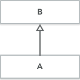   | A继承B，B为非抽象类   | 继承结构   |
| 实现（Realization）      |      | 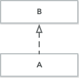   | A实现B，B为抽象类或接口   | 继承结构   |
| 聚合（Aggregation）      |      | 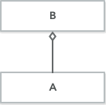   | A聚合到B上，B由A组成   | 表示整体由部分构成的语义。</br> (不是强依赖：整体不存在了，部分仍然存在)   
| 组合（Composition）      |      | 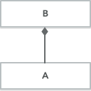  |  A组成B，B由A组成  | 表示整体由部分构成的语义。</br> (强依赖：整体不存在了，部分也不存在了)    |
| 关联（Association）      |      | 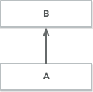  | A知道B，但是B不知道A   | 不同类的对象之间的结构关系。</br> 不强调方向，表示对象间相互知道。   |
| 依赖（Dependence）       |      | 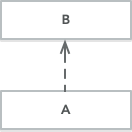   | A依赖于B   | 描述一个对象在运行期间会用到另一个对象的关系。</br> 应该保持单向依赖，杜绝双向依赖。|
                 

首先，我们给出一张具有整体关系的 UML 类图，后面再逐步分解说明。

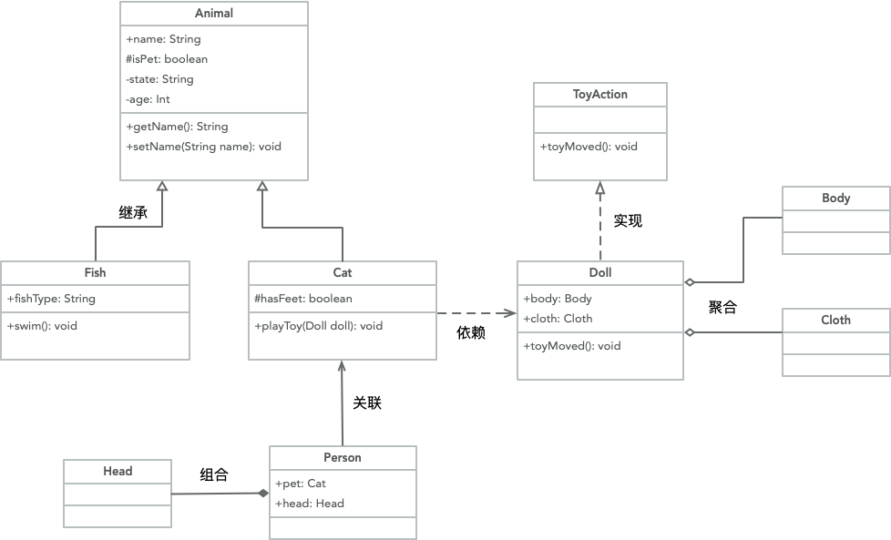

#### 泛化（Generalization）

泛化即 Java 中的继承关系，是类与类或者接口与接口之间最常见的关系。

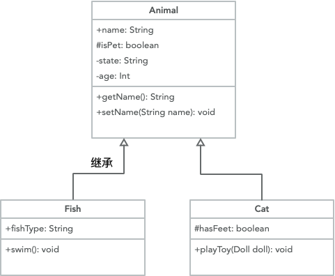

两个子类 Fish 和 Cat 分别继承自 Animal。
```java
public class Animal {
	public String name;
	protected boolean isPet;
	private String state;
	private int age;

	public String getName() {
		return name;
	}

	public void setName(String name) {
		this.name = name;
	}
}
```

```java
public class Fish extends Animal {
	public String fishType;

	public void swim() {

	}
}
```

```java
public class Cat extends Animal{
	protected boolean hasFeet;

	public void playToy(Doll doll){

	}
}
```

#### 实现（Realization）

实现即 Java 中类对抽象类或接口的实现关系，是类与接口之间最常见的关系。

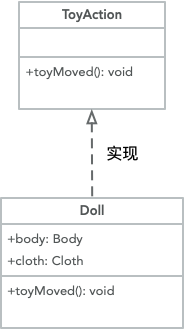

```java
public interface ToyAction {
	void toyMoved();
}
```
```java
public class Doll implements ToyAction{
	public Body body;
	public Cloth cloth;

	@Override
	public void toyMoved() {

	}
}
```

#### 关联（Association）

关联关系是一种比较强的关系，他们的关系是比较持久的、稳定的，而且双方的关系一般是平等的，分单向关联、双向关联等。
表现在代码层面，就是类 B 作为类 A 的属性，也可能是类 A 引用了一个类型为 B 的全局变量。如 Person 类，他拥有一个宠物猫，他们之间是关联关系。

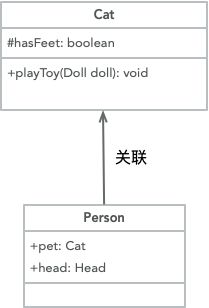

```java
public class Person {
	public Cat pet;
	public Head head;
}
```

(1) 单向关联
用带箭头的实线表示，箭头指向被引用或被包含的类。上面演示的就是一个单向关联关系。

(2) 双向关联
用不带箭头的实线来连接两个类，所谓的双向关联就是双方各自持有对方类型的成员变量。例如 Customer 类中维护一个 Product[] 数组，表示一个顾客购买了哪些商品；在 Product 类中维护一个 Customer 类型的成员变量表示这个产品被哪个顾客所购买。

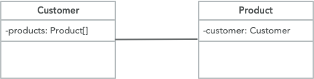

(3) 自关联
系统中可能会存在一些类的属性对象类型为该类本身，例如二叉树中的 TreeNode 定义。

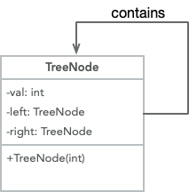


#### 依赖（Dependence）

就是一个类 A 使用到了另一个类 B ，这种使用关系是具有偶然性的、临时性的、非常弱的，但是类 B 的变化会影响到 A。
表现在代码层面，就是类 B 作为参数被类 A 在某个 method 方法中使用。如 Cat 类的 playToy 方法的参数就引用了 Doll 类，因此他们是依赖关系。

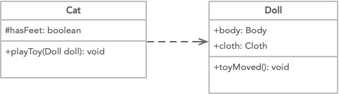


#### 聚合（Aggregation）

聚合关系强调的整体和部分、拥有的关系，即 has-a 的关系，其中部分可以脱离整体而存在，他们可以具有各自的生命周期。
如 Doll 类由 Body 和 Cloth 组成，即使失去了 Cloth，Doll 也可以正常存在。
表现在代码层面，和关联关系是一致的，只能从语义级别来区分。

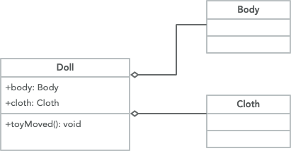

```java
public class Body {
}
```

```java
public class Cloth {
}
```

#### 组合（Composition）

组合关系也是强调整体和部分的关系，不同的是部分不能脱离整体而存在，它体现的是一种 contains-a 的关系，这种关系比聚合更强，也成为强聚合。
整体的生命周期结束也就意味着部分的生命周期结束，如人和大脑。
表现在代码层面，和关联关系是一致的，只能从语义级别来区分。

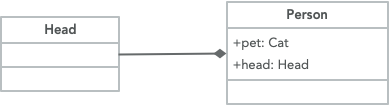

```java
public class Head {
}
```

类关系强度：组合 > 聚合 > 关联 > 依赖


下面我们在 idea 中构建这几个类，将这几个放到同一 package 下，看下 idea 自动生成的UML类图：
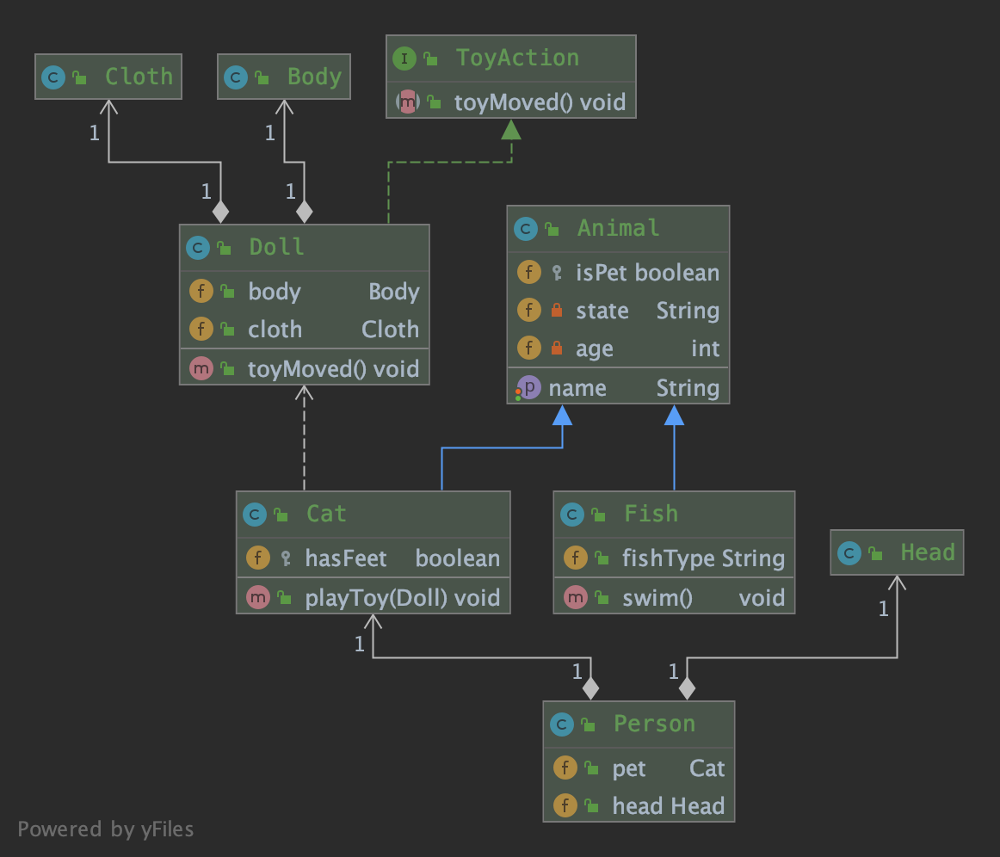

和我们给出整体关系 UML 类图基本一致，区别是聚合关系和组合关系都是用实心菱形表示的。


## 对象图

是类图的一个具体实例。


## 用例图

从用户的角度出发描述系统的功能、需求，展示系统外部的各类角色与系统内部的各种用例之间的关系。

## 顺序图

表示对象之间动态合作的关系。

## 协作图

描述对象之间的协作关系。

## 活动图

描述系统中各种活动的执行顺序。

## 状态图

描述一类对象的所有可能的状态以及事件发生时状态的转移条件。

## 部署图

定义系统中软硬件的物理体系结构。

## UML组件图

描述代码部件的物理结构以及各部件之间的依赖关系。


