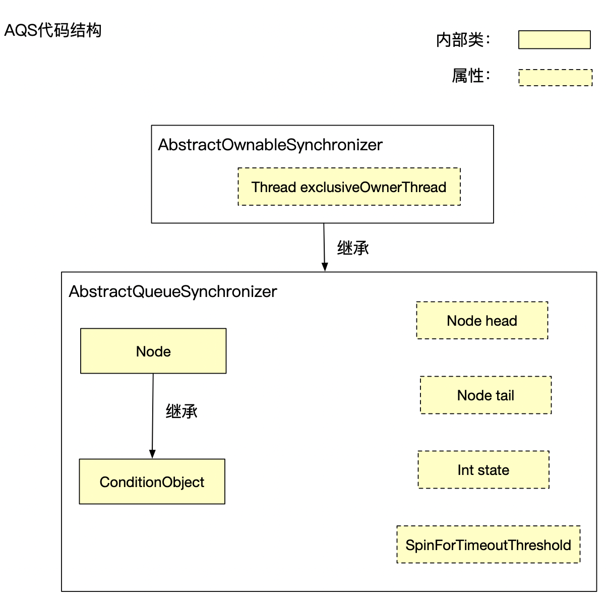
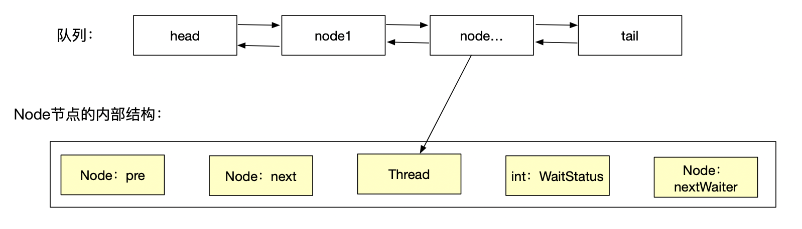

# AQS详解

为了了解AQS，我们首先需要知道锁的定义，看看java帮我们实现了哪几种锁。

###一、锁的介绍

####1.1 乐观锁/悲观锁

乐观锁与悲观锁是一种广义上的概念，体现了看待线程同步的不同角度，在java和数据库中都有应用。

概念来讲。对于悲观锁，不管当前是否有线程竞争，都会对当前数据进行加锁，确保数据不会被别的线程修改，在java中，synchronized就是悲观锁

而乐观锁任务自己在使用数据时，不会有别的线程修改数据，所以不会添加锁，只会在更新数据的时候去判断之前有没有别的线程更新了这个数据。如果这个数据没有被更新，当前线程将自己修改过的数据成功写入，如果数据已经被其他线程修改，则自动重试。

#### 1.2 共享锁/独占锁

独占锁也叫排他锁，我们在对数据A加排他锁后，其他线程则不能对A加任何类型的锁。

共享锁是指该锁可以被多个线程持有。如果线程T对数据A加上共享锁后，则其他线程只能对A再加共享锁，不能加排他锁。获得共享锁的线程只能读数据，不能修改数据，可以参考ReadLock。

#### 1.3 公平锁/非公平锁

对于线程来讲，他最关心什么？线程最关心的就是啥时候能够执行，那么这个线程是否能够按照先来后到的顺序执行就是公平锁和非公平锁的区别。

公平锁是指多个线程按照申请锁的顺序来获取锁，线程直接进入队列中排队，队列中的第一个线程能获取到锁。公平锁的优点就是等待锁的线程不会饿死。缺点就是整体吞吐效率相对非公平锁要低。

非公平锁就是多个线程加锁时直接尝试获取锁，获取不到锁才会到等待队列的队尾等待。非公平锁的优点是可以减少唤起线程的开销，整体的吞吐效率高，因为线程有可能不阻塞就可以锁。缺点是处于等待队列中的线程有可能饿死，可能这个线程永远也轮不到他获取锁。

### 二、大概框架介绍

AQS代码结构如下：

exclusiveOwnerThread：保存当前持有独占锁的线程

Node：队列中的结点

ConditionObject：继承Node，是Condition条件下使用的Node结点

Node head:队列的头部节点

Node tail:队列的尾部节点

Int State：锁的状态值。如果0则代表当前锁没有被持有，如果state>0那么就代表当前锁已经被其他线程获取了

SpinForTimeoutThreshold：自旋的超时时间

AQS内部维护了一个队列，来存储要获取锁的线程（这里先不考虑Condition）。

队列：是保存Node节点的双向链表，它是CLH的变形队列

Node节点的内部结构：

Node pre：当前节点的前一个节点

Node next：当前节点的下一个节点

Thread：节点所需要执行的线程

WaitStatus：节点的状态

- 0：初始化的值
- 1：Cancelled，由于超时或者中断，该节点被取消，节点永远不会离开此状态，特别的是，具有取消节点的线程将永远不会被再次阻塞
- -1：Signal，此节点的后继节点(或即将被阻止)阻塞(通过Park)，因此当前节点必须在其释放或取消时取消其后续节点。为了避免竞争，获取方法必须首先表示它们需要一个信号，然后重试原子获取，然后在失败时阻塞。
- -2：condition，该节点当前在条件队列中，不会作用于同步队列节点，直到转移，此时状态设置为0。（此时使用此值与字段的其他用途无关，但简化了机制）
- -3：Propagate，一个realeaseShared节点应该传播到其他节点，在（仅用于头部节点）中设置doReleaseShared以确保传播继续，即使有其他操作介入

nextWaiter：链接到下一个等待的条件节点。

### 三、acquire源码详解

独占锁获取锁流程图

1.调用自定义同步器的tryAcquire()尝试直接去获取资源，如果成功则直接返回；

2.没成功，则addWaiter()将该线程加入等待队列的尾部，并标记为独占模式；

3.acquireQueued()使线程在等待队列中休息，有机会时（轮到自己，会被unpark()）会去尝试获取资源。获取到资源后才返回。如果在整个等待过程中被中断过，则返回true，否则返回false。

4.如果线程在等待过程中被中断过，它是不响应的。只是获取资源后才再进行自我中断selfInterrupt()，将中断补上。

###四、acquireShared源码详解

共享锁获取锁流程

