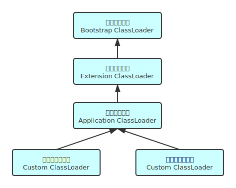
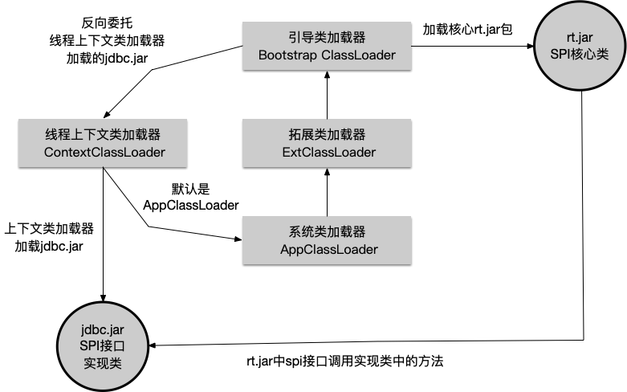

## 插件化开发基础篇—classloader

### 1. 什么是类加载？

每个编写的".java"拓展名类文件都存储着需要执行的程序逻辑，这些".java"文件经过Java编译器编译成拓展名为".class"的文件，".class"文件中保存着Java代码经转换后的虚拟机指令，当需要使用某个类时，虚拟机将会加载它的".class"文件，将class文件加载到虚拟机内存的方法区，生成class对象，这个过程称为类加载


### 2. 类加载的方式？

#### 2.1 显式加载

显式加载指的是在代码中通过调用ClassLoader加载字节码并返回class对象，如直接使用`Class.forName(name)`或`this.getClass().getClassLoader().loadClass()`加载class对象。

#### 2.2 隐式加载

隐式加载则是不直接在代码中调用ClassLoader的方法加载class对象，而是通过虚拟机自动加载到内存中，如在加载某个类的class文件时，该类的class文件中引用了另外一个类，此时当前类的类加载器尝试加载被引用的类到JVM内存中。在日常开发以上两种方式一般会混合使用。

##### 2.2.1 延迟加载

延迟加载又叫按需加载，当程序创建第一个对类的静态成员(静态成员属性、静态成员方法)的引用时，就会加载这个类。这也证明了构造器也是类的静态方法，即使在构造器之前并没有 static 关键字。因此，使用 new 操作符创建类的对象也会被当作对类的静态成员的引用。

反过来，类加载的时候，又会去进行static变量的赋值和执行static静态代码块。”类加载“和”静态成员的初始化和静态代码块的执行“这两个过程是相辅相成的。


### 3. 类加载的过程

加载：就是指通过类的全限定名将class文件读入内存，并为之创建一个Class对象

链接：

1. 验证：确保被加载类的正确性

2. 准备：负责为类的静态成员分配内存，并设置默认初始化值为0
3. 解析：将类中的符号引用替换为直接引用（参考jvm内存模型中的常量池）

初始化： 执行静态语句，包括静态变量的赋值还有静态代码块


### 4. 双亲委派

双亲委派模型发布于JDK1.2，其要求除顶层的启动类加载器外，其余的类加载器都应该有自己的父类加载器。这里的父子关系不是以继承的方式体现，而是通过组合的方式，即父加载器以parent成员属性的方式保存在子加载器中。

JDK自带的类加载器有三种：

1. 启动类加载器，Bootstrap ClassLoader，由C++实现，是虚拟机自身的一部分。加载%JAVA_HOME%/lib目录和-Xbootclasspath指定目录下的，并且必须是虚拟机能识别(如rt.jar，名字不符合的放在目录下也不会被加载)的类
2. 扩展类加载器，sun.misc.Launcher$ExtClassLoader，加载%JAVA_HOME%/lib/ext目录和-Djava.ext.dir系统变量指定的目录下的所有类库。开发者可以直接使用该类加载器
3. 系统类加载器/应用程序类加载器，sun.misc.Launcher$AppClassLoader， ClassLoader.getSystemClassLoader方法的返回值，负责加载classpath下所有类库



​																图一：Parents Delegation Model

#### 4.1 确立父子关系

JVM启动时，会去调用`Launcher.java`类的构造方法，其中定义了三种类加载器的父子关系：

```java
public Launcher() {
        ClassLoader extcl;
        try {
        // 首先创建扩展类加载器
            extcl = ExtClassLoader.getExtClassLoader();
        } catch (IOException e) {
            throw new InternalError(
                "Could not create extension class loader");
        }

        // Now create the class loader to use to launch the application
        try {
	        //再创建AppClassLoader并把extcl作为父加载器传递给AppClassLoader
            loader = AppClassLoader.getAppClassLoader(extcl);
        } catch (IOException e) {
            throw new InternalError(
                "Could not create application class loader");
        }

        //设置线程上下文类加载器，稍后分析
        Thread.currentThread().setContextClassLoader(loader);
        //省略其他没必要的代码......
        }
    }
```

Launcher初始化时首先会创建ExtClassLoader类加载器，然后再创建AppClassLoader并把ExtClassLoader传递给它作为父类加载器，这里还把AppClassLoader默认设置为线程上下文类加载器，关于线程上下文类加载器稍后会分析。那ExtClassLoader类加载器的父类加载器被设置为null，因为其父类加载器BootstraClassLoaders是JVM自身需要的类，这个类加载器使用C++语言实现的。 

```java
//Launcher中创建ExtClassLoader
extcl = ExtClassLoader.getExtClassLoader();

//getExtClassLoader()方法
public static ExtClassLoader getExtClassLoader() throws IOException{

  //........省略其他代码 
  return new ExtClassLoader(dirs);                     
  // .........
}

//构造方法
public ExtClassLoader(File[] dirs) throws IOException {
   //调用父类构造URLClassLoader传递null作为parent
   super(getExtURLs(dirs), null, factory);
}

//URLClassLoader构造
public URLClassLoader(URL[] urls, ClassLoader parent,
                          URLStreamHandlerFactory factory) {
}
```

ClassLoader是一个抽象类，很多方法没有实现，比如 findClass()等。而URLClassLoader这个实现类为这些方法提供了具体的实现，并新增了URLClassPath类协助取得Class字节码流等功能，在编写自定义类加载器时，如果没有太过于复杂的需求，可以直接继承URLClassLoader类，这样就可以避免自己去编写findClass()方法及其获取字节码流的方式，使自定义类加载器编写更加简洁


​																图二：ClassLoader extends relationship

#### 4.2 委派过程

1. loadclass()：定义了双亲委派流程

```java
    protected Class<?> loadClass(String name, boolean resolve)
        throws ClassNotFoundException
    {
        synchronized (getClassLoadingLock(name)) {
            // 查JVM中的缓存，看是否当前ClassLoader已经作为定义类加载器加载过该class
            Class<?> c = findLoadedClass(name);
            if (c == null) {
                long t0 = System.nanoTime();
                try {
                		//尝试让父类加载器加载
                    if (parent != null) {
                        c = parent.loadClass(name, false);
                    } else {
                    		//如果没有父类加载器，尝试让BootstrapClassLoader加载
                        c = findBootstrapClassOrNull(name);
                    }
                } catch (ClassNotFoundException e) {
                    // ClassNotFoundException thrown if class not found
                    // from the non-null parent class loader
                }
								//如果父类加载器无法返回class对象，则调用findClass方法，读取字节流
                if (c == null) {
                    // If still not found, then invoke findClass in order
                    // to find the class.
                    long t1 = System.nanoTime();
                    c = findClass(name);

                    // this is the defining class loader; record the stats
                    sun.misc.PerfCounter.getParentDelegationTime().addTime(t1 - t0);
                    sun.misc.PerfCounter.getFindClassTime().addElapsedTimeFrom(t1);
                    sun.misc.PerfCounter.getFindClasses().increment();
                }
            }
            if (resolve) {
                resolveClass(c);
            }
            return c;
        }
    }
```

2. findClass()：读取.class字节码文件的字节流

JDK1.2之后已不再建议用户去覆盖loadClass()方法，而是建议把自定义的类加载逻辑写在findClass()方法中，这样就可以保证自定义的类加载器也符合双亲委托模式。

```java
   import java.io.*;
   
   public class MyClassLoader extends ClassLoader {
   
       /**
        * 重写findClass方法
        * @param name 是我们这个类的全限定名
        * @return
        * @throws ClassNotFoundException
        */
       @Override
       protected Class<?> findClass(String name) throws ClassNotFoundException {
   
           try {
               String fileName = name.substring(name.lastIndexOf(".")+1)+".class";
             	 //到classpath下寻找.class文件并读取其字节流
               InputStream is = this.getClass().getResourceAsStream(fileName);
               byte[] b = new byte[is.available()];
               is.read(b);
               return defineClass(name, b, 0, b.length);
           }catch (IOException e){
               throw new ClassNotFoundException(name);
           }
       }
   }
```

自定义类加载器如果没有定义构造函数，则会默认调用父类ClassLoader的构造函数，并会默认将AppClassLoader作为自己的父类加载器：

```java
public abstract class ClassLoader {
  	//省略无关代码...
    protected ClassLoader() {
      	//getSystemClassLoader()返回AppClassLoader
        this(checkCreateClassLoader(), getSystemClassLoader());
    }

    private ClassLoader(Void unused, ClassLoader parent) {
        this.parent = parent;
        if (ParallelLoaders.isRegistered(this.getClass())) {
            parallelLockMap = new ConcurrentHashMap<>();
            package2certs = new ConcurrentHashMap<>();
            domains =
                    Collections.synchronizedSet(new HashSet<ProtectionDomain>());
            assertionLock = new Object();
        } else {
            // no finer-grained lock; lock on the classloader instance
            parallelLockMap = null;
            package2certs = new Hashtable<>();
            domains = new HashSet<>();
            assertionLock = this;
        }
    }
}
```


3. defineClass()：用来将byte字节流解析成JVM能够识别的Class对象

#### 4.3优缺点

1. 优点：

首先，通过这种层级关可以避免类的重复加载，当父亲已经加载了该类时，就没有必要子ClassLoader再加载一次；

其次，确保核心类的安全，防止核心类型被随意替换。假设通过网络传递一个名为java.lang.Integer的类，通过双亲委托模式传递到启动类加载器，而启动类加载器在核心Java API发现这个名字的类，发现该类已被加载，并不会重新加载网络传递的过来的java.lang.Integer，而直接返回已加载过的Integer.class，这样便可以防止核心API库被随意篡改

2. 缺点：

双亲委托机制中存在一个隐含的关系是一个类是由某个类加载器加载的，那么它所引用的其他类都是由该类加载器来加载，一些SPI接口属于 Java 核心库如`java.sql.DriverManager`，由BootstrapClassLoader加载，当SPI接口想要引用第三方实现类的具体方法时，BootstrapClassLoader无法加载位于classpath下的第三方实现类

### 5. 打破双亲委派

由上节可知，一些SPI接口属于 Java 核心库，由BootstrapClassLoader加载，当SPI接口想要引用第三方实现类的具体方法时，BootstrapClassLoader无法加载classpath下的第三方实现类，这时就需要使用线程上下文类加载器Thread.currentThread().getContextClassLoader()来解决。借助这种机制可以打破双亲委托机制限制：

```java
//DriverManager是Java核心包rt.jar的类
public class DriverManager {
	//省略不必要的代码
    static {
        loadInitialDrivers();//执行该方法
        println("JDBC DriverManager initialized");
    }

//loadInitialDrivers方法
 private static void loadInitialDrivers() {
     sun.misc.Providers()
     AccessController.doPrivileged(new PrivilegedAction<Void>() {
            public Void run() {
				//加载外部的Driver的实现类
                ServiceLoader<Driver> loadedDrivers = ServiceLoader.load(Driver.class);
              //省略不必要的代码......
            }
        });
    }

```

```java
//SPI核心类ServiceLoader
public final class ServiceLoader<S> implements Iterable<S> {
    public static <S> ServiceLoader<S> load(Class<S> service) {
        // 线程上下文类加载器，在Launcher类的构造器中被赋值为AppClassLoader，它可以读到ClassPath下的自定义类
        ClassLoader cl = Thread.currentThread().getContextClassLoader();
        return ServiceLoader.load(service, cl);
    }

    private S nextService() {
        if (!hasNextService())
            throw new NoSuchElementException();
        String cn = nextName;
        nextName = null;
        Class<?> c = null;
        try {
            //cn表示第三方具体实现类的全限定名，如果该实现类的class在loader类加载器命名空间没有找到，则通过loader进行加载
            c = Class.forName(cn, false, loader);
        } catch (ClassNotFoundException x) {
            fail(service,
                    "Provider " + cn + " not found");
        }
        if (!service.isAssignableFrom(c)) {
            fail(service,
                    "Provider " + cn + " not a subtype");
        }
        try {
            S p = service.cast(c.newInstance());
            providers.put(cn, p);
            return p;
        } catch (Throwable x) {
            fail(service,
                    "Provider " + cn + " could not be instantiated", x);
        }
        throw new Error();          // This cannot happen
    }
}
```


​																	图三：ThreadContextClassLoader

### 6. 命名空间

在JVM中，即使两个class对象来源同一个Class文件，被同一个虚拟机所加载，但只要加载它们的ClassLoader实例对象不同，那么这两个类对象也是不相等的。那么一个进程中有诸多类加载器加载的class，这些class对象是完全隔离的吗？满足怎样的条件才能互相引用？请看

> 参考：
> https://blog.csdn.net/javazejian/article/details/73413292
> https://juejin.im/post/5e3cd9cee51d4527214ba232
> https://www.runoob.com/w3cnote/java-class-forname.html