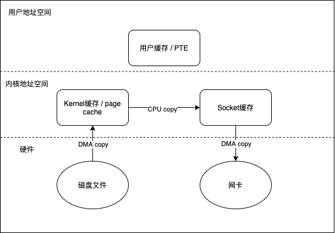

[TOC]

## NIO基础篇

### NIO概念

Java NIO(New IO)是从Java 1.4版本开始引入的 一个新的IO API，可以替代标准的Java IO API。 NIO与原来的IO有同样的作用和目的，但是使用 的方式完全不同，NIO支持面向缓冲区的、基于 通道的IO操作。NIO将以更加高效的方式进行文 件的读写操作。

| IO                      | NIO                         |
| ----------------------- | --------------------------- |
| 面向流(Stream Oriented) | 面向缓冲区(Buffer Oriented) |
| 阻塞IO(Blocking IO)     | 非阻塞IO(Non Blocking IO)   |
| (无)                    | 选择器(Selectors)           |


### 缓冲区

 Java NIO系统的核心在于:通道(Channel)和缓冲区 (Buffer)。通道表示打开到 IO 设备(例如:文件、 套接字)的连接。若需要使用 NIO 系统，需要获取用于连接 IO 设备的通道以及用于容纳数据的缓冲区。然后操作缓冲区，对数据进行处理。


#### 缓冲区类型

Buffer 底层维护了一个数组，可以保存多个相同类型的数据。根

据数据类型不同(boolean 除外) ，有以下 Buffer 常用子类:

- ByteBuffer
- CharBuffer
- ShortBuffer 
- IntBuffer
- LongBuffer 
- FloatBuffer 
- DoubleBuffer

上述 Buffer 类 他们都采用相似的方法进行管理数据，只是各自管理的数据类型不同而已。


#### 缓冲区基本属性

容量 (capacity) ：表示 Buffer 最大数据容量，缓冲区容量不能为负，并且创建后不能更改。

限制 (limit)：第一个不应该读取或写入的数据的索引，即位于 limit 后的数据 不可读写。缓冲区的限制不能为负，并且不能大于其容量。

位置 (position)：下一个要读取或写入的数据的索引。缓冲区的位置不能为负，并且不能大于其限制。

标记 (mark)与重置 (reset)：标记是一个索引，通过 Buffer 中的 mark() 方法 指定 Buffer 中一个特定的 position，之后可以通过调用 reset() 方法恢复到这 个 position。


#### Buffer常用方法

| 方法 | 描述 |
| ---- | ---- |
|   Buffer clear()   |   清空缓冲区并返回对缓冲区的引用   |
|   Buffer flip()   |    将缓冲区的界限设置为当前位置，并将当前位置充值为 0  |
|    int capacity()  |   返回 Buffer 的 capacity 大小   |
|boolean hasRemaining()|判断缓冲区中是否还有元素|
|int limit()|返回 Buffer 的界限(limit) 的位置|
|Buffer limit(int n)|将设置缓冲区界限为 n, 并返回一个具有新 limit 的缓冲区对象|
|Buffer mark()|对缓冲区设置标记|
|int position()|返回缓冲区的当前位置 position|
|Buffer position(int n)|将设置缓冲区的当前位置为 n , 并返回修改后的 Buffer 对象|
|int remaining()|返回 position 和 limit 之间的元素个数|
|Buffer reset()|将位置 position 转到以前设置的 mark 所在的位置|
|Buffer rewind()|将位置设为为 0， 取消设置的 mark|


####  缓冲区的数据操作

Buffer 所有子类提供了两个用于数据操作的方法:get() 与 put() 方法

- 获取 Buffer 中的数据

  get() :读取单个字节

  get(byte[] dst):批量读取多个字节到 dst 中

  get(int index):读取指定索引位置的字节(不会移动 position)

- 放入数据到 Buffer 中

  put(byte b):将给定单个字节写入缓冲区的当前位置

  put(byte[] src):将 src 中的字节写入缓冲区的当前位置

  put(int index, byte b):将指定字节写入缓冲区的索引位置(不会移动 position)


#### 直接与非直接缓冲区

ByteBuffer是一个抽象类，HeapByteBuffer和DirectByteBuffer，即字节缓冲区要么是直接的，要么是非直接的。如果为直接字节缓冲区，则Java虚拟机会尽最大努力直接在此缓冲区上执行本机 I/O 操作。也就是说，在每次调用基础操作系统的一个本机 I/O 操作之前(或之后)， 虚拟机都会尽量避免将缓冲区的内容复制到中间缓冲区中(或从中间缓冲区中复制内容)。详情见《进阶篇》中的MMAP和零拷贝。

非直接缓冲区即我们常见的堆内存，使用`java.nio.ByteBuffer#allocate`进行申请，源码如下：

```java
public static ByteBuffer allocate(int capacity) {
	if (capacity < 0)
		throw new IllegalArgumentException();
	return new HeapByteBuffer(capacity, capacity);
}

HeapByteBuffer(int cap, int lim) {            // package-private
	super(-1, 0, lim, cap, new byte[cap], 0);
        /*
        hb = new byte[cap];
        offset = 0;
        */
}

```

可以看到，申请堆内存实际上就是申请字节数组。

直接字节缓冲区可以通过调用此类的`java.nio.ByteBuffer#allocateDirect`方法来创建。此方法返回的缓冲区进行分配和取消 分配所需成本通常高于非直接缓冲区。直接缓冲区的内容可以驻留在常规的垃圾回收堆之外，因此，它们对应用程序的内存需求量造成的影响可能并不明显。FileChannel的map()方法将文件区域直接映射到内存中来创建。该方法返回抽象类 MappedByteBuffer，它的实现类是DirectByteBuffer，即堆外内存。虽然堆外内存不受JVM管理，但是JAVA代码（堆中）中可以持有堆外内存的引用，如上述MappedByteBuffer对象。源码如下：

```java
public static ByteBuffer allocateDirect(int capacity) {
	return new DirectByteBuffer(capacity);
}

DirectByteBuffer(int cap) {                   // package-private
	super(-1, 0, cap, cap);
  //如果是按页对齐，则还要加一个Page的大小；我们分析只pa为false的情况就好了
	boolean pa = VM.isDirectMemoryPageAligned();
	int ps = Bits.pageSize();
	long size = Math.max(1L, (long)cap + (pa ? ps : 0));
  //预分配内存
	Bits.reserveMemory(size, cap);

	long base = 0;
	try {
  //分配内存
	base = unsafe.allocateMemory(size);
	} catch (OutOfMemoryError x) {
		Bits.unreserveMemory(size, cap);
		throw x;
	}
  //将分配的内存的所有值赋值为0
	unsafe.setMemory(base, size, (byte) 0);
  //为address赋值，address就是分配内存的起始地址，之后的数据读写都是以它作为基准
	if (pa && (base % ps != 0)) {
		// Round up to page boundary
		address = base + ps - (base & (ps - 1));
	} else {
    //pa为false的情况，address==base
		address = base;
	}
  //创建一个Cleaner，将this和一个Deallocator对象传进去
	cleaner = Cleaner.create(this, new Deallocator(base, size, cap));
	att = null;
}
```

可以看到，申请直接缓冲区时，调用了native方法`Unsafe#allocateMemory`，关于Cleaner和堆外内存的垃圾回收，请参考《进阶篇》。

字节缓冲区是直接缓冲区还是非直接缓冲区可通过调用其isDirect()方法来确定。


### 通道

通道(Channel):由 java.nio.channels包定义的。Channel 表示 IO 源与目标打开的连接，如socketChannel代表TCP连接，DatagramChannel代表UDP连接。 Channel 类似于传统的“流”。只不过 Channel 本身不能直接访问数据，Channel 只能与 Buffer 进行交互。


#### 通道类型

Java 为 Channel 接口提供的最主要实现类如下:

- FileChannel:用于读取、写入、映射和操作文件的通道。
- DatagramChannel:通过 UDP 读写网络中的数据通道。 
- SocketChannel:通过 TCP 读写网络中的数据。 
- ServerSocketChannel:可以监听新进来的 TCP 连接，对每一个新进来的连接都会创建一个 SocketChannel。


#### 获取通道

1. Java 针对支持通道的类提供了一个 getChannel() 方法。
          本地IO操作
   
   - FileInputStream/File Output Stream
   
   - RandomAccessFile
   
     网络IO
   
   - Socket
   
   - ServerSocket
   
   - DatagramSocket
   
2. 在JDK1.7中的NIO.2 针对各个通道提供了静态方法open();
3. 在JDK1.7中的NIO.2 的Files类的静态方法newByteChannel();


#### 通道的数据传输

将 Buffer 中数据写入 Channel

```java
int byteWritten = inChannel.write(buf)
```

从 Channel 读取数据到 Buffer 例如:

```java
int byteRead = inChannel.read(buf)
```

 

###  NIO的非阻塞式网络通信

- 传统的 IO 流都是阻塞式的。也就是说，当一个线程调用 read() 或 write() 时，该线程被阻塞，直到有一些数据被读取或写入，该线程在此期间不 能执行其他任务。因此，在完成网络通信进行 IO 操作时，由于线程会阻塞，所以服务器端必须为每个客户端都提供一个独立的线程进行处理， 当服务器端需要处理大量客户端时，性能急剧下降。

-  Java NIO是非阻塞模式的。当线程从某通道进行读写数据时，若没有数据可用时，该线程可以进行其他任务。线程通常将非阻塞 IO 的空闲时间用于在其他通道上执行 IO 操作，所以单独的线程可以管理多个输入和输出通道。因此，NIO 可以让服务器端使用一个或有限几个线程来同 时处理连接到服务器端的所有客户端。

#### Selector

选择器(Selector) 是 SelectableChannle 对象的多路复用器，Selector可以同时监控多个 SelectableChannel 的 IO 状况，也就是说，利用 Selector 可使一个单独的线程管理多个 Channel。Selector 是非阻塞 IO 的核心。


selector的应用步骤如下：

1. 创建 Selector :通过调用 Selector.open() 方法创建一个 Selector。

```java
Selector selector = Selector.open()
```

2. 向选择器注册通道:SelectableChannel.register(Selector sel,  int ops)

```java
// 创建一个socket套接字
Socket socket = new Socket(InetAddress.getByName("127.0.0.1"), 9898)
// 获取SocketChannel
SocketChannel channel = socket.getChannel();
// 创建选择器
Selector selector = Selector.open();
// 将SelectorChannel切换到非阻塞模式
channel.configureBlocking(false);
// 想selector注册channel
SelectionKey key = channel.register(selector, SelectionKey.OP_READ);
```

常用方法如下：

|   方法   |  描述    |
| ---- | ---- |
|   Set<SelectionKey> keys()   |   所有的 SelectionKey 集合。代表注册在该Selector上的Channel   |
|   selectedKeys()   |   被选择的 SelectionKey 集合。返回此Selector的已选择键集   |
|   int select()   |  监控所有注册的Channel，当它们中间有需要处理的 IO 操作时， 该方法返回，并将对应的 SelectionKey 加入被选择的 SelectionKey 集合中，该方法返回这些 Channel 的数量。   |
|int select(long timeout)|可以设置超时时长的 select() 操作|
|int selectNow()|执行一个立即返回的 select() 操作，该方法不会阻塞线程|
|Selector wakeup()|使一个还未返回的 select() 方法立即返回|
|void close()|关闭该选择器|


####  SelectionKey

SelectionKey:表示 SelectableChannel 和 Selector 之间的注册关系。每次向 选择器注册通道时就会选择一个事件(选择键)。选择键包含两个表示为整 数值的操作集。操作集的每一位都表示该键的通道所支持的一类可选择操 作。

可以监听的事件类型(可使用 SelectionKey 的四个常量表示):

- 读 : SelectionKey.OP_READ (1)

- 写 : SelectionKey.OP_WRITE (4) 

- 连接:SelectionKey.OP_CONNECT (8)

- 接收 : SelectionKey.OP_ACCEPT (16)

若注册时不止监听一个事件，则可以使用“位或”操作符连接。

```java
int interestSet = SelectionKey.OP_READ | SelectionKey.OP_WRITE;
```

详情请参考《进阶篇》中位运算符的相关介绍。

常用方法如下：

|   方法   |  描述    |
| ---- | ---- |
|   int   interestOps()   |   获取感兴趣事件集合   |
|   int   readyOps()   |   获取通道已经准备就绪的操作的集合   |
|    SelectableChannel  channel()  |   获取注册通道   |
|Selector  selector()|返回选择器|
|boolean isReadable()|检测 Channel 中读事件是否就绪|
|boolean isWritable()|检测 Channel 中写事件是否就绪|
|boolean isConnectable()|检测 Channel 中连接是否就绪|
|boolean isAcceptable()|检测 Channel 中接收是否就绪|

#### 示例

```java
    @Test
    public void client() throws IOException {
        SocketChannel socketChannel = SocketChannel.open(new InetSocketAddress("127.0.0.1",7498));

        // 切换成非 阻塞模式
        socketChannel.configureBlocking(false);

        FileChannel inputChannel = FileChannel.open(Paths.get("/Users/djg/Downloads/branch.jpg"), StandardOpenOption.READ);

        ByteBuffer clientBuffer = ByteBuffer.allocate(1024);

        while (inputChannel.read(clientBuffer) != -1){
            clientBuffer.flip();
            socketChannel.write(clientBuffer);
            clientBuffer.clear();
        }
        socketChannel.close();
        inputChannel.close();
    }


    @Test
    public void server() throws IOException {
        ServerSocketChannel serverSocketChannel = ServerSocketChannel.open();

        // 非阻塞
        serverSocketChannel.configureBlocking(false);

        serverSocketChannel.bind(new InetSocketAddress(7498));

        FileChannel outputChannel = FileChannel.open(Paths.get("/Users/djg/Downloads/branch2.jpg"),StandardOpenOption.WRITE,StandardOpenOption.CREATE);


        // 选择器
        Selector selector = Selector.open();

        // 将通道注册到选择器上，并制定监听事件
        serverSocketChannel.register(selector, SelectionKey.OP_ACCEPT);
        // 轮巡式获得选择器里的已经准备就绪的事件
        while (selector.select() > 0 ){

            // 获取已经就绪的监听事件
            Iterator<SelectionKey> selectorIterator =  selector.selectedKeys().iterator();

            // 迭代获取
            while (selectorIterator.hasNext()){
                // 获取准备就绪的事件

                SelectionKey key = selectorIterator.next();

                SocketChannel socketChannel = null;
                // 判断是什么事件
                if (key.isAcceptable()){
                    // 或接受就绪，，则获取客户端连接
                    socketChannel = serverSocketChannel.accept();

                    //切换非阻塞方式
                    socketChannel.configureBlocking(false);
                    // 注册到选择器上
                    socketChannel.register(selector,SelectionKey.OP_READ);
                } else if (key.isReadable()){
                    // 获取读就绪通道
                    SocketChannel readChannel = (SocketChannel) key.channel();

                    readChannel.configureBlocking(false);
                    ByteBuffer readBuffer = ByteBuffer.allocate(1024);

                    int len = 0;
                    while ( (len = readChannel.read(readBuffer)) != -1){
                        readBuffer.flip();
                        System.out.println(new String(readBuffer.array(),0,len));
                        outputChannel.write(readBuffer);
                        readBuffer.clear();
                    }
                    readChannel.close();
                    outputChannel.close();

                }
            }

            // 取消选择键
            selectorIterator.remove();
        }
    }
```

想要进一步了解NIO的相关知识如MMAP、堆外内存等，请关注《进阶篇》。


## NIO进阶篇

### DMA

在学习零拷贝等NIO技术之前，我们需要先知道什么是DMA。DMA(Direct Memory Access,直接存储器访问)。在ＤＭＡ出现之前，CPU与外设之间的数据传送方式有程序传送方式、中断传送方式。CPU是通过系统总线与其他部件连接并进行数据传输。不管何种传送方式，都要消耗CPU，间接影响了其他任务的执行。

https://blog.csdn.net/zhejfl/article/details/82555634

#### 原理

DMA的出现就是为了解决批量数据的输入/输出问题。DMA是指外部设备不通过CPU而直接与系统内存交换数据的接口技术。类比显卡，也是从CPU中剥离出来的功能。将这些特殊的模块进行剥离，使得CPU可以更加专注于计算工作。

通常系统总线是由CPU管理的，在ＤＭＡ方式时，就希望CPU把这些总线让出来而由DMA控制器接管，控制传送的字节数，判断DMA是否结束，以及发出DMA结束信号。因此DMA控制器必须有以下功能:

1、能向CPU发出系统保持(HOLD)信号，提出总线接管请求；

2、当CPU发出允许接管信号后，对总线的控制由DMA接管;

3、能对存储器寻址及能修改地址指针，实现对内存的读写；

4、能决定本次DMA传送的字节数，判断DMA传送是否借宿。

5、发出DMA结束信号，使CPU恢复正常工作状态。


### Page Cache

#### 文件

从应用程序的角度看，操作系统提供了一个统一的虚拟机，在该虚拟机中没有各种机器的具体细节，只有进程、文件、地址空间以及进程间通信等逻辑概念。这种抽象虚拟机使得应用程序的开发变得相对容易。对于存储设备上的数据，操作系统向应用程序提供的逻辑概念就是"文件"。应用程序要存储或访问数据时，只需读或者写"文件"的一维地址空间即可，而这个地址空间与存储设备上存储块之间的对应关系则由操作系统维护。


#### Page Cache的作用


图中描述了 Linux 操作系统中文件 Cache 管理与内存管理以及文件系统的关系示意图。从图中可以看到，在 Linux 中，具体文件系统，如 ext2/ext3、jfs、ntfs 等，负责在文件 Cache和存储设备之间交换数据，位于具体文件系统之上的虚拟文件系统VFS负责在应用程序和文件 Cache 之间通过 read/write 等接口交换数据，而内存管理系统负责文件 Cache 的分配和回收，同时虚拟内存管理系统(VMM)则允许应用程序和文件 Cache 之间通过 memory map的方式交换数据。可见，在 Linux 系统中，文件 Cache 是内存管理系统、文件系统以及应用程序之间的一个联系枢纽。

#### Page Cache相关的数据结构

每一个 Page Cache 包含若干 Buffer Cache。

内存管理系统与Page Cache交互，负责维护每项 Page Cache 的分配和回收，同时在使用 memory map 方式访问时负责建立映射；

VFS 与Page Cache交互，负责 Page Cache 与用户空间的数据交换，即文件读写；

具体文件系统则一般只与 Buffer Cache 交互，它们负责在外围存储设备和 Buffer Cache 之间交换数据。

Page Cache、Buffer Cache、文件以及磁盘之间的关系如图 2 所示，Page 结构和 buffer_head 数据结构的关系如图 所示：


由图中可见，一个Page Cache包含多个Buffer Cache，一个Buffer Cache与一个磁盘块一一对应。


假定了 Page 的大小是 4K，则文件的每个4K的数据块最多只能对应一个 Page Cache 项，它通过一个是 radix tree来管理文件块和page cache的映射关系，Radix tree 是一种搜索树，Linux 内核利用这个数据结构来通过文件内偏移快速定位 Cache 项。

[page cache]: https://www.ibm.com/developerworks/cn/linux/l-cache/index.html


### 零拷贝

Linux内核中与文件Cache操作相关的API有很多，按其使用方式可以分成两类：一类是以拷贝方式操作的相关接口， 如read/write/sendfile等；另一类是以地址映射方式操作的相关接口，如mmap。其中sendfile和mmap都是零拷贝的实现方案。

我们经常听说Kafka和RocketMQ等消息中间件有利用零拷贝技术来加速数据处理，提高吞吐量。所谓零拷贝，就是使用CPU进行数据拷贝的次数为零

#### 常规文件读写

我们先看下正常文件读写所经历的阶段，即`FileChannel#read`，`FileChannel#write`，共涉及四次上下文切换（内核态和用户态的切换，包括read调用，read返回，write调用，write返回）和四次数据拷贝


JAVA中关于正常文件读写的示例代码：

```java
    @Test
    public void testChannel() throws IOException {
        FileInputStream inputStream = null;
        FileOutputStream outputStream = null;
        FileChannel inputChannel = null;
        FileChannel outputChannel = null;
        try {
            inputStream = new FileInputStream(new File("/Users/djg/Downloads/branch.jpg"));
            outputStream = new FileOutputStream(new File("/Users/djg/Downloads/branch2.jpg"));

            // 获取通道
            inputChannel = inputStream.getChannel();
            outputChannel = outputStream.getChannel();

            // 分配缓冲区
            ByteBuffer byteBuffer = ByteBuffer.allocate(1024);

            // 将通道中数据存入缓冲区
            while(inputChannel.read(byteBuffer) != -1){
                // 切换成读取数据的模式
                byteBuffer.flip();
                //缓冲区中数据写到通道中区
                outputChannel.write(byteBuffer);
                // 清空缓冲区
                byteBuffer.clear();
            }
            System.out.println("读写成功");
        } catch (FileNotFoundException e) {
            e.printStackTrace();
        } catch (IOException e) {
            e.printStackTrace();
        } finally {
            inputChannel.close();
            outputChannel.close();
            System.out.println("数据关闭成功");
        }
    }
```


#### mmap

mmap 把文件映射到用户空间里的虚拟地址空间，实现文件磁盘地址和进程虚拟地址空间中一段虚拟地址的一一对映关系。

省去了从内核缓冲区复制到用户空间的过程，进程就可以采用指针的方式读写操作这一段内存，而系统会自动回写脏页面到对应的文件磁盘上，即完成了对文件的操作而不必再调用read,write等系统调用函数。相反，内核空间对这段区域的修改也直接反映到用户空间，从而可以实现不同进程间的文件共享（）。

但在真正使用到这些数据前却不会消耗物理内存，也不会有读写磁盘的操作，只有真正使用这些数据时，虚拟内存管理系统 VMS 才根据缺页加载的机制从磁盘加载对应的数据块到物理内存。这样的文件读写文件方式少了数据从内核缓存到用户空间的拷贝，效率很高。

概括而言，mmap有以下特点：

1. 文件直接映射到用户虚拟地址空间，避免了一次数据拷贝

2. []: 

3. 建立mmap之后，并不会立马加载数据到内存，只有真正使用数据时，才会引发缺页异常并加载数据到内存


memory map具体步骤如下：

首先，应用程序调用mmap（图中1），陷入到内核中后调用do_mmap_pgoff（图中2）。该函数从应用程序的地址空间中分配一段区域作为映射的内存地址，并使用一个VMA（vm_area_struct）结构代表该区域，之后就返回到应用程序（图中3）。当应用程序访问mmap所返回的地址指针时（图中4），由于虚实映射尚未建立，会触发缺页中断（图中5）。之后系统会调用缺页中断处理函数（图中6），在缺页中断处理函数中，内核通过相应区域的VMA结构判断出该区域属于文件映射，于是调用具体文件系统的接口读入相应的Page Cache项（图中7、8、9），并填写相应的虚实映射表。经过这些步骤之后，应用程序就可以正常访问相应的内存区域了。

详情请参考

[mmap与page cache]: https://www.ibm.com/developerworks/cn/linux/l-cache/index.html
[虚拟内存]: https://zhuanlan.zhihu.com/p/96098896
[mmap与虚拟内存]: https://www.jianshu.com/p/eece39beee20
[mmap]: https://blog.csdn.net/yusiguyuan/article/details/23388771

Java中关于mmap的示例：

```java
    @Test
    public void channelTest() throws IOException {
        FileChannel inputChannel = FileChannel.open(Paths.get("/Users/djg/Downloads/branch.jpg"), StandardOpenOption.READ);
        FileChannel outputChannel = FileChannel.open(Paths.get("/Users/djg/Downloads/branch2.jpg"), StandardOpenOption.WRITE,StandardOpenOption.READ,StandardOpenOption.CREATE);
        // 内存映射文件
        MappedByteBuffer inputBuffer = inputChannel.map(FileChannel.MapMode.READ_ONLY,0,inputChannel.size());
        MappedByteBuffer outputBuffer = outputChannel.map(FileChannel.MapMode.READ_WRITE,0,inputChannel.size());

        byte [] bytes = new byte[inputBuffer.limit()];
        inputBuffer.get(bytes);
        outputBuffer.put(bytes);

        inputChannel.close();
        outputChannel.close();
    }
```

以下是mmap源码分析，不感兴趣的读者可以略过：

来看一下mmap在C语言中的源码

```c++
#include <sys/mman.h>
void *mmap(void *start, size_t length, int prot, int flags, int fd, off_t offset);
```

| 参数   | 含义                                                         |
| ------ | ------------------------------------------------------------ |
| start  | 指向欲映射的内存（映射区）起始地址，通常设为 NULL，代表让系统自动选定地址，映射成功后返回该地址 |
| length | 代表将文件中多大的部分映射到内存                             |
| prot   | 映射区域的保护方式。可以为以下几种方式的组合：<br />PROT_EXEC ：页内容可以被执行 <br />PROT_READ ：页内容可以被读取<br />PROT_WRITE ：页可以被写入<br />PROT_NONE ：页不可访问 |
| flags  | 影响映射区域的各种特性。<br />MAP_FIXED：如果参数start所指的地址无法成功建立映射时，则放弃映射，不对地址做修正。通常不鼓励用此旗标。<br/>MAP_SHARED：对映射区域的写入数据会复制回文件内，而且允许其他映射该文件的进程共享。直到msync()或者munmap()被调用，文件实际上不会被更新。<br/>MAP_PRIVATE：建立一个写时复制的私有映射。内存区域的写入不会影响到原文件。这个标志和以上标志是互斥的，只能使用其中一个。 |
| fd     | 文件描述符                                                   |
| offset | 文件映射的偏移量，通常设置为0，代表从文件最前方开始对应，offset必须是PAGE_SIZE的整数倍。 |

在sun.nio.ch.FileChannelImpl里有map的具体实现：

```java
private native long map0(int prot, long position, long length)
```

调用的是一个native方法，这个native方法的实现位于solaris/native/sun/nio/ch/FileChannelImpl.c

源码如下：

```c++
JNIEXPORT jlong JNICALL
Java_sun_nio_ch_FileChannelImpl_map0(JNIEnv *env, jobject this,
                                     jint prot, jlong off, jlong len)
{
    void *mapAddress = 0;
    jobject fdo = (*env)->GetObjectField(env, this, chan_fd);
    jint fd = fdval(env, fdo);
    int protections = 0;
    int flags = 0;

    if (prot == sun_nio_ch_FileChannelImpl_MAP_RO) {
        protections = PROT_READ;
        flags = MAP_SHARED;
    } else if (prot == sun_nio_ch_FileChannelImpl_MAP_RW) {
        protections = PROT_WRITE | PROT_READ;
        flags = MAP_SHARED;
    } else if (prot == sun_nio_ch_FileChannelImpl_MAP_PV) {
        protections =  PROT_WRITE | PROT_READ;
        flags = MAP_PRIVATE;
    }

    mapAddress = mmap64(
        0,                    /* Let OS decide location */
        len,                  /* Number of bytes to map */
        protections,          /* File permissions */
        flags,                /* Changes are shared */
        fd,                   /* File descriptor of mapped file */
        off);                 /* Offset into file */

    if (mapAddress == MAP_FAILED) {
        if (errno == ENOMEM) {
            JNU_ThrowOutOfMemoryError(env, "Map failed");
            return IOS_THROWN;
        }
        return handle(env, -1, "Map failed");
    }

    return ((jlong) (unsigned long) mapAddress);
}
```

可以看到，当我们在示例中以`MapMode.READ_WRITE`和`MapMode.READ_ONLY`的方式对文件进行映射时，会在底层使用`MAP_SHARED`的共享方式，与其它所有映射到文件的进程共享映射空间，且对映射区域的写入数据会复制回文件内。

[mmap]: https://www.cnblogs.com/huxiao-tee/p/4660352.html
[利用mmap用户态与内核直接共享内存]: https://happyseeker.github.io/kernel/2016/05/03/sharing-memory-by-mmap.html
[虚拟内存利用mmap进行与物理内存的映射]: https://www.jianshu.com/p/eece39beee20
[mmap源码]: https://zhuanlan.zhihu.com/p/27698585


#### sendfile

从Linux 2.1版内核开始，Linux引入了sendfile，也能减少一次拷贝

```c++
#include<sys/sendfile.h>
ssize_t sendfile(int out_fd, int in_fd, off_t *offset, size_t count);
```

在java中可以通过`transferFrom`和`transferTo`实现

```java
    @Test
    public void ChannelTest3() throws IOException {
        FileChannel inputChannel = FileChannel.open(Paths.get("/Users/djg/Downloads/branch.jpg"), StandardOpenOption.READ);
        FileChannel outputChannel = FileChannel.open(Paths.get("/Users/djg/Downloads/branch3.jpg"), StandardOpenOption.WRITE,StandardOpenOption.READ,StandardOpenOption.CREATE);

        // 两种方式都行
        //inputChannel.transferTo(0,inputChannel.size(),outputChannel);
        outputChannel.transferFrom(inputChannel,0,inputChannel.size());

        inputChannel.close();
        outputChannel.close();
    }
```



这种方式避免了与用户空间进行交互，将四次拷贝减少到三次，内核态与用户态的切换从四次减少到两次。

在 Linux 内核 2.4 及后期版本中，针对套接字缓冲区描述符做了相应调整，DMA自带了收集功能，对于用户方面，用法还是一样。内部只把包含数据位置和长度信息的描述符追加到套接字缓冲区，DMA 引擎直接把数据从内核缓冲区传到协议引擎，从而消除了最后一次 CPU参与的拷贝动作。


### 顺序读写

我们时常听到顺序读写比随机读写更高效的论断，那么什么是顺序读写？要想搞清楚顺序读写，我们首先要掌握文件的预读机制，它是一种将磁盘块预读如page cache的机制。

Linux内核中文件预读算法的具体过程是这样的：对于每个文件的第一个读请求，系统读入所请求的页面并读入紧随其后的少数几个页面(不少于一个页面，通常是三个页面)，这时的预读称为同步预读。对于第二次读请求，如果所读页面不在Cache中，即不在前次预读的group中，则表明文件访问不是顺序访问，系统继续采用同步预读；如果所读页面在Cache中，则表明前次预读命中，操作系统把预读group扩大一倍，并让底层文件系统读入group中剩下尚不在Cache中的文件数据块，这时的预读称为异步预读。无论第二次读请求是否命中，系统都要更新当前预读group的大小。此外，系统中定义了一个window，它包括前一次预读的group和本次预读的group。任何接下来的读请求都会处于两种情况之一：第一种情况是所请求的页面处于预读window中，这时继续进行异步预读并更新相应的window和group；第二种情况是所请求的页面处于预读window之外，这时系统就要进行同步预读并重置相应的window和group。如下是Linux内核预读机制的一个示意图，其中a是某次读操作之前的情况，b是读操作所请求页面不在window中的情况，而c是读操作所请求页面在window中的情况。


图中group指一次读入page cached的集合；window包括前一次预读的group和本次预读的group；浅灰色代表要用户想要查找的page cache，深灰色代表命中的page。

下面说说顺序读为什么比随机读要快


以顺序读为例，当用户发起一个 fileChannel.read(4kb) 之后，实际发生了两件事

1. 操作系统从磁盘加载了 16kb 进入 PageCache，这被称为预读
2. 操作通从 PageCache 拷贝 4kb 进入用户内存

最终我们在用户内存访问到了 4kb，为什么顺序读快？很容量想到，当用户继续访问接下来的 [4kb,16kb] 的磁盘内容时，便是直接从 PageCache 去访问了。试想一下，当需要访问 16kb 的磁盘内容时，是发生 4 次磁盘 IO 快，还是发生 1 次磁盘 IO+4 次内存 IO 快呢？答案是显而易见的，这一切都是 PageCache 带来的优化。

[顺序读分析]: https://www.cnkirito.moe/file-io-best-practise/


### 堆外内存

在《基础篇》中我们了解到，mmap中`map()`方法返回的对象是MappedByteBuffer类型，其实现类是DirectByteBuffer，即堆外内存。那么堆外内存申请之后是否可以回收？由谁来进行回收？

#### 堆内存与堆外内存的关系

引用

[《文件IO操作的一些最佳实践》]: 堆内内存堆外内存

中的对比表格

|                  |                           堆内内存                           | 堆外内存                                                     |
| :--------------: | :----------------------------------------------------------: | ------------------------------------------------------------ |
|   **底层实现**   |                        数组，JVM 内存                        | unsafe.allocateMemory(size) 返回直接内存                     |
| **分配大小限制** | -Xms-Xmx 配置的 JVM 内存相关，并且数组的大小有限制，在做测试时发现，当 JVM free memory 大于 1.5G 时，ByteBuffer.allocate(900M) 时会报错 | 可以通过 -XX:MaxDirectMemorySize 参数从 JVM 层面去限制，同时受到机器虚拟内存（说物理内存不太准确）的限制 |
|   **垃圾回收**   |                           不必多说                           | 当 DirectByteBuffer 不再被使用时，会出发内部 cleaner 的钩子，保险起见，可以考虑手动回收：((DirectBuffer) buffer).cleaner().clean(); |
|   **内存复制**   |              堆内内存 -> 堆外内存 -> pageCache               | 堆外内存 -> pageCache                                        |

关于堆内内存和堆外内存的一些最佳实践：

1. 当需要申请大块的内存时，堆内内存会受到限制，只能分配堆外内存。
2. 堆外内存适用于生命周期中等或较长的对象。(如果是生命周期较短的对象，在 YGC 的时候就被回收了，就不存在大内存且生命周期较长的对象在 FGC 对应用造成的性能影响)。
3. 堆内内存刷盘的过程中，还需要复制一份到堆外内存，这部分内容可以在 FileChannel 的实现源码中看到细节
4. 堆外内存就是把内存对象分配在Java虚拟机堆以外的内存，这些内存直接受操作系统管理（而不是虚拟机），这样做的结果就是能够在一定程度上减少垃圾回收对应用程序造成的影响。

关于第三点，我们通过FileChannel源码来一探究竟，`FileChannel#read()`中使用`了IOUtil.read()`

```java
//sun.nio.ch.IOUtil#read
static int read(FileDescriptor var0, ByteBuffer var1, long var2, NativeDispatcher var4) throws IOException {
    if (var1.isReadOnly()) {
        throw new IllegalArgumentException("Read-only buffer");
    } else if (var1 instanceof DirectBuffer) {
        return readIntoNativeBuffer(var0, var1, var2, var4);
    } else {
       	// 申请直接内存
        ByteBuffer var5 = Util.getTemporaryDirectBuffer(var1.remaining());
        int var7;
        try {
            int var6 = readIntoNativeBuffer(var0, var5, var2, var4);
            var5.flip();
            if (var6 > 0) {
                var1.put(var5);
            }
            var7 = var6;
        } finally {
            Util.offerFirstTemporaryDirectBuffer(var5);
        }
        return var7;
    }
}
```

```java
package sun.nio.ch;
public class Util {
    private static ThreadLocal<Util.BufferCache> bufferCache;
    
    public static ByteBuffer getTemporaryDirectBuffer(int var0) {
        if (isBufferTooLarge(var0)) {
            return ByteBuffer.allocateDirect(var0);
        } else {
            // FOUCS ON THIS LINE
            Util.BufferCache var1 = (Util.BufferCache)bufferCache.get();
            ByteBuffer var2 = var1.get(var0);
            if (var2 != null) {
                return var2;
            } else {
                if (!var1.isEmpty()) {
                    var2 = var1.removeFirst();
                    free(var2);
                }

                return ByteBuffer.allocateDirect(var0);
            }
        }
    }
}
```

可以得到两条结论：

1. 使用 HeapByteBuffer 读写都会经过 DirectByteBuffer，写入数据的流转方式其实是：HeapByteBuffer -> DirectByteBuffer -> PageCache -> Disk，读取数据的流转方式正好相反。
2. 使用 HeapByteBuffer 读写会申请一块跟线程绑定的 DirectByteBuffer。这意味着，线程越多，临时 DirectByteBuffer 就越会占用越多的空间。


#### 堆外内存的回收

首先看DirectByteBuffer的构造方法，创建了一个Cleaner对象，通过`Cleaner#create`方法，将当前直接内存对象传入其中，以用于GC时进行回收。

```java
// DirectByteBuffer类    
DirectByteBuffer(int cap) {                   // package-private

        super(-1, 0, cap, cap);
        boolean pa = VM.isDirectMemoryPageAligned();
        int ps = Bits.pageSize();
        long size = Math.max(1L, (long)cap + (pa ? ps : 0));
        Bits.reserveMemory(size, cap);

        long base = 0;
        try {
            base = unsafe.allocateMemory(size);
        } catch (OutOfMemoryError x) {
            Bits.unreserveMemory(size, cap);
            throw x;
        }
        unsafe.setMemory(base, size, (byte) 0);
        if (pa && (base % ps != 0)) {
            // Round up to page boundary
            address = base + ps - (base & (ps - 1));
        } else {
            address = base;
        }
        // 创建Cleaner对象
        cleaner = Cleaner.create(this, new Deallocator(base, size, cap));
        att = null;
    }
```

Cleaner对象继承自PhantomReference，即Cleaner是一个虚引用，而软引用、弱引用、虚引用，这三种引用类型都是继承于Reference这个类。

```java
public abstract class Reference<T> {
    //引用的对象
    private T referent;        
	//回收队列，由使用者在Reference的构造函数中指定
    volatile ReferenceQueue<? super T> queue;
 	//当该引用被加入到queue中的时候，该字段被设置为queue中的下一个元素，以形成链表结构
    volatile Reference next;
    //在GC时，JVM底层会维护一个叫DiscoveredList的链表，存放的是Reference对象，discovered字段指向的就是链表中的下一个元素，由JVM设置
    transient private Reference<T> discovered;  
	//进行线程同步的锁对象
    static private class Lock { }
    private static Lock lock = new Lock();
	//等待加入queue的Reference对象，在GC时由JVM设置，会有一个线程(ReferenceHandler)源源不断的从pending中提取元素加入到queue
    private static Reference<Object> pending = null;
}
```

一个Reference对象的生命周期如下：

### 

图中PendingList的队首就是Reference#pending对象。 来看看ReferenceHandler线程是如何处理需要回收的引用的。

```java
private static class ReferenceHandler extends Thread {
     	...
        public void run() {
            while (true) {
                tryHandlePending(true);
            }
        }
  } 
static boolean tryHandlePending(boolean waitForNotify) {
        Reference<Object> r;
        Cleaner c;
        try {
            synchronized (lock) {
                if (pending != null) {
                    r = pending;
                 	//如果是Cleaner对象，则记录下来，下面做特殊处理
                    c = r instanceof Cleaner ? (Cleaner) r : null;
                    //指向PendingList的下一个对象
                    pending = r.discovered;
                    r.discovered = null;
                } else {
                   //如果pending为null就先等待，当有对象加入到PendingList中时，jvm会执行notify
                    if (waitForNotify) {
                        lock.wait();
                    }
                    // retry if waited
                    return waitForNotify;
                }
            }
        } 
        ...

        // 如果要回收的引用是Cleaner对象，则调用clean方法进行资源回收
        if (c != null) {
            c.clean();
            return true;
        }
		//将Reference加入到ReferenceQueue，开发者可以通过从ReferenceQueue中poll元素感知到对象被回收的事件。
        ReferenceQueue<? super Object> q = r.queue;
        if (q != ReferenceQueue.NULL) q.enqueue(r);
        return true;
 }
```

流程比较简单：就是源源不断的从PendingList中提取出元素，然后将其加入到ReferenceQueue中去，开发者可以通过从ReferenceQueue中poll元素感知到对象被回收的事件。对于Cleaner类型（继承自虚引用）的对象会有额外的处理：在其指向的对象被回收时，会调用clean方法，该方法主要是用来做对应的资源回收，在堆外内存DirectByteBuffer中就是用Cleaner#clean()进行堆外内存的回收，这也是虚引用在java中的典型应用。

```java
   // Cleaner类
   public void clean() {
        if (!remove(this))
            return;
        try {
            // thunk即是通过Cleaner.create(this, new Deallocator)传入的Deallocator对象
            thunk.run();
        } catch (final Throwable x) {
            AccessController.doPrivileged(new PrivilegedAction<Void>() {
                    public Void run() {
                        if (System.err != null)
                            new Error("Cleaner terminated abnormally", x)
                                .printStackTrace();
                        System.exit(1);
                        return null;
                    }});
        }
    }
```

```java
// DirectByteBuffer内部类Deallocator
private static class Deallocator
        implements Runnable
    {

        private static Unsafe unsafe = Unsafe.getUnsafe();

        private long address;
        private long size;
        private int capacity;

        private Deallocator(long address, long size, int capacity) {
            assert (address != 0);
            this.address = address;
            this.size = size;
            this.capacity = capacity;
        }

        public void run() {
            if (address == 0) {
                // Paranoia
                return;
            }
            // 调用unsafe释放堆外内存
            unsafe.freeMemory(address);
            address = 0;
            Bits.unreserveMemory(size, capacity);
        }

    }
```

总结：GC在标记垃圾时，如果发现Reference类型且Reference的具体类型是Cleaner类型，则会调用其Cleaner对象的clean方法释放Cleaner对象所引用的堆外内存。


三、顺序读为什么快？

[pagecache与PTE的区别]: https://www.jianshu.com/p/bff46f531920


https://www.cnkirito.moe/file-io-best-practise/

https://github.com/farmerjohngit/myblog/issues/10

https://juejin.im/post/5be538fff265da611b57da10

https://www.cnkirito.moe/file-io-best-practise

https://blog.csdn.net/weixin_43815050/article/details/95218893

https://www.cnkirito.moe/nio-buffer-recycle/

https://www.cnkirito.moe/file-io-best-practise/

https://mp.weixin.qq.com/s/EWx-AOeQAP0Maa4HzlgkCQ

https://mp.weixin.qq.com/s/1Hi4acZXyer0gnyxUGCDdg

https://mp.weixin.qq.com/s/MQD-d2Ki8GeAscd9K78zJg

https://blog.csdn.net/zhejfl/article/details/82555634

https://juejin.im/post/5be538fff265da611b57da10

https://zhuanlan.zhihu.com/p/27679281

https://zhuanlan.zhihu.com/p/27698585

