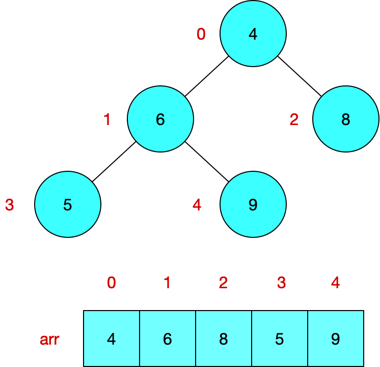
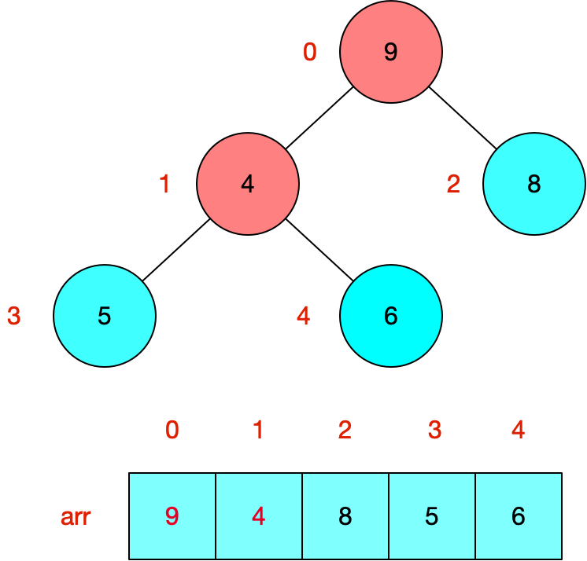
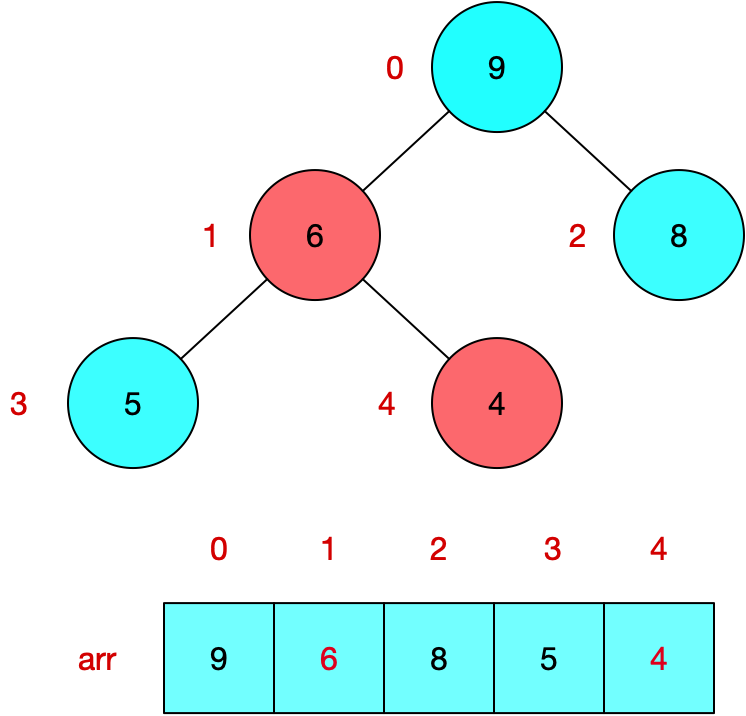
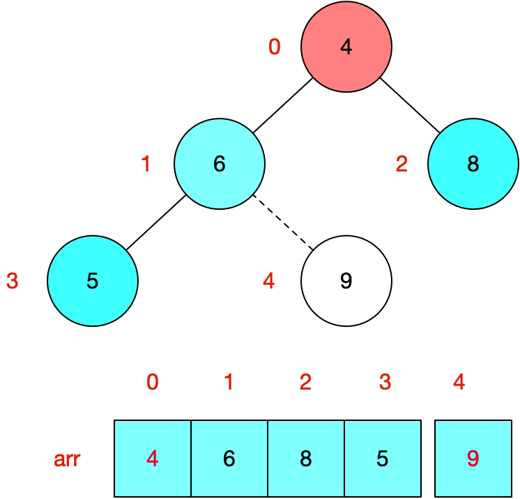
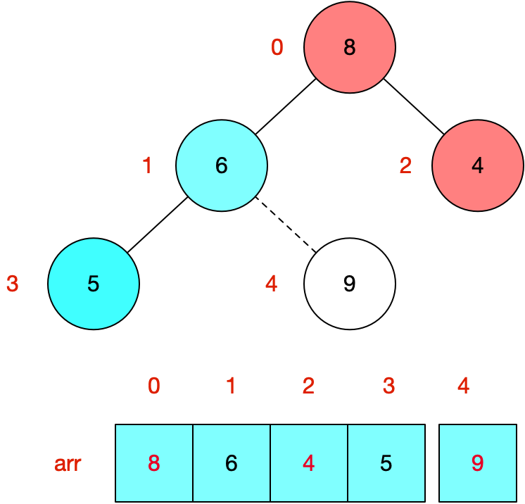
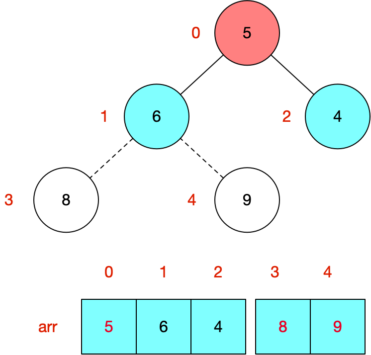
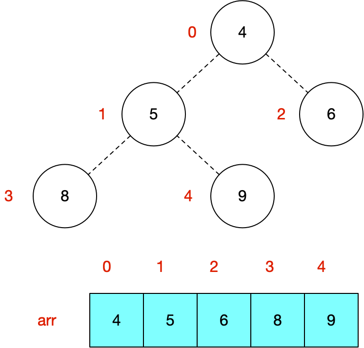

[TOC]

### 堆的定义

- 堆是一颗完全二叉树；

- 堆中某个节点的值总是不大于（或不小于）其父节点的值

其中，我们把根节点最大的堆叫做大顶堆，根节点最小的堆叫做小顶堆。

### 堆的存储结构

数组

### 堆调整

堆调整又名heapify，以大顶堆为例，大顶堆的堆调整即将左右子树中较大者的值与父节点的值对换，递归进行该过程,使得当前树满足`arr[i] >= arr[2i+1] && arr[i] >= arr[2i+2]`

### 步骤

#### 构造堆

1. 给定如下无序数组



2. 此时我们从最后一个非叶子结点开始（arr.length/2-1=5/2-1=1），从左至右，从下至上进行调整。


3. 找到第二个非叶节点4，由于[4,9,8]中9元素最大，4和9交换。




4. 这时，交换导致了子树[4,5,6]结构混乱，继续调整，[4,5,6]中6最大，交换4和6。




#### 堆调整

将堆顶元素与末尾元素交换，并对新的堆顶元素进行堆调整

1. 将堆顶元素9和末尾元素4进行交换



2. 从堆顶开始重新heapify，使其继续满足堆定义



3. 再将堆顶元素8与末尾元素5进行交换，得到第二大元素8.



4. 后续过程，继续进行调整，交换，如此反复进行，最终使得整个序列有序



#### 代码

```java
//Java 代码实现
public class HeapSort{

    public int[] sort(int[] sourceArray) throws Exception {
        // 对arr进行拷贝，不改变参数内容
        int[] arr = Arrays.copyOf(sourceArray, sourceArray.length);
        int len = arr.length;
        buildMaxHeap(arr, len);
		    // 最大值拿出来，放到堆的最后一位，然后对长度为len-1的堆重新heapify
        for (int i = len - 1; i > 0; i--) {
            // 思考1：此处为什么不需要再走一次buildMaxHeap？
            swap(arr, 0, i);
            len--;
            heapify(arr, 0, len);
        }
        return arr;
    }
	// 从最后一个叶子节点的父亲节点开始，往前遍历所有节点，并针对每个节点进行heapify
  // 思考2：为什么要有这一步？是否可以从i=0进行heapify操作以取代这一步遍历操作？
    private void buildMaxHeap(int[] arr, int len) {
        for (int i = (int) Math.floor(len / 2)-1; i >= 0; i--) {
            heapify(arr, i, len);
        }
    }
	//heapify：将左右子树中较大者的值与父节点的值对换，递归进行该过程,使得子节点永远小于父节点
    private void heapify(int[] arr, int i, int len) {
        int left = 2 * i + 1;
        int right = 2 * i + 2;
        int largest = i;

        if (left < len && arr[left] > arr[largest]) {
            largest = left;
        }

        if (right < len && arr[right] > arr[largest]) {
            largest = right;
        }
				// 基线条件：largest == i
        if (largest != i) {
            swap(arr, i, largest);
            //递归条件：因arr[largest]和arr[i]的值进行了对调，无法判断arr[largest]上的当前值是否比子树的值要大，因此要进行递归对比
            heapify(arr, largest, len);
        }
    }

    private void swap(int[] arr, int i, int j) {
        int temp = arr[i];
        arr[i] = arr[j];
        arr[j] = temp;
    }

}
```

### 面试题

如何在10亿数中找出前1000大的数？

#### 思路

10亿个数无法在有限的内存中进行存储，因此内存中只能存放有限的数据。我们考虑在内存中维护一个1000个数的数组，并构建小顶堆。从文件中一次读取剩余元素，分别于小顶堆的堆顶元素进行对比，如果小于堆顶元素，则丢弃；如果大于堆顶元素，则赋值给堆顶元素，并从堆顶开始进行重新heapify。
假设是从N个数据中找出前M大的数，一次heapify的时间复杂度为`logM`，则整个计算过程的时间复杂度是`NlogM`

#### 代码

```java
public class Heapsort {
    private void heapify(int[] arr, int i, int len) {
        int left = 2 * i + 1;
        int right = 2 * i + 2;
        int smallest = i;

        if (left < len && arr[left] < arr[smallest]) {
            smallest = left;
        }

        if (right < len && arr[right] < arr[smallest]) {
            smallest = right;
        }

        if (smallest != i) {
            swap(arr, i, smallest);
            heapify(arr, smallest, len);
        }
    }

    private void swap(int[] arr, int i, int j) {
        int temp = arr[i];
        arr[i] = arr[j];
        arr[j] = temp;
    }

    private void buildMinHeap(int[] arr, int len) {
        for (int i = (int) Math.floor(len / 2)-1; i >= 0; i--) {
            heapify(arr, i, len);
        }
    }

    // 寻找topN，该方法改变data，将topN排到最前面
    public void findTopN(int n, int[] data) {
        // 先构建n个数的小顶堆
        buildMinHeap(data, n);
        // n往后的数进行调整
        for (int j=n; j<data.length; j++){
            if (data[j] < data[0])
                continue;
            swap(data, j, 0);
            heapify(data, 0, n);
        }
    }

    // 打印数组
    public void print(int[] data) {
        for (int i = 0; i < data.length; i++) {
            System.out.print(data[i] + " ");
        }
        System.out.println();
    }


    public static void main(String[] args) {
        Heapsort topN = new Heapsort();
        int[] arr = new int[]{56, 30, 71, 18, 29, 93, 44, 75, 20, 65, 68, 34};
        System.out.println("原数组：");
        topN.print(arr);
        topN.findTopN(5, arr);
        System.out.println("调整后数组：");
        topN.print(arr);
    }
}
```

> 参考：
> https://www.cnblogs.com/chengxiao/p/6129630.html
> https://mp.weixin.qq.com/s/d2-cW4DAHFBeMOf_DbvgMQ