本文介绍Java开发中常见的创造类设计模式。

### 创造类

#### 单例模式

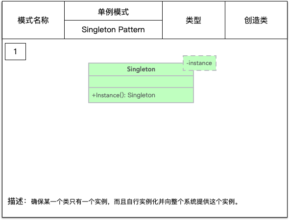

一个类在整个系统中只有一个实例，而且这个实例是在类的内部通过一个 private 构造方法构造的，外部不能调用其构造方法，只能获取它的实例。
在内存中只有一个实例对象，节省内存空间，避免重复的创建和销毁对象，可以提高性能，避免对资源的重复占用，可以全局访问。 

- 在哪里用到单例了？
1. Windows 的 Task Manger 任务管理器和 Recycle Bin 回收站。
2. 网站的计数器，否则难以同步。
3. 应用程序的日志应用，一般是由于共享的日志文件一直处于打开状态，只能由一个实例去操作，否则不好追加。
4. Web应用的配置对象的读取，因为配置文件是共享的资源。
5. 数据库连接池设计，在连接池中维护一些数据库连接，避免频繁的实例化和销毁数据库连接，并使用单例连接池对池中的数据库连接进行统一控制。
6. 多线程的线程池设计，在线程池中开启一些线程，避免频繁的创建和销毁线程，并使用单例线程池对池中的线程进行统一控制。
7. 系统需要提供一个唯一的序列号生成器

- 为什么要用单例？
1. 资源共享的情况下，避免由于资源操作导致的性能损耗或操作混乱等。如上述中的日志文件、应用配置。
2. 控制资源的情况下，方便资源间的互相通信，也便于统一控制。如上述的线程池。

- 实现单例模式的思路？
1. 构造私有
2. 以静态方法返回实例
3. 确保对类只进行一次实例化

下面介绍下几种常用的单例模式实现方式：饿汉模式、懒汉模式、双重检测、静态内部类、枚举。

##### 饿汉模式

也叫立即加载，在类初始化时，自行实例化。在类创建的同时就已经创建好一个静态的对象供系统使用，以后就不再改变，所以天生是线程安全的。
```java
public class Singleton{
    private static Singleton instance = new Singleton();
    private Singleton(){}
    public static Singleton getInstance(){
        return instance;
    }
}
```

饿汉模式还有一种变种写法，在 static 中初始化 instance ，也是在本类初始化即实例化 instance。
```java
public class Singleton{
    private static Singleton instance;
    static {
        instance = new Singleton();
    }
    private Singleton(){}
    public static Singleton getInstance(){
        return instance;
    }
}
```

##### 懒汉模式

也叫延迟加载，在第一次调用时实例化。
```java
public class Singleton{
    private static Singleton instance = null;
    private Singleton(){}
    public static Singleton getInstance(){
        if(null == instance){
            instance = new Singleton();
        }
        return instance;
    }
}
```
懒汉模式是线程不安全的，如果多个线程同时访问 Singleton.getInstance() 方法，可能会因为并发问题导致类被实例化多次，
所以懒汉模式需要加上锁 synchronized 来控制类只允许被实例化一次。

- 在方法上声明 synchronized 关键字
```java
public class Singleton{
    private static Singleton instance = null;
    private Singleton(){}
    public static synchronized Singleton getInstance(){
        if(null == instance){
            instance = new Singleton();
        }
        return instance;
    }
}
```

- 同步代码块
```java
public class Singleton{
    private static Singleton instance = null;
    private Singleton(){}
    public static Singleton getInstance(){
        synchronized(Singleton.class){
            if(null == instance){
                instance = new Singleton();
            }
            return instance;
        }
    }
}
```

这两种同步方法，都能解决多线程下并发创建实例类的问题，但是每次调用 Singleton.getInstance() 都要进入同步方法，即使 instance 已经被实例化了，
这会让线程阻塞时间过长，导致性能低下，不推荐使用。
可以选择其他方式来解决，如双重检测、静态内部类、枚举，下面一一介绍。


##### 双重检测

即 Double-Check Locking，加锁操作只针对实例化那部分，只有当 instance 没有被实例化时，才需要进行加锁。这也是我们常强调的要尽量缩小代码的加锁范围。

```java
public class Singleton {
    // 私有单例对象
    private static volatile Singleton instance = null;
    // 私有构造
    private Singleton(){}
    // 静态工厂
    public static Singleton getInstance() {
        if (instance == null) { // Single Checked
            synchronized (Singleton.class) { // 同步锁
                if (instance == null) { // Double checked
                    instance = new Singleton();
                }
 
            }
        }
        return instance;
    }
}
```
- Single Checked 是判断 instance 有没有被实例化，如果已经实例化就直接返回，否则就对实例化语句加锁，接着进行实例化操作。
- Double Checked 这一次 if(instance == null) 判断也是必须的，因为 getInstance() 是允许并发的，instance 可能已经在其他线程中完成初始化了。
- volatile 关键字修饰 instance 也是必要的，避免 JVM 的指令重排。
  `instance = new Singleton(); `这步其实分3步执行：
  1. 为 instance 分配内存空间
  2. 初始化 instance
  3. 将 instance 指向分配的内存地址
  但是由于 JVM 具有指令重排的特性，执行顺序有可能变成 1->3->2。指令重排在单线程环境下不会出现问题，但是在多线程环境下会导致一个线程获得还没有初始化的实例。
  例如，线程 T1 执行了 1和3 步骤，此时线程 T2 调用 Singleton.getInstance() 方法后发现 instance 不为空，直接返回了 instance ，但此时 instance
  还没有被初始化。
  使用 volatile 关键字，使得上面3个步骤的执行顺序必须是 1->2->3。
  

##### 静态内部类

当 Singleton 类加载时，静态内部类 SingletonHolder 还没有被加载进内存，因为 SingletonHolder 类还没有被显示调用。
只有当调用 Singleton.getInstance() 方法从而触发 SingletonHolder.instance 
时 SingletonHolder 才会被加载，此时才初始化 instance 实例。利用 classloader 的加载机制来实现懒加载，并保证构建单例的线程安全。

```java
public class Singleton implements Serializable {
    private static class SingletonHolder{
        public static final Singleton instance = new Singleton();
    }
    private Singleton(){}
    public static Singleton getInstance(){
        return SingletonHolder.instance;
    }
}
```
这种方式不仅具有延迟初始化的好处，而且由 JVM 提供了对线程安全的支持。

但是，私有化构造器并不保险，无法防止反射机制的漏洞，从而无法保证对象的唯一性，静态内部类实现方式也是一样。
在上面的 Singleton 添加如下 main 方法：
```java
public class Client {
    public static void main(String[] args) throws Exception {
        // 获得构造器
        Constructor constructor = HolderSingleton.class.getDeclaredConstructor();
        // 设置为可访问
        constructor.setAccessible(true);

        // 构造两个不同的对象
        HolderSingleton holderSingleton1 = (HolderSingleton)constructor.newInstance();
        HolderSingleton holderSingleton2 = (HolderSingleton)constructor.newInstance();

        // 验证是否是不同的对象
        System.out.println(holderSingleton1);
        System.out.println(holderSingleton2);
        System.out.println(holderSingleton1.equals(holderSingleton2));
    }
}
```
运行结果如下：
```txt
com.jdk.learning.designpattern.singleton.Singleton@78308db1
com.jdk.learning.designpattern.singleton.Singleton@27c170f0
false
```
结果很明显，通过反射，竟然给所谓的单例创建出了一个新的实例对象，创建了两个 Singleton 实例。
解决办法：在构造函数第二次被调用的时候抛出异常，枚举类就是这样做的。

再看下序列化和反序列化会不会有问题：
```java
public class Client {
    public static void main(String[] args) throws Exception {
        HolderSingleton holderSingleton = HolderSingleton.getInstance();
        byte[] serialize = SerializationUtils.serialize(holderSingleton);
        Object deserialize = SerializationUtils.deserialize(serialize);
    
        System.out.println(holderSingleton);
        System.out.println(deserialize);
        System.out.println(holderSingleton == deserialize);
    }
}
```
运行结果如下：
```txt
com.jdk.learning.designpattern.singleton.Singleton@28a418fc
com.jdk.learning.designpattern.singleton.Singleton@6f539caf
false
```
可以看出，序列化前后两个对象并不相等，所以它序列化也不是安全的。

##### 枚举

使用枚举实现单例极其的简单：

```java
public enum Singleton{
    INSTANCE;
    Singleton(){}
}
```

首先看看是否防御反射攻击：
```java
public class Client{
    public static void main(String[] args) throws Exception {
        EnumSingleton enumSingleton = EnumSingleton.INSTANCE;

        Constructor<EnumSingleton> constructor = EnumSingleton.class.getDeclaredConstructor();
        constructor.setAccessible(true);
        EnumSingleton enumSingletonReflection = constructor.newInstance("testInstance", 1);

        System.out.println(enumSingleton);
        System.out.println(enumSingletonReflection);
        System.out.println(enumSingleton == enumSingletonReflection);
    }
}
```

运行结果如下：
```txt
Exception in thread "main" java.lang.IllegalArgumentException: Cannot reflectively create enum objects
	at java.lang.reflect.Constructor.newInstance(Constructor.java:417)
	at com.jdk.learning.designpattern.singleton.EnumSingleton.main(EnumSingleton.java:25)
```

定位到 Constructor 的417行：反射在通过newInstance创建对象时，会检查该类**是否ENUM修饰**，如果是则抛出异常，反射失败，因此枚举类型对反射是绝对安全的。
```java
public final class Constructor<T> extends Executable {
	
    public T newInstance(Object ... initargs) throws InstantiationException, IllegalAccessException,
     IllegalArgumentException, InvocationTargetException {
		
        if ((clazz.getModifiers() & Modifier.ENUM) != 0)
            throw new IllegalArgumentException("Cannot reflectively create enum objects");	
	}
}
```

再看下序列化和反序列化会不会有问题：
```java
public class Client{
    public static void main(String[] args) {
        EnumSingleton enumSingleton = EnumSingleton.INSTANCE;
        byte[] serialize = SerializationUtils.serialize(enumSingleton);
        Object deserialize = SerializationUtils.deserialize(serialize);
    
        System.out.println(enumSingleton == deserialize);
    }
}
```

运行结果如下：
```txt
true
```
因此，枚举类型对序列化、反序列也是安全的。


#### 简单工厂模式

和名字一样简单，通常是一个工厂类，里面有一个静态方法，我们根据不同的参数，返回派生自同一个父类（或实现同一接口）的实例对象。
我们强调单一原则，一个类只提供一种功能，ProductFactory 的功能就是只负责生产各种 Product 。

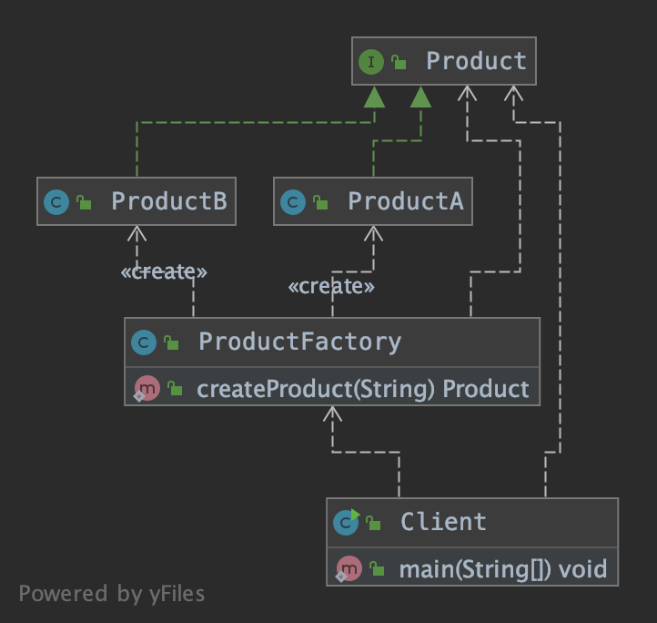

```java
public class ProductFactory {

    public static Product createProduct(String name) {
        if ("A".equals(name)) {
            return new ProductA();
        } else if ("B".equals(name)) {
            return new ProductB();
        } else {
            return null;
        }
    }
}
```

#### 工厂方法模式

之所以要引入工厂方法模式，是因为我们往往需要使用两个及以上的工厂。

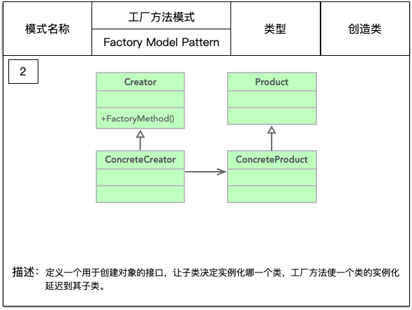

- Product：抽象产品
```java
public abstract class Product {
    public abstract void use();
}
```
- ConcreteProduct：具体产品
```java
public class ConcreteProduct extends Product {
    
    @Override
    public void use(){
        // 具体产品的用途
    }
}
```
- Creator：抽象工厂
```java
public abstract class Creator {
    public abstract <T extends Product> T createProduct(Class<T> tClass);
}
```
- ConcreteCreator：具体工厂
```java
public class ConcreteCreator extends Creator {
    public  <T extends Product> T createProduct(Class<T> tClass){
        Product product = null;
        try{
            product = (Product) Class.forName(tClass.getName()).newInstance();
        } catch (Exception e){
            
        }
        return (T)product;
    }
}
```

- Client：场景类
```java
public class Client {
    public static void main(String[] args){
        Creator creator = new ConcreteCreator();
        Product product = creator.createProduct(ConcreteProduct.class);
        
        // 继续业务处理
    }
}
```

##### 实例-日志记录器

系统的日志记录器要求支持多种日志记录方式，如文件记录、数据库记录等，不同记录方式创建 Log 文件的形式不同，对应的 Log 写入方法也不同。
下面使用工厂方法模式设计该系统：

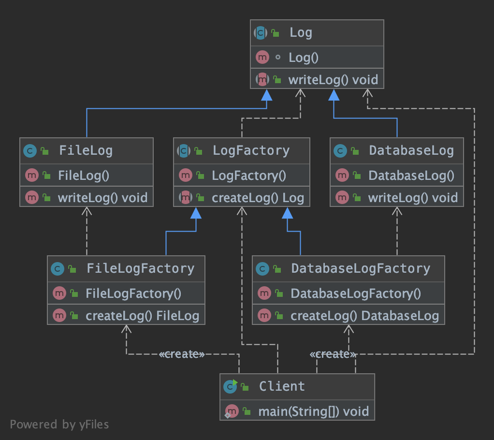

- LogFactory：创建 Log 文件的抽象工厂
- Log：定义日志记录写入方法的 Log 抽象类
- FileLogFactory：创建 FileLog 的具体工厂
- FileLog：文件日志记录的写入方法
- DatabaseLogFactory：创建 DatabaseLog 的具体工厂
- DatabaseLog：数据库日志记录的写入方法
- Client：调用类
```java
public class Client {
    public static void main(String[] args) {
        // 第一步，选取合适的工厂
        LogFactory databaseLogFactory = new DatabaseLogFactory();
        // 第二步，基本上和简单工厂一致了
        Log databaseLog = databaseLogFactory.createLog();
  
        LogFactory fileLogFactory = new FileLogFactory();
        Log fileLog = fileLogFactory.createLog();

    }
}
```

- 缺点

1. 在添加新产品时，需要编写新的具体产品类，而且还要提供与之对应的具体工厂类，系统中类的个数将成对增加。
2. 由于考虑到系统的可扩展性，需要引入抽象层，在客户端代码中均使用抽象层进行定义，增加了系统的抽象性和理解难度，
且在实现时可能需要用到DOM、反射等技术，增加了系统的实现难度。

#### 抽象工厂模式

在工厂方法模式中具体工厂负责生产具体的产品，每一个具体工厂对应一种具体产品，工厂方法也具有唯一性，一般情况下，一个具体工厂中只有一个工厂方法或者一组
重载的工厂方法。但是有时候我们需要一个工厂可以提供多个产品对象，而不是单一的产品对象。

即当涉及到产品族的时候，就需要引入抽象工厂模式了。抽象工厂模式有产品族的概念，需要从产品族的角度创建整体的工厂了，而不是根据各个组件来创建工厂，
在客户端调用时组装同一工厂生产出的产品组件。


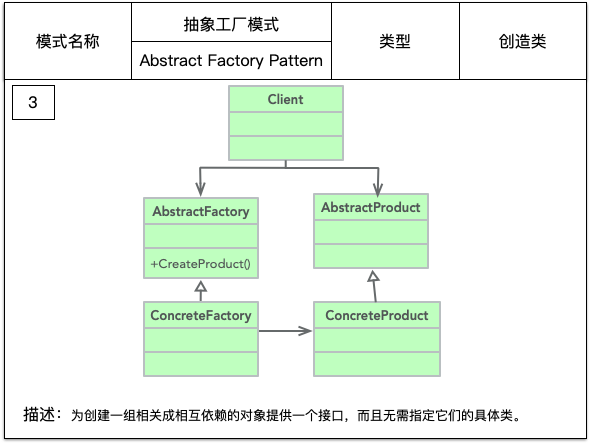

抽象工厂模式是工厂方法模式的升级版。

- AbstractFactory：抽象工厂
- ConcreteFactory：具体工厂
- AbstractProduct：抽象产品
- Product：具体产品

##### 实例-生产一台电脑


要生产一台电脑，我们先不引入抽象工厂模式，使用上述的工厂方法模式，电脑的每一个组件都对应一个工厂类，CPU 由 CPUFactory 生产，主板由 
MainBoardFactory 生产，然后再将 CPU 和 主板搭配起来组合在一起。

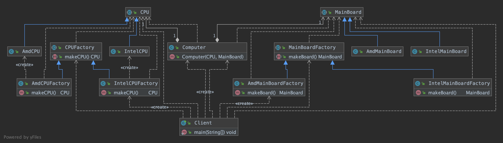

客户端调用时分别从 IntelCPUFactory 获得 IntelCPU ，从 AmdMainBoardFactory 获得 AdmMainBoard，组装成 Computer 类。
```java
public class Client {

    public static void main(String[] args) {
        // 得到 Intel 生产的 CPU
        CPUFactory intelCPUFactory = new IntelCPUFactory();
        CPU cpu = intelCPUFactory.makeCPU();

        // 得到 Amd 生产的 MainBoard
        MainBoardFactory admMainBoardFactory = new AmdMainBoardFactory();
        MainBoard mainBoard = admMainBoardFactory.makeBoard();

        // 组装 CPU 和 MainBoard
        Computer computer = new Computer(cpu,mainBoard);

    }
}
```

单独看 CPUFactory 和 MainBoardFactory ，就是前面我们说的工厂模式。这种方式容易扩展，比如要给电脑加硬盘的话，
只需要相应增加一个 HardDiskFactory、HardDisk 和相应的实现即可，不需要修改现有的工厂。

但是，这种方式有一个问题，就是如果 Intel 家的 CPU 和 AMD 家的 MainBoard 不能兼容，那么电脑就不能正常使用了，体现在代码层面就是会报错，因为客户端
并不知道它们不兼容，随意组合可能会出现问题。也就是电脑是有产品族的概念的，如这里的 CPU、MainBoard、HardDisk 等就是一个产品族，
每个厂家都有自己的一套实现规范，不可能适配所有厂家的。
因此，当涉及到这种产品族的时候，就需要抽象工厂模式来支持了。我们不再单独定义 CPUFactory、MainBoardFactory、HardDiskFactory 等，我们直接根据
厂家来定义电脑工厂，每个厂商负责生产所有的设备，这样能保证肯定不存在兼容性问题。

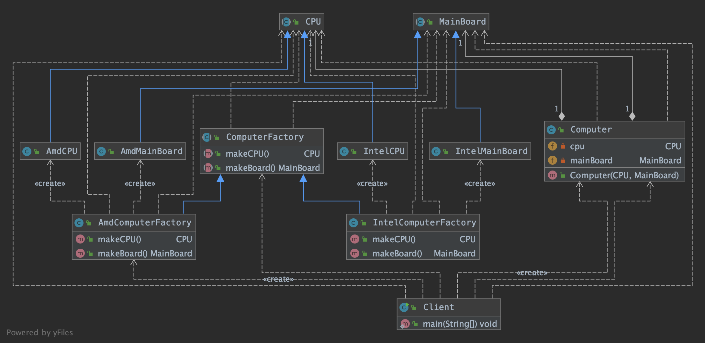

```java
public class Client {

    public static void main(String[] args) {
        // 选择特定的 AmdComputerFactory
        ComputerFactory computerFactory = new AmdComputerFactory();

        // AmdComputerFactory 生产 CPU 和 MainBoard
        CPU cpu = computerFactory.makeCPU();
        MainBoard mainBoard = computerFactory.makeBoard();

        // 用 AmdComputerFactory 生产出来的 CPU 和 MainBoard 来组装一台 Computer
        Computer computer = new Computer(cpu, mainBoard);
    }
}
```

- 缺点

抽象工厂的问题也是显而易见的，比如我们要加个显示器，就需要修改所有的工厂类，给所有的工厂都加上制造显示器的方法。违背了开闭原则。


#### 建造者模式

在代码中经常碰见的 xxxBuilder，通常都是建造者模式的产物。
通常用来对一个类连续设置属性：
```
Product product = new Product().a().b.().c();
```


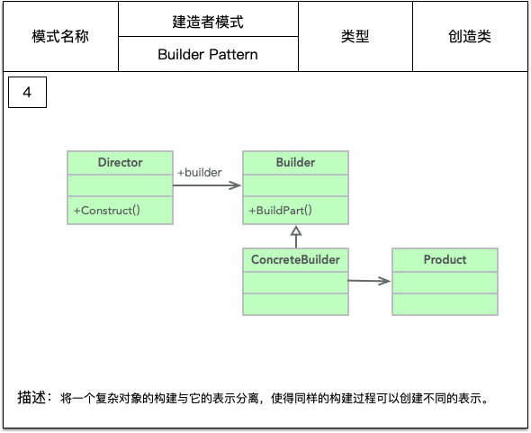

- Product：具体产品
```java
public class Product {
    public void doSomething() {

    }
}
```

- Builder：抽象构造者
```java
public abstract class Builder {

    /**
     * 设置产品零部件
     */
    public abstract void setPart();

    /**
     * 组件一个产品
     * @return Product
     */
    public abstract Product buildProduct();

}
```
- ConcreteBuilder：具体构造者
```java
public class ConcreteBuilder extends Builder {

    private Product product = new Product();

    @Override
    public void setPart() {

    }

    @Override
    public Product buildProduct() {
        return product;
    }
}
```

- Director：导演类
```java
public class Director {

    private Builder builder = new ConcreteBuilder();

    public Product getProduct() {
        builder.setPart();
        return builder.buildProduct();
    }
}
```

##### 实例-Java类属性的连续设置

以下是一个中规中矩的建造者模式，核心是先把所有的属性都设置给 Builder，然后链式的调用一些方法，最后调用一次 build() 方法，将这些属性复制给实际产生的对象。
```java
public class User {
    private String name;
    private String password;
    private String nickName;
    private int age;

    private User(String name, String password, String nickName, int age) {
        this.name = name;
        this.password = password;
        this.nickName = nickName;
        this.age = age;
    }

    // 非必需
    public static UserBuilder builder() {
        return new UserBuilder();
    }

    public static class UserBuilder {
        private String name;
        private String password;
        private String nickName;
        private int age;

        private UserBuilder() {}

        public UserBuilder name(String name) {
            this.name = name;
            return this;
        }

        public UserBuilder password(String password) {
            this.password = password;
            return this;
        }

        public UserBuilder nickName(String nickName) {
            this.nickName = nickName;
            return this;
        }

        public UserBuilder age(int age) {
            this.age = age;
            return this;
        }

        User build() {
            if (name == null || password == null) {
                throw new RuntimeException("用户名和密码必填");
            }
            if (age <= 0 || age >= 150) {
                throw new RuntimeException("年龄不合法");
            }
            // 还可以做赋予”默认值“的功能
            if (nickName == null) {
                nickName = name;
            }
            return new User(name, password, nickName, age);
        }
    }
}
```

调用如下：
```java
public class Client {
    public static void main(String[] args) {
        User user = User.builder()
                .name("foo")
                .password("123456")
                .nickName("lucky")
                .age(25)
                .build();
    }
}
```

或者换一种更简易的写法，类中的 getter 方法不变，所有的 setter 方法都让其 `return this;` 就可以了。
```java
public class User {
    private String name;
    private String password;
    private String nickName;
    private int age;

    public User name(String name) {
        this.name = name;
        return this;
    }

    public User password(String password) {
        this.password = password;
        return this;
    }


    public User nickName(String nickName) {
        this.nickName = nickName;
        return this;
    }

    public User age(int age) {
        this.age = age;
        return this;
    }
}
```

简易写法的调用如下：
```java
public class Client {
    public static void main(String[] args) {
        User1 user = new User()
                .name("foo")
                .password("123456")
                .nickName("lucky")
                .age(25);
    }
}
```

或者建议大家直接使用 lombok，代码会更加简洁：
```java
@Builder
class User {
    private String  name;
    private String password;
    private String nickName;
    private int age;
}
```

#### 原型模式

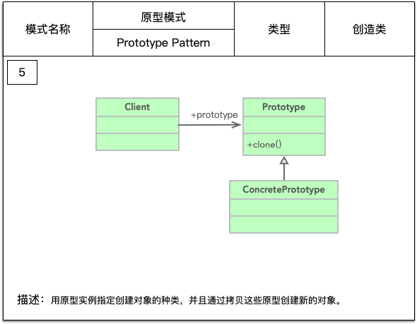

原型模式的核心是一个 clone 方法，通过该方法进行对象的拷贝。
实现 Cloneable 接口，重写 Object.clone() 方法，就完成了原型模式：
```java
public class PrototypeClass implements Cloneable {
    
    @Override
    public PrototypeClass clone() {
        PrototypeClass prototypeClass = null;
        try {
            prototypeClass = (PrototypeClass) super.clone();
        } catch (CloneNotSupportedException e) {
        }
        return prototypeClass;
    }
}
```
原型模式是在内存二进制流的拷贝，要比直接 new 一个对象性能好很多。构造函数是不会执行的。
在实际的项目中，原型模式很少单独出现，一般是和工厂方法模式一起出现，通过 clone 方法创建一个对象，然后由工厂方法提供给调用者。

原型模式的使用场景：
- 资源优化场景
类初始化需要消耗非常多的资源，包括数据、硬件资源等。
- 有性能和安全要求的场景
通过 new 产生一个对象需要非常繁琐的数据准备或访问权限。


#### 迭代器模式

简单来说，迭代器就类似数据库中的游标，可以在一个容器内上下翻滚，遍历所有需要查看的元素。

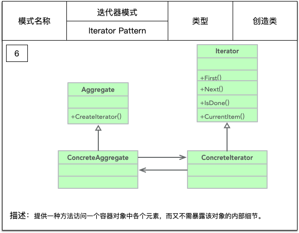

- Iterator：抽象迭代器
负责定义访问和遍历元素的接口，基本会有以下几个方法： first()、next()、isDone() 或 hasNext()、remove()。
```java
public interface Iterator {
    /**
     * 遍历到下一个元素
     */
    Object next();

    /**
     * 是否已经遍历到尾部
     */
    boolean hasNext();

    /**
     * 是否删除当前指向的元素
     */
    boolean remove();
}
```

- ConcreteIterator：具体迭代器
```java
public class ConcreteIterator implements Iterator {

    private Vector vector = new Vector();
    private int cursor = 0;

    public ConcreteIterator(Vector vector) {
        this.vector = vector;
    }

    @Override
    public Object next() {
        Object result = null;
        if (this.hasNext()) {
            result = this.vector.get(this.cursor++);
        }
        return result;
    }

    @Override
    public boolean hasNext() {
        if (this.cursor == this.vector.size()) {
            return false;
        } else {
            return true;
        }
    }

    @Override
    public boolean remove() {
        this.vector.remove(this.cursor);
        return true;
    }
}
```

- Aggregate：抽象容器
```java
public interface Aggregate {

    /**
     * 添加元素
     */
    void add(Object object);

    /**
     * 减少元素
     */
    void remove(Object object);

    /**
     * 由迭代器来遍历操作所有元素
     */
    Iterator iterator();
}
```

- ConcreteAggregate：具体容器
```java
public class ConcreteAggregate implements Aggregate {

    private Vector vector = new Vector();

    @Override
    public void add(Object object) {
        vector.add(object);
    }

    @Override
    public void remove(Object object) {
        vector.remove(object);
    }

    @Override
    public Iterator iterator() {
        return new ConcreteIterator(vector);
    }
}
```

调用方法如下：
```java
public class Client {

    public static void main(String[] args) {
        Aggregate aggregate = new ConcreteAggregate();
        aggregate.add("abc");
        aggregate.add("1234");

        Iterator iterator = aggregate.iterator();
        while (iterator.hasNext()) {
            System.out.println(iterator.next());
        }
    }
}
```

尽量不要自己写迭代器模式，Java 提供的 Iterator 一般都能满足要求。

我们看下 java.util.Iterator 的直接实现子接口是 Collection ，List、Set、Queue 接口继承了 Collection ，并有丰富的实现子类。
所以说 Java 提供了丰富多样的集合，并且已经把迭代器模式融入到集合操作 API 中了，我们可以轻松便捷的使用。
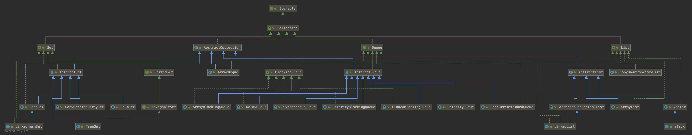

下面我们看下 Iterable 接口和 Iterator 接口的关系：
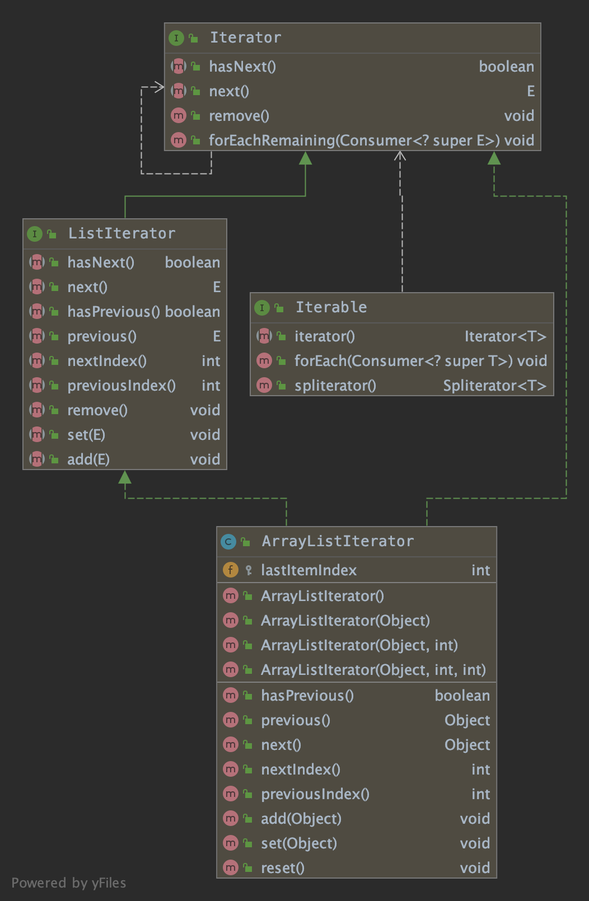

Iterable 接口只是返回了 Iterator 接口的一个实例，为什么不把两个接口合二为一，直接在 Iterable 接口中定义 hasNext()、next() 等方法呢？

原因是实现了 Iterable 接口的实现类可以再实现多个 Iterator 内部类。
例如 LinkedList 中的 ListItr 和 DescendingIterator 两个内部类，
就分别实现了双向遍历和逆序遍历。通过返回不同的 Iterator 实现不同的遍历方式，这样更加灵活。

```java
public class LinkedList<E>
    extends AbstractSequentialList<E>
    implements List<E>, Deque<E>, Cloneable, java.io.Serializable {
    
     public ListIterator<E> listIterator(int index) {
         checkPositionIndex(index);
         return new ListItr(index);
     }
    
     private class ListItr implements ListIterator<E> {
         // ...
     }
     
     public Iterator<E> descendingIterator() {
         return new DescendingIterator();
     }
     
     private class DescendingIterator implements Iterator<E> {
         private final ListItr itr = new ListItr(size());
         public boolean hasNext() {
             return itr.hasPrevious();
         }
         public E next() {
             return itr.previous();
         }
         public void remove() {
             itr.remove();
         }
     } 
}
```


