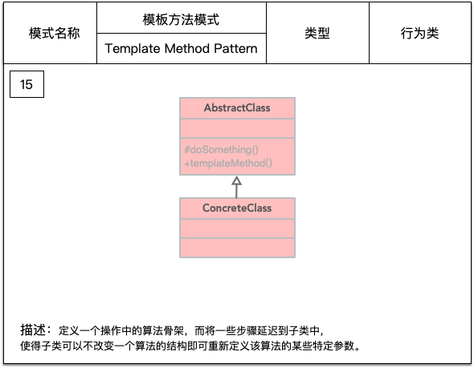

本文介绍Java开发中常见的创造类设计模式。

### 创造类

#### 单例模式

##### 定义


一个类在整个系统中只有一个实例，而且这个实例是在类的内部通过一个 private 构造方法构造的，外部不能调用其构造方法，只能获取它的实例。
在内存中只有一个实例对象，节省内存空间，避免重复的创建和销毁对象，可以提高性能，避免对资源的重复占用，可以全局访问。 

- 在哪里用到单例了？
1. Windows 的 Task Manger 任务管理器和 Recycle Bin 回收站。
2. 网站的计数器，否则难以同步。
3. 应用程序的日志应用，一般是由于共享的日志文件一直处于打开状态，只能由一个实例去操作，否则不好追加。
4. Web应用的配置对象的读取，因为配置文件是共享的资源。
5. 数据库连接池设计，在连接池中维护一些数据库连接，避免频繁的实例化和销毁数据库连接，并使用单例连接池对池中的数据库连接进行统一控制。
6. 多线程的线程池设计，在线程池中开启一些线程，避免频繁的创建和销毁线程，并使用单例线程池对池中的线程进行统一控制。
7. 系统需要提供一个唯一的序列号生成器

- 为什么要用单例？
1. 资源共享的情况下，避免由于资源操作导致的性能损耗或操作混乱等。如上述中的日志文件、应用配置。
2. 控制资源的情况下，方便资源间的互相通信，也便于统一控制。如上述的线程池。

- 实现单例模式的思路？
1. 构造私有
2. 以静态方法返回实例
3. 确保对类只进行一次实例化

下面介绍下几种常用的单例模式实现方式：饿汉模式、懒汉模式、双重检测、静态内部类、枚举。

##### 饿汉模式

也叫立即加载，在类初始化时，自行实例化。在类创建的同时就已经创建好一个静态的对象供系统使用，以后就不再改变，所以天生是线程安全的。
```java
public class Singleton{
    private static Singleton instance = new Singleton();
    private Singleton(){}
    public static Singleton getInstance(){
        return instance;
    }
}
```

饿汉模式还有一种变种写法，在 static 中初始化 instance ，也是在本类初始化即实例化 instance。
```java
public class Singleton{
    private static Singleton instance;
    static {
        instance = new Singleton();
    }
    private Singleton(){}
    public static Singleton getInstance(){
        return instance;
    }
}
```

##### 懒汉模式

也叫延迟加载，在第一次调用时实例化。
```java
public class Singleton{
    private static Singleton instance = null;
    private Singleton(){}
    public static Singleton getInstance(){
        if(null == instance){
            instance = new Singleton();
        }
        return instance;
    }
}
```
懒汉模式是线程不安全的，如果多个线程同时访问 Singleton.getInstance() 方法，可能会因为并发问题导致类被实例化多次，
所以懒汉模式需要加上锁 synchronized 来控制类只允许被实例化一次。

- 在方法上声明 synchronized 关键字
```java
public class Singleton{
    private static Singleton instance = null;
    private Singleton(){}
    public static synchronized Singleton getInstance(){
        if(null == instance){
            instance = new Singleton();
        }
        return instance;
    }
}
```

- 同步代码块
```java
public class Singleton{
    private static Singleton instance = null;
    private Singleton(){}
    public static Singleton getInstance(){
        synchronized(Singleton.class){
            if(null == instance){
                instance = new Singleton();
            }
            return instance;
        }
    }
}
```

这两种同步方法，都能解决多线程下并发创建实例类的问题，但是每次调用 Singleton.getInstance() 都要进入同步方法，即使 instance 已经被实例化了，
这会让线程阻塞时间过长，导致性能低下，不推荐使用。
可以选择其他方式来解决，如双重检测、静态内部类、枚举，下面一一介绍。


##### 双重检测

即 Double-Check Locking，加锁操作只针对实例化那部分，只有当 instance 没有被实例化时，才需要进行加锁。这也是我们常强调的要尽量缩小代码的加锁范围。

```java
public class Singleton {
    // 私有单例对象
    private static volatile Singleton instance = null;
    // 私有构造
    private Singleton(){}
    // 静态工厂
    public static Singleton getInstance() {
        if (instance == null) { // Single Checked
            synchronized (Singleton.class) { // 同步锁
                if (instance == null) { // Double checked
                    instance = new Singleton();
                }
 
            }
        }
        return instance;
    }
}
```
- Single Checked 是判断 instance 有没有被实例化，如果已经实例化就直接返回，否则就对实例化语句加锁，接着进行实例化操作。
- Double Checked 这一次 if(instance == null) 判断也是必须的，因为 getInstance() 是允许并发的，instance 可能已经在其他线程中完成初始化了。
- volatile 关键字修饰 instance 也是必要的，避免 JVM 的指令重排。
  `instance = new Singleton(); `这步其实分3步执行：
  1. 为 instance 分配内存空间
  2. 初始化 instance
  3. 将 instance 指向分配的内存地址
  但是由于 JVM 具有指令重排的特性，执行顺序有可能变成 1->3->2。指令重排在单线程环境下不会出现问题，但是在多线程环境下会导致一个线程获得还没有初始化的实例。
  例如，线程 T1 执行了 1和3 步骤，此时线程 T2 调用 Singleton.getInstance() 方法后发现 instance 不为空，直接返回了 instance ，但此时 instance
  还没有被初始化。
  使用 volatile 关键字，使得上面3个步骤的执行顺序必须是 1->2->3。
  

##### 静态内部类

当 Singleton 类加载时，静态内部类 SingletonHolder 还没有被加载进内存，因为 SingletonHolder 类还没有被显示调用。
只有当调用 Singleton.getInstance() 方法从而触发 SingletonHolder.instance 
时 SingletonHolder 才会被加载，此时才初始化 instance 实例。利用 classloader 的加载机制来实现懒加载，并保证构建单例的线程安全。

```java
public class Singleton implements Serializable {
    private static class SingletonHolder{
        public static final Singleton instance = new Singleton();
    }
    private Singleton(){}
    public static Singleton getInstance(){
        return SingletonHolder.instance;
    }
}
```
这种方式不仅具有延迟初始化的好处，而且由 JVM 提供了对线程安全的支持。

但是，私有化构造器并不保险，无法防止反射机制的漏洞，从而无法保证对象的唯一性，静态内部类实现方式也是一样。
在上面的 Singleton 添加如下 main 方法：
```java
public static void main(String[] args) throws Exception {
    // 获得构造器
    Constructor constructor = HolderSingleton.class.getDeclaredConstructor();
    // 设置为可访问
    constructor.setAccessible(true);

    // 构造两个不同的对象
    HolderSingleton holderSingleton1 = (HolderSingleton)constructor.newInstance();
    HolderSingleton holderSingleton2 = (HolderSingleton)constructor.newInstance();

    // 验证是否是不同的对象
    System.out.println(holderSingleton1);
    System.out.println(holderSingleton2);
    System.out.println(holderSingleton1.equals(holderSingleton2));
}
```
运行结果如下：
```txt
com.jdk.learning.designpattern.singleton.Singleton@78308db1
com.jdk.learning.designpattern.singleton.Singleton@27c170f0
false
```
结果很明显，通过反射，竟然给所谓的单例创建出了一个新的实例对象，创建了两个 Singleton 实例。
解决办法：在构造函数第二次被调用的时候抛出异常，枚举类就是这样做的。

再看下序列化和反序列化会不会有问题：
```java
public static void main(String[] args) throws Exception {
    HolderSingleton holderSingleton = HolderSingleton.getInstance();
    byte[] serialize = SerializationUtils.serialize(holderSingleton);
    Object deserialize = SerializationUtils.deserialize(serialize);
    
    System.out.println(holderSingleton);
    System.out.println(deserialize);
    System.out.println(holderSingleton == deserialize);
}
```
运行结果如下：
```txt
com.jdk.learning.designpattern.singleton.Singleton@28a418fc
com.jdk.learning.designpattern.singleton.Singleton@6f539caf
false
```
可以看出，序列化前后两个对象并不相等，所以它序列化也不是安全的。

##### 枚举

使用枚举实现单例极其的简单：

```java
public enum Singleton{
    INSTANCE;
    Singleton(){}
}
```

首先看看是否防御反射攻击：
```java
public static void main(String[] args) throws Exception {
    EnumSingleton enumSingleton = EnumSingleton.INSTANCE;

    Constructor<EnumSingleton> constructor = EnumSingleton.class.getDeclaredConstructor();
    constructor.setAccessible(true);
    EnumSingleton enumSingletonReflection = constructor.newInstance("testInstance", 1);

    System.out.println(enumSingleton);
    System.out.println(enumSingletonReflection);
    System.out.println(enumSingleton == enumSingletonReflection);
}
```

运行结果如下：
```txt
Exception in thread "main" java.lang.IllegalArgumentException: Cannot reflectively create enum objects
	at java.lang.reflect.Constructor.newInstance(Constructor.java:417)
	at com.jdk.learning.designpattern.singleton.EnumSingleton.main(EnumSingleton.java:25)
```

定位到 Constructor 的417行：反射在通过newInstance创建对象时，会检查该类**是否ENUM修饰**，如果是则抛出异常，反射失败，因此枚举类型对反射是绝对安全的。
```java
public final class Constructor<T> extends Executable {
	
    public T newInstance(Object ... initargs) throws InstantiationException, IllegalAccessException,
     IllegalArgumentException, InvocationTargetException {
		
        if ((clazz.getModifiers() & Modifier.ENUM) != 0)
            throw new IllegalArgumentException("Cannot reflectively create enum objects");	
	}
}
```

再看下序列化和反序列化会不会有问题：
```java
public static void main(String[] args) throws Exception {
    EnumSingleton enumSingleton = EnumSingleton.INSTANCE;
    byte[] serialize = SerializationUtils.serialize(enumSingleton);
    Object deserialize = SerializationUtils.deserialize(serialize);
    
    System.out.println(enumSingleton == deserialize);
}
```

运行结果如下：
```txt
true
```
因此，枚举类型对序列化、反序列也是安全的。


#### 简单工厂模式


#### 工厂方法模式

##### 定义


- Product：抽象产品
```java
public abstract class Product {
    public abstract void use();
}
```
- ConcreteProduct：具体产品
```java
public class ConcreteProduct extends Product {
    
    @Override
    public void use(){
        // 具体产品的用途
    }
}
```
- Creator：抽象工厂
```java
public abstract class Creator {
    public abstract <T extends Product> T createProduct(Class<T> tClass);
}
```
- ConcreteCreator：具体工厂
```java
public class ConcreteCreator extends Creator {
    public  <T extends Product> T createProduct(Class<T> tClass){
        Product product = null;
        try{
            product = (Product) Class.forName(tClass.getName()).newInstance();
        } catch (Exception e){
            
        }
        return (T)product;
    }
}
```

- Client：场景类
```java
public class Client {
    public static void main(String[] args){
        Creator creator = new ConcreteCreator();
        Product product = creator.createProduct(ConcreteProduct.class);
        
        // 继续业务处理
    }
}
```

##### 实例-日志记录器

系统的日志记录器要求支持多种日志记录方式，如文件记录、数据库记录等，不同记录方式创建 Log 文件的形式不同，对应的 Log 写入方法也不同。
下面使用工厂方法模式设计该系统：


- LogFactory：创建 Log 文件的抽象工厂
- Log：定义日志记录写入方法的 Log 抽象类
- FileLogFactory：创建 FileLog 的具体工厂
- FileLog：文件日志记录的写入方法
- DatabaseLogFactory：创建 DatabaseLog 的具体工厂
- DatabaseLog：数据库日志记录的写入方法
- Client：调用类
```java
public class Client {
    public static void main(String[] args) {
        LogFactory databaseLogFactory = new DatabaseLogFactory();
        Log databaseLog = databaseLogFactory.createLog();
  
        LogFactory fileLogFactory = new FileLogFactory();
        Log fileLog = fileLogFactory.createLog();

    }
}
```

##### 缺点

1. 在添加新产品时，需要编写新的具体产品类，而且还要提供与之对应的具体工厂类，系统中类的个数将成对增加。
2. 由于考虑到系统的可扩展性，需要引入抽象层，在客户端代码中均使用抽象层进行定义，增加了系统的抽象性和理解难度，
且在实现时可能需要用到DOM、反射等技术，增加了系统的实现难度。

#### 抽象工厂模式

##### 定义


抽象工厂模式是工厂方法模式的升级版。

- AbstractFactory：抽象工厂
- ConcreteFactory：具体工厂
- AbstractProduct：抽象产品
- Product：具体产品


#### 模版方式模式

##### 定义




#### 建造者模式

##### 定义


#### 原型模式

##### 定义


### 迭代器模式

##### 定义


