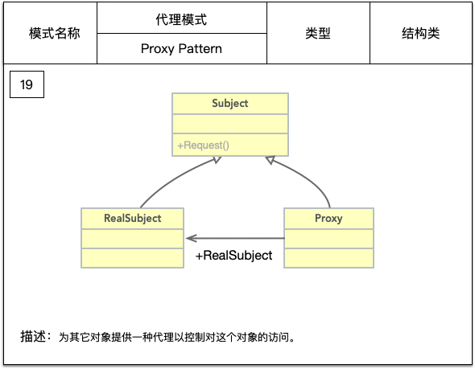
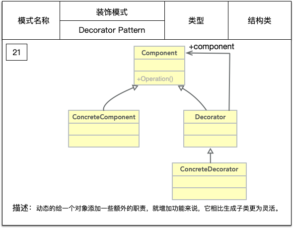
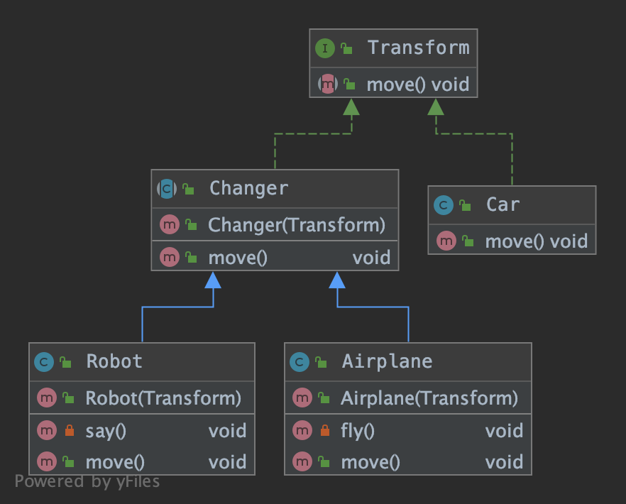
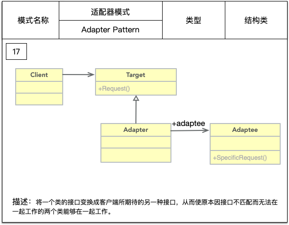
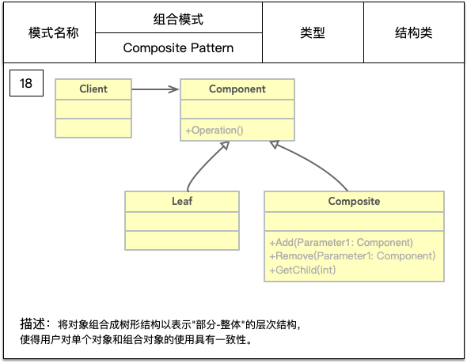
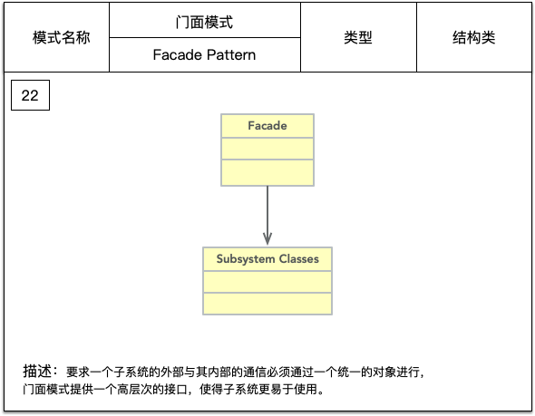
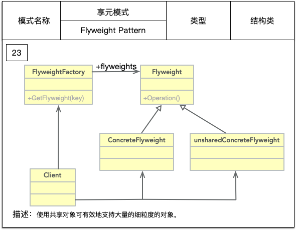
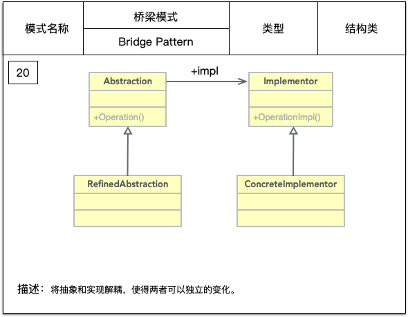

本文介绍Java开发中常见的结构类设计模式。

### 结构类

#### 代理模式

用一个代理类来隐藏真实类的实现细节，通常还用于在真实的实现前后添加一部分逻辑。



- Project：抽象主题类
```java
public interface Subject {
     void make();
}
```

- RealSubject：真实主题类
```java
public class RealSubject  implements  Subject{
    @Override
    public void make() {
     System.out.println("Core work."）;
    }
}
```

- ProxySubject：代理类
```java
public class ProxySubject implements Subject {
    private RealSubject realSubject;

    public ProxySubject(RealSubject realSubject) {
        this.realSubject = realSubject;
    }

    private void prepare() {
        System.out.println("Prepare work.");
    }

    @Override
    public void make() {
        prepare();
        this.realSubject.make();
        destory();
    }

    private void destory() {
        System.out.println("Destory work.");
    }
}
```

- Client：场景类
```java
public class Client {
    public static void main(String[] args){
        Subject subject = new ProxySubject(new RealSubject());
        subject.make();
    }
}
```

#### 装饰者模式



- Component：抽象构件，是一个接口或抽象类，定义最核心最原始的对象。
```java
public abstract class Component {
    public abstract void operate();
}
```

- ConcreteComponent：具体构件，抽象构件的实现，我们要装饰的就是它。
```java
public class ConcreteComponent extends Component {

    @Override
    public void operate() {
        System.out.println("Concrete component.");
    }
}
```

- Decorator：装饰角色，属性里必然有一个属性指向 Component 抽象构件。
```java
public abstract class Decorator extends Component {
    private Component component ;
    public Decorator(Component component){
        this.component = component;
    }

    @Override
    public void operate() {
        component.operate();
    }
}
```

- ConcreteDecorator：具体装饰角色，原始方法和装饰方法的执行顺序在具体的装饰类是固定的，可以通过方法重载实现多种执行顺序。
```java
public class ConcreteDecorator extends Decorator {

    public ConcreteDecorator(Component component) {
        super(component);
    }

    private void decorateBefore(){
        System.out.println("Decorate before.");
    }

    private void decorateAfter(){
        System.out.println("Decorate after.");
    }

    @Override
    public void operate() {
        // 装饰方法1
        decorateBefore();
        // 原始方法
        super.operate();
        // 装饰方法2
        decorateAfter();
    }

}
```

- Client：场景类
```java
public class Client {

    public static void main(String[] args) {
        // 创建具体的 Component
        Component component = new ConcreteComponent();
        // 使用具体的 Decorator 类进行装饰
        component = new ConcreteDecorator(component);
        // 装饰后执行
        component.operate();
    }
}
```
装饰模式可以动态地扩展一个实现类的功能。
装饰类和被装饰类可以独立发展，而不会互相耦合。
继承是一种耦合度较大的静态关系，无法在程序运行时动态扩展。与继承关系相比，关联关系的主要优势在于不会破坏类的封装性。
装饰模式是继承关系的一个替代方案，我们看装饰类 Decorator，不管装饰多少层，返回的对象还是 Component，实现的是 is-a 的关系，可以在不需要创造更多子类的情况下，将对象的功能加以扩展。

##### 实例-变形金刚



这里的 Transform 是一个抽象构件，Car 是一个具体构件，Changer 是一个装饰者，Robot 和 Airplane 分别对应两种具体的装饰类。
Car 经过 Robot 和 Airplane 的装饰后就具有说话和飞行的功能了。


#### 适配器模式



以下介绍的是类适配器。

- Target：目标角色
```java
public interface Target {
    /**
     * 目标角色有自己的方法
     */
    void request();
}
```

- ConcreteTarget：目标角色的实现类
```java
public class ConcreteTarget implements Target {
    @Override
    public void request() {
        System.out.println("if you need any help,pls call me!");
    }
}
```

- Adaptee：源角色
```java
public class Adaptee {
    public void specificRequest() {
        System.out.println("I'm kind of busy,leave me alone,pls!");
    }
}
```

- Adapter：适配器角色
```java
public class Adapter extends Adaptee implements Target {

    @Override
    public void request() {
        super.specificRequest();
    }
}
```

- Client：场景类
```java
public class Client {

    public static void main(String[] args){
        // 原有的业务逻辑
        Target target = new ConcreteTarget();
        target.request();

        // 增加适配器角色之后的业务逻辑
        Target target1 = new Adapter();
        target1.request();
    }
}
```

将目标类和适配者类解耦，通过引入一个适配器类来重用现有的适配者类，而无须修改原有代码。
增加了类的透明性和复用性，将具体的实现封装在适配者类中，对于客户端类来说是透明的，而且提高了适配者的复用性。
灵活性和扩展性都非常好，通过使用配置文件，可以很方便地更换适配器，也可以在不修改原有代码的基础上增加新的适配器类，完全符合“开闭原则”。

#### 组合模式

组合模式也叫合成模式，主要用来描述部分和整体的关系。



- Component：抽象构件角色，定义参加组合对象的共有方法和属性，可以定义一些默认的行为或属性。
```java
public abstract class Component {
    public void doSomething(){
        
    }
}
```

- Composite：树枝构件，组合树枝节点和叶子节点形成一个树形结构。
```java
public class Composite extends Component {
    /**
     * 构件容器
     */
    private ArrayList<Component> componentArrayList = new ArrayList<>();

    /**
     * 增加一个树枝构件或叶子构件
     */
    public void add(Component component) {
        componentArrayList.add(component);
    }

    /**
     * 删除一个树枝构件或叶子构件
     */
    public void remove(Component component) {
        componentArrayList.remove(component);
    }

    /**
     * 获得分支下所有的树枝构件和叶子构件
     */
    public ArrayList<Component> getChildren() {
        return componentArrayList;
    }
}
```

- Leaf：叶子构件，再也没有其他的分支，也就是遍历的最小节点。
```java
public class Leaf extends Component {
    @Override
    public void doSomething() {

    }
}
```

- Client：场景类，负责树状结构的构建，并递归遍历树。
```java
public class Client {

    public static void main(String[] args) {
        // 创建一个根节点
        Composite root = new Composite();
        root.doSomething();

        // 创建一个树枝构件
        Composite branch = new Composite();
        // 创建一个叶子节点
        Leaf leaf = new Leaf();

        // 构件整体
        root.add(branch);
        branch.add(leaf);
    }

    /**
     * 通过递归遍历树
     */
    public static void display(Composite root) {
        for (Component c : root.getChildren()) {
            if (c instanceof Leaf) {
                c.doSomething();
            } else {
                display((Composite) c);
            }
        }
    }
}
```

高层模块调用简单，一棵树形结构中的所有节点都是 Component ，局部和整体对调用者来说没有任何区别。
使用了组合模式，增加树枝、叶子构件都很容易，只要找到它的父节点就成，容易扩展和维护。

组合模式的使用场景：
- 维护和展示部分-整体关系的场景，尤其是这种关系还可能比较深，如树形菜单、文件和文件夹管理。
- 从一个整体中能独立出部分模块或功能的场景。


#### 门面模式



也叫外观模式。类图很简单，但是代表的意义很复杂，Subsystem Classes 是子系统所有类的简称，可能是一个类，也可能是代表几十个对象的集合。

- Subsystem Classes：子系统角色。每一个子系统都是类的集合，对于子系统而言，门面仅仅是另外一个客户端而已。
子系统A：
```java
public class SystemA {
    public void operationA(){

    }
}
```
子系统B：
```java
public class SystemB {
    public void operationB(){
        
    }
}
```
子系统C：
```java
public class SystemC {
    public void operationC(){
        
    }
}
```
- Facade：门面角色。客户端可以调用这个角色的方法，此角色知晓子系统的所有功能和责任。一般情况下，门面会将客户端发来的请求委派到相应的子系统中，也就是
该角色没有实际的业务逻辑，只是一个委托类。
```java
public class Facade {

    private SystemA systemA = new SystemA();
    private SystemB systemB = new SystemB();
    private SystemC systemC = new SystemC();

    public void wrapOperation(String request) {
        if (request.equals("A")) {
            systemA.operationA();
        } else if (request.equals("B")) {
            systemB.operationB();
        } else if (request.equals("C")) {
            systemC.operationC();
        }
    }
}
```

根据"单一职责原则"，在软件中将一个系统划分为若干个子系统有利于降低整个系统的复杂性，一个常见的设计目标是使子系统间的通信和相互依赖关系达到最小，
而达到该目标的途径之一就是引入一个门面，它为子系统的访问提供了一个简单而单一的入口。


#### 享元模式



享元模式的目的在于运用共享技术，使得一些细粒度的对象可以共享，多使用细粒度的对象，便于重用或重构。

- Flyweight：抽象享元角色
```java
public abstract class Flyweight {
    /**
     * 内部状态
     */
    private String intrinsic;
    /**
     * 外部状态
     */
    protected final String extrinsic;

    /**
     * 要求享元角色必须接受外部状态
     *
     * @param extrinsic
     */
    public Flyweight(String extrinsic) {
        this.extrinsic = extrinsic;
    }

    /**
     * 定义业务操作
     */
    public abstract void operate();

    public String getIntrinsic() {
        return intrinsic;
    }

    public void setIntrinsic() {
        this.intrinsic = intrinsic;
    }

}
```

- ConcreteFlyweight：具体享元角色
```java
public class ConcreteFlyweight extends Flyweight {
    public ConcreteFlyweight(String extrinsic) {
        super(extrinsic);
    }

    @Override
    public void operate() {
        // 根据外部状态进行逻辑处理
    }
}
```

- UnsharedConcreteFlyweight：不可共享的享元角色

- FlyweightFactory：享元工厂，提供一个用于存储享元对象的享元池，
用户需要对象时，首先从享元池中获取，如果享元池中不存在，则创建一个新的享元对象返回给用户，并在享元池中保存该新增对象。
```java
public class FlyweightFactory {
    private static HashMap<String, Flyweight> pool = new HashMap<>();

    public static Flyweight getFlyweight(String extrinsic) {
        Flyweight flyweight;
        if (pool.containsKey(extrinsic)) {
            flyweight = pool.get(extrinsic);
        } else {
            flyweight = new ConcreteFlyweight(extrinsic);
            pool.put(extrinsic, flyweight);
        }
        return flyweight;
    }
}
```

- Client：场景类
```java
public class Client {

    public static void main(String[] args) {
        Flyweight flyweight1 = FlyweightFactory.getFlyweight("one");
        Flyweight flyweight2 = FlyweightFactory.getFlyweight("one");

        System.out.println(flyweight1 == flyweight2);
    }
}
```

#### 桥梁模式



- Implementor：实现化角色，接口或抽象类，定义角色必须的行为和属性。
```java
public interface Implementor {
    void doSomething();
    void doAnything();
}
```

- ConcreteImplementor：具体实现化角色，实现接口或抽象类定义的行为和属性。
```java
public class ConcreteImplementor implements Implementor {

    @Override
    public void doSomething() {

    }

    @Override
    public void doAnything() {

    }
}
```

- Abstraction：抽象化角色，一般是抽象类，定义出该角色的行为，同时保存一个对实现化角色的引用。
```java
public abstract class Abstraction {
    // 定义对实现化角色的引用
    private Implementor impl;
    // 约束子类必须实现该构造函数
    public Abstraction(Implementor impl) {
        this.impl = impl;
    }

    public void request(){
        impl.doSomething();
    }

    public Implementor getImpl(){
        return impl;
    }
}
```

- RefinedAbstraction：修正抽象化角色，覆写父类的方法以修正父类的行为。

```java
public class RefinedAbstraction extends Abstraction {

    public RefinedAbstraction(Implementor implementor) {
        super(implementor);
    }

    @Override
    public void request() {
        super.request();
        super.getImpl().doAnything();
    }
}
```

- Client：场景类
```java
public class Client {

    public static void main(String[] args) {
        Implementor impl = new ConcreteImplementor();
        Abstraction abstraction = new RefinedAbstraction(impl);
        abstraction.request();
    }

}
```

桥梁模式只是使用了类间的聚合关系、继承、覆写等常用功能，提供一个清晰、稳定的架构。


