本文介绍Java开发中常见的行为类设计模式。

### 行为类

#### 模版方法模式

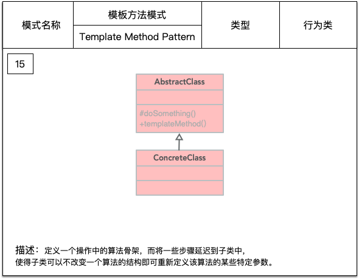

- AbstractClass：抽象模板，它的方法分为两类，基本方法和模板方法。
基本方法：是由子类实现的方法，并且在模板方法中被调用，尽量设计为 protected。
模板方法：可以有一个或几个，一般是一个具体方法，实现对基本方法的调度，完成固定的逻辑。
```java
public abstract class AbstractClass {
    /**
     * 基本方法
     */
    protected abstract void step1();
    protected abstract void step2();

    /**
     * 模板方法
     */
    public void templateMethod(){
        step1();
        step2();
    }
}
```

- ConcreteClass
```java
public class ConcreteClass extends AbstractClass {
    @Override
    protected void step1() {

    }

    @Override
    protected void step2() {

    }
}
```

- Client：场景类
```java
public class Client {

    public static void main(String[] args) {
        AbstractClass class1 = new ConcreteClass();
        class1.templateMethod();
    }
}
```

模版方法模式非常简单，仅仅是使用了 Java 的继承机制，定义一个抽象模板 AbstractClass，其中基本方法由子类实现，模板方法中定义基本方法的固定执行步骤。

#### 中介者模式

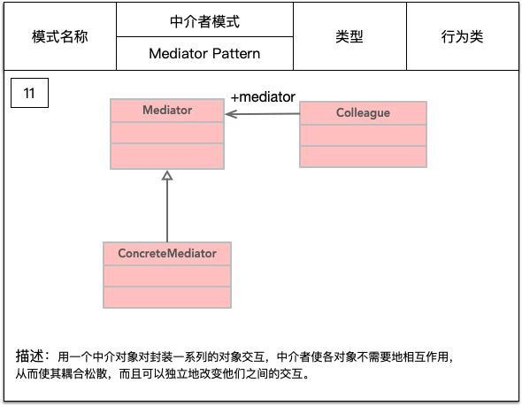

- Mediator：抽象中介者角色
```java
public abstract class Mediator {
    public abstract void register(int id, Colleague colleague);
    public abstract void operation(int id, String msg);
}
```
- ConcreteMediator：具体中介者
```java
public class ConcreteMediator extends Mediator {

    private Map<Integer, Colleague> colleagues = new HashMap<>();

    @Override
    public void register(int id, Colleague colleague) {
        colleagues.put(id, colleague);
    }

    @Override
    public void operation(int id, String msg) {
        Colleague colleague = colleagues.get(id);
        colleague.receiveMsg(msg);
    }
}
```
- Colleague：抽象同事类
```java
public abstract class Colleague {

    protected Mediator mediator;

    public Colleague(Mediator mediator) {
        this.mediator = mediator;
    }

    public abstract void receiveMsg(String msg);

    public void sendMsg(int id, String msg) {
        mediator.operation(id, msg);
    }

}
```
- ConcreteColleague：具体同事类
```java
public class ConcreteColleague1 extends Colleague {

    public ConcreteColleague1(Mediator mediator) {
        super(mediator);
    }

    @Override
    public void receiveMsg(String msg) {
        System.out.println(String.format("1 Receive msg: %s", msg));
    }
}
```

```java
public class ConcreteColleague2 extends Colleague {

    public ConcreteColleague2(Mediator mediator) {
        super(mediator);
    }

    @Override
    public void receiveMsg(String msg) {
        System.out.println(String.format("2 Receive msg: %s", msg));
    }
}
```

- Client：场景类
```java
public class Client {

    public static void main(String[] args) {
        Mediator mediator = new ConcreteMediator();

        Colleague colleague1 = new ConcreteColleague1(mediator);
        Colleague colleague2 = new ConcreteColleague2(mediator);

        mediator.register(1, colleague1);
        mediator.register(2, colleague2);

        colleague1.sendMsg(2, "Hello,I am 1.");
        colleague2.sendMsg(1, "Hello,I am 2.");

    }
}
```

输出结果：
```txt
2 Receive msg: Hello,I am 1.
1 Receive msg: Hello,I am 2.
```

使用统一的 Mediator 中介者类，简化了对象之间的交互，将各同事解耦，也简化了各个同事类的设计和实现。
但是，在具体中介者类中包含了同事之间的交互细节，可能会导致交互者类非常复杂，使得系统难以维护。


#### 命令模式

命令模式是一个高内聚的模式。将一个请求封装成一个对象，从而让你使用不同的请求将客户端参数化，还可以提供命令的撤销和恢复功能。

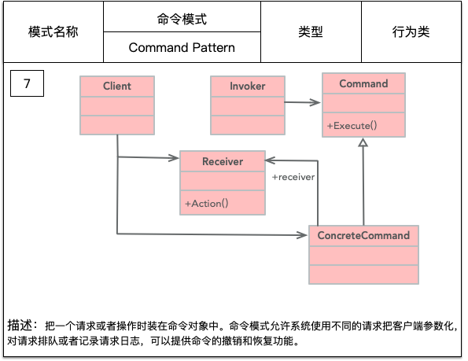

- Receiver：接收者角色
```java
public abstract class Receiver {
    /**
     * 定义抽象接收者，定义每个接收者必须完成的业务
     */
    public abstract void doSomething();
}
```

- ConcreteReceiver：具体接收者角色
```java
public class ConcreteReceiver extends Receiver {
    @Override
    public void doSomething() {
        // 每个接收者必须要处理一定的业务逻辑
    }
}
```

- Command：命令角色
```java
public abstract class Command {
    /**
     * 每个命令类都必须有一个执行命令的方法
     */
    public abstract void execute();
}
```

- ConcreteCommand：具体命令角色
```java
public class ConcreteCommand extends Command {
    private Receiver receiver;

    public ConcreteCommand(Receiver receiver) {
        this.receiver = receiver;
    }

    @Override
    public void execute() {
        receiver.doSomething();
    }
}
```

- Invoker：调用者角色
```java
public class Invoker {
    private Command command;

    public void setCommand(Command command){
        this.command = command;
    }

    public void action(){
        command.execute();
    }
}
```

- Client：场景类
```java
public class Client {

    public static void main(String[] args){
        // 首先声明调用者 Invoker
        Invoker invoker = new Invoker();
        // 定义接收者 Receiver
        Receiver receiver = new ConcreteReceiver();
        // 定义一个发送给接收者的命令 Command
        Command command = new ConcreteCommand(receiver);
        // 把命令交给调用者去执行
        invoker.setCommand(command);
        invoker.action();
    }
}
```

命令模式将请求方(Invoker)和执行方(Receiver)分开了，Command 的子类可以非常容易的扩展，而调用者和高层次模块 Client 也不会因此产生严重的代码耦合。
类间解耦，调用者角色与接收者角色之间没有任何依赖关系，调用者实现功能时只需要调用 Command 抽象类的 execute 方法即可，不需要了解到底是哪个
接收者执行。
命令模式可以结合责任链模式，实现命令族解析任务；结合模板方法方式，就可以减少 Command 子类的膨胀问题。


##### 实例-电视遥控器

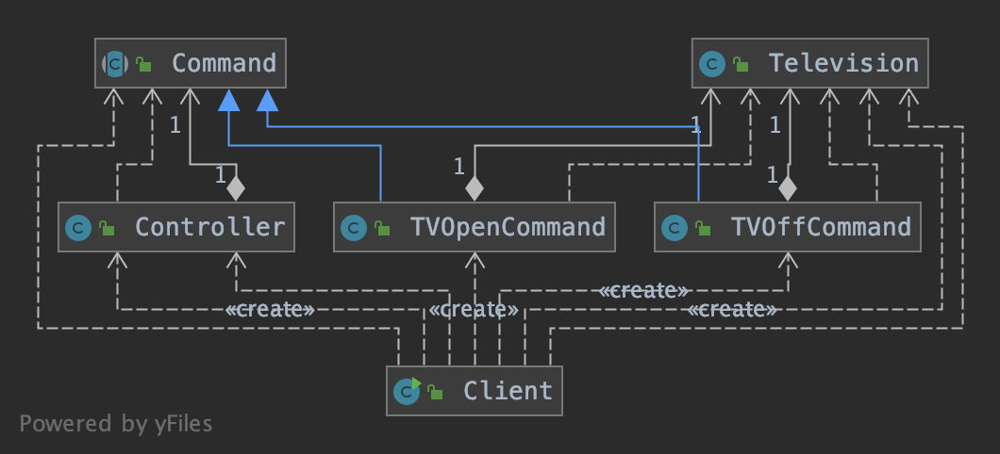

其中 Television 是请求的最终接收者，Controller 是请求的发送者，遥控器上的不同按钮就对应具体的 Command ，如打开电视机、关闭电视机等。
显然，电视机遥控器就是一个典型的命令模式应用实例。


#### 责任链模式

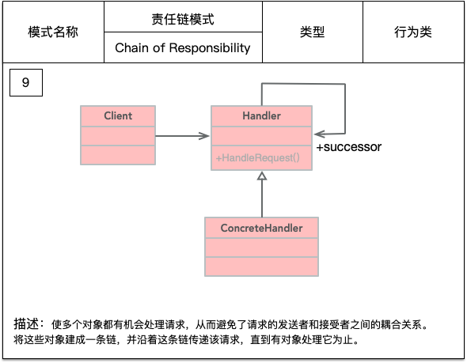

- Handler：抽象处理者
```java
public abstract class Handler {

    private Handler nextHandler;

    /**
     * 每个 Handler 都必须对请求作出处理
     */
    public final Response handleMessage(Request request) {
        Response response = null;
        // 判断是否是自己的处理级别
        if (this.getHandlerLevel().equals(request.getRequestLevel())) {
            response = this.echo(request);
        } else {
            // 不属于自己的处理级别，判断是否有下一个处理器
            if (nextHandler != null) {
                response = nextHandler.handleMessage(request);
            }
        }
        return response;
    }

    public void setNext(Handler handler) {
        this.nextHandler = handler;
    }

    protected abstract Level getHandlerLevel();

    protected abstract Response echo(Request request);
}
```
- ConcreteHandler：具体处理者
```java
public class ConcreteHandler extends Handler{
    @Override
    protected Level getHandlerLevel() {
        return null;
    }

    @Override
    protected Response echo(Request request) {
        return null;
    }
}
```
- Client：场景类
```java
public class Client {

    public static void main(String[] args) {
        // 定义所有的处理节点
        Handler handler1 = new ConcreteHandler1();
        Handler handler2 = new ConcreteHandler2();
        Handler handler3 = new ConcreteHandler3();

        // 设置链式处理顺序 1->2->3
        handler1.setNext(handler2);
        handler2.setNext(handler3);

        // 提交请求，经过链式调用，返回结果
        Response response = handler1.handleMessage(new Request());
    }
}
```
责任链模式的重点在"链"上，由一条链去处理相似的请求，并返回相应的结果。
可以参考 Netty 源码中 pipeline 的实现，就是对责任链模式的最佳实践。

#### 策略模式

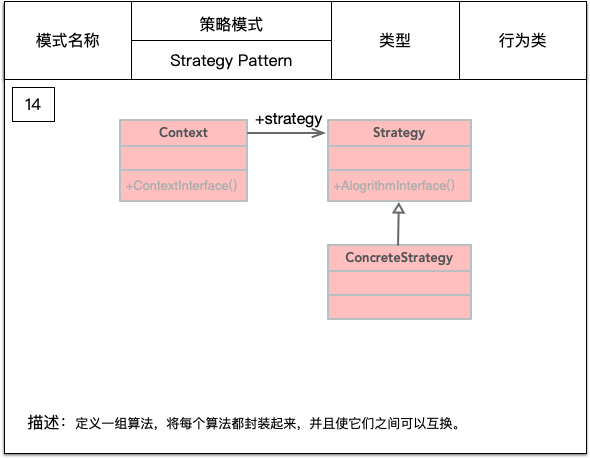

- Context：封装角色
```java
public class Context {
    private Strategy strategy;

    public Context(Strategy strategy){
        this.strategy = strategy;
    }

    public void doAnything(){
        strategy.doSomething();
    }

}
```
- Strategy：抽象策略角色
```java
public interface Strategy {
    void doSomething();
}
```
- ConcreteStrategy：具体策略角色
```java
public class ConcreteStrategy implements Strategy {
    @Override
    public void doSomething() {
        System.out.println("具体策略的运算法则");
    }
}
```
- Client：场景类
```java
public class Client {

    public static void main(String[] args){
        Strategy strategy = new ConcreteStrategy();
        Context context = new Context(strategy);
        context.doAnything();
    }

}
```

策略模式借用了代理模式的思路，区别就是策略模式的封装角色和被封装的策略类不是用同一个接口。
策略模式的使用场景：
多个类只有在算法或行为上稍有不同的场景。
算法需要自由切换的场景。
需要屏蔽算法规则的场景。

#### 观察者模式

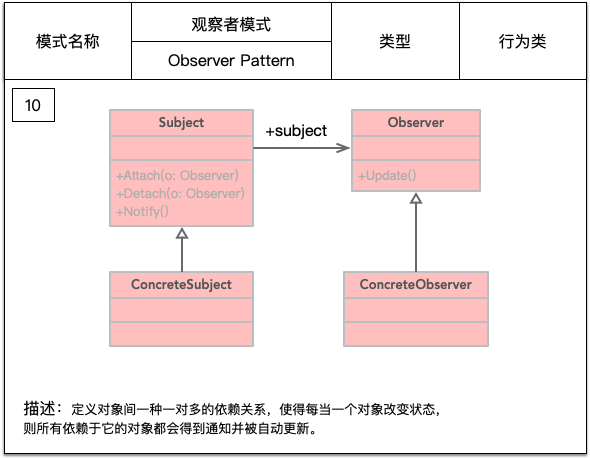

- Subject：被观察者
```java
public abstract class Subject {
    private Vector<Observer> obsVector = new Vector<>();

    /**
     * 增加一个观察者
     */
    public void addObserver(Observer o) {
        obsVector.add(o);
    }

    /**
     * 删除一个观察者
     */
    public void delObserver(Observer o) {
        obsVector.remove(o);
    }

    public abstract void doSomething();

    /**
     * 通知所有观察者
     */
    public void notifyObservers() {
        for (Observer o : obsVector) {
            o.update();
        }
    }
}
```
- ConcreteSubject：具体被观察者
```java
public class ConcreteSubject extends Subject {

    @Override
    public void doSomething(){
        // do something
        super.notifyObservers();
    }
}
```
- Observer：观察者
```java
public interface Observer {
    void update();
}
```
- ConcreteObserver：具体的观察者
```java
public class ConcreteObserver implements Observer {
    @Override
    public void update() {
        System.out.println("接收到信息，进行处理.");
    }
}
```

- Client：场景类
```java
public class Client {

    public static void main(String[] args) {
        // 创建一个被观察者 Subject
        Subject subject = new ConcreteSubject();
        // 定义一个观察者 Observer
        Observer observer = new ConcreteObserver();
        // Observer 添加到 Subject 的观察者集合中
        subject.addObserver(observer);
        // 被观察者执行其方法
        subject.doSomething();
    }
}
```

不管是增加观察者还是被观察者都非常容易扩展。
但是需要考虑以下开发效率和运行效率问题，一个被观察者，多个观察者，开发和调试就会比较复杂，而且在 Java 中消息的通知默认是顺序执行的，一个
观察者卡壳，会影响整体的执行效率。在这种情况下，一般考虑采用异步的方式。


#### 备忘录模式

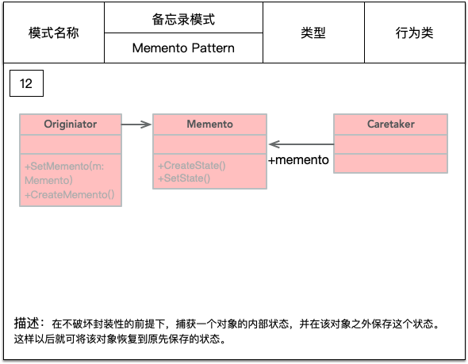

- Originator：发起人角色，记录当前时刻的内部状态，负责创建和备份备忘录数据。
```java
public class Originator {
    /**
     * 内部状态
     */
    private String state;

    public String getState() {
        return state;
    }

    public void setState(String state) {
        this.state = state;
    }

    /**
     * 创建一个备忘录
     */
    public Memento createMemento(){
        return new Memento(state);
    }

    /**
     * 恢复一个备忘录
     */
    public void restoreMemento(Memento memento){
        setState(memento.getState());
    }
}
```

- Memento：备忘录角色，负责存储 Originator 发起人对象的内部状态。
```java
public class Memento {
    /**
     * 发起人的内部状态
     */
    private String state;

    public Memento(String state){
        this.state = state;
    }

    public String getState() {
        return state;
    }

    public void setState(String state) {
        this.state = state;
    }
}
```

- Caretaker：备忘录管理员角色，对备忘录进行管理、保存和提供备忘录。                 
```java
public class Caretaker {
    private Memento memento;

    public Memento getMemento() {
        return memento;
    }

    public void setMemento(Memento memento) {
        this.memento = memento;
    }
}
```

- Client：场景类
```java
public class Client {

    public static void main(String[] args){
        // 定义发起人 Originator
        Originator originator = new Originator();
        // 定义备忘录管理员 Caretaker
        Caretaker caretaker = new Caretaker();
        // 创建一个备忘录
        caretaker.setMemento(originator.createMemento());
        // 恢复一个备忘录
        originator.restoreMemento(caretaker.getMemento());
    }
}
```
数据库连接的事务管理就是用的备忘录模式，需要提供 rollback 操作。


#### 访问者模式

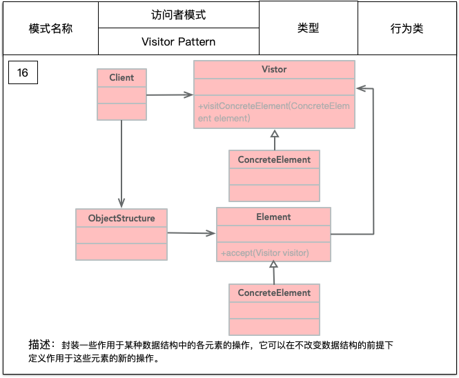

- Visitor：抽象访问者
```java
public interface Visitor {
    void visit(ConcreteElement1 element1);
    void visit(ConcreteElement2 element2);
}
```
- ConcreteVisitor：具体访问者
```java
public class ConcreteVisitor implements Visitor {
    @Override
    public void visit(ConcreteElement1 element1) {
        element1.doSomething();
    }

    @Override
    public void visit(ConcreteElement2 element2) {
        element2.doSomething();
    }
}
```
- Element：抽象元素
```java
public abstract class Element {
    public abstract void doSomething();

    public abstract void accept(Visitor visitor);
}
```
- ConcreteElement：具体元素
```java
public class ConcreteElement1 extends Element {
    @Override
    public void doSomething() {

    }

    @Override
    public void accept(Visitor visitor) {

    }
}
```
- ObjectStructure：结构对象
```java
public class ObjectStructure {

    public static Element createElement() {
        Random random = new Random();
        if (random.nextInt(100) > 50) {
            return new ConcreteElement1();
        } else {
            return new ConcreteElement2();
        }
    }
}
```
- Client：场景类
```java
public class Client {
    public static void main(String[] args) {
        for (int i = 0; i < 10; i++) {
            Element element = ObjectStructure.createElement();
            element.accept(new ConcreteVisitor());
        }
    }
}
```


#### 状态模式

状态模式是一种对象行为型模式，允许一个对象在其内部状态改变时改变它的行为。

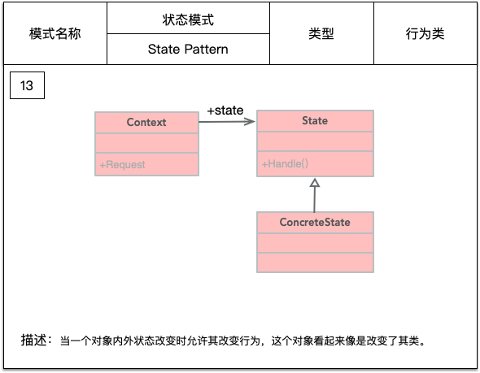

- State：抽象状态角色
```java
public abstract class State {
    protected Context context;
    
    public void setContext(Context context){
        this.context = context;
    }

    public abstract void handle();
}
```
- ConcreteState：具体状态角色
STARTED State：
```java
public class Started extends State {
    @Override
    public void handle() {
        System.out.println("Now state is STARED.");
    }
}
```

STOPPED State：
```java
public class Stopped extends State {
    @Override
    public void handle() {
        System.out.println("Now state is STOPPED.");
    }
}
```

- Context：环境角色
```java
public class Context {
    public final static State STOPPED = new Stopped();
    public final static State STARTED = new Started();

    private State currentState;

    public State getCurrentState(){
        return currentState;
    }

    public void changeState(State state){
        this.currentState = state;
        this.currentState.setContext(this);
    }

    public void handleState(){
        currentState.handle();
    }

}
```

- Client：场景类
```java
public class Client {

    public static void main(String[] args){
        // 定义两种状态
        State started = new Started();
        State stopped = new Stopped();

        // 定义环境角色
        Context context = new Context();

        // 将状态切换成 STARTED
        context.changeState(started);
        context.handleState();

        // 将状态切换成 STOPPED
        context.changeState(stopped);
        context.handleState();

    }
}
```

状态模式描述了对象状态的变化以及对象如何在每一种状态下表现出不同的行为。State 定义一个抽象状态类，实际使用中通常会使用枚举来表示各种状态。
Context 实际上就是拥有状态的对象，充当状态管理器的角色，可以在 Context 类中对状态进行切换操作。


#### 解释器模式

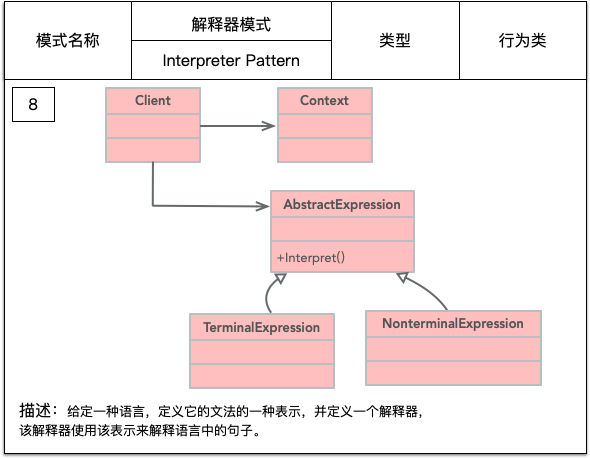

- AbstractExpression：抽象解释器
```java
public abstract class AbstractExpression {
    public abstract Object interpreter(Context context);
}
```

- TerminalExpression：终结符表达式
```java
public class TerminalExpression extends AbstractExpression{
    @Override
    public Object interpreter(Context context) {
        return null;
    }
}
```

- NonterminalExpression：非终结符表达式
```java
public class NonterminalExpression extends AbstractExpression{
    public NonterminalExpression(AbstractExpression... expressions){

    }

    @Override
    public Object interpreter(Context context) {
        return null;
    }
}
```

- Client：场景类
```java
public class Client {

    public static void main(String[] args) {
        Context context = new Context();
        // 定义一个语法容器
        List<AbstractExpression> expressions = new ArrayList<>();

        for (AbstractExpression expression : expressions) {
            // 进行语法判断，并产生递归调用
            expression.interpreter(context);
        }

    }
}
```